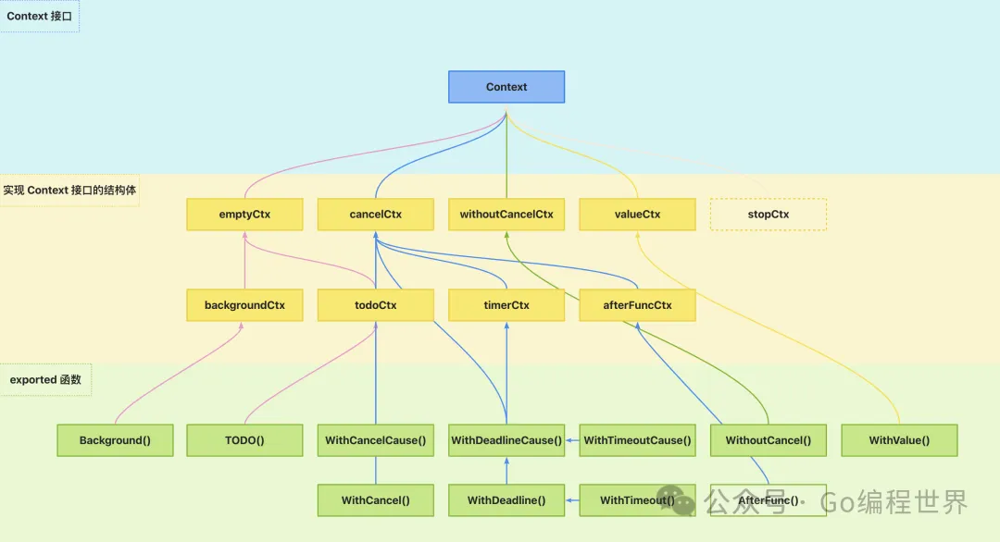
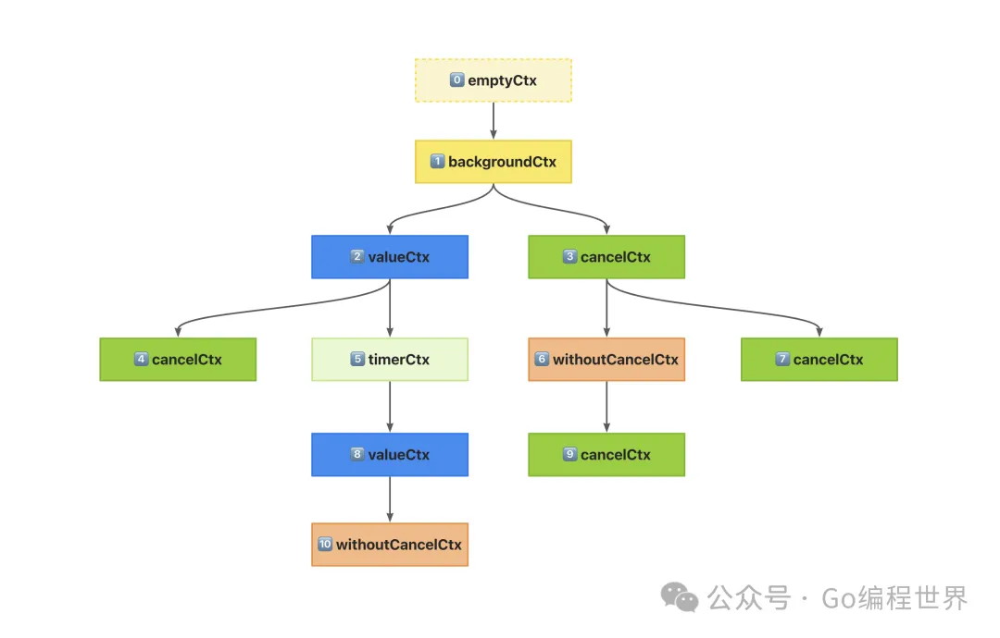

context 是 Go 语言的特色设计之一，主要作用有两个：**控制链路**和**安全传值**，并且 context 是**并发安全**的。context 在 Go 1.17 版本被引入，经过数年的迭代，在设计和用法上已经趋于稳定，本文以最新的 Go 1.23.0 版本源码为基础，带你深入理解 context 的设计和实现。

### context 设计

context 被设计为一个接口，名为 `Context`。为了支持不同特性，这个接口有多种结构体实现。而每个结构体又提供了一个或多个 exported 函数（大写字母开头的公开函数）作为构造函数来实例化 context 对象。

我画了一张 context 的设计架构图如下：



<div align="center"><i>context 设计架构</i></div>

这张图包含了 context 中最核心的对象和它们之间的关系，我们来简单梳理下这张图，为稍后的源码阅读打下基础。

`Context` **接口**是 context 最基本的抽象，定义了一个 context 对象应该支持哪些行为。它被设计为 exported，所以我们也可以实现自定义的 context 对象。

实现 `Context` 接口的结构体：为了实现 context 的控制链路和安全传值两大特性，context 包提供了多种 `Context` 接口的实现。

- `emptyCtx` 表示一个空的 context 实现，没有控制链路的能力，也没有安全传值的功能。不过它作为最基础的 context 实现，可以算是其他 context 实现的 “基类” 了。
- `backgroundCtx` 和 `todoCtx` 包装了 `emptyCtx`，不过二者并没有扩展什么功能，只是表明了**语义**，它们通常作为整个 context 链路的起点。
- `cancelCtx` 是一个带有取消功能的 context 实现，所以它拥有控制链路的能力。`timerCtx` 和 `afterFuncCtx` 都是在 `cancelCtx` 的基础上来实现的。
- `withoutCancelCtx` 从命名上也能看出，它和 `cancelCtx` 正相反，没有取消功能，在实现上与 `emptyCtx` 差不多。
- `valueCtx` 见名之意，是用来进行安全传值的。
- 最后还有一个 `stopCtx` 实现，它比较特殊，没有提供构造函数，目前来看并不是 context 的核心对象。

**exported 函数**：因为所有的 context 实现都是 `unexported` 类型，所以就需要 `exported` 类型的函数来创建 context 对象供我们使用。

- `Background()` 是使用的最多的函数了，它构造一个 `backgroundCtx` 对象并返回，通常作为 context 树的根节点。
- `TODO()` 函数当然就是用来构造 `todoCtx` 对象的构造函数了，同样会作为 context 树的根节点。当我们不知道该用哪个 context 对象时，就用它。
- `WithCancel()` 和 `WithCancelCause()` 都用来构造并返回 `cancelCtx` 对象，二者唯一的区别就是构造对象时是否传入**根因**。
- `WithDeadline()` 和 `WithDeadlineCause()` 用于构造一个 `cancelCtx` 或 `timerCtx` 对象。它们可以接收一个 `time.Time` 用来指定 context 对象被取消的时间，到期时会被**自动取消**。
- `WithTimeout()` 和 `WithTimeoutCause()` 都接收一个 `time.Duration` 来指定多长时间之后 context 对象被取消。`WithTimeout()` 内部调用了 `WithDeadline()`，而 `WithTimeoutCause()` 内部则调用了 `WithDeadlineCause()`。
- `WithoutCancel()` 用于构造并返回 `withoutCancelCtx` 对象。
- `WithValue()` 用于构造并返回 `valueCtx` 对象。
- `AfterFunc()` 用于在 context 过期时异步的执行一个任务，它会构造一个 `afterFuncCtx` 对象，但不返回它，而是返回一个停止函数，可以阻止异步任务执行。

以上，就简单梳理了 context 包最核心的设计框架。如果你不够熟悉 context，切记不要死记硬背，只需要多使用它就好了。你可以先收藏此文，用过 context 一段时间，再回来看本文的源码解析。

### context 接口

`Context` 作为 context 包最核心的接口，其定义如下：

```go
type Context interface {
	Deadline() (deadline time.Time, ok bool)
	Done() <-chan struct{}
	Err() error
	Value(key any) any
}
```

可以看到 `Context` 只有 4 个方法，可谓大道至简。

- `Deadline()` 方法返回该 context 应该被取消的**截止时间**，如果此 context 没有设置截止时间，则返回的 `ok` 值为 `false`。
- `Done()` 返回一个只读的 channel 作为**取消信号**，当 context 被取消时，此 channel 会被 close 掉。用一个空结构体 `struct{}`，表示一种零字节的类型，充当信号非常合适，表示传递一个信号而非数据。
- `Err()` 方法返回 context **被取消的原因**，如果 context 还未取消，返回 `nil`；如果调用 `cancel()` 主动取消了 context，返回 `Canceled` 错误；如果是截止时间到了自动取消了 context，返回 `DeadlineExceeded` 错误。
- `Value()` 方法返回与给定键（`key`）**关联的值**（`value`），如果没有与该 `key` 关联的 `value`，则返回 `nil`。

其中 `Canceled` 和 `DeadlineExceeded` 两个错误定义如下：

```go
var Canceled = errors.New("context canceled")

var DeadlineExceeded error = deadlineExceededError{}

type deadlineExceededError struct{}

func (deadlineExceededError) Error() string   { return "context deadline exceeded" }
func (deadlineExceededError) Timeout() bool   { return true }
func (deadlineExceededError) Temporary() bool { return true }
```

这里采用了典型的 Sentinel error 用法。并且从 `deadlineExceededError` 实现的方法来看，其鼓励**行为断言**而非**类型断言**。

> 在 Go 中，Sentinel error 是一种通过预定义变量表示特定错误的模式。在这个例子中，`Canceled` 和 `DeadlineExceeded` 就是两个 Sentinel error。
>
> **Sentinel Error**
>
> - `Canceled` 是一个简单的 Sentinel error，通过 `errors.New` 创建。
> - `DeadlineExceeded` 是一个更复杂的 Sentinel error，通过实现一个自定义结构体 `deadlineExceededError`，并将其赋值给 `DeadlineExceeded` 变量。
>
> **行为断言 vs. 类型断言**
>
> - **类型断言**：检查一个接口值的具体类型。例如，使用类型断言来检查某个错误是否是 `deadlineExceededError` 类型。
> - **行为断言**：检查一个接口值是否实现了某个接口的方法，而不关心其具体类型。
>
> 在 `deadlineExceededError` 中，它实现了 `Error()`, `Timeout()`, 和 `Temporary()` 方法。通过这些方法，代码可以根据错误的行为（比如是否超时、是否临时）来处理错误，而不需要关心错误的具体类型。因此，行为断言更关注错误的性质，而不是其具体实现。
>
> 这种设计允许更灵活和通用的错误处理方式，因为可以根据错误的行为进行处理，而不需要知道其具体的类型。

如果你对 Go 错误设计和处理不够熟悉，可以查看我的另一篇文章 [《Go 错误处理指北：如何优雅的处理错误？》](Go%20错误处理指北：如何优雅的处理错误？.md#^sentinelError)。

### context 实现

接下来我们对 `Context` 接口的具体实现进行逐一讲解。

#### emptyCtx

`emptyCtx` 是最基础的 context 实现，定义如下：

```go
type emptyCtx struct {}

func (emptyCtx) Deadline() (deadline time.Time, ok bool) {
    return
}

func (emptyCtx) Done() <-chan struct{} {
    return nil
}

func (emptyCtx) Err() error {
    return nil
}

func (emptyCtx) Value(key any) any {
    return nil
}
```

它确实 “基础”，也确实 “empty”，所有实现都为空，没有代码逻辑，仅是一个 context 架子。

##### backgroundCtx 和 todoCtx

`backgroundCtx` 定义如下：

```go
type backgroundCtx struct {
    emptyCtx
}

func (backgroundCtx) String() string {
    return "context.Background"
}
```

`todoCtx` 实现同理：

```go
type todoCtx struct {
	emptyCtx
}

func (todoCtx) String() string {
	return "context.TODO"
}
```

##### Background() 和 TODO()

我们在使用 context 时，往往会用 `context.Background()` 或 `context.TODO()` 来定义了最顶层 context，这两个方法实现如下：

```go
func Background() Context {
    return backgroundCtx {}
}

func TODO() Context {
    return todoCtx {}
}
```

没错，最常用的 context 代码实现就是这么简单，它们是整个 context 链路的基础。

#### cancelCtx

`cancelCtx` 结构体定义如下：

```go
type cancelCtx struct {
    Context                         // “继承”的父 Context

    mu       sync.Mutex             // 持有锁保护下面这些字段
    done     atomic.Value           // 值为 chan struct{} 类型，会被懒惰创建，在第一次调用取消函数 cancel() 时被关闭，表示 Context 已被取消
    children map[canceler] struct{} // 所有可以被取消的子 Context 集合，它们在第一次调用取消函数 cancel() 时被级联取消，然后置为 nil
    err      error                  // 取消原因，在第一次调用取消函数 cancel() 时被设置值
    cause    error                  // 取消根因，在第一次调用取消函数 cancel() 时被设置值
}
```

`cancelCtx` 直接内嵌了 `Context` 接口，也就是说，它支持任意其他类型的 context 实现作为父上下文（`parent context`）。

前文说过，context 是并发安全的，所以 `cancelCtx` 内部持有一把互斥锁，保证安全的操作结构体属性。

`done` 属性为 `atomic.Value` 类型，是为了支持原子操作，使用它可以减少互斥锁的使用频率，稍后你将在 `Done()` 方法中看到。它的值是 `chan struct{}` 类型。

`children` 属性是一个集合，记录了当前 context 的所有子上下文（`child context`）。这样，父子 context 就产生了链路关系，以此为基础实现父 context 取消时，级联的取消所有子 context。

`err` 和 `cause` 分别记录了 context 被取消的**原因**和**根因**，`err` 是 context 包内部产生的，`cause` 则是我们在使用 `WithXxxCause()` 方法构造 context 对象时传入的。

这里涉及的 `canceler` 定义如下：

```go
type canceler interface {
    cancel(removeFromParent bool, err, cause error) // 取消函数
    Done() <-chan struct{}                          // 通过返回的 channel 能够知道是否被取消
}
```

它是一个接口，表示一个可以被**取消**的对象。也就是说，在 context 包中设计的支持取消的 context 类型都需要提供这两个方法。父 context 取消时会调用子 context 的 `cancel()` 方法进行级联取消；并且有取消功能的 context 必须要实现 `Done()` 方法，这样使用者才能通过监听 done channel 知道这个 context 是否被取消。

`cancelCtx` 的 `Done()` 方法实现如下：

```go
func(c * cancelCtx) Done() <-chan struct{} {
    // 使用 double-check 来提升性能
    d := c.done.Load()  // 原子操作，比互斥锁更加轻量
    if d != nil {       // 如果存在 channel 直接返回
        return d.(chan struct{})
    }
    c.mu.Lock() // 如果不存在 channel，则要先加锁，然后创建 channel 并返回
    defer c.mu.Unlock()
    d = c.done.Load()
    if d == nil {   // 为保证并发安全，再做一次检查
        d = make(chan struct{})
        c.done.Store(d)
    }
    return d.(chan struct{})
}
```

这里使用了 `double-check` 来提升程序的性能，这也是 `done` 属性为什么被设计成 `atomic.Value` 类型的原因。首先使用 `c.done.Load()` 来判断标识 context 是否取消的 `chan struct{}` 是否存在，存在则直接返回，不存在才会加锁创建。

`cancelCtx` 的 `cancel()` 方法实现如下：

```go
func(c * cancelCtx) cancel(removeFromParent bool, err, cause error) {
    if err == nil {
        panic("context: internal error: missing cancel error")
    }
    if cause == nil {   // 如果没有设置根因，取 err
        cause = err
    }
    c.mu.Lock()
    if c.err != nil {   // 如果 err 不为空，说明已经被取消，直接返回
        c.mu.Unlock()
        return
    }

    // NOTE: 只有第一次调用 cancel 才会执行之后的代码

    // 记录错误和根因
    c.err = err
    c.cause = cause
    d, _: = c.done.Load().(chan struct{})
    if d == nil {   // 如果 done 为空，直接设置一个已关闭的 channel
        c.done.Store(closedchan)
    } else {    // 如果 done 有值，将其关闭
        close(d)
    }
    // 级联取消所有子 Context
    for child: = range c.children {
        // NOTE: 获取子 Context 的锁，同时持有父 Context 的锁
        child.cancel(false, err, cause)
    }
    c.children = nil    // 清空子 Context 集合，因为已经完成了 Context 树整个链路的取消操作
    c.mu.Unlock()

    if removeFromParent {   // 从父 Context 的 children 集合中移除当前 Context
        removeChild(c.Context, c)
    }
}
```

这个方法用来取消 `cancelCtx`，它接收 3 个参数，`removeFromParent` 表示是否要从父 context 的 `children` 属性集合中移除当前的 `cancelCtx`；`err` 和 `cause` 则分别表示取消的错误原因和根因。

在第 9 行，因为使用了 `c.err != nil` 来判断 `err` 是否为空，如果不为空，说明 context 已经被取消，直接返回。所以，多次调用 `cancel()` 方法效果相同。

当第一次调用 `cancel()` 方法时会记录 `err` 和 `cause`。接着判断 done channel 是否存在，不存在就直接设置为一个已经关闭的 channel 对象 `closedchan`；如果存在则调用 `close(d)` 将其关闭。

接着，会遍历 `c.children` 属性对当前 `cancelCtx` 的所有子 context 进行级联取消，即依次调用它们的 `cancel()` 方法。然后清空 `children` 集合。

最终根据参数 `removeFromParent` 的值决定是否要从父 context 的 `children` 属性集合中移除 `cancelCtx`。

这里涉及的 `closedchan` 定义如下：

```go
// closedchan 表示一个已关闭的 channel
var closedchan = make(chan struct{})

// 导入 context 包时直接关闭 closedchan
func init() {
    close(closedchan)
}
```

在 context 包被导入时就直接关闭了。

`removeChild()` 函数的具体实现如下：

```go
func removeChild(parent Context, child canceler) {
    if s, ok: = parent.(stopCtx); ok {
        s.stop()
        return
    }
    p, ok: = parentCancelCtx(parent)
    if !ok {
        return
    }
    p.mu.Lock()
    if p.children != nil {
        delete(p.children, child)
    }
    p.mu.Unlock()
}
```

首先判断父 context 是否为 `stopCtx` 类型，如果是，则调用其 `s.stop()` 方法。关于 `stopCtx` 类型暂时不必深究，后文中讲解 `*cancelCtx.propagateCancel()` 方法时我会更详细的解释。

接着调用 `parentCancelCtx()` 函数向上查找父 context 或其链路中是否存在 `*cancelCtx` 对象，如果不存在，直接返回；如果存在，从其 `children` 属性集合中移除当前 context。

`parentCancelCtx()` 函数实现如下：

```go
func parentCancelCtx(parent Context) (*cancelCtx, bool) {
    done := parent.Done()
    if done == closedchan || done == nil {
        return nil, false
    }
    p, ok: = parent.Value(&cancelCtxKey).(*cancelCtx)
    if !ok {
        return nil, false
    }
    pdone, _: = p.done.Load().(chan struct{})
    if pdone != done {
        return nil, false
    }
    return p, true
}
```

如果父 context 的 `Done()` 方法返回 `closedchan`，说明已经被取消了；如果返回 `nil`，则说明父 context 永远不会被取消。这两种情况，都不必继续向上查找 `*cancelCtx` 对象了，直接返回 `false` 表示未找到。

接下来使用 `&cancelCtxKey` 作为 `key` 从父 context 中查找 `value`，并且断言查找到的对象是否为 `*cancelCtx` 类型，如果 `!ok` 说明未找到，返回 `false`；否则，说明找到的 `*cancelCtx`。

然后对 `*cancelCtx` 进行进一步的检查，确保返回的 `*cancelCtx` 的 done channel 与父 context 的 done channel 是匹配的，如果不匹配，说明 `*cancelCtx` 已经被包装在一个自定义实现中，为了避免影响自定义 context 实现，这种情况下返回 `false` 表示未找到；如果匹配，才返回 `*cancelCtx` 对象和 `true` 表示找到了。

`cancelCtx` 还实现了 `Context` 接口的 `Value()` 和 `Err()` 方法：

```go
func (c *cancelCtx) Value(key any) any {
    // 使用 &cancelCtxKey 标记需要返回自身
    // 这是一个未导出的（unexported）类型，所以仅作为 context 包内部实现的一个“协议”，对用户不可见
    if key == &cancelCtxKey {
        return c
    }
    // 接着向上遍历父 Context 链路，查询 key
    return value(c.Context, key)
}

func (c *cancelCtx) Err() error {
    c.mu.Lock()
    err := c.err
    c.mu.Unlock()
    return err
}
```

`Err()` 方法的实现非常简单，没什么好说的。

`cancelCtx` 实现了 `Value()` 方法，这是为了实现一个特殊的 “内部协议”。这个方法里有一个特殊的判断 `if key == &cancelCtxKey`，如果成立，则不去查找给定 `key` 所对应的 `value`；如果不成立才调用 `value()` 函数继续进行查找。

`cancelCtxKey` 就是一个普通的变量：

```go
var cancelCtxKey int
```

上面介绍的 `parentCancelCtx()` 函数中，之所以能够使用 `parent.Value(&cancelCtxKey).(*cancelCtx)` 获取到 `*cancelCtx` 对象，就是通过在 `Value()` 方法中这个特殊的 “协议” 来实现的。

从 `Value()` 方法的实现来看，只要调用 `*cancelCtx.Value()` 方法时传入 `&cancelCtxKey` 作为查找的 `key`，就返回 `*cancelCtx` 对象本身。

注意：`&cancelCtxKey` 是一个 `unexported` 类型的指针变量，所以外部无法使用，只作为 “内部协议”。

这个设计有点奇技淫巧的意思，不过却很有用。

这里涉及的 `value()` 函数我们暂且不继续深究，后文再来讲解。

此外，`cancelCtx` 也实现了自己的 `String()` 方法：

```go
type stringer interface {
    String() string
}

func contextName(c Context) string {
    if s, ok: = c.(stringer); ok {
        return s.String()
    }
    return reflectlite.TypeOf(c).String()
}

func (c *cancelCtx) String() string {
    return contextName(c.Context) + ".WithCancel"
}
```

##### WithCancel() 和 WithCancelCause()

看完了 `cancelCtx` 的实现，接下来看下我们如何构造一个 `cancelCtx`。

context 包提供了两种构造 `cancelCtx` 的方法，分别是 `WithCancel()` 和 `WithCancelCause()`。

`WithCancel()` 实现如下：

```go
type CancelFunc func()

func WithCancel(parent Context) (ctx Context, cancel CancelFunc) {
    c: = withCancel(parent)
    return c, func() { c.cancel(true, Canceled, nil) }
}
```

`WithCancel()` 根据给定的父 context 构造一个新的具有取消功能的 `cancelCtx` 并返回，其核心逻辑是代理给 `withCancel()` 函数去实现的。

`WithCancelCause()` 实现如下：

```go
type CancelCauseFunc func(cause error)

func WithCancelCause(parent Context) (ctx Context, cancel CancelCauseFunc) {
    c: = withCancel(parent)
    return c, func(cause error) { c.cancel(true, Canceled, cause) }
}
```

`WithCancelCause()` 与 `WithCancel()` 类似，但返回 `CancelCauseFunc` 而不是 `CancelFunc`。可以发现二者的唯一区别就是返回的函数是否支持设置 context 被取消的根因 `cause`。

那么接下来就看看 `withCancel()` 函数是如何实现的：

```go
func withCancel(parent Context) *cancelCtx {
    if parent == nil {
        panic("cannot create context from nil parent")
    }
    c := &cancelCtx{}               // 带取消功能的 Context
    c.propagateCancel(parent, c)    // 将新构造的 Context 向上传播挂载到父 Context 的 children 属性中，这样当父 Context 取消时子 Context 对象 c 也会级联取消
    return c
}
```

这个函数逻辑并不多，这里构造了一个 `cancelCtx` 并返回，核心逻辑都交给了 `propagateCancel()` 方法。

`propagateCancel()` 方法实现如下：

```go
func (c *cancelCtx) propagateCancel(parent Context, child canceler) {
    c.Context = parent  // “继承”父 Context，这里可以是任何实现了 Context 接口的类型

    // NOTE: 父 Context 没有实现取消功能
    done := parent.Done()
    if done == nil {    // 如果父 Context 的 Done() 方法返回 nil，说明父 Context 没有取消的功能，那么无需传播子 Context 的 cancel 功能到父 Context
        return
    }

    // NOTE: 父 Context 已经被取消
    select {
    case <-done:    // 直接取消子 Context，且取消原因设置为父 Context 的取消原因
        child.cancel(false, parent.Err(), Cause(parent))
        return
    default:
    }

    // NOTE: 父 Context 还未取消
    if p, ok := parentCancelCtx(parent); ok {   // 如果父 Context 是 *cancelCtx 或者从 *cancelCtx 派生而来
        p.mu.Lock()
        if p.err != nil {
            // 如果父 Context 的 err 属性有值，说明已经被取消，直接取消子 Context
            child.cancel(false, p.err, p.cause)
        } else {
            if p.children == nil {  // 延迟创建父 Context 的 children 属性
                p.children = make(map[canceler] struct{})
            }
            p.children[child] = struct{}{}  // 将 child 加入到这个 *cancelCtx 的 children 集合中
        }
        p.mu.Unlock()
        return
    }

    // NOTE: 父 Context 实现了 afterFuncer 接口
    if a, ok := parent.(afterFuncer); ok {  // 测试文件 afterfunc_test.go 中 *afterFuncCtx 实现了 afterFuncer 接口
        c.mu.Lock()
        stop := a.AfterFunc(func() {    // 注册子 Context 取消功能到父 Context，当父 Context 取消时，能级联取消子 Context
            child.cancel(false, parent.Err(), Cause(parent))
        })
        c.Context = stopCtx {   // 将当前 *cancelCtx 的直接父 Context 设置为 stopCtx
            Context: parent,    // stopCtx 的父 Context 设置为 parent
            stop: stop,
        }
        c.mu.Unlock()
        return
    }

    // NOTE: 父 Context 不是已知类型，但实现了取消功能
    goroutines.Add(1)   // 记录下开启了几个 goroutine，用于测试代码
    go func() { // 开起一个 goroutine，监听父 Context 是否被取消，如果取消则级联取消子 Context
        select {
        case <-parent.Done():   // 父 Context 被取消
            child.cancel(false, parent.Err(), Cause(parent))
        case <-child.Done():    // 自己被取消
        }
    }()
}
```

`propagateCancel()` 方法将 `cancelCtx` 对象向上传播挂载到父 context 的 `children` 属性集合中，这样当父 context 被取消时，子 context 也会被级联取消。这个方法逻辑稍微有点多，也是 context 包中最复杂的方法了，拿下它，后面的代码就都很简单了。

首先将 `parent` 参数记录到 `cancelCtx.Context` 属性中，作为父 context。接下来会对父 context 做各种判断，以此来决定如何处理子 context。

第 5 行通过 `parent.Done()` 拿到父 context 的 done channel，如果值为 `nil`，则说明父 context 没有取消功能，所以不必传播子 context 的取消功能到父 context。

第 11 行使用 `select…case…` 来监听 `<-done` 是否被关闭，如果已关闭，则说明父 context 已经被取消，那么直接调用 `child.cancel()` 取消子 context。因为 context 的取消功能是从上到下级联取消，所以父 context 被取消，那么子 context 也一定要取消。

如果父 context 尚未取消，则在第 19 行判断父 context 是否为 `*cancelCtx` 或者从 `*cancelCtx` 派生而来。如果是，则判断父 context 的 `err` 属性是否有值，有值则说明父 context 已经被取消，那么直接取消子 context；否则将子 context 加入到这个 `*cancelCtx` 类型的父 context 的 `children` 属性集合中。

如果父 context 不是 `*cancelCtx` 类型，在第 35 行判断父 context 是否实现了 `afterFuncer` 接口。如果实现了，则新建一个 `stopCtx` 作为当前 `*cancelCtx` 的父 context。

最终，如果之前对父 context 的判断都不成立，则开启一个新的 goroutine 来监听父 context 和子 context 的取消信号。如果父 context 被取消，则级联取消子 context；如果子 context 被取消，则直接退出 goroutine。

至此 `propagateCancel()` 方法的主要逻辑就梳理完了。

不过，在当前的 context 包实现中，其实在第 35 行判断父 context 是否实现了 `afterFuncer` 接口的 case 永远不会发生。`afterFuncer` 接口定义如下：

```go
type afterFuncer interface {
    AfterFunc(func()) func() bool
}
```

在 Go 1.23.0 版本 context 包的源码中，并没有一个 context 实现了 `afterFuncer` 接口。所以 `stopCtx` 也并没有被真正使用。所以我才在前文讲解 `removeChild()` 函数时说 `stopCtx` 类型不必深究。

不过我们还是简单看一下 `stopCtx` 的定义：

```go
type stopCtx struct {
    Context
    stop func() bool
}
```

它同样嵌入了 `Context` 接口，`stop` 方法用于注销 `AfterFunc`。

> NOTE:
>
> 其实 `afterFuncer` 接口在 context/afterfunc_test.go 文件中有一个 `afterFuncContext` 类型是实现了的，只不过是测试代码，所以我们还是无法使用。
>
> 我在 [issues/61672](https://github.com/golang/go/issues/61672) 中找到了一些关于 `afterFuncer` 的讨论，在我看来这是一个为了填早期设计的坑而定义的，如果能重来，大概率 `Context` 不会被设计成接口，而是结构体。

> 在那个 issue 中看到了 link 到 Google 的代码风格指南：https://google.github.io/styleguide/go/decisions#custom-contexts
>
> 整挺好，都可以看看。

此外，这里还用到了 `Cause()` 函数从 `parent` 中提取根因，`Cause()` 函数实现如下：

```go
func Cause(c Context) error {
    if cc, ok: = c.Value(&cancelCtxKey).(*cancelCtx); ok {
        cc.mu.Lock()
        defer cc.mu.Unlock()
        return cc.cause
    }
    return c.Err()
}
```

这里同样使用特殊的 `key` `&cancelCtxKey` 来查找 context 链路中的 `*cancelCtx`，如果找到，则返回 `*cancelCtx.cause`，否则将 context 的错误原因作为根因。

针对 `cancelCtx` 类型的源码讲解就到这里，可以说 `cancelCtx` 是最复杂的 context 实现了，后文中要讲解的 `timerCtx` 和 `afterFuncCtx` 都是基于它实现的。

#### timerCtx

`timerCtx` 结构体定义如下：

```go
type timerCtx struct {
    cancelCtx   // “继承”了 cancelCtx
    timer *time.Timer   // Under cancelCtx.mu.

    deadline time.Time
}
```

`timerCtx` 内部嵌入了 `cancelCtx` 以 “继承” `Done()` 和 `Err()` 方法。并且它还关联了一个定时器 `timer` 和截止时间 `deadline`，以此来实现在截止时间到期时，自动取消 context。

`timerCtx` 实现的方法如下：

```go
func (c *timerCtx) Deadline() (deadline time.Time, ok bool) {
    return c.deadline, true
}

func (c *timerCtx) String() string {
    return contextName(c.cancelCtx.Context) + ".WithDeadline(" +
        c.deadline.String() + " [" +
        time.Until(c.deadline).String() + "])"
}

func (c *timerCtx) cancel(removeFromParent bool, err, cause error) {
    c.cancelCtx.cancel(false, err, cause)
    if removeFromParent {
        // 将此 *timerCtx 从其父 *cancelCtx 的 children 集合中删除
        removeChild(c.cancelCtx.Context, c)
    }
    c.mu.Lock()
    if c.timer != nil {
        c.timer.Stop()
        c.timer = nil
    }
    c.mu.Unlock()
}
```

你是否还记得我们在讲解 `Context` 接口时提到，`Deadline()` 方法返回的 `ok` 值为 `false` 时说明 context 没有设置截止时间。这里返回 `true` 则说明 `timerCtx` 支持设置截止时间。

`timerCtx` 也实现了自己的 `String()` 方法。其实所有 context 实现都有自己的 `String()` 方法。

`timerCtx` 的并没有直接使用 `cancelCtx` 的取消方法，而是自己也实现了 `cancel()` 方法。内部调用的 `removeChild()` 函数我们在前文讲解 `cancelCtx` 时已经见过了。这里唯一需要注意的一点是，如果 `timer` 属性不为 `nil` 则调用 `timer.Stop()` 将其停止，并将属性值置为 `nil`，以此让 `timer` 对象尽早被 GC 回收。

##### WithDeadline () 和 WithTimeoutCause ()

我们先来看 `timerCtx` 的第一个构造函数 `WithDeadline()`：

```go
func WithDeadline(parent Context, d time.Time) (Context, CancelFunc) {
    return WithDeadlineCause(parent, d, nil)
}
```

`WithDeadline()` 直接将逻辑代理给了 `WithDeadlineCause()` 来处理，`WithDeadlineCause()` 实现如下：

```go
func WithDeadlineCause(parent Context, d time.Time, cause error) (Context, CancelFunc) {
    if parent == nil {
        panic("cannot create context from nil parent")
    }
    // 如果父 Context 的截止时间已经比传入的 d 更早，直接返回一个 *cancelCtx（无需构造 *timerCtx 等待定时器判断截止时间到了才取消 Context）
    if cur, ok: = parent.Deadline(); ok && cur.Before(d) {
        return WithCancel(parent)
    }
    c := &timerCtx {    // 构造一个带有定时器和截止时间功能的 Context
        deadline: d,
    }
    // 这里使用 cancelCtx 结构体默认值，初始化 timerCtx 时没有显式初始化 cancelCtx 字段
    c.cancelCtx.propagateCancel(parent, c)  // 向父 Context 传播 cancel 功能，这样当父 Context 取消时当前 Context 也会被级联取消
    dur := time.Until(d)
    if dur <= 0 {   // 截止日期已过，直接取消
        c.cancel(true, DeadlineExceeded, cause)
        return c, func() {
            c.cancel(false, Canceled, nil)
        }
    }
    c.mu.Lock()
    defer c.mu.Unlock()
    if c.err == nil {
        c.timer = time.AfterFunc(dur, func() {  // 等待截止时间到期，自动调用 cancel 取消 Context
            c.cancel(true, DeadlineExceeded, cause)
        })
    }
    return c, func() {
        c.cancel(true, Canceled, nil)
    }
}
```

可以发现 `WithDeadline(parent, d)` 等价于 `WithDeadlineCause(parent, d, nil)`。

`WithDeadlineCause()` 实现代码不多，首先对 `parent` 是否为 `nil` 做了检查。接着检查父 context 的截止时间是否比传入的 `d` 更早，如果是，则直接创建一个 `*cancelCtx` 并返回，无需创建 `*timerCtx`。这是因为 context 具有级联取消的能力，既然父 context 的截止时间更早，则父 context 一定先于子 context 取消，所以子 context 会被级联取消，这就没必要再大费周章的构造 `*timerCtx` 来定时取消子 context 了。

如果上述条件不成立，则构造一个带有定时器和截止时间功能的 `*timerCtx`。并且，同样需要调用 `cancelCtx.propagateCancel()` 向上传播取消功能。

接着判断是否已到截止时间，如果到了，则直接取消 context。否则使用 `time.AfterFunc()` 来实现延迟取消 context。

##### WithTimeout() 和 WithTimeoutCause()

`WithTimeout()` 和 `WithTimeoutCause()` 两个方法同样用于构造 `timerCtx`，其实现如下：

```go
func WithTimeout(parent Context, timeout time.Duration) (Context, CancelFunc) {
    return WithDeadline(parent, time.Now().Add(timeout))
}

func WithTimeoutCause(parent Context, timeout time.Duration, cause error) (Context, CancelFunc) {
    return WithDeadlineCause(parent, time.Now().Add(timeout), cause)
}
```

`WithTimeout()` 内部调用了 `WithDeadline()`，而 `WithTimeoutCause()` 内部则调用了 `WithDeadlineCause()`。

`WithDeadline()` 和 `WithDeadlineCause()` 接收一个绝对时间 `d time.Time`。

`WithTimeout()` 和 `WithTimeoutCause()` 接收一个相对时间 `timeout time.Duration`，并在内部将其转换为绝对时间。

所以 `timerCtx` 类型的构造函数有 4 个。

#### withoutCancelCtx

`withoutCancelCtx` 故名思义，是没有取消功能的 context，它可以打断 context 控制链路中级联取消的能力。

`withoutCancelCtx` 结构体定义非常简单，只有一个属性 `c` 用来保存父 context：

```go
type withoutCancelCtx struct {
    c Context
}
```

`withoutCancelCtx` 实现方法如下：

```go
func (withoutCancelCtx) Deadline() (deadline time.Time, ok bool) {
    return
}

func (withoutCancelCtx) Done() <-chan struct{} {
    return nil
}

func (withoutCancelCtx) Err() error {
    return nil
}

func (c withoutCancelCtx) Value(key any) any {
    return value(c, key)
}

func (c withoutCancelCtx) String() string {
    return contextName(c.c) + ".WithoutCancel"
}
```

`withoutCancelCtx` 虽然没有取消功能，但实现了 `Value` 方法，可以根据 `key` 查询 `value`。这样才能保证整个 context 链路中传值的能力不被中断。

##### WithoutCancel()

不仅 `withoutCancelCtx` 结构体设计简单，它的构造函数 `WithoutCancel()` 同样非常简单：

```go
func WithoutCancel(parent Context) Context {
    if parent == nil {
        panic("cannot create context from nil parent")
    }
    return withoutCancelCtx {
        parent
    }
}
```

这里只对父 context 是否为 `nil` 做了检查，然后就直接返回实例化的 `withoutCancelCtx` 对象了。

#### valueCtx

我们前面介绍的 context 从设计上来说都是为了实现控制链路的，与其他 context 不同，`valueCtx` 用于实现在 context 链路中进行安全传值。

`valueCtx` 实现如下：

```go
type valueCtx struct {
    Context
    key, val any    // 存储的键值对，注意一个 Context 仅能保存一对 key/value，这样就能实现并发读的安全，copy-on-write
}

func (c *valueCtx) Value(key any) any {
    if c.key == key {   // 在自己的键值对中查找
        return c.val
    }
    return value(c.Context, key)    // 沿着父 Context 向上查找
}
```

`valueCtx` 结构体内部嵌入了 `Context` 接口，这样可以直接复用父 context 实现的方法。`key` 和 `value` 字段则用于存储键值对。可以发现，一个 `valueCtx` 对象只能存储一对 `key/value`。

在用户调用 `Value()` 方法查找给定 `key` 关联的 `value` 时，首先判断是否在当前 context 中，如果不在，则交给 `value()` 函数来处理。

在介绍 `*cancelCtx.Value()` 方法时，我们并没有深入讲解 `value()` 函数，那么现在是时候看下 `value()` 函数是如何实现的了：

```go
func value(c Context, key any) any {
    for {
        switch ctx := c.(type) {    // 断言 Context 类型
        case *valueCtx: // 表示一个用于安全传递数据的 Context
            if key == ctx.key { // 与当前 Context 的 key 匹配，直接返回对应的值 val
                return ctx.val
            }
            c = ctx.Context // key 不匹配，继续向上遍历父 Context
        case *cancelCtx:    // 表示一个带有取消功能的 Context
            if key == &cancelCtxKey {   // 检查 key 是否等于 &cancelCtxKey（这是一个指向 *cancelCtx 的特殊键），如果匹配，就返回自身（即 c 对象）
                return c
            }
            c = ctx.Context // key 不匹配，继续向上遍历父 Context
        case withoutCancelCtx:  // 表示一个不带取消功能的 Context（使用 WithoutCancel() 创建出来的 Context 类型）
            if key == &cancelCtxKey {   // 检查 key 是否等于 &cancelCtxKey，如果匹配，说明要查找的是取消信号的特殊键，就返回 nil，因为这种 Context 没有取消信号
                return nil
            }
            c = ctx.c   // 如果 key 不匹配，则继续向上遍历父 Context
        case *timerCtx: // 表示一个带有定时器的 Context
            if key == &cancelCtxKey {   // 检查 key 是否等于 &cancelCtxKey，如果匹配，返回其包装的 *cancelCtx
                return &ctx.cancelCtx
            }
            c = ctx.Context // key 不匹配，继续向上遍历父 Context
        case backgroundCtx, todoCtx:    // 这两个类型是无值的 Context（通常这是 Context 树的根），所以直接返回 nil
            return nil
        default:    // 如果没有匹配任何已知的 Context 类型，则调用 Context 的 Value 方法去查找 key 对应的值
            return c.Value(key)
        }
    }
}
```

这里代码看似复杂，实际上逻辑非常简单。启用一个 `for` 无限循环，沿着传进来的 context 对象 `c` 的父路径，循环查找匹配的 `key`，直到找到目标 `value` 或走到链路根节点返回 `nil`。

`for` 循环中，首先会断言当前 context 对象 `c` 的类型，如果是 `*valueCtx`，判断 `key` 是否匹配，匹配则直接返回 `ctx.val`，不匹配则将父 context 取出赋值给 `c`，进行下一轮循环；如果是 `*cancelCtx` 或 `*timerCtx`，判断 `key` 是否匹配 `&cancelCtxKey` 这个特殊值，匹配则根据我们前文讲过的 “内部协议” 返回当前 `*cancelCtx`，否则将父 context 取出赋值给 `c`，进行下一轮循环；如果是 `withoutCancelCtx`，当 `key` 匹配 `&cancelCtxKey` 时返回 `nil`，因为这个 context 的实现不支持取消功能，`key` 不匹配同样将父 context 取出赋值给 `c`，进行下一轮循环；如果是 `backgroundCtx` 或 `todoCtx`，则说明已经遍历到 context 链路的顶点，所以直接返回 `nil`，表示未查找到；如果所有已知类型都没匹配，则调用其 `Value()` 方法继续查找。

所以，从源码中我们能够看出，context 根据给定的 `key` 查找 `value` 时，是自下而上查找的。

此外，`valueCtx` 同样实现了自己的 `String()` 方法：

```go
func stringify(v any) string {
    switch s := v.(type) {
    case stringer:  // 实现了 String() 方法，就返回 String() 内容
        return s.String()
    case string:    // 字符串类型就返回字符串内容
        return s
    case nil:   // nil 返回字符串格式
        return "<nil>"
    }
    // 其他类型会返回对象类型名的字符串格式，而不是对象值的字符串形式
    return reflectlite.TypeOf(v).String()
}

// 代码示例：context.WithValue(context.Background(), "a", 1)
// 输出示例：context.Background.WithValue(a, int)
func(c *valueCtx) String() string {
    // 取父 Context 的 string 形式 + .WithValue(k, v)
    return contextName(c.Context) + ".WithValue(" +
        stringify(c.key) + ", " +
        stringify(c.val) + ")"
}
```

##### WithValue()

`valueCtx` 构造函数 `WithValue()` 实现如下：

```go
func WithValue(parent Context, key, val any) Context {
    if parent == nil {
        panic("cannot create context from nil parent")
    }
    if key == nil {
        panic("nil key")
    }
    if !reflectlite.TypeOf(key).Comparable() {
        panic("key is not comparable")
    }
    return &valueCtx {
        parent, key, val
    }
}
```

这里对 `parent` 和 `key` 都做了检查，注意 `key` 一定是可比较类型。

可以发现，`valueCtx` 并没有使用互斥锁，这是因为每次新增 `key/value` 时，都会新建一个新的 `valueCtx`，并将 `parent` 赋值给 `valueCtx`。这种 copy-on-write 的思想，保证绝不修改现有的 context 对象，那么程序中并发读取值时就不会产生 data race，同时也能保证并发安全。

#### afterFuncCtx

我们最后还未介绍的 context 就仅剩一个 `afterFuncCtx` 类型了，其实现如下：

```go
type afterFuncCtx struct {
    cancelCtx               // “继承”了 cancelCtx
    once        sync.Once   // 要么用来开始执行 f，要么用来阻止 f 被执行
    f           func()
}
```

与 `timerCtx` 一样，`afterFuncCtx` 内部也嵌入了 `cancelCtx`。此外它还有两个属性 `once` 和 `f`，`once` 保证一个操作仅执行一次，要么用来开始执行 `f`，要么用来阻止 `f` 被执行，`f` 是一个延迟函数，在构造函数 `AfterFunc()` 中被传入赋值。

`afterFuncCtx` 实现了自己的 `cancel()` 方法：

```go
func (a *afterFuncCtx) cancel(removeFromParent bool, err, cause error) {
    a.cancelCtx.cancel(false, err, cause)   // 取消 cancelCtx
    if removeFromParent {
        removeChild(a.Context, a)   // 将当前 *afterFuncCtx 从 cancelCtx 的父 Context 的 children 属性中移除
    }
    a.once.Do(func() {  // 确保仅执行一次
        go a.f()    // 开启新的 goroutine 执行 f，如果在调用 a.cancel() 之前 stop 函数被调用，stop 函数中的 a.once.Do 优先被执行，则此处就不会执行
    })
}
```

`afterFuncCtx` 在取消时，首先会取消父 `cancelCtx`。然后根据参数 `removeFromParent` 决定是否从父 context 的 `children` 属性中移除。最后使用 `once.Do()` 确保 `f` 函数仅执行一次。

##### AfterFunc()

`afterFuncCtx` 构造函数 `AfterFunc()` 实现如下：

```go
func AfterFunc(ctx Context, f func()) (stop func() bool) {
    a: = &afterFuncCtx {
        f: f,
    }
    // 调用 cancelCtx 的向上传播方法，将 a 的取消功能挂载到父 ctx 的 children 属性中，实现级联取消
    a.cancelCtx.propagateCancel(ctx, a)
    return func() bool {    // 返回一个停止函数，用于阻止 f 被执行
        stopped: = false
        a.once.Do(func() {  // 确保仅执行一次
            stopped = true  // 如果此处被执行，则 a.cancel 方法内部的 a.once.Do 就不会重复执行，即阻止 f 被执行
        })
        if stopped {    // 第一次调用，取消 Context
            a.cancel(true, Canceled, nil)
        }
        return stopped
    }
}
```

与其他 context 构造函数不同，`AfterFunc()` 并不会返回构造的 `afterFuncCtx` 对象，而是返回一个 `stop()` 函数。其实 `AfterFunc()` 的功能是为 context 注册一个延迟函数，当 context 被取消时，开启新的 goroutine 异步执行 `f()`。而 `stop()` 函数的作用则是用来阻止 `f()` 被执行。

因为 `stop()` 函数和 `cancel()` 方法内部使用的 `a.once.Do()` 是同一个，所以二者只能有一个会被执行。可以总结 `stop()` 函数和 `cancel()` 方法执行逻辑如下：

- 如果先执行 `cancel()`，则 `f()` 必然执行。无论之后是否调用了 `stop()`。

- 如果先执行 `stop()`，则 `f()` 必然不会被执行。无论之后是否调用了 `cancel()`。

至此，context 包的源码就全部解读完成了。

### 总结

context 包在 Go 1.7 版本被引入，核心功能是**控制链路**和**安全传值**，且并发安全。

context 被设计为一个 `Context` 接口和多个实现了此接口的结构体。一切 context 链路都会从一个空的 `emptyCtx` 开始，由 `context.Background()` 或 `context.TODO()` 来定义了最顶层 context，接着使用 `WithXxx()` 方法在原有的 context 基础上附加新的功能，形成 context 链路。

context 链路最终可能发展成一个树形结构，不过你要清楚，控制链路是从上到下的，父 context 取消，则会及联的取消所有带有取消功能的子孙 context；但通过给定 `key` 查找 `value` 则是自下而上的，而这就会导致从不同的起点出发，查找 context 中相同 `key` 对应的 `value` 可能不同。

我画了一张 context 树形结构图：



<div align="center"><i>context 树</i></div>

在这幅图中，从控制链路的角度出发，如果我们取消 context 3️⃣，则 context 7️⃣ 会被级联取消，因为 6️⃣ 不支持取消，控制链路会被打断，所以 9️⃣ 不会被取消；如果取消 context 7️⃣，则 context 3️⃣ 不会被取消，因为控制链路是从上到下的。

从安全传值的角度出发，根据给定 `key` 查找 `value`，假如 context 2️⃣ 中存储的是 `key: value2`，context 8️⃣ 中存储的是 `key: value8`，那么从 context 2️⃣ 4️⃣ 5️⃣ 中看到的就是 `key: value2`；从 context 8️⃣ 🔟 中看到的则是 `key: value8`。

我用代码构造了这幅图中的 context 树，放在了 [这里](https://github.com/jianghushinian/blog-go-example/blob/main/context/main.go) ，你可以点击进去跟着代码来实验一下。也可以将代码 clone 到本地，进行修改，尝试执行和分析结果，以此来加深你对 context 的理解。

本文示例源码我都放在了 GitHub 中： https://github.com/jianghushinian/blog-go-example/tree/main/context

希望此文能对你有所启发。

**延伸阅读**

- Go 1.7 Release Notes：https://go.dev/doc/go1.7
- Go 1.21 Release Notes：https://go.dev/doc/go1.21#contextpkgcontext
- context Documentation：https://pkg.go.dev/context@go1.23.0
- go1.7/src/context：https://github.com/golang/go/tree/go1.7/src/context
- go1.23.0/src/context：https://github.com/golang/go/tree/go1.23.0/src/context
- context: AfterFunc spawns a goroutine # 61672：https://github.com/golang/go/issues/61672
- Go 错误处理指北：如何优雅的处理错误？：https://jianghushinian.cn/2024/10/01/go-error-guidelines-error-handling/
- 本文 GitHub 示例代码：https://github.com/jianghushinian/blog-go-example/tree/main/context

**联系我**

- 公众号：Go 编程世界
- 微信：jianghushinian
- 邮箱：jianghushinian007@outlook.com
- 博客：https://jianghushinian.cn
- GitHub：https://github.com/jianghushinian
