# Redis Stream

Stream 是 redis 5.0 增加的新特性，是一个支持多播的可持久化的消息队列，类似于 MQ 消息中间件，作者声明借鉴于 Kafka 设计的。

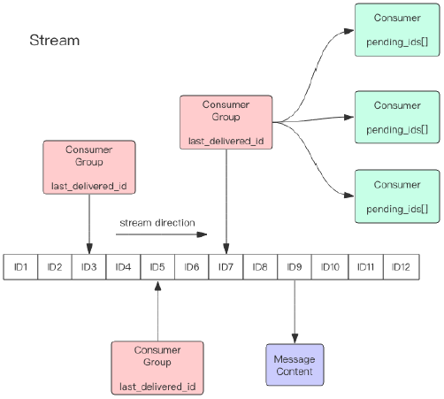

<div align="center"><i>Stream 结构图</i></div>

Redis Stream 的结构如图所示，每一个 Stream 都有一个消息链表，将所有消息串起来，每个消息都有一个唯一的 ID 和对应的内容。

Stream 和 MQ 的消息中间件非常相似，也有消费组、消费者的概念。

在公司中如果只是非常小的项目可以使用 Stream，如果想专业一些还是推荐使用 MQ，MQ 可以解决 Stream 很多问题，如 死信问题等。

**问题一**：Stream 队列可以持久化吗？重启会消失吗？

Redis 是一个哈希类型的字典，里面是 key-value 结构，而 Stream 严格意义上来说是 redis 中的 value 的一种类型，自然也可以持久化。

## 消费组

**每个 Stream 可以挂多个消费组**，每个消费组会有一个游标 `last_delivered_id` 在 stream 数组上往前移动，表示 当前消费组已经消费到了哪条消息。

每个消费组都有一个 Stream 内唯一的名称，消费组不会自动创建，它需要单独的指令 `xgroup create` 进行创建，需要指定从 Stream 的某个消息 ID 开始消费，这个 ID 用来初始化 `last_delivered_id` 变量。

每个消费组 (Consumer Group) 的状态都是**独立的，相互不受影响**。也就是说同一份 Stream 内部的消息会被每个消费组都消费到（类似于广播，每个消费组都会收到）。

## 消费者

同一个消费组 (Consumer Group) 可以挂接多个消费者 (Consumer)，这些消费者之间是竞争关系，任意一个消费者读取了消息都会使游标 `last_delivered_id` 往前移动。每个消费者有一个组内唯一名称。

消费者 (Consumer) 内部会有个==状态变量 pending_ids，它记录了当前已经被客户端读取，但是还没有 ack 的消息==。如果客户端没有 ack，这个变量里面的消息 ID 会越来越多，==一旦某个消息被 ack，它就开始减少==。这个 `pending_ids` 变量在 Redis 官方被称之为 PEL，也就是 Pending Entries List，这是一个很核心的数据结构，它用来确保客户端至少消费了消息一次，而不会在网络传输的中途丢失了没处理。

## 消费 ID 结构

消息 ID 的形式是 timestampInMillis-sequence，例如 1527846880572-5，它表示当前的消息在毫米时间戳 1527846880572 时产生，并且是该毫秒内产生的第 5 条消息。消息 ID 可以由服务器自动生成，也可以由客户端自己指定，但是形式必须是整数 - 整数，而且必须是后面加入的消息的 ID 要大于前面的消息 ID。

消息内容就是键值对，形如 hash 结构的键值对，这没什么特别之处。

## 常用操作命令

### 生产端

#### xadd 追加消息

```sh
# xadd 关键字，stream key名，*代表让redis自动生成消息ID，后面的则是 key-value的格式存储消息
127.0.0.1:0>xadd streamtest2 * name zhangsan age 20
"1678079989825-0"
127.0.0.1:0>xadd streamtest2 * name lisi  age 20
"1678079996663-0"
127.0.0.1:0>xadd streamtest2 * name wangwu age 20
"1678080022804-0"
```

**命令解释**

streamtest2 表示当前 stream 的 key 名称，* 表示让 redis 自动生成 ID，后面的则是 key-value 的格式存储消息。

Redis 返回值 1678079989825-0 则是生成的消息 ID，由两部分组成：时间戳 - 序号。时间戳时毫秒级单位，是生成消息的 Redis 服务器时间，它是个 64 位整型。序号是在这个毫秒时间点内的消息序号。它也是个 64 位整型。

**latest_generated_id 最后一次消息 ID**

为了保证消息有序性，redis 生成的 ID 都是单调递增有序的，ID 包含了时间戳部分，避免了服务器时区或时间不一致等带来的问题。

每个 Stream 都会维护一个 latest_generated_id 属性，该属性记录 最后一次消息 ID，如果追加消息时，发现当前 redis 服务器时间戳小于 latest_generated_id 时，则采用时间戳不变而序号递增的方案来作为新消息 ID，从而保证 ID 的单调递增性质。

如果不是非常特别的需求，建议使用 Redis 的方案生成消息 ID，因为这种时间戳 + 序号的单调递增的 ID 方案，几乎可以满足全部的需求。

#### xdel 删除消息

- 仅删除 stream 中的标志位，不会真正的删除消息
  - 不会真正的从内存中删除数据，而只是删除了 stream 中的标志位，xrange 和 xlen 查询的时候会过滤掉已经删除的消息

```sh
# 删除前
127.0.0.1:0>xlen streamtest2
"3"

# 删除后		关键字		stream key	消息ID
127.0.0.1:0>xdel streamtest2 1678079989825-0
"1"
127.0.0.1:0>xlen streamtest2
"2"
127.0.0.1:0>xrange streamtest2 - +
1) 1) "1678079996663-0"
   1) 1) "name"
      1) "lisi"
      2) "age"
      3) "20"

2) 1) "1678080022804-0"
   1) 1) "name"
      1) "wangwu"
      2) "age"
      3) "20"
```

#### xrange 获取消息列表

- 获取消息列表，会自动过滤已经删除（xdel）的消息

第一种写法：

```sh
# xrange 关键字   stream key名，查询范围： - 代表该消息队列中最小的ID号，+ 代表最大的ID号
127.0.0.1:0>xrange streamtest2 - +
1) 1) "1678079989825-0"
   1) 1) "name"
      1) "zhangsan"
      2) "age"
      3) "20"

2) 1) "1678079996663-0"
   2) 1) "name"
      1) "lisi"
      2) "age"
      3) "20"

3) 1) "1678080022804-0"
   2) 1) "name"
      1) "wangwu"
      2) "age"
      3) "20"
```

第二种写法：手动指定范围

```sh
# 手动指定 查询范围： 该消息队列最小的ID号 到 1678079996663-0 之间的数据
127.0.0.1:0>xrange streamtest2 - 1678079996663-0
1) 1) "1678079989825-0"
   1) 1) "name"
      1) "zhangsan"
      2) "age"
      3) "20"

2) 1) "1678079996663-0"
   2) 1) "name"
      1) "lisi"
      2) "age"
      3) "20"
```

**xlen 消息长度**

```sh
127.0.0.1:0>xlen streamtest2
"3"
```

**del 删除 Stream**

```sh
127.0.0.1:0>del streamtest3
"1"
```

### 消费端

redis 支持 单消费者和 消费组 两种消费方式，根据实际情况选择 需要的方式，推荐使用 消费组。

#### 单独消费者

- Redis 设计了一个单独的消费指令 xread，可以将 Stream 当成普通的消息队列 (list) 来使用。
  - 使用 xread 时，我们可以完全忽略消费组 (Consumer Group) 的存在，就好比 Stream 就是一个普通的列表 (list)。

缺点：使用 xread 进行消费时，因为 **xread 没有游标的概念，要记住返回的消息 ID**，下次继续调用 xread 时，将上次返回的最后一个消息 ID 作为参数传递进去，就可以继续消费后续的消息。

**xread count 1 streams streamtest2 0-0**

- 从 stream 中读取 1 条记录，范围区间：0-0 表示从头开始读取

```sh
# count  1意思是从stream读取1条记录，streams 关键字，streamtest2是队列名称，0-0 代表 从头开始读 这里是消息范围，我们可以指定 从哪个消息ID开始读取，也可以 不指定
127.0.0.1:0>xread count 1 streams streamtest2 0-0
1) 1) "streamtest2"
   1) 1) 1) "1678079996663-0"
         1) 1) "name"
            1) "lisi"
            2) "age"
            3) "20"
```

**xread block 0 count 1 streams streamtest2 $**

- 以阻塞的方式读取尾部最新的一条记录（block 0 count 1），如果收到新的信息回马上打印出来，没收到之前会一直阻塞等待消息

```sh
# 以阻塞的方式读取尾部最新的一条记录（block 0 count 1），等待收到新的信息后 会返回回来
127.0.0.1:0>xread block 0 count 1 streams streamtest2 $
1) 1) "streamtest2"
   1) 1) 1) "1678098290832-0"
         1) 1) "name"
            1) "aaaa"
            2) "age"
            3) "22"

# 往streamtest2 追加一条消息
127.0.0.1:0>xadd streamtest2 * name aaaa age 22
"1678098290832-0"
```

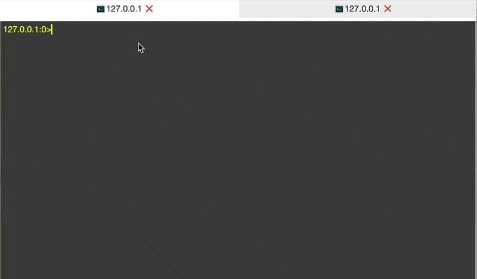

#### 消费组

- Stream 通过 xgroup create 命令创建消费组，需要指定起始消息 ID 来初始化 last_delivered_id 变量。
  - 简单理解就是，设置消费组从哪个消息 ID 开始消费

##### 创建消费组

`xgroup create streamtest2`

```sh
# streamtest2为要读取的队列名称   cg1  消费组名称 0-0 从头开始消费
127.0.0.1:0>xgroup create streamtest2 cg1 0-0
"OK"

# streamtest2为要读取的队列名称  cg2  消费组名称，$表示 从尾部开始消费，只会接收最新的消息，之前的消息全都忽略
127.0.0.1:0>xgroup create streamtest2 cg2 $
"OK"
```

##### 查看消费组详情

```sh
127.0.0.1:0>xinfo groups streamtest2
1) 1)  "name"
   1)  "cg1"
   2)  "consumers"
   3)  "0"
   4)  "pending"
   5)  "0"
   6)  "last-delivered-id"
   7)  "0-0"
   8)  "entries-read"
   9) null
   10) "lag"
   11) "4"

2) 1)  "name"
   1)  "cg2"
   2)  "consumers"
   3)  "0"
   4)  "pending"
   5)  "0"
   6)  "last-delivered-id"
   7)  "1678098504903-0"
   8)  "entries-read"
   9) null
   10) "lag"
   11) "0"
```

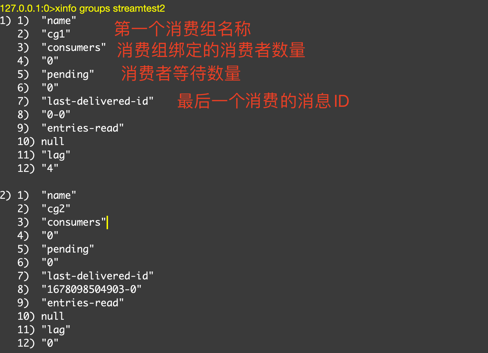

<div align="center"><i>消费组信息</i></div>

##### 查看 Stream 队列详情

```sh
127.0.0.1:0>xinfo stream streamtest2
1)  "length"
2)  "4"		# streamtest2队列一共有4个消息
3)  "radix-tree-keys"
4)  "1"
5)  "radix-tree-nodes"
6)  "2"
7)  "last-generated-id"   # 最后一条消息的ID
8)  "1678098504903-0"
9)  "max-deleted-entry-id"
10) "1678079989825-0"
11) "entries-added"
12) "5"
13) "recorded-first-entry-id"
14) "1678079996663-0"
15) "groups"   # 有2个消费组
16) "2"
17) "first-entry"   # 最开始的一条消息
18) 1) "1678079996663-0"
    1) 1) "name"
       1) "lisi"
       2) "age"
       3) "20"


19) "last-entry"  # 最后一条消息
20) 1) "1678098504903-0"
    1) 1) "name"
       1) "ttt"
       2) "age"
       3) "22"
```

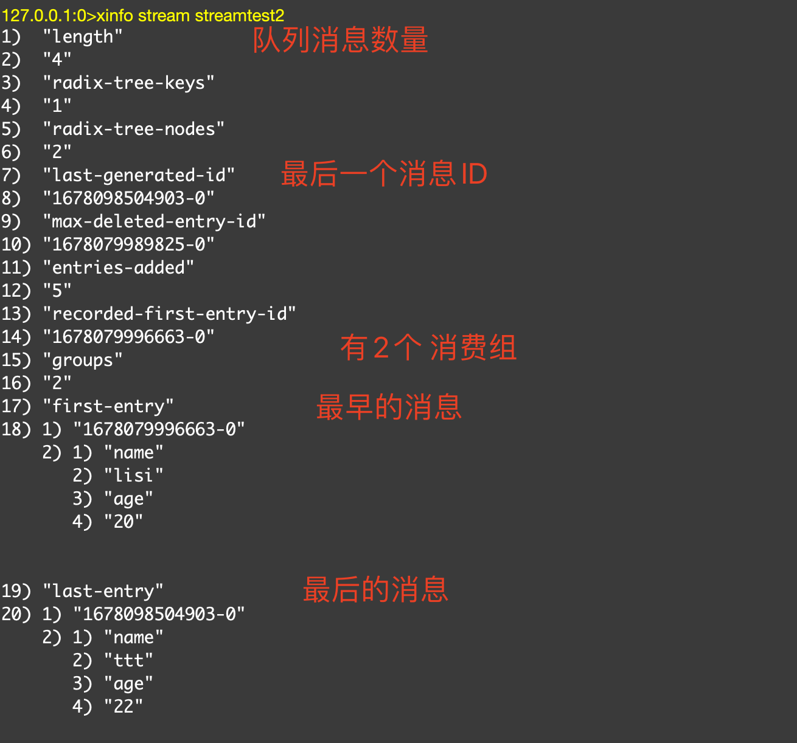

<div align="center"><i>队列信息</i></div>

#### 消费组消费

Stream 提供了 `xreadgroup` 指令可以进行消费组的组内消费，需要提供消费组名称、消费者名称和起始消息 ID。

它同 xread 一样，也可以阻塞等待新消息。读到新消息后，对应的消息 ID 就会进入消费者的 PEL (正在处理的消息) 结构里，客户端处理完毕后使用 xack 指令通知服务器，本条消息已经处理完毕，该消息 ID 就会从 PEL 中移除。

##### 消费消息命令

`xreadgroup GROUP cg1 c1 count 1 streams streamtest2 >`

关键字 group，cg1 是消费组名称，c1 是消费者名称 可以随便起，count 1 代表获取 1 条消息，streamtest2 是队列名，> 号表示从当前消费组的 last_delivered_id 后面开始读，每当消费者读取一条消息，last_delivered_id 就会前进。

我们创建消费组时，指定 last_delivered_id 是 0-0 ，所以现在读取的信息 是 最开始的第一条数据。

```sh
127.0.0.1:0>xreadgroup GROUP cg1 c1 count 1 streams streamtest2 >
1) 1) "streamtest2"
   1) 1) 1) "1678079996663-0"
         1) 1) "name"
            1) "lisi"
            2) "age"
            3) "20"
```

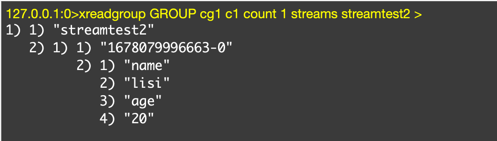

##### 阻塞等待消息

阻塞消息 就多了一个 block 0，其他没有太大区别

```sh
# 阻塞 等待消息
127.0.0.1:0>xreadgroup GROUP cg1 c1 block 0 count 1 streams streamtest2 >

# 新开另外一个客户端 追加消息
127.0.0.1:0>xadd streamtest2 * name ttt222 age 22
"1678160658056-0"

# 回到之前的客户端，发现阻塞解除，收到新消息
127.0.0.1:0>xreadgroup GROUP cg1 c1 block 0 count 1 streams streamtest2 >
1) 1) "streamtest2"
   1) 1) 1) "1678160832005-0"
         1) 1) "name"
            1) "ttt222"
            2) "age"
            3) "22"
```


##### 查看 Stream 的消费组状态

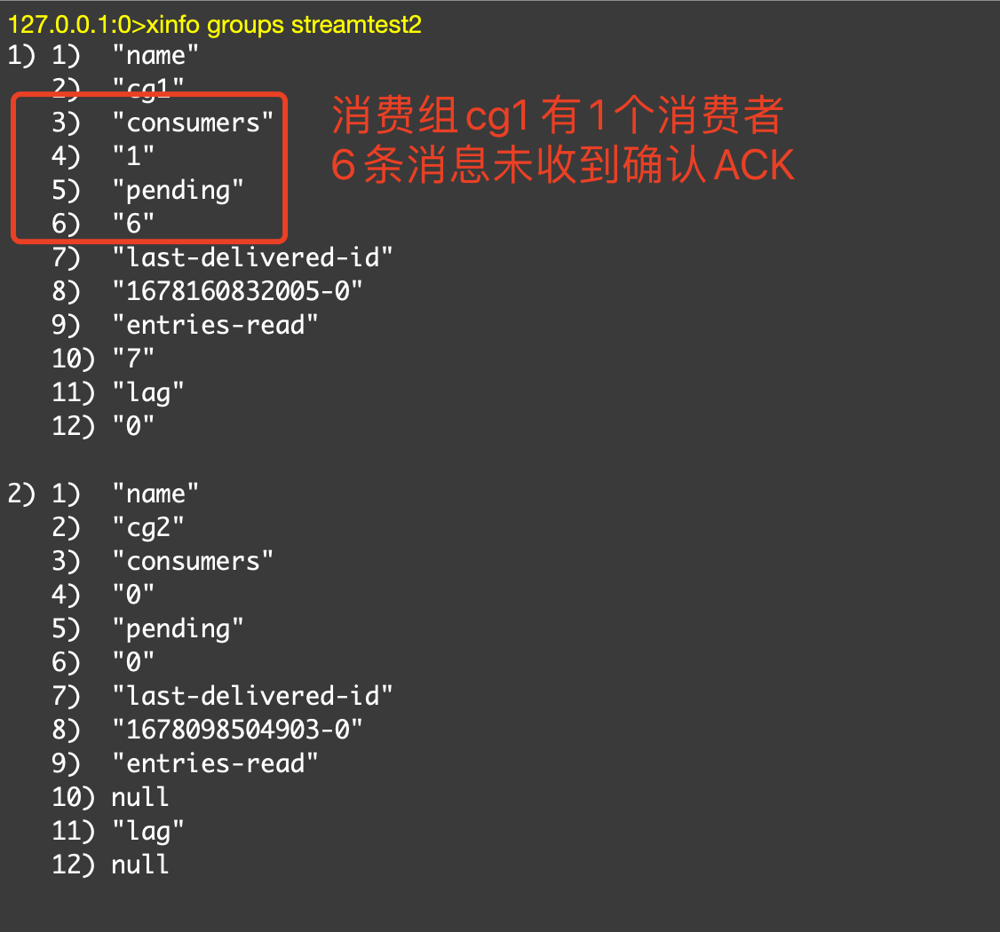

<div align="center"><i>消费组信息</i></div>

如图所示，我们可以看出 消费组 cg1 有 1 个消费者 ，并且有 6 条 未收到确认 ACK 的消息。

##### 发送确认 ACK

xack 关键字，streamtest2 队列名，cg1 消费组名称， 1678160832005-0 消息 ID，注意 这个消息 ID 可以携带多个

```sh
# 注意 这个消息ID可以携带多个
127.0.0.1:0>xack streamtest2 cg1 1678160832005-0
"1"

# 携带多个消息ID，如：127.0.0.1:0>xack streamtest2 cg1 1678160832005-0 1678160832004-0
```

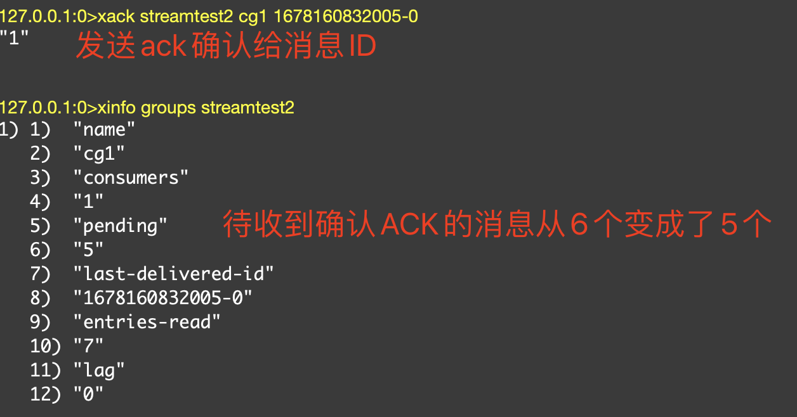

## Redis 队列几种实现的总结

### 基于 List 的 LPUSH+BRPOP 的实现

足够简单，消费消息延迟几乎为零，但是需要处理空闲连接的问题。

如果线程一直阻塞在那里，Redis 客户端的连接就成了闲置连接，闲置过久，服务器一般会主动断开连接，减少闲置资源占用，这个时候 blpop 和 brpop 或抛出异常，所以在编写客户端消费者的时候要小心，如果捕获到异常需要重试。

其他缺点包括：

做消费者确认 ACK 麻烦，不能保证消费者消费消息后是否成功处理的问题（宕机或处理异常等），通常需要维护一个 Pending 列表，保证消息处理确认；不能做广播模式，如 pub/sub，消息发布 / 订阅模型；不能重复消费，一旦消费就会被删除；不支持分组消费。

### 基于 Sorted-Set 的实现

多用来实现延迟队列，当然也可以实现有序的普通的消息队列，但是消费者无法阻塞的获取消息，只能轮询，不允许重复消息。

### PUB/SUB，订阅 / 发布模式

优点：

典型的广播模式，一个消息可以发布到多个消费者；多信道订阅，消费者可以同时订阅多个信道，从而接收多类消息；消息即时发送，消息不用等待消费者读取，消费者会自动接收到信道发布的消息。

缺点：

消息一旦发布，不能接收。换句话就是发布时若客户端不在线，则消息丢失，不能寻回；不能保证每个消费者接收的时间是一致的；若消费者客户端出现消息积压，到一定程度，会被强制断开，导致消息意外丢失。通常发生在消息的生产远大于消费速度时；可见，Pub/Sub 模式不适合做消息存储，消息积压类的业务，而是擅长处理广播，即时通讯，即时反馈的业务。

### 基于 Stream 类型的实现

基本上已经有了一个消息中间件的雏形，可以考虑在生产过程中使用，当然真正要在生产中应用，要做的事情还很多，比如消息队列的管理和监控就需要花大力气去实现，而专业消息队列都已经自带或者存在着很好的第三方方案和插件。

## 消息队列问题

从我们上面对 Stream 的使用表明，Stream 已经具备了一个消息队列的基本要素，生产者 API、消费者 API，消息 Broker，消息的确认机制等等，所以在使用消息中间件中产生的问题，这里一样也会遇到。

**Stream 消息太多怎么办？**

要是消息积累太多，Stream 的链表岂不是很长，内容会不会爆掉？xdel 指令又不会删除消息，它只是给消息做了个标志位。

Redis 自然考虑到了这一点，所以它提供了一个定长 Stream 功能。在 xadd 的指令提供一个定长长度 maxlen，就可以将老的消息干掉，确保最多不超过指定长度。

**消息如果忘记 ACK 会怎样？**

Stream 在每个消费者结构中保存了正在处理中的消息 ID 列表 PEL，如果消费者收到了消息处理完了但是没有回复 ack，就会导致 PEL 列表不断增长，如果有很多消费组的话，那么这个 PEL 占用的内存就会放大。所以消息要尽可能的快速消费并确认。

**PEL 如何避免消息丢失？**

在客户端消费者读取 Stream 消息时，Redis 服务器将消息回复给客户端的过程中，客户端突然断开了连接，消息就丢失了。但是 PEL 里已经保存了发出去的消息 ID。待客户端重新连上之后，可以再次收到 PEL 中的消息 ID 列表。不过此时 xreadgroup 的起始消息 ID 不能为参数 >，而必须是任意有效的消息 ID，一般将参数设为 0-0，表示读取所有的 PEL 消息以及自 last_delivered_id 之后的新消息。

**死信问题**

如果某个消息，不能被消费者处理，也就是不能被 XACK，这是要长时间处于 Pending 列表中，即使被反复的转移给各个消费者也是如此。此时该消息的 delivery counter（通过 XPENDING 可以查询到）就会累加，当累加到某个我们预设的临界值时，我们就认为是坏消息（也叫死信，DeadLetter，无法投递的消息），由于有了判定条件，我们将坏消息处理掉即可，删除即可。删除一个消息，使用 XDEL 语法，注意，这个命令并没有删除 Pending 中的消息，因此查看 Pending，消息还会在，可以在执行执行 XDEL 之后，XACK 这个消息标识其处理完毕。

**Stream 的高可用**

Stream 的高可用是建立主从复制基础上的，它和其它数据结构的复制机制没有区别，也就是说在 Sentinel 和 Cluster 集群环境下 Stream 是可以支持高可用的。不过鉴于 Redis 的指令复制是异步的，在 failover 发生时，Redis 可能会丢失极小部分数据，这点 Redis 的其它数据结构也是一样的。

**分区 Partition**

Redis 的服务器没有原生支持分区能力，如果想要使用分区，那就需要分配多个 Stream，然后在客户端使用一定的策略来生产消息到不同的 Stream。

**Stream 小结**

Stream 的消费模型借鉴了 Kafka 的消费分组的概念，它弥补了 Redis Pub/Sub 不能持久化消息的缺陷。但是它又不同于 kafka，Kafka 的消息可以分 partition，而 Stream 不行。如果非要分 parition 的话，得在客户端做，提供不同的 Stream 名称，对消息进行 hash 取模来选择往哪个 Stream 里塞。

总的来说，如果是中小项目和企业，在工作中已经使用了 Redis，在业务量不是很大，而又需要消息中间件功能的情况下，可以考虑使用 Redis 的 Stream 功能。但是如果并发量很高，资源足够支持下，还是以专业的消息中间件，比如 RocketMQ、Kafka 等来支持业务更好。

# Reactor 模式

Reactor 称为 反应器（事件转发器），具体事件处理程序不调用反应器，而向反应器注册一个事件处理器，表示自己对某些事件感兴趣，有时间来了，具体事件处理程序通过事件处理器对某个指定的事件发生做出反应；这种控制逆转又称为 “好莱坞法则”（不要调用我，让我来调用你）

## 单线程 Reactor 模式流程

服务器端的 Reactor 是一个线程对象，该线程会启动事件循环，并使用 Acceptor 事件处理器关注 ACCEPT 事件，这样 Reactor 会监听==客户端向服务器端发起的连接请求事件（也称之为 ACCEPT 事件）==。

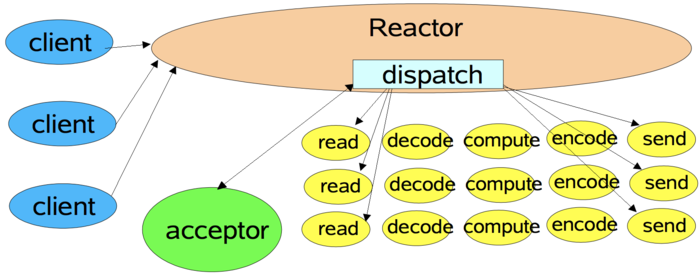

<div align="center"><i>单线程 Reactor-1</i></div>

单线程 Reactor 流程：

1. 客户端向服务器发送发起一个连接请求，Reactor 监听到了该 ACCEPT 事件的发生并将**该 ACCEPT 事件派发给相应的 Acceptor 处理器**来进行处理。建立连接后关注的 READ 事件，这样一来 Reactor 就会监听该连接的 READ 事件了。
2. 当 Reactor 监听到有读 READ 事件发生时，将相关的事件派发给对应的处理器进行处理。比如，读处理器会通过读取数据，此时 read() 操作可以直接读取到数据，而不会堵塞与等待可读的数据到来。

如上图所示，不仅 I/O 操作由 Reactor 线程来处理，非 I/O 的业务操作也在 Reactor 线程上处理，这会大大的降低 Reactor 线程的执行效率，因此 我们**应当将非 I/O 的业务操作 从 Reactor 线程上 剥离出来**。

如：client 连接由 Reactor 线程进行处理，read 读取 、decode 解密、compute 计算、encode 加密、send 发送 都由 Reactor 来完成，Reactor 会非常的忙，所以我们要把这些非 I/O 的业务操作剥离出来，分配给其他线程。

## 单线程 Reactor + 工作者线程池

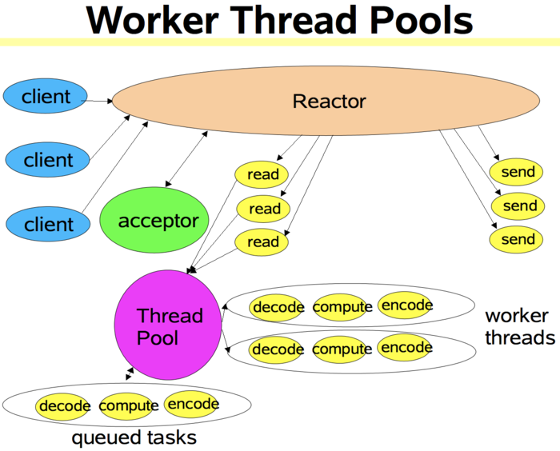

<div align="center"><i>Reactor 工作者线程池</i></div>

该模式与单线程 Reactor 模式不同的是，该模式添加了一个工作者线程池，并将非 I/O 操作从 Reactor 线程中移出转交给工作者线程池来执行。这样能够提高 Reactor 线程的 I/O 响应，不至于因为一些耗时的业务逻辑而延迟对后面 I/O 请求的处理。

对于一些小规模场景，可以使用 单线程模型，但是对于 高负载、高并发、大数据量场景，单线程模型却不太适合，主要原因如下：

1. 一个主线程同时处理成成千上万的请求，线程性能无法支撑
2. 当主线程负载过重时，处理效率会下降，甚至导致后面的客户端连接会阻塞、超时，导致大量消息积压

## 多 Reactor 线程模式

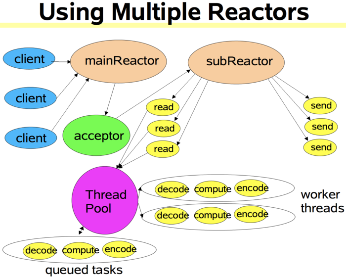

<div align="center"><i>多线程模型</i></div>

Reactor 线程池中的每一 Reactor 线程都会有自己的 Selector、线程和分发的事件循环逻辑。

**mainReactor 可以只有一个，但 subReactor 一般会有多个**。mainReactor 线程主要负责接收客户端的连接请求，然后将接收到的 SocketChannel 传递给 subReactor，由 subReactor 来完成和客户端的通信。

**mainReactor 完成接收客户端连接请求的操作，它不负责与客户端的通信**，而是将建立好的连接转交给 subReactor 线程来完成与客户端的通信，这样一来就不会因为 read () 数据量太大而导致后面的客户端连接请求得不到即时处理的情况。

多 Reactor 线程模式在海量的客户端并发请求的情况下，还可以通过实现 subReactor 线程池来将海量的连接分发给多个 subReactor 线程，在多核的操作系统中这能大大提升应用的负载和吞吐量。

# Redis 中的线程和 IO 概述

Redis **基于 Reactor 模式开发了自己的网络事件处理器（IO 多路复用器） - 文件事件处理器**（File Event Handler，后文简称为 FEH），而该处理器又是单线程的，所以 redis 设计为单线程模型。

## 文件事件处理器组成部分

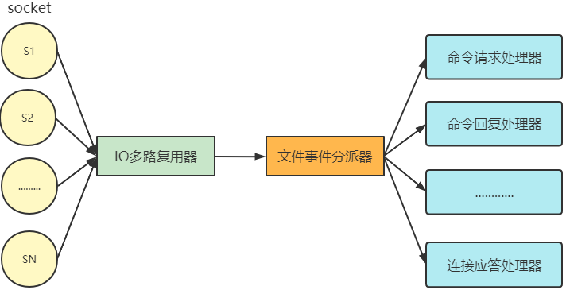

<div align="center"><i>文件事件处理器</i></div>

I/O 多路复用器会**同时监听多个客户端 socket 连接**，根据 socket 当前执行的事件来为 socket **选择对应的事件处理器**。I/O 多路复用程序会负责监听多个客户端发起的 socket 连接。

当被监听的 socket 准备好执行 accept、read、write、close 等操作时，文件事件分派器就会**调用对应的事件处理器来处理对应的 Socket**。

I/O 多路复用器会监听多个 socket，不仅实现高性能的网络通信，由于 **FEH 是单线程模型，又可以避免多线程带来的开销**。

**多线程带来的 2 个必要开销**：

1. 线程创建
2. 线程切换

### socket

每当一个 socket 准备好执行连接 accept、read、write、close 等操作时， 就会产生一个文件事件。一个服务器通常会连接多个 socket， 多个 socket 可能并发产生不同操作，每个操作对应不同文件事件。

### I/O 多路复用程序

I/O 多路复用程序会负责监听多个客户端发起的 socket 连接。

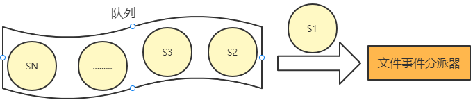

I/O 多路复用程序会**将所有产生事件的 socket 连接放入队列**， 通过该队列以**有序的，每次一个 socket** 的方式向文件事件分派器发送。

当上一个 socket 产生的事件被对应事件处理器执行完后， I/O 多路复用程序才会向文件事件分派器发送下个 socket。

#### I/O 多路复用程序的实现

Redis 的 I/O 多路复用程序的所有功能都是通过包装常见的 select、epoll、 evport 和 kqueue 这些 I/O 多路复用函数库实现的。

每个 I/O 多路复用函数库在 Redis 源码中都对应一个单独的文件：

因为 Redis 为每个 I/O 多路复用函数库都实现了相同的 API ， 所以 I/O 多路复用程序的底层实现是可以互换的。Redis 在 I/O 多路复用程序的实现源码 `ae.c` 文件中宏定义了相应规则，使得程序在编译时自动选择系统中性能最高的 I/O 多路复用函数库作为 Redis 的 I/O 多路复用程序的底层实现：性能降序排列。

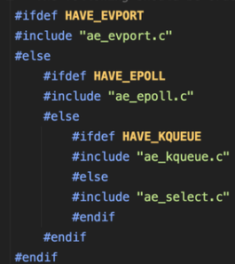

> 注：
>
> evport = Solaris 10
>
> epoll = Linux
>
> kqueue = OS X，FreeBSD
>
> select = 通常作为 fallback 安装在所有平台上
>
> Evport，Epoll 和 KQueue 具有 O (1) 描述符选择算法复杂度，并且它们都使用内部内核空间内存结构。他们还可以提供很多 (数十万个) 文件描述符.
>
> 除其他外，select 最多只能提供 1024 个描述符，并且对描述符进行完全扫描 (因此每次迭代所有描述符以选择一个可使用的描述符)，因此复杂性是 O (n).

### 文件事件分派器

文件事件分派器接收 I/O 多路复用程序传来的 socket， 并根据 socket 产生的事件类型， 调用相应的事件处理器。

### 文件事件处理器

服务器会为不同任务的 socket 关联不同的事件处理器， 这些处理器是一个个函数， 它们定义了某个事件发生时， 服务器应该执行的动作。

Redis 为各种文件事件需求编写了多个处理器，若客户端连接 Redis，对连接服务器的各个客户端进行应答，就需要将 socket 映射到连接应答处理器写数据到 Redis，接收客户端传来的命令请求，就需要映射到命令请求处理器从 Redis 读数据，向客户端返回命令的执行结果，就需要映射到命令回复处理器当主服务器和从服务器进行复制操作时， 主从服务器都需要映射到特别为复制功能编写的复制处理器。

#### 文件事件的类型

I/O 多路复用程序可以监听多个 socket 的 ae.h/AE_READABLE 事件和 ae.h/AE_WRITABLE 事件， 这两类事件和套接字操作之间的对应关系如下：

当 socket 可读（比如客户端对 Redis 执行 write/close 操作），或有新的可应答的 socket 出现时（即客户端对 Redis 执行 connect 操作），socket 就会产生一个 AE_READABLE 事件。

当 socket 可写时（比如客户端对 Redis 执行 read 操作），socket 会产生一个 AE_WRITABLE 事件。

I/O 多路复用程序可以同时监听 AE_REABLE 和 AE_WRITABLE 两种事件，要是一个 socket 同时产生这两种事件，那么文件事件分派器优先处理 AE_REABLE 事件。即一个 socket 又可读又可写时， Redis 服务器先读后写 socket。

## 总结

最后，让我们梳理一下客户端和 Redis 服务器通信的整个过程：

1. Redis 启动初始化时，将连接应答处理器跟 AE_READABLE 事件关联。
2. 若一个客户端发起连接，会产生一个 AE_READABLE 事件，然后由连接应答处理器负责和客户端建立连接，创建客户端对应的 socket，同时将这个 socket 的 AE_READABLE 事件和命令请求处理器关联，使得客户端可以向主服务器发送命令请求。
3. 当客户端向 Redis 发请求时（不管读还是写请求），客户端 socket 都会产生一个 AE_READABLE 事件，触发命令请求处理器。处理器读取客户端的命令内容， 然后传给相关程序执行。
4. 当 Redis 服务器准备好给客户端的响应数据后，会将 socket 的 AE_WRITABLE 事件和命令回复处理器关联，当客户端准备好读取响应数据时，会在 socket 产生一个 AE_WRITABLE 事件，由对应命令回复处理器处理，即将准备好的响应数据写入 socket，供客户端读取。
5. 命令回复处理器全部写完到 socket 后，就会删除该 socket 的 AE_WRITABLE 事件和命令回复处理器的映射。

# Redis6.0 关于多线程大厂常问的问题

**为什么 Redis 单线程那么快**？

1. 数据存储在内存
2. Redis 的主线程是单线程模型
3. Redis 采用 NIO 非阻塞网络通信
4. redis 服务器和客户端之间采用 resp 二进制通信协议比较快又轻

**1. Redis6.0 之前的版本真的是单线程吗**？

Redis 在处理客户端的请求时，包括获取、解析、执行、内容返回等**都由一个顺序串行的主线程处理**，这就是所谓的 “单线程”。

但严格来讲从 Redis4.0 之后并不是单线程，**除了主线程外，它也有后台线程在处理一些较为缓慢的操作**，例如清理脏数据、无用连接的释放、大 key 的删除等等。

**2. Redis6.0 之前为什么一直不使用多线程**？

官方曾做过类似问题的回复：使用 Redis 时，几乎不存在 CPU 成为瓶颈的情况，**Redis 主要受限于内存和网络**。

使用了单线程后，可维护性高。多线程模型虽然在某些方面表现优异，但是它却引入了**程序执行顺序的不确定性，带来了并发读写的一系列问题**，增加了系统复杂度、同时可能存在线程切换、甚至加锁解锁、死锁造成的性能损耗。

Redis 通过 AE 事件模型以及 IO 多路复用等技术，处理性能非常高，因此**没有必要使用多线程。**

单线程机制使得 Redis 内部实现的复杂度大大降低，Hash 的惰性 Rehash、Lpush 等等 “线程不安全” 的命令都可以无锁进行。

**3. Redis6.0 为什么要引入多线程呢**？

因为读写网络的 read/write 系统调用占用了 Redis 执行期间大部分 CPU 时间，瓶颈主要在于网络的 IO 消耗。

redis 支持多线程主要就是两个原因：

- 可以**充分利用服务器 CPU 资源**，目前主线程只能利用一个核
- 多线程可以分摊 Redis 同步 IO 读写负荷，**提高网络 IO**

**4. Redis6.0 默认是否开启了多线程**？

Redis6.0 的多线程默认是禁用的，只使用主线程。如需开启需要修改 redis.conf 配置文件：io-threads-do-reads yes

开启多线程后，还需要设置线程数，否则是不生效的。

关于线程数的设置，官方有一个建议：4 核的机器建议设置为 2 或 3 个线程，8 核的建议设置为 6 个线程，**线程数一定要小于机器核数**。还需要注意的是，**线程数并不是越大越好**，官方认为超过了 8 个基本就没什么意义了。

**5. Redis6.0 采用多线程后，性能的提升效果如何**？

Redis 6 引入的**多线程 IO 特性对性能提升至少是一倍以上**。国内也有大牛曾使用 unstable 版本在阿里云 esc 进行过测试，GET/SET 命令在 4 线程 IO 时性能相比单线程是几乎是翻倍了。

**6. Redis6.0 多线程的实现机制**？

流程简述如下：

1. 主线程负责接收建立连接请求，获取 socket 放入全局等待读处理队列
2. 主线程处理完读事件之后，通过 RR (Round Robin) 将这些连接分配给这些 IO 线程
3. 主线程阻塞等待 IO 线程读取 socket 完毕
4. 主线程通过单线程的方式执行请求命令，请求数据读取并解析完成，但并不执行回写 socket
5. 主线程阻塞等待 IO 线程将数据回写 socket 完毕
6. 解除绑定，清空等待队列

该设计有如下特点：

1. IO 线程要么同时在读 socket，要么同时在写，不会同时读或写
2. IO 线程只负责读写 socket 解析命令，不负责命令处理

**7. 开启多线程后，是否会存在线程并发安全问题**？

从上面的实现机制可以看出，Redis 的多线程部分只是用来处理**网络数据的读写和协议解析**，**执行命令（操作内存）仍然是主线程单线程顺序执行**。所以我们不需要去考虑控制 key、lua、事务，LPUSH/LPOP 等等的并发及线程安全问题。

**8. Redis6.0 的多线程和 Memcached 多线程模型进行对比**

Memcached 服务器采用 master-woker 模式进行工作，服务端采用 socket 与客户端通讯。主线程、工作线程 采用 pipe 管道进行通讯。主线程采用 libevent 监听 listen、accept 的读事件，事件响应后将连接信息的数据结构封装起来，根据算法选择合适的工作线程，将连接任务携带连接信息分发出去，相应的线程利用连接描述符建立与客户端的 socket 连接 并进行后续的存取数据操作。

相同点：都采用了 master 线程 - worker 线程的模型

不同点：Memcached 执行主逻辑也是在 worker 线程里，模型更加简单，实现了真正的线程隔离，符合我们对线程隔离的常规理解。而 Redis 把处理逻辑交还给 master 线程，虽然一定程度上增加了模型复杂度，但也解决了线程并发安全等问题
