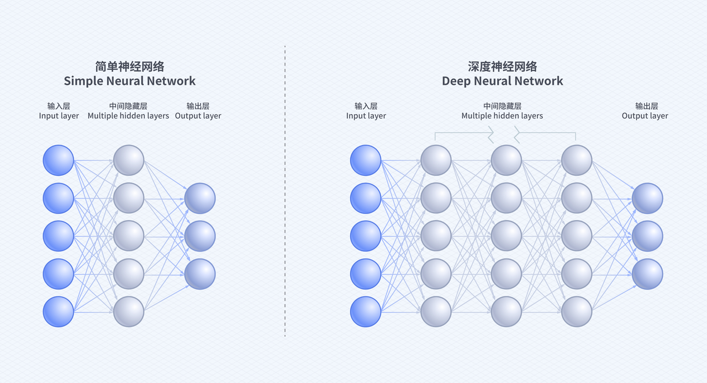
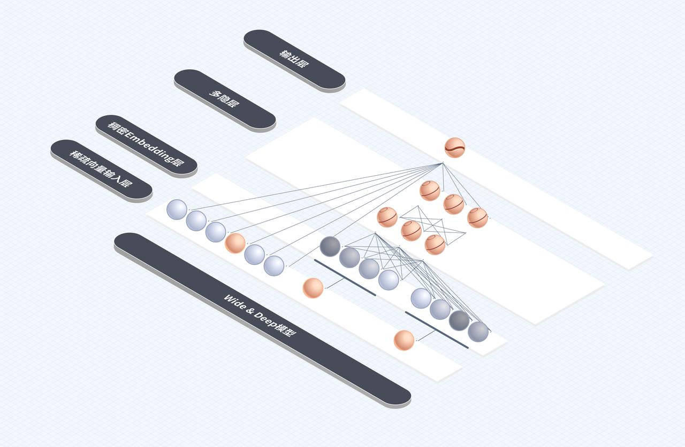
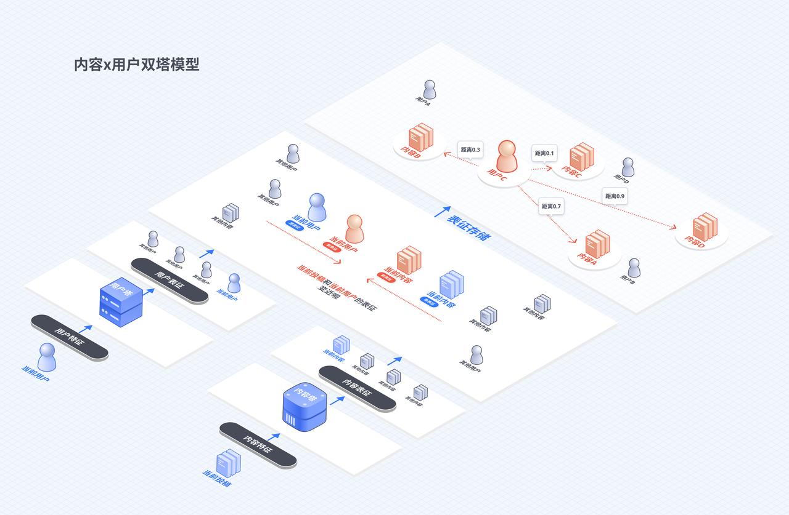

今天，我们生活在信息爆炸时代，在海量信息中寻找自己所需的内容无异于大海捞针。据 IDC（国际数据公司）发布的《数据时代 2025》报告显示，全球每年产生的数据将从 2018 年的 33 ZB（1 ZB 等于 10 万亿亿个字节）增长到 175 ZB，以 25Mb/秒的下载速度计算，一个人下载全人类 2025 年产生的数据需要 18 亿年。具体到个人，我们面对的新增信息量，也从报纸时代的每天几十个版面、数百条新闻，增加到一个平台每天就有上亿条新内容，远超个人所能处理的极限。

## 推荐算法：用数学方法高效匹配信息

互联网诞生后，为了高效连接人和信息，共出现过四类主要技术/模式：

- 第一类是门户网站，核心逻辑是对内容建立分类目录，按目录对不同信息进行集纳，用户按照目录路径查阅信息；
- 第二类是搜索引擎，其最大特点是基于用户的搜索需求，通过搜索引擎主动搜寻信息；
- 第三类是社交网络，其特点是用户首先要关注好友或者订阅频道，系统基于此进行推送；
- 最后一种是推荐系统，特点是系统会更加智能主动地发掘用户的兴趣。

那么推荐系统是如何实现更加高效的信息匹配的呢？

事实上，推荐算法的本质是个极其高效的信息过滤系统。个性化推荐算法，好比给每个人量身定制了一个信息“快递员”，能更高效、准确地把合适的信息推送到用户面前，满足每个用户各不相同的需求。

今天，这类算法已广泛应用于电商平台（商品推荐）、视频网站（内容推送）及社交网络（好友/信息流推荐），通过“千人千面”推荐显著提升推荐的精准度和用户体验。

而从技术视角来看，推荐算法的基础是机器学习。事实上，机器学习是人工智能的核心技术之一，其定义有很多种，大体都可以归结为通过已有的数据进行数学建模、挖掘规律，随后，在此基础上对未知的数据进行预测。

推荐算法是机器学习技术的重要应用领域之一，其核心目标是通过分析用户的“**行为**”（点击、浏览、喜欢、转发、收藏等），构建个性化的推荐模型。具体而言，系统会基于用户历史动作、对象特征和上下文环境，采用算法模型预测用户可能会对什么样的内容产生什么样的行为。

## 传统推荐，不需要算法“懂”内容

“协同过滤”（ Collaborative Filtering，简称 CF）推荐算法是最经典的推荐算法之一，至今仍然在广泛使用。所谓“协同过滤”推荐，简单来说就是协同用户的行为，一起对海量的信息进行过滤，从中更加快速筛选出用户可能会产生行为（比如完播、点赞）的内容。

基于内容的协同过滤的大致过程是这样的。比如用户 A 观看了内容 X、Y、Z，用户 B 观看了内容 X、Z、W，那么 X 和 Z 之间就有较高的相似度。然后根据用户对已观看或已评分内容的偏好，为用户推荐与这些内容相似的其他内容。重点是计算内容之间的相似度，根据用户的行为数据，找出与目标内容相似的其他内容。这种方法在内容数量相对稳定、用户数量较大的场景下表现较好。

因此协同过滤可以在完全“不理解内容”的情况下，也为用户推荐其可能想看的内容。其原理简单来说就是，找到和你兴趣相似的用户，把他们感兴趣的内容也推荐给你。

不过，要在上亿用户中满足上述需求，过程要比上图复杂很多。协同过滤进化出的“矩阵分解”（Matrix Factorization）算法，是业界最常用算法之一。其过程简单说是，基于用户行为数据，构建共现矩阵。

在协同过滤的过程中，用户相似度的计算是算法中最关键的一步。通过上文介绍可知，共现矩阵中的行向量代表相应用户的用户向量。那么，计算用户 A 和用户 B 的相似度问题，就是计算用户向量 A 和用户向量 B 之间的相似度，两个向量之间常用的相似度计算方法有多种，下面介绍其中一种。

余弦相似度，如下图公式所示。余弦相似度（Cosine Similarity）衡量了用户向量 A 和用户向量 B 之间的向量夹角大小。夹角越小，证明余弦相似度越大，两个用户越相似。

$$
Similarity (A, B) = \frac{A \cdot B}{||A|| \times ||B||} = \frac{\sum_{i=1}^{n} (A_i \times B_i)}{\sqrt{\sum_{i=1}^{n} A_i^2} \times \sqrt{\sum_{i=1}^{n} B_i^2}}
$$

**以上内容描述了协同过滤的流程。协同过滤算法通过分析用户行为数据而非内容特征，实现个性化推荐**。需要说明的是，上述介绍只是非常精简的协同过滤推荐算法的描述，具体的细节在不同场景中可能有差异。

## 推荐算法升级：神经网络激发深度学习能力

随着微软的 Deep Crossing，谷歌的 Wide＆Deep，以及 FNN、PNN 等一大批优秀的深度学习推荐模型在 2016 年被提出，推荐系统全面进入深度学习时代。

时至今日，深度学习推荐模型已经成为推荐领域当之无愧的主流。行业以多层感知机器（Multi-Layer Perceptron，MLP）为核心，通过改变神经网络的结构，构建特点各异的深度学习推荐模型。在进入深度学习时代之后，推荐模型主要在以下两方面取得了重大进展。

1. 与传统的机器学习模型相比，深度学习模型的表达能力更强，能够挖掘出更多数据中潜藏的模式。
2. 深度学习的模型结构非常灵活，能够根据业务场景和数据特点，灵活调整模型结构，使模型与应用场景完美契合。

从技术角度讲，深度学习推荐模型大量借鉴并融合了深度学习在图像、语音及自然语言处理方向的成果，在模型结构上进行了快速的演化。

### 深度学习&神经网络原理介绍

深度学习的基础依然是机器学习。机器学习是人工智能的一个分支，核心目标是使用数据和算法使人工智能能够模仿人类的学习方式，并逐渐提高准确性。

在推荐算法应用领域，机器学习的核心目标是学习模仿人类点击某种内容的行为。其常见的过程大致可以简化如下：

- 准备训练集数据；
- 将训练集中的数据输入模型进行训练；
- 将模型输出数据与训练集的目标数据进行对比；
- 通过不断调整参数使得二者不断接近（数学称为拟合）。

这个过程，从表面看和老师教授学生新知识类似：在训练集（相当于老师）的指导下，通过大量的数据输入（相当于练习题），对比目标不断调整模型参数（改错），使得模型输出结果尽量准确，这个过程就是机器学习。

近几年，机器学习的能力越来越强，这得益于深度学习的发展。深度学习是机器学习的高级形态，其核心特点是以人工神经网络为架构。

人工神经网络（Artificial Neural Network，即 ANN）是模仿生物大脑内神经网络的结构和功能设计的计算模型，由大量的节点（类似生物大脑的神经元）之间相互连接构成。

人工神经网络可以分成三个主要部分：输入层、隐藏层、输出层。输入层能够对外界的信息进行处理和分类，然后将结果传递给下一层；隐藏层可能包含一层或多层，能够对输入层或者其他隐藏层传递来的信息进行处理，并将信息传递给输出层或下一个隐藏层；输出层对输入进来的信息进行最终分类判断，并输出结果。深度学习中的“深度”，指的就是在神经网络中使用“多层”，通常情况下，层数越多，算法的能力越强。

在深度学习中，现实世界的所有事物都可以被转化为向量，模型的输入和目标首先被向量化，再进行各种复杂运算。在此用“破案抓小偷”的类比，来介绍神经网络的基本原理：

- 输入层：小区保安（输入特征）

小区门口的保安负责登记来访人员信息，例如戴黑帽子、穿红衣服、背双肩包（像素级基础特征）。登记完成后，他把这些信息写成小纸条，传给下一层侦探。

- 中间隐藏层：多组侦探（加工分析特征）

第一组侦探：看小纸条拼拼图，发现“黑帽子 + 红衣服”常出现在便利店盗窃案；

第二组侦探：查历史档案，发现“双肩包 + 上午 8 点”对应小区快递被偷案；

第三组侦探：画嫌疑人画像，综合“黑帽子、红衣服、双肩包 + 多次出现在案发地”，锁定惯犯特征；

- 输出层：警长拍板（输出计算结果）

警长拿到综合报告，对比数据库后大喊：“这是上周连环盗窃案的 A！”（输出计算结果）

- 训练过程：

一开始侦探们总认错人，队长会复盘：“上次把戴黑帽子的外卖员当成小偷，是因为没考虑时间特征！”。于是调整“时间权重”，下次侦探优先检查“黑帽子 + 非工作时间”的人。如此反复训练后，侦探队成了抓小偷专家。

以上为简化案例，实际模型的复杂度远高于此。但其底层原理大体类似，都是将现实问题转化为纯粹的数学问题。从理论上来说，只要有足够大量的数据对深度神经网络进行训练，它就能用来模拟任意类型的函数，解决各种类型的问题。

### 抖音 Wide&Deep 模型

抖音在 2016 年上线，恰逢推荐算法开始进入深度学习时代，我们所应用的推荐算法也是深度学习算法的一种。接下来我们以至今依然是抖音推荐算法主力模型之一的 Wide&Deep 模型为例进行介绍。

Wide＆Deep 模型的主要思路正如其名，是由单层的 Wide 部分和多层的 Deep 部分组成的混合模型。其中，Wide 部分的主要作用是让模型具有较强的“记忆能力”（memorization），“记忆能力”可以被理解为模型直接学习并利用历史数据中物品或者特征的“共现频率”的能力；Deep 部分的主要作用是让模型具有“泛化能力”（generalization），“泛化能力”可以被理解为模型传递特征的相关性，以及发掘稀疏甚至从未出现过的稀有特征与最终标签相关性的能力。

其具体模型结构如下图：Wide＆Deep 模型把单输入层的 Wide 部分与由 Embedding 层和多隐层组成的 Deep 部分连接起来，一起输入最终的输出层。Deep 部分进行深层的特征交叉，挖掘藏在特征背后的数据模式；而单层的 Wide 部分善于处理大量稀疏的特征，使得数据稀少的用户或者物品也能获得有数据支撑的推荐得分，从而提高泛化能力。

Wide＆Deep 模型的这一结构特征，可以解决前文提到的协同过滤算法的短板。协同过滤算法优点突出，但是其局限性也很明显，就是泛化能力差，推荐的结果头部效应比较明显。也就是容易造成信息单一问题。

### 抖音双塔召回模型

一条视频从海量信息中被选中，推送给用户，一般要经过进入内容池、召回、排序三个环节。用户发布的新视频首先要经过初步评估进入内容池，然后进入召回环节，其作用是从海量的内容池中，初步快速粗筛出一大批用户可能感兴趣的内容。

举例来说，召回环节需要用到召回模型，抖音最常用的召回模型是“双塔召回模型”（Two-Tower Retrieval Model）。双塔召回模型把用户和内容都转化为数学空间里的一个个点，就像是给用户和内容贴上了独特的“数字标签”，这个过程叫做向量化表征学习。其大概过程如下：

1. 分别将用户特征、内容特征进行数学转化（如展示小猫的视频为 0，展示小狗的视频为 1，短视频为 0，长视频为 1，那么一个展示小猫的长视频即（0，1），其实际长度取决于特征有多少维度，用户特征同理）；
2. 将转化后的数学特征输入到用户塔、内容塔两个深度学习模型中，经过训练，各自形成一组新的数字集合，这叫做用户表征和内容表征。在这一步，原本各自代表一个现实特征的数字不再具备任何实际语义，两个模型会把用户特征和内容特征都转化为没有现实意义的数字代码——因此，算法不用理解现实语义，只需处理纯粹的数学符号；
3. 将两组形式为纯粹的数字集合的用户表征和内容表征，放入同一个向量空间中，每一组数字集合便在向量空间中拥有了一组专属的向量值，好比一组独有的“数字指纹”；
4. 将训练过的所有内容表征的向量值和当前用户表征的向量值的距离进行对比，距离越接近代表用户越喜欢。当你的“数字指纹”和某个视频的“数字指纹”在坐标系里刚好比较“匹配”（距离近），算法就会推荐它。

## 总结推荐算法：以数学计算学习人类行为

相比人工推荐，推荐算法实现了一个重要范式突破：它将用户对内容的具体偏好（如点击、评分等显式行为）抽象为高维空间中的数学映射关系。

通过将用户 - 内容交互矩阵分解为隐语义空间中的用户偏好矩阵和内容特征矩阵，算法无需理解“内容类型”或“开心愤怒情绪”等现实语义，而是通过潜在特征向量运算，就能实现对用户“是否会看完”“是否会点赞”“是否会收藏”某个内容的行为预测。

正是这种脱离现实语义的数学建模能力，结合亿级数据，实现“知其然，而不必知其所以然”的精准推荐。
