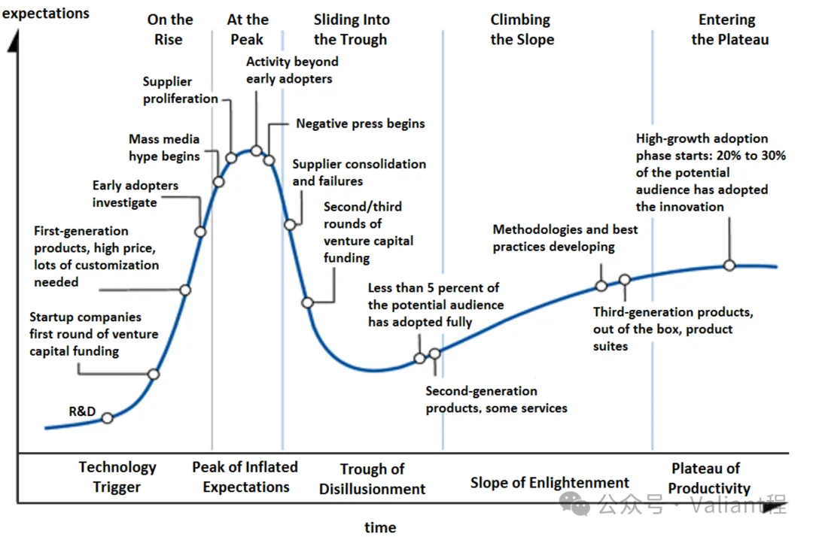

凌晨一点的办公室，32 岁的 Java 工程师老程正在重启已经失败了 8 次的服务。他想起白天面试时那个对分布式一致性哈希算法侃侃而谈的候选人，突然意识到自己也曾像他一样热衷于各种各样高大上的技术。然而，如今在自己维护的陈旧后台管理系统中，每一个 CRUD 接口需求的完成，每一次的 Button 位置的调整，可能永远都用不上这些酷炫技术。

这种割裂感正在整个行业蔓延 —— 除去少数 GitHub Trending 上的技术弄潮儿们能不断创造令人目眩的技术和项目，现实中 90% 以上的程序员总在重复写着 CRUD 类的简单机械需求，满足一个又一个 “紧急且重要” 的功能，焦虑地和他人比较着薪资，但始终无法找到充足的意义和价值。

那些曾经在 LeetCode 上刷爆题库的年轻人们，可能还未曾意识到自己如何在转动的商业机器中做着一颗螺丝钉，为企业财报中的某些数字做出贡献。

这说明了一个冰冷的真相：在市场化的商业时代中，大部分普通程序员本质上仅仅是企业盈利链条上的价值导体，对他们以及他们的雇主来说，技术本质上是手段而非目的。

程序员的核心价值，是技术吗？作为手段而非目的的技术，相对不重要吗？技术的价值又从哪里得来？请让我为你聊聊我的看法。

> Hi，大家好，我是 Valiant 程，在正式开始之前，我想说明下为什么要聊这些话题？代码和编程之外系列源于我对自身及程序员群体的观察思考得来，我们大部分人（包括我），可能陷于各种酷炫高大上技术的盲目崇拜中，可能陷于面向薪资和跳槽编程的功利急躁中，可能陷于应接不暇的繁重工作中，而对于场景、技术本质、价值、动机追求等一些更加不可见，真正决定脚下的路能走多远的主题，却未能了解到。
>
> 我希望通过我的表达，来帮助大家厘清这些常被忽视的东西，如果能对这些东西有足够的理解，可能会帮助大家走得更快更远。
>
> 当然，这些也都只是我个人的观点，不代表绝对正确，如果你有不同的意见，那么肯定也有对应充分的理由，欢迎一起讨论。

## 企业生存的本质

科斯在《企业的本质》中早已揭示，企业存在的意义之一在于降低交易成本和费用，互联网公司的出现，进一步证明了这一理念。当某互联网大厂每年支付 100 万薪资给分布式系统专家时，本质上可能是在购买其：提高交易效率、降低系统崩溃风险的能力 —— 这个岗位的 ROI 必须高于带来的交易效率增长收益以及可能的宕机损失。

而当这样的提升空间达到瓶颈，以及宕机风险不再存在时（可能因为各种各样的原因，如云服务、AI 等新技术的出现），那么这位分布式系统专家对大厂的价值也就不再重要了。

从更广泛的意义上来讲，任何现代市场经济中的工作岗位，要么开源（直接创造利润），要么节流（控制成本）。软件工程师，或者说程序员，自然也无法脱离这个范畴。只不过，在分工和链条日益复杂的趋势下，我们所做工作价值从手下键盘传导到终端利润的路径，也变得越来越间接和复杂化，以至于很多人无法意识和感受到，这也是很多人缺乏价值感的原因之一。

而软件工程师岗位相较于其他大部分传统岗位，一个比较特殊的地方在于：能够通过技术杠杆来帮助企业放大盈利效率。拿建筑工人来举例，在不掌握特殊知识技能的前提下，他们给企业带来的收益是线性的，1 个人产出 1 个单位劳动的收益，10 个人干 10 个单位劳动的收益。

而程序员因为掌握技术，有时候能够出现 1 个人产出 3 个单位劳动的收益，这是依赖软件信息自动化技术本身带来的【技术杠杆】，这也是为何目前互联网行业的从业者工资较高的原因之一。而多位高质量程序员组成的协作良好的团队，能够进一步带来乘数效应，甚至能够出现 10 个人产出 1k 乃至 1w 单位的收益（OpenAI、Deepseek 团队都是这样的案例），这也是为何管理程序员的管理人员能够拿到更多薪资的原因之一。

由此可见，程序员的核心价值，不仅仅是技术，但方方面面又离不开技术。

技术为创收的业务场景带来杠杆作用，程序员的价值函数可量化为：V=Σ（技术杠杆率 × 业务价值密度） 。当某电商平台对实时推荐算法进行一轮优化后，转化率提升 0.5%，看似微小，却因其千亿 GMV 基数产生 5 亿增量价值，这正是技术杠杆的乘数放大效应。

那么，我们产出的价值，到底是如何通过企业传导到利润终端呢？

## 技术价值的传导路径

经常有人在网上讨论，关于技术重要还是业务重要的问题，这个问题在我看来没有标准答案，因为缺失很多上下文背景信息。

其实，更多时候我们只需要厘清技术、业务、盈利的链条传导关系，那么这个问题的答案自然就会浮现出来。技术价值传导链的核心法则可以用一个公式表达：

> 技术价值 = 技术稀缺性 × 业务适配度 × 泡沫溢价率

#### 技术稀缺性

所谓的技术稀缺性，相信是最好理解的，决定稀缺的一方面是技术本身的先进度，越先进的技术，就越稀缺。先进性技术能够提升效率，比如电机对比蒸汽机，前者的效率可能是后者的数倍乃至数十倍，换到我们熟悉的 IT 技术范畴内，就是前端框架对比手写 html、容器化对比手动部署、AI 自动化对比人工等等。

技术先进性意味着相对平均市场水平的效率提升，如果企业能够引入这种先进性，那自然就能获取到更高的利润、更大范围的市场：这是技术最本质也最直观的价值。此外，只要这种技术先进性能够辐射的范围足够广，匹配什么业务甚至也不再重要，如通用性的互联网和 AI 技术，可以说他们在过去的这几十年重塑了各个产业。

曾经，高并发分布式作为互联网应对大规模增长的刚需技术，又有一定的技术深度和难度，逐渐成为了技术稀缺性的一个符号。不过，随着互联网的规模增长放缓见顶，存量累积的大量工程师，以及技术方案、教学和工具的普及成熟，它可能便不再是稀缺的技术了。具备稀缺性的技术，每年都在发生变化与发展。

另外，先进性并不完全等于稀缺性，还有另一类技术虽然并不具备先进特征，但也较为稀缺，比如 COBOL 这种非常古老的语言，没有多少人会，但很多大型银行还有系统需要维护，那么这种技术也就具备其稀缺性。同样的道理，程序员圈子里所谓的 “防御性编程”（我写的代码只有我自己能够维护），也是这一种思路的体现，但并非长久之计。

#### 业务适配度

> 技术如果仅有先进性，而无匹配的落地、发挥实际作用的场景，最终也只会是空中楼阁和奇技淫巧。

近几年的某个跨境电商平台的技术复盘会上，他们的 CTO 叫停了团队对 Service Mesh 的盲目投入：" 我们的日均订单量只有 50 万，Kubernetes 原生能力完全够用 "。这揭示了影响技术价值的第二个因素：**和业务的匹配度**。

技术和业务的匹配度计量，通常有两个维度：**业务类型**和**业务规模**。

业务类型的匹配度很好理解，我们拿以下三种典型的业务类型举例：

- **事务密集型业务**（如电商、金融）：技术栈需优先保障数据一致性，例如银行系统采用 TCC 分布式事务模式，而电商订单系统常通过“预占库存 + 异步结算”的柔性事务平衡性能与准确性，这种业务类型下叠加极大的规模，数据库、分布式、中间件等技术至关重要。
- **流量密集型业务**（如直播、社交）：技术重心转向高并发吞吐量处理，例如某短视频平台曾通过将 gRPC 替换为自研的 QUIC 协议栈，将通信端到端延迟和丢包率降低，全面提升用户体验，提升留存时长，这种业务类型下，网络性能优化相关的技术至关重要。
- **计算密集型业务**（如 AI 训练、渲染农场、大数据计算）：技术核心在于基础设施的资源利用率优化，某自动驾驶公司通过定制 Kubernetes 调度器，使 GPU 集群利用率从 30% 提升至 60%（翻倍），直接缩减百万级云计算成本。这种业务类型下，资源调度和优化相关的技术至关重要。

我们可以很明显地看到，随着业务类型的不同，不同的技术切入不同的场景，显现出不同的价值。

而第二个方面，业务的规模，对技术价值的影响也很大，如：

- **启动期业务**：某社交创业公司用 Firebase 快速实现消息推送，放弃自研 IM 系统节省的 3 个月时间，换来关键的用户增长窗口期，这时候快速搭建 MVP（全栈开发），做胶水粘合成熟服务的 “技术” 很重要；（这也就意味着更侧重广度、实践性的技术而非深度、研究性的技术）
- **增长期业务**：当某个爆火应用的 QPS 峰值迅速增加至 50 万时，自研分布式数据库良好的伸缩扩展性能很好地支持了应用用户量的扩展，这时候优化性能支撑规模的 “技术” 很重要；
- **稳定期业务**：当某成熟互联网平台企业经过快速发展期后，业务规模进入稳定阶段，出于成本考虑，需要盘活已有的各类数据中心服务器资源的利用率，这时候做精细化资源调度优化的 “技术” 很重要；
- **衰退期业务**：某传统车企的 ERP 维护团队，用 80% 精力保持系统正常稳定运转，不再去做密集的开发，而是着重建设监控和运维技术体系，保障服务质量，这时候运维的 “技术” 很重要；

在金融科技公司的底层清算系统中，每减少 1ms 延迟就可能能提升数亿资金流转效率，这里需要足够深度的顶尖分布式和性能优化技术；而某生鲜电商的全栈工程师用低代码平台快速迭代小程序，三周上线社区团购功能抢占地盘，这里需要侧重广度和实践的技术。两者看似技术含量悬殊，实则都精准匹配了业务阶段需求，这就是业务适配度对技术价值的影响。

#### 泡沫溢价率

常言道，在风口上，猪都能飞起来，这个道理想必大家也非常熟悉。生活在我们这个快速变化的时代，我们总是能够看到泡沫潮起潮落。当某个新概念迅速在互联网上病毒式传播时，泡沫就出现了，与之相对应的，此时某些风口上的技术，会经由供需不匹配的表现，进而以高溢价率的形式体现出来：

当某元宇宙 Web3 公司在 2022 年以年薪百万招聘 Unity 工程师时，本质上是**风口期的资源虹吸效应**：

> 溢价率 = 资本泡沫浓度 × 人才稀缺系数 × 概念传播速度

Gartner 曲线显示，新技术从促动期到泡沫谷底通常存在一段时间差，而这个时间差范围就是技术溢价率体现的时间段。Web3 领域在 2021 年热钱涌入时，Solidity 开发者薪资一度达到传统互联网的 2~3 倍；而当 Terra/LUNA 崩盘后，后续一段时间内，这批工程师中有 41% 转型到了 LLM 相关的企业内工作，这种波动本质上是技术价值在金融杠杆作用下的变形记。

这样的潮起潮落，在我们当今的时代不断发生，但泡沫并不意味着骗局，任何真正具备先进性和潜在匹配场景的技术，都逃离不了泡沫阶段。如果你有能力把握和利用泡沫，吃到溢价率带来的红利，那么你收获的技术价值就会进一步提升。

#### 技术与业务的错位

现在，我们基本能够明确技术本身和业务对最终价值的贡献模式了。如果你能够把握住这个技术通过业务传导到盈利的链条，并做出针对性的行动，相信就能够获得应有的回报，而如果你的技术价值无法穿透业务层抵达盈利端时，就会出现三类明显的问题：

1. **技术超前性陷阱**：某物流公司的开发人员过早引入区块链溯源，增加 25% 研发成本却无实际业务需求
2. **路径依赖黑洞**：某视频网站的站长死守 Flash 技术，错过移动端 H5 转型机遇
3. **伪需求传导失真**：某餐饮 SaaS 企业的老板用神经网络做菜品推荐，实际转化率不如人工运营

这些技术上的选择带来了商业上的失败，而最终也会以冷酷的方式降临在企业内的每一个员工身上。这些案例印证了某个技术出身投资人的警告：“当你无法用三句话说明白技术方案和营收增长的关系时，就该重新审视代码和系统的价值本质了。”

而对于我们个人，如果无法把握正确的技术价值传导方向，那么自身的能力模型也必然偏离整体市场的需求，以至于最终无法在市场上寻找好的发展机会。

反过来，我们也不能一味地完全偏向市场和业务，这也磨灭了创新的可能，很多技术的创新，又源于对冷门领域的研究投入。

---

老程对服务的第 9 次的重启终于成功了，显示器上的光映出他嘴角的一丝苦笑。他忽然又意识到，那些面试中高深晦涩的主题也许并不是毫无意义，那些东西也必然来源于某个曾经需要它的公司的业务场景中，并发挥出了其应有的价值，只不过是自己并没有参与其中罢了。

如果自己当时能够对技术价值的决定性因素有所明晰，将恰当的技术切入到了恰当的场景，并规划选择了合适的发展路径，想必现在可能早已成为了管理多个团队的技术总监或是资深技术专家，而不是仍然奋战在加班一线的程序员搬砖工。

而今，虽然 32 岁的自己，在 IT 行业已经算是 “中高龄”，但拉长周期看，他认为他的时间仍然充足。

老程想起了十年前刚从学校毕业的自己，怀揣着对技术的热爱，那时，他总是每天对着一个个技术问题和项目钻研到很晚，看到自己业余出于兴趣编写的程序在屏幕上打印出一行行整洁的日志，发自内心地感受到开心。

种一棵树最好的时间是十年前，其次是现在，本质上，老程还是当年那个热爱技术的少年，现在，他想清楚了更多。
