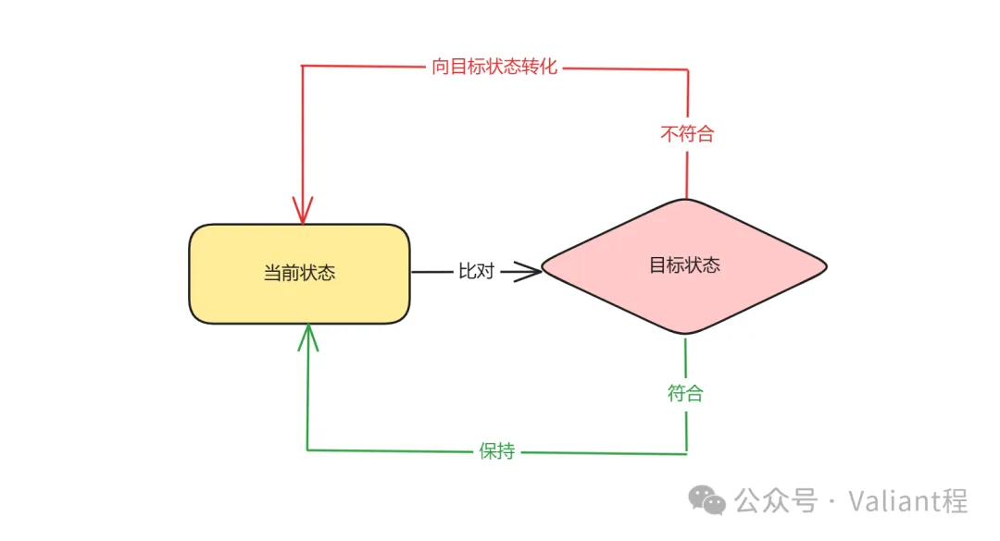
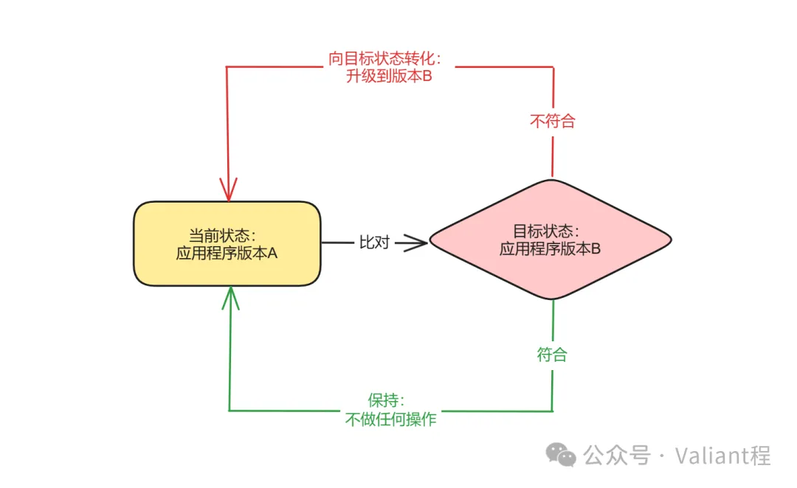
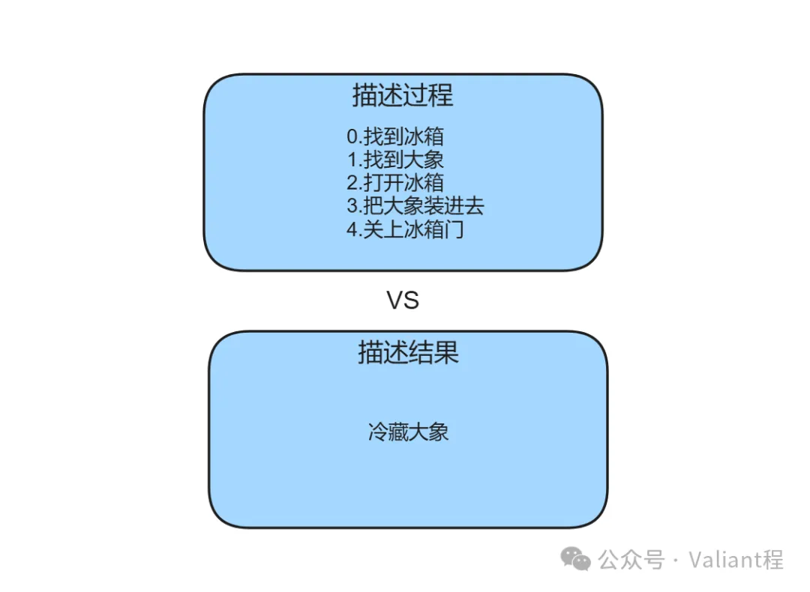

> 总的来说是一篇还不错的技术小品，一个对 K8S 结构的 overview。简单快速，仅供了解之用。

## 为什么会有 K8S

在上一篇文章中我们讲解了容器的诞生历程，其根本性解决了程序一直以来存在的部署问题，这一问题的解决，从根本上提高了 IT 技术工程的整体效率，从而让容器的使用开始得到逐步的普及。从个人使用到企业大规模化使用，落地容器技术和追求容器化率开始成为大多数追求技术先进性企业的目标。

不过随着容器技术被大规模地运用于生产实践，一些问题也逐步暴露了出来：

单机上的容器可以使用 docker 很轻松地进行管理，但有一定规模的企业往往会有很多个应用、很多台机器，一旦应用、机器的数量急剧增长，承载应用运行的容器的管理就开始变得复杂和麻烦了。试想，如果没有任何手段，那么就只能编写运维脚本，然后批量下发到每台机器上做管理了，这种管理模式有很多弊端：

- **操作管理效率低**：任何操作都要编写脚本实现，操作人必须关注每一步的操作和实施细节，整体的实施操作的效率很低，且具备人工误操作的风险，并且大多数时候这对工程师来说是一种高重复性且枯燥的事务性操作，存在自动化的可能
- **缺失全局记录**：在大量机器上做了容器化部署后，默认是没有记录机制的，部署完成后无法感知应用程序在大量机器上的分布和运行情况，必须自己建设管控系统记录这些信息
- **精细化控制操作成本高**：比如实现一组应用程序的受控分批化逐步升降级、根据资源使用情况针对应用程序所申请的各类计算资源进行扩缩容调整、一台机器宕机后对上面运行的应用程序进行转移恢复等等，规划、执行这些操作行为都有很高的成本
- **难以进行高效的资源管理、使用及分配**：应用程序需要的各类资源（计算、内存、存储、网络、异构算力等）如何管理和供给？哪类或哪个应用适合放在当前集群内的哪个机器上？如何放置才能将资源碎片度降到最低、机器集群整体的资源利用率得到最高效的使用？这一点和成本紧密相关，也是对企业最有吸引力的一个方面
- **服务难以高效管理和治理**：在微服务化的背景下，应用服务间该如何在大规模机器集群上高效地互相感知、互联及协作？每个服务的配置如何进行高效跟踪、修改和管理？服务该如何恰当地暴露给用户进行访问？

要一一解决这些问题，就需要从头针对容器化应用在大规模机器集群的部署实践中遇到的上述各类问题，设计一个功能健全的管控系统来解决，而其实 K8S 也就是这样的东西，可以说这又是一个遇到问题解决问题的过程，但 K8S 并非是解决这些问题唯一出现的项目，但却是在一堆解决方案中解决最成功的一个。

> 不过，我们更多地将 K8S 称为容器编排（Orchestration）系统，而非管控（Control）系统：这两个定义的差异关键就在于编排是一种更上层、更宏观及关注结果的视角（即最终应当是一种怎样的状态），而管控则时更底层、微观一些，关注操作过程的视角（即如何进行控制来达成需要的状态）。这一差异是 K8S 理念中最核心的一点，也是其相对于其他类似系统最根本性和革命性的差异。

## K8S 如何解决这些问题

那么 K8S 具体是如何解决上述问题的，上文提到的前三个弊端问题的解决，都和 K8S 应对这些问题和场景时所秉持的一个大原则：**面向终态** 有关

### 面向终态

如何理解 “面向终态”？相信即使没有程序员背景知识的人也都用过马桶水箱、冰箱、热水器、空调、自动驾驶汽车这些东西吧，这些东西都可以视为 “面向终态的控制系统”：

- 马桶水箱的终态是水箱内的水达到指定水位，否则会一直尝试送水进来
- 冰箱、热水器和空调的终态是其关注对象的温度达到指定值，否则会一直尝试工作来改变对象温度
- 自动驾驶汽车启用定速巡航功能的终态是达到其设定的行驶速度，否则会调节发动机转速达到指定速度

我们不难看出，面向终态的关键就在于让控制逻辑感知到某种状态（现状），然后根据感知到的状态进行针对性操作，最终达成某个目标状态（终态），而目标状态也不是一成不变的，所以整个系统往往处于一种动态平衡的状态。

为什么这个思想成为了 K8S 的核心思想呢？我们首先要分析清楚 K8S 要解决的问题究竟是一个什么样的问题：

> **大规模程序、应用在大规模机器集群内的高效部署管理**

我们对这个问题进一步分解细化一下，部署管理无非就是对程序、应用和机器进行各种操作，来达成各种目的，比如：

- 对应用程序进行从无到有的部署：一批应用程序**应当**运行在集群内的某些机器上，以满足业务需求
- 将应用程序从 A 版本升级到 B 版本：应用程序的版本**应当**为 B，以满足新的功能需求
- 将应用程序的 CPU 资源从 1 颗增加至 2 颗：应用程序**应当**享有 2 颗 CPU 的计算资源，以缓解其性能压力
- 在应用程序所处的机器宕机后对其进行转移：应用程序**应当**始终保持运行，以保证服务始终可用
- 为机器集群扩充机器：当 IT 业务经历使用高峰时，应用程序的计算资源**应当**保持充足，以保证用户良好的使用体验

诸如此类的问题，其实都可以划分为操作、目标状态和最终目的三部分：

- 操作的直接目的是达成目标状态（应当达成的状态）
- 达成目标状态可以满足最终目的

所以，这里目标状态实际上就是操作和最终目的之间的关键纽带，K8S “面向终态” 的设计思想就是关注这里的目标状态，将达成目标状态的操作进行自动化、公共化和抽象化，从而更高效地达成最终目的。

上述所提到的 “面向终态” 的思想，有一个行业内的专业术语，叫 “声明式 API”，这个思想及术语，大概率是由声明式和命令时两种差异化的编程思想而得来的。

更具体地讲，K8S 里使用的各类 Yaml 就是我们能够直接看到的体现形式，我们把期望的终态写入 Yaml 中，K8S 就会为我们自动操作实现，所以这里写 Yaml 就好像变成了调 API 一样，我们只需要写 (声明) 一下就能产生效果，所以就是所谓的 “声明式 API”。

在业内，搞 K8S 的工程师经常自嘲或被戏称为 “Yaml 工程师”，这也要 “归咎” 于 K8S 通过这种思想极大地提高了效率，让我们只写 Yaml，就能完成以前实施成本异常复杂的操作行为。

### 自动化、标准化操作流程

之所以能够实现自动化、标准化的基础之一，也在于对程序在大规模机器集群内的部署管理这个问题来说，大部分的操作都是重复冗余、有高度自动化可能性空间的，所以 K8S “面向终态”，实际上就把这些高度重复冗余的操作都标准化、自动化了。

最典型的比如重启、升级、增加计算资源这些操作，基本的操作流程都是固定不变的，并且和容器内运行的到底是什么样的程序无关，会变的仅仅只是一些外部参数（如应用名、版本号、增加的计算资源数目等），因此这些流程很容易就能被标准化自动化，这本质上和在编程中封装公共函数是同一件事情。

而最终这样的自动化、标准化也消除了管理运维人员原本必须进行的重复繁重枯燥的手动人工操作，也消除了因为人工误操作带来的故障风险，从而提升了管理效率和稳定性水平，成功释放了技术红利。

### 天然重试

面向终态的思想还带来了一个天然的结果，那就是 “重试”。

当我们进行任何操作，如果不符合预期，可能是各种各样的偶然因素影响，我们往往会做重试来再尝试若干次以避免偶然因素带来的影响。

在面向终态的思想中，因为时刻在比较现状与目标状态的差异，一旦没有满足要求，就会立即进行操作来尝试达成目标，如果这次操作失败了，就会再次重试来再次尝试达成目标状态。也因此，“重试” 操作成了面向终态设计思想和实现中所达成的一个天然性的结果，这也降低了由人工进行操作重试所带来的成本。

> 重试这件事本身也很复杂，该重试几次？重试的频率是多少？什么情况下不该进行重试？等等之类的问题，我们会在后面探究更细节性的 K8S 设计思想的时候进一步阐述。

一个很有意思的例子是，很多的企业采用 K8S 后，发现遇到的实际生产问题变少了，原因不是他们用了 K8S 后代码中的 bug 减少了，而是因为原来的 bug 导致的服务崩溃都由 K8S 帮他们迅速重启拉起恢复掉了，这样的重启执行速度之快与及时，甚至让开发人员意识不到是自己的程序出了问题。

### 状态的全局记录

因为面向终态要时刻比较当下和目标状态的差异，因此对当下和目标状态信息的记录就变成了一个必要的条件，否则便无法实现 “面向终态” 思想所要求的效果，所以这种记录能力也是 K8S 提供的基本功能。

所以，在管理程序和机器的同时，我们也就有了记录机制。每一个部署的程序，管理范围内的机器，以及彼此之间的各类关系，都有了明确的记录（所有机器就像是都有了证件，证件上的所有相关数据信息都在管理机构的数据库内统一保存，并且能够实现实时更新感知），这极大地提升了管理的效率，因为我们可以近乎实时地感知到当前大量程序和机器的状态，判断其是否存在问题，并做针对性的调整。

### 降低门槛

另外一个效果是，由于所有的具体操作行为被自动化和标准化掉了，也因此实际上运维人员不需要进行达成目标状态的每一步细节操作，这极大的降低了管理程序和机器集群的门槛。

在这样的思想下，解决问题的人的关注点完全改变了，从关注过程变成了关注结果，而描述清楚需求、结果往往比描述清楚过程简单得多，因此问题的解决变得更加容易和高效了。更具体地来讲，这里的受益人员实际上是运维人员以及一切做运维操作的人。

> 但往往随着需求越来越复杂，这套机制也会出现新的问题，那就是描述结果的语义也开始变得复杂，就像是用 SQL 取数据一样，同样是关注结果而非过程的思想，在最简单的场景下往往 select + where 就够用了，而一旦取数据要求的结果本身很复杂，就会导致写 SQL 本身这件事也开始变得复杂。

所以，我们现在来看，在上文所提到的前三个问题是否都得到了解决：

- **操作管理效率低**：几乎所有高频、重复的操作都被自动化、标准化了，管理人员无需付出较多精力去操心如何进行操作执行的细节
- **缺失全局记录**：因为要时刻获知当前管理的各类目标资源对象的状态，所以会有实时性的全局记录
- **精细化控制操作成本高**：基于自动化、标准化的基本操作，由于 K8S 的开源和开放扩展性，开发人员可以开发更多定制的精细化控制操作，并提供给广大 K8S 用户进行使用，而用户同样无需关心实现细节，即可在任意 K8S 环境重复使用，这一点的实际案例就是各类 k8s operator

## 总结

好的，到这里，我们基本搞清楚了 K8S 是如何解决开头所提到的前三个问题。

本期视频所要传达的是 K8S 最核心的思想之一：“面向终态”，希望各位观众通过本期视频能够比较深入地理解这个思想，这也是理解 K8S 的关键。

由于整个 K8S 解决的问题是相当复杂的，即使只讲思想，也会有相当长的篇幅，出于接收信息饱和度的考量，后面两个关于资源规划调度和服务管理治理的问题，我们会放到下一期进行详细介绍，请大家保持关注。

对于目前关于 K8S 的内容，我都会侧重于阐述思想而非实现，因为理解思想是理解实现的基础，关于具体实现的介绍，如果各位观众感兴趣，可以在评论区反馈，如果大家都有需求，我也会纳入选题规划中。

我是 valiant 程，致力于帮助大家成为一个更出色的工程师，感谢观看。
