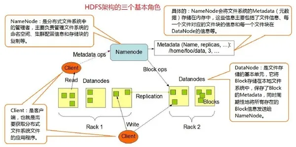

## 一文读懂分布式存储

在当今数字化时代，数据呈爆炸式增长，分布式存储技术应运而生，成为大数据存储与管理的得力助手。它将数据分散存于多台独立设备，构建起一个庞大而可靠的虚拟存储体系，有效突破了传统集中式存储的性能瓶颈，大幅提升了可靠性、可用性及存取效率，轻松应对海量数据的存储挑战。

分布式存储的应用场景极为广泛。在大数据处理领域，如互联网公司应对海量用户数据、科研机构处理实验数据等，它能让数据分散存储，利用多节点并行处理，显著加速数据读写，提升处理效率；云计算服务借助分布式存储，为用户提供高可用、易扩展的存储方案，满足不同规模用户的数据存储需求；物联网场景中，众多传感器持续产生大量实时数据，分布式存储可在靠近数据源处就近存储，确保数据低延迟处理，支撑智能家居、智能交通等应用高效运行；人工智能训练依赖海量数据，分布式存储能快速提供数据访问，加速模型训练进程；内容分发网络（CDN）运用分布式存储，将内容缓存于离用户近的节点，使用户快速获取数据，提升访问体验。

面对多样的分布式存储需求，市场上涌现出诸多解决方案，其中 HDFS、Ceph、MinIO 备受瞩目。它们各自具有独特优势与适用场景，接下来让我们深入剖析，助您明晰如何做出契合自身需求的明智抉择。

## 分布式存储 “三巨头” 特性剖析

### HDFS：大数据存储的老牌劲旅

HDFS（Hadoop Distributed File System）作为 Hadoop 项目的核心子项目之一，是分布式存储领域的先驱。它起源于 Apache Nutch，旨在为大规模数据集提供可靠、高效的存储，在大数据处理的发展历程中功不可没。

HDFS 采用经典的 master/slave 架构。NameNode 作为核心的管理节点，掌控着整个文件系统的目录树、文件与数据块的映射关系，以及各数据块的存储位置信息，是数据访问的调度中枢；DataNode 则充当工作节点，负责实际的数据存储与读取，它们将文件切割成固定大小的数据块（默认 128M），分散存储于集群中的各个节点，并定期向 NameNode 汇报自身状态。此外，Secondary NameNode 起着辅助作用，周期性地合并编辑日志与文件系统镜像，防止编辑日志过大，虽不能直接替代 NameNode，但为系统恢复提供了一定保障。

HDFS 的优势显著。其高容错性通过多副本机制实现，数据自动保存多个副本，即便某个副本丢失，也能迅速从其他副本恢复，确保数据安全；基于 “一次写入多次读写” 的流式数据访问模式，契合大数据处理中批量处理数据的需求，能以流的形式高效访问数据集，大幅提升吞吐量；设计之初就定位于处理超大规模数据，轻松应对 GB、TB 乃至 PB 级别的数据存储，可管理海量文件。

然而，HDFS 也并非十全十美。由于其架构设计，数据读取需多次与 NameNode 交互获取元数据，导致低延迟访问表现欠佳，难以满足毫秒级响应的实时性要求；对于海量小文件存储，NameNode 需要耗费大量内存来管理文件目录与块信息，不仅造成资源浪费，还会因寻址时间过长而降低读写效率；另外，它仅支持数据追加写入，不允许文件随机修改，一定程度上限制了应用场景。

在实际应用中，HDFS 广泛应用于大数据处理流水线的各个环节。像互联网公司的海量日志存储与分析，科研机构的大规模实验数据存储，以及数据挖掘、机器学习的数据预处理阶段，其批量处理、高容错的特性得以充分发挥，助力企业与科研人员从海量数据中挖掘价值。

### Ceph：全能型分布式存储选手

Ceph 是一款开源的分布式存储系统，自 Sage 博士在 2004 年发表早期成果并贡献给开源社区后，经过多年的雕琢与沉淀，如今已在云计算、大数据等领域熠熠生辉，得到众多厂商的青睐，成为 OpenStack 的主流后端存储选择。

Ceph 的架构独具匠心，核心在于 RADOS（Reliable Autonomic Distributed Object Store），即可靠的、自动化的、分布式对象存储系统，它是 Ceph 集群的基石，确保数据的一致性、可靠性与分布式存储。在此之上，Ceph 衍生出三种存储接口：对象存储（RADOSGW），提供 RESTful 接口，兼容 S3、Swift，适用于网盘类应用对接；块存储（RBD），可直接作为磁盘挂载，内置容灾机制，为虚拟机、容器提供高性能存储；文件系统存储（CephFS），符合 POSIX 标准，便于共享存储，适用于多用户共享目录、FTP 等场景。

Ceph 的组件各司其职。OSD（Object Storage Device）负责物理存储，与磁盘一一对应，承载数据存储、复制、平衡与恢复等重任，直接响应客户端数据请求；Monitor 组成小集群，通过 Paxos 协议同步数据，严密监控集群运行状态，维护各类 Map 视图，保障集群健康；MDS（Metadata Server）专注于 CephFS 的元数据管理，维护文件系统目录结构，若不使用 CephFS 则无需部署；Mgr 作为集群管理入口，为外界提供统一管理界面，方便与监控、管理系统对接。

Ceph 的优势众多。在高性能方面，摒弃传统集中式存储元数据寻址，采用 CRUSH 算法，数据分布均衡，并行度极高，客户端直接与 OSD 交互，减少中间环节，读写操作得以高度并行化，理论上节点越多，IOPS 和吞吐量越高；高可用性表现卓越，支持多份强一致性副本，可跨主机、机架、机房、数据中心存放，灵活控制副本数，结合 CRUSH 算法精准分隔故障域，多种故障场景下能自动修复自愈，杜绝单点故障；扩展性堪称一绝，去中心化设计，采用 Crush 和 HASH 环等技术解决中心化难题，随节点增加，系统规模、存储容量与数据访问带宽均可线性增长；接口丰富，同时支持块、文件、对象存储，还能自定义接口，适配多种语言驱动，满足不同应用开发需求。

不过，强大的功能背后是一定的复杂性。Ceph 的部署、配置与运维难度较高，需要深入理解其原理与架构，对运维人员技术要求苛刻；另外，由于功能模块众多，资源占用相对较大，在资源有限的环境下需精细规划。

在适用场景上，Ceph 展现出强大的通用性。云计算场景中，为虚拟机提供块存储，支撑云主机运行；对象存储服务对接网盘、内容分发，满足海量非结构化数据存储；大数据存储与分析，凭借高性能、高扩展性处理海量数据；企业级存储领域，保障关键业务数据高可用，应对复杂业务需求。

### MinIO：轻量级分布式存储新贵

MinIO 作为后起之秀，以开源、高性能、兼容 S3 接口迅速在分布式存储市场崭露头角，专为云原生应用、大规模对象存储需求精心打造。

MinIO 基于 Golang 开发，采用分布式架构，将数据分片存储于多个节点。它巧妙地兼容 Amazon S3 接口，这意味着能无缝对接海量基于 S3 开发的应用与工具，极大降低了迁移成本，拓展了应用生态。

MinIO 的分布式原理精妙绝伦。运用纠删码技术，将原始数据分割为多个数据块与校验块，即便部分磁盘故障，只要有足够的数据块与校验块，数据就能完美恢复；数据分散存于多个节点上的 Drive（磁盘），这些 Drive 分布在不同的 Set（节点集合），每个 Set 中 Drive 数量固定，对象固定存储在一个 Set 上，实现高效分布式存储。

MinIO 优势尽显。高可用性出众，集群中各服务器存有相同数据副本，某节点故障时，其余节点迅速顶上，确保数据持续可用；高性能令人瞩目，分布式架构结合并行处理，充分挖掘硬件潜能，多线程、多核处理器协同发力，实现高并发、低延迟的数据读写，轻松应对大规模数据访问；扩展性优异，按需水平扩展，添加服务器即可线性提升存储容量与处理能力，新节点无缝融入集群，自动参与数据分片与负载均衡；数据保护坚实可靠，纠删码技术为数据冗余备份护航，同时支持数据加密传输与存储，严守数据安全防线。

相较于一些复杂的分布式存储系统，MinIO 部署极为便捷，一个二进制文件即可启动服务，支持多种平台，运维成本低廉，对资源要求相对温和，能在有限资源下稳定运行。

MinIO 在云原生应用、容器存储场景中大放异彩，为 Kubernetes 等容器编排系统提供动态、可扩展存储；作为数据湖存储层，高效管理不同格式大数据；数据备份与恢复领域，凭借分布式架构与高可靠性，守护数据安全。

## 选型实战：如何抉择？

面对这三款各具特色的分布式存储系统，究竟该如何抉择呢？这需要综合考量多方面因素。

存储需求首当其冲。若主要应对海量大数据，如大型互联网公司的日志存储、数据挖掘场景，数据多为大文件且写入后以批量处理、多次读取为主，极少有随机修改操作，HDFS 凭借其高容错、大规模数据处理能力，无疑是首选；倘若业务场景复杂多样，既需支持块存储供虚拟机运行，又要有对象存储对接应用，还得满足文件共享需求，像云计算服务提供商、企业级数据中心，Ceph 的全能型表现，以其丰富接口与高可用、高性能特质，可全方位覆盖；要是聚焦于云原生应用、容器存储，或是追求极简部署、低运维成本，且数据以对象存储为主，MinIO 的轻量级、易部署、兼容 S3 接口优势尽显，能快速适配。

性能要求不容忽视。对低延迟、高并发读写有严苛要求，如金融实时交易、在线视频直播等场景，Ceph 和 MinIO 更具优势，Ceph 靠其精妙的 CRUSH 算法、并行处理架构，MinIO 则依托分布式并行与高效纠删码技术，均可实现低延迟、高吞吐；若业务能容忍一定延迟，更注重批量处理的高吞吐量，例如批量数据加载、离线数据分析，HDFS 的流式数据访问模式可充分发挥磁盘顺序读写性能，大放异彩。

运维成本也是关键一环。初创企业、技术人力有限的团队，MinIO 部署运维简便，资源需求温和，可大幅降低人力、物力成本；有一定技术实力，且追求高性能、高可用的企业级应用，虽 Ceph 运维复杂，但借助专业团队或自身深厚技术积累，能驾驭其复杂性，收获卓越存储性能回报；HDFS 运维复杂度居中，若已深度融入 Hadoop 生态，相关技术人员充足，其运维成本也在可控范围。

扩展性规划不容小觑。预计未来数据呈爆发式增长，需频繁大规模扩缩容，Ceph 和 MinIO 的分布式架构支持水平扩展，新节点轻松融入，线性提升存储与性能；业务增长相对平稳，对扩展性要求不极端，HDFS 基于现有成熟架构，合理规划下也能满足阶段性扩展需求。

综合而言，没有绝对的最优解，唯有贴合自身业务实际，权衡利弊，精准选型，方能让分布式存储系统成为企业数据存储与管理的强大引擎，驱动业务蓬勃发展。
