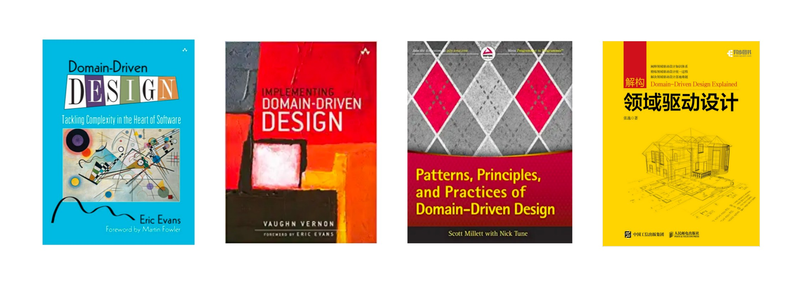

# DDD 入门

本文是本系列的第一篇文章，主要讲解 DDD 入门知识，如果你已经对 DDD 有所了解，可跳过本文。

在阅读本文之前，你可能会认为 DDD 是整天做 PPT 的架构师们才应该去关注的东西；或者会认为 DDD 是比较顶层的东西，跟我写代码的程序员关系不大；你可能还会认为 DDD 是一种被咨询师们吹得天花乱坠但是却无法落地的概念炒作而已。在日常实践中，我接触过不懂装懂的言必称 DDD 者，也见识过声称 DDD 与编码毫无关系的虚无主义者，当然也接触过真正能将 DDD 落地者。在本系列文章中，我将向你证明，DDD 正是软件工程师的工具，可以用于编写更好的代码，设计更好的架构，进而做出更好的软件。当然，我也会针对 DDD 中被夸大其词的那部分进行澄清，甚至批评。

DDD 是什么呢？是架构思想？是方法论？还是软件之道？从某种层度上说这些都对，但是对于程序员或者架构师来讲，最接地气的回答应该是：**DDD 是面向对象进阶**。对于写了几年代码希望在职业生涯中更上一层楼的程序员来说，学习 DDD 是再适合不过的了。为了能让 DDD 新手们更快地上手，我们还是以代码为入口展开讲解，首先让我们来看看 DDD 项目代码和非 DDD 项目代码有何不同。

## 实现业务逻辑的三种方式

在案例项目 [码如云](https://www.mryqr.com/) 中有这样一个业务需求：所有可登录的用户被称为**成员** (Member)，成员可以自行修改自己的手机号码，修改后该成员将被标记为 “手机号已识别” 的状态。为了实现这个需求，我们分别通过三种方式予以实现，读者可以对照看看这些实现方式是不是和自己曾经的编码方式有相似之处。

### 第一种：事务脚本

对于上述需求，从纯技术上讲，我们希望达到的最终目的不过是在数据库中的 `member` 表中更新 2 个字段而已，一个是手机号 (`mobile_number`) 字段，另一个是手机号已识别 (`mobile_identified`) 字段。为了实现这个需求，最简单直接的方式难道不是直接写个 SQL 语句直接更新数据库表么？的确如此，这个简单的方式其实有个专门的名词 —— [事务脚本 (Transactional Script)](https://martinfowler.com/eaaCatalog/transactionScript.html)，也即通过类似编写脚本的方式完成一个业务用例，一个业务用例对应一次事务。

```java
    @Transactional//事务边界
    public void updateMyMobile(String mobileNumber, String memberId) {
        
        //采用事务脚本的方式，直接通过SQL语句实现业务逻辑
        String sql = "update member set mobile_number = ? , mobile_identified = 1 where id = ?;";
        jdbcTemplate.update(sql, mobileNumber,memberId);
    }
```

这种直接通过技术手段实现业务功能的方式没有任何软件建模可言，它将原本可以分开的业务性代码和技术性代码揉杂在一起，既不利于业务的重用，也不利于系统的长期演进，因此通常被认为只适合一些小型软件项目。

### 第二种：贫血对象

看到第一种实现方式你可能会想：这都什么年代了，还在像写 C 语言那样编写代码，不使用点儿面向对象技术连一个刚入职的毕业生估计都不好意思。那好吧，让我们创建一个 Member 对象。

```java
    @Transactional
    public void updateMyMobile(String mobileNumber) {
        String memberId = CurrentUserContext.getCurrentMemberId();
        Member member = memberRepository.findMemberById(memberId);

        //先后调用Member对象中的2个setter方法实现业务逻辑
        member.setMobileNumber(mobileNumber);
        member.setMobileIdentified(true);

        memberRepository.updateMember(member);
    }
```

在上例中，首先我们将数据库访问相关的逻辑全部封装在 `memberRepository` 中，从而解决了 “技术性代码和业务性代码揉杂” 的问题。其次，创建了 `Member` 对象，其中包含两个 setter 方法，`setMobileNumber()` 用于设置手机号码，`setMobileIdentified()` 用于标记标记手机号已识别，这应该面向对象了吧？！但是，问题恰恰出在了这两个 setter 方法上：此时的 `Member` 对象只是一个数据容器而已，而非真正的对象。这种只有数据没有行为的对象被称为 [贫血对象](https://martinfowler.com/bliki/AnemicDomainModel.html)。

问题还不止于此，本例中先后调用的两个 setter 方法事实上违背了软件开发的一个根本性原则 —— 内聚性。简单来讲，“设置手机号” 和 “标记手机号已识别” 这两个步骤在业务上是紧密联系在一起的，应该由 Member 中的单个方法完成，而不应该由 2 个独立的方法完成。为了解释这里体现的内聚性，让我们再来看个需求：除了成员自己可以修改手机号外，管理员也可以为任何成员设置手机号，为此我们再实现一个 `updateMemberMobile()` 方法。

```java
    @Transactional
    public void updateMemberMobile(String mobileNumber,String memberId) {
        Member member = memberRepository.findMemberById(memberId);

        //与updateMyMobile()相同，需要先后调用Member对象中的2个setter方法实现业务逻辑
        member.setMobileNumber(mobileNumber);
        member.setMobileIdentified(true);

        memberRepository.updateMember(member);
    }
```

这里，`updateMemberMobile()` 方法也需要显式地先后调用 Member 的 `setMobileNumber()` 和 `setMobileIdentified()` 方法，也就是说编码者需要记住必须同时调用 2 个方法，否则程序就会出 Bug。这种方式存在以下问题：

1. 业务逻辑的泄漏：对于维持 “设置手机号” 和 “标记手机号已识别” 同时发生的职责来说，本应该由 Member 对象自身完成的，结果泄漏到了 Member 对象的外部；
2. 增加调用者的负担：对于作为 Member 客户方的 `updateMyMobile()` 和 `updateMemberMobile()` 方法来讲，他们本应该将 Member 当做一个黑盒，但在本例中却需要了解 Member 的内部细节 (先后调用 `setMobileNumber()` 和 `setMobileIdentified()` 方法)，这无疑是调用者的负担。
3. 难于维护：如果以后业务需求有变，那么需要同时修改 `updateMyMobile()` 和 `updateMemberMobile()`2 个方法，这可能不是能够轻易做到的，特别是在人员流动频繁的软件项目中。

与事务脚本相似，贫血对象除了可用于一些小的软件项目外，通常被认为是一种反模式，应该避免使用。

### 第三种：领域对象

**领域对象**是一个与贫血对象相对立的概念，它表示直接体现业务逻辑的一类对象，这类对象不仅包含业务数据，还包含业务行为。领域对象希望达到的理想状态是：所有业务逻辑均由领域对象完成，外界将领域对象当做一个黑盒向其发送指令（调用方法）即可。在本例中，设置手机号的同时需要标记 “手机号已识别” 均属业务逻辑，应该全部放到领域对象中完成。

```java
    @Transactional
    public void updateMyMobile(String mobileNumber) {
        String memberId = CurrentUserContext.getCurrentMemberId();
        Member member = memberRepository.findMemberById(memberId);

        //只需调用Member种的updateMobile()方法即可
        member.updateMobile(mobileNumber);

        memberRepository.updateMember(member);
    }
```

这里，`updateMyMobile()` 方法只需调用 Member 中的 `updateMobile()` 方法即可，然后由 Member 自行处理具体的业务逻辑：

```java
    //由Member对象自身处理同时更新mobileNumber和mobileIdentified字段
    public void updateMobile(String mobileNumber) {
        this.mobileNumber = mobileNumber;
        this.mobileIdentified = true;
    }
```

在本例中，除了将数据和行为同时放到 Member 对象之外，我们还会考虑如何设计和安排这些行为才最得当，比如将高内聚的 `mobileNumber` 和 `mobileIdentified` 放到同一个方法中，此时的 Member 便是一个行为饱满的领域对象，并开始变得有些 “领域驱动” 的意味了，所谓的 "DDD 是面向对象进阶 " 这个说法也正体现于此。事实上，在 DDD 中 Member 对象也被称为 [聚合根](https://docs.mryqr.com/ddd-aggregate-root-and-repository)，而 “更新 `mobileNumber` 的同时需要一并更新 `mobileIdentified`” 则被称为聚合根的**不变条件**，我们将在后续文章中对此做详细讲解。

看到这里，你可能会问：领域对象的实现方式不就是将贫血对象中的业务逻辑实现挪了个位置吗？的确，但是这一挪，便挪出了编程的讲究与思考，挪出了模型的设计与原则，挪出了软件的发展与进步。就像云计算早年被认为不过是将本地的计算资源搬移到网络上一样，我们将很多看似并不具有颠覆性的微小创新合在一起，便可将理想编织成一个个能够为行业为社会带来实际进步的美好现实。

你可能还会说，领域对象这种实现方式我平时就是这么做的呀！？没错，我们平时编程的很多做法其实已经包含了 DDD 中的某些思想或实践，因为 DDD 并不是什么全新的东西要把你所写的代码全部推翻重来，而是很多具有逻辑归因性的东西其实大家都能总结出来，只是那些大牛总结得比我们更早，更系统，更全面而已。

对于以上三种实现方式，我们在前面提到事务脚本和贫血对象只适合一些小型的软件项目，那么问题来了，到底多小才算小呢？这个问题没有标准答案，就像你问微服务多小算小一样，It depends！然而，但凡是企业中立过项的软件项目，都不会是实现一个 [Code Kata](http://codekata.com/) 这么简单，都不能被定义为 “小型项目”。因此，对于几乎所有企业级软件系统来说，使用领域对象进而 DDD 都不会是个错误的选择。

## 真实产品代码

由于本文是入门性质的文章，故到目前为止所使用的代码均不是 [码如云](https://www.mryqr.com/) 的产品代码。接下来，让我们来看看真实的产品代码，对于 “成员修改自己的手机号” 的业务功能，[码如云](https://www.mryqr.com/) 代码库中的实现如下：

```java
    @Transactional
    public void changeMyMobile(ChangeMyMobileCommand command, User user) {
        //API限流器，与DDD无关，读者可忽略
        mryRateLimiter.applyFor(user.getTenantId(), "Member:ChangeMyMobile", 5);

        //将所有请求相关的数据封装到Command对象中
        String mobile = command.getMobile();

        //修改手机号时，需要验证发往新手机号的验证码
        verificationCodeChecker.check(mobile, command.getVerification(), CHANGE_MOBILE);

        Member member = memberRepository.byId(user.getMemberId());

        //这里调用了MemberDomainService中的方法，而不是直接调用Member，因为需要检查手机号是否重复，而Member自身无法完成该检查
        memberDomainService.changeMyMobile(member, mobile, command.getPassword());

        memberRepository.save(member);
        log.info("Mobile changed by member[{}].", member.getId());
    }
```

> 源码出处：[com/mryqr/core/member/command/MemberCommandService.java](https://github.com/mryqr-com/mry-backend/blob/main/src/main/java/com/mryqr/core/member/command/MemberCommandService.java)

为了让读者能对代码有更加详尽的了解，我们在源代码中加上了注释，建议读者通过阅读这些注释来理解代码的意图。（真实的码如云代码库中是很少有注释的，因为我们坚持 “代码即是设计” 的原则，让代码本身直接体现业务意图）

在本例中，首先使用限流器 `MryRateLimiter` 对请求进行限流处理，然后使用 `VerificationCodeChecker` 对手机号验证码进行检查，最后才调用 `MemberDomainService` 完成实际的业务逻辑。你可能有些纳闷儿，为什么不像前文中那样直接调用 `Member` 对象中的方法，而是调用 `MemberDomainService` 呢？事实上，这里的 `MemberDomainService` 在 DDD 中被称为 [领域服务](https://docs.mryqr.com/ddd-application-service-and-domain-service)，用于处理领域对象自身无法处理的业务逻辑。在本例中，成员在修改手机号时，系统需要检查该手机号是否已经被其他成员所占用，这部分逻辑是无法通过单个 `Member` 自身完成的，只能通过一个可以跨多个 `Member` 的 `MemberDomainService` 完成。

对于诸如限流器 `MryRateLimiter` 这些与 DDD 无关的代码，我们将在后续文章的代码中予以删除，以使代码集中在对 DDD 的阐述上。

`MemberDomainService.changeMyMobile()` 方法实现如下：

```java
    public void changeMyMobile(Member member, String newMobile, String password) {
        //修改手机号时，需要验证密码
        if (!mryPasswordEncoder.matches(password, member.getPassword())) {
            throw new MryException(PASSWORD_NOT_MATCH, "修改手机号失败，密码不正确。", "memberId", member.getId());
        }

        if (Objects.equals(member.getMobile(), newMobile)) {
            return;
        }

        //检查手机号是否已被占用
        if (memberRepository.existsByMobile(newMobile)) {
            throw new MryException(MEMBER_WITH_MOBILE_ALREADY_EXISTS, "修改手机号失败，手机号对应成员已存在。",
                    mapOf("mobile", newMobile, "memberId", member.getId()));
        }

        //调用Member对象中的方法，完成对手机号的修改
        member.changeMobile(newMobile, member.toUser());
    }
```

> 源码出处：[com/mryqr/core/member/domain/MemberDomainService.java](https://github.com/mryqr-com/mry-backend/blob/main/src/main/java/com/mryqr/core/member/domain/MemberDomainService.java)

可以看到，`MemberDomainService` 调用了 `MemberRepository.existsByMobile()` 用于检查手机号是否已经被占用，如果是，则抛出异常。

最后，`MemberDomainService` 调用 `Member.changeMobile()` 方法完成对手机号的修改：

```java
public void changeMobile(String mobile, User user) {
        if (Objects.equals(this.mobile, mobile)) {
            return;
        }

        //同时设置mobile字段和mobileIdentified的值，高度内聚
        this.mobile = mobile;
        this.mobileIdentified = true;
        
        this.addOpsLog("修改手机号为[" + mobile + "]", user);
    }
```

> 源码出处：[com/mryqr/core/member/domain/Member.java](https://github.com/mryqr-com/mry-backend/blob/main/src/main/java/com/mryqr/core/member/domain/Member.java)

如前文所述，`mobile` 和 `mobileIdentified` 是高度内聚的，因此放在 `Member` 的同一个方法 `changeMobile()` 中完成更新。以后，无论通过什么业务渠道修改成员的手机号，都只需要调用相同的 `Member.changeMobile()` 方法即可。

## DDD 书籍推荐

我基本上参阅完了市面上所有的 DDD 书籍（截止到 2023 年 3 月份），在这些书籍中，真正值得推崇的有以下 4 本书：



- **《领域驱动设计：软件核心复杂性应对之道》**（蓝皮书，从左往右第一本，首版时间 2003 年）：DDD 的开山之作，对于初学者来说阅读起来有些晦涩，不建议初学者直接阅读该书
- **《实现领域驱动设计》**（红皮书，从左往右第二本，首版时间 2013 年）：这本是讲 DDD 落地的经典书籍，其中包含大量代码示例，很多人都是通过这本书才真正进入 DDD 的世界
- **《领域驱动设计模式、原理与实践》**（从左往右第三本，首版时间 2015 年）：这也是一本能够帮你系统的完成 DDD 落地的书籍
- **《解构领域驱动设计》**（首版时间 2021 年）：国内第一本关于 DDD 的专著，作者张逸在 DDD 社区具有比较大的影响力

对于英文书籍，建议大家如果有条件的话，一定阅读英文原版，因为那才是第一手资料，中文翻译始终存在漏译错译等无法表达原书本意的情况。

# 总结

本文从事务脚本、贫血对象和领域对象三种实现业务逻辑的方式为入口，一步一步地引入 DDD 的概念，希望能让 DDD 新手们平滑地开启 DDD 的学习之路。在 [下一篇：DDD 概念大白话](https://docs.mryqr.com/ddd-in-plain-words) 文章中，我们将通过大白话的方式给大家讲解 DDD 中的各种概念，以让读者对 DDD 有个全景式的认识。
