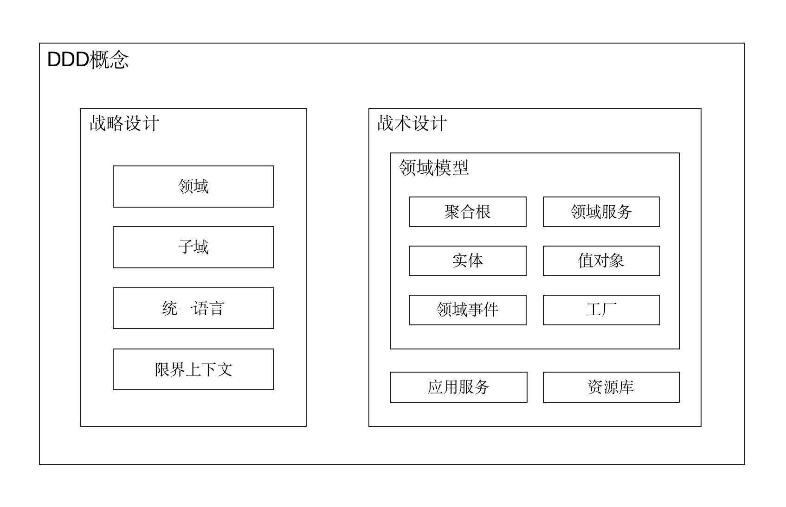

# DDD 概念大白话

本文是本系列的第二篇文章，主要解释 DDD 中的各种概念，一方面让读者对 DDD 有个全景式的认识，另一方面也方便读者更好地理解本系列的后续文章。

DDD 中的概念，说多不多，说少不少，一个新手在面对各种 DDD 名词的轮番轰炸时可能会被搞得晕头转向不知所措，而对于深谙其道的人来说，DDD 也就那么点儿东西。除此之外，不同人对于 DDD 概念的理解也存在千差万别。本文尝试通过朴素的大白话解释 DDD 中的各种概念，不装，也不作。

DDD 分为**战略设计**和**战术设计**，战略设计是一种宏观的顶层设计，而战术设计则更偏向于代码落地实践。



战略设计中有通用语言、领域、子域和限界上下文等概念，这些概念不好理解得清楚，也不好讲得清楚。但是，从本质上讲，**DDD 的战略设计只在解决一个问题，即软件的模块化划分的问题**。为此，我们将在下一篇 [战略设计](https://docs.mryqr.com/ddd-strategic-design) 中进行详细阐述。

当我们把软件的模块划分好（也即完成了战略设计）之后，下一步自然是编码实现了，于是乎我们也就顺理成章地进入了 DDD 的战术设计范畴。DDD 的战术设计包括聚合根、实体和资源库等众多概念，其中最重要的当属聚合根了，那接下来我们就从聚合根讲起。

在上一篇 [DDD 入门](https://docs.mryqr.com/ddd-introduction) 中我们提到，DDD 的一个重要使命是实现软件中 “业务复杂度” 和 “技术复杂度” 的分离。为此，我们使用**领域模型**来描述业务，使之与数据库、消息队列等技术实现解耦开来。在 DDD 的领域模型中，最核心的则是**聚合根** (Aggregate Root)，我们甚至可以认为整个 DDD 都是围绕聚合根的设计与实现展开的。

聚合根中的 “聚合” 即 “高内聚，低耦合” 中的 “内聚” 之意，而 “根” 则是 “根部” 的意思。事实上，并不存在一个教科书式的对聚合根的理论定义，你可以将聚合根理解为一个系统中最重要的那些名词。为了给你一个直观的理解，我们先来看看以下聚合根的例子：

- 在一个电商系统中，一个订单（Order）对象表示一个聚合根
- 在一个 CRM 系统中，一个客户（Customer）对象表示一个聚合根
- 在一个银行系统中，一次交易（Transaction）对象表示一个聚合根

怎么样，是不是至少对聚合根有了一个感性认识？这些名词是其所在的软件系统之所以存在的原因，设想淘宝中没有了订单的概念还能称之为电商系统吗？当然，一个概念是否能成为聚合根是根据其所处的业务场景而定的，我们将在后续文章 [聚合根和资源库](https://docs.mryqr.com/ddd-aggregate-root-and-repository) 中做详细解释。

聚合根是业务逻辑的主要载体，在理想情况下应该是业务的唯一载体。但是，万事皆有但是，有时将业务逻辑放到聚合根中是不合适的，甚至是不可行的。比如，在 [码如云](https://www.mryqr.com/) 中，在更新成员手机号时，需要先行检查该手机号是否已经被占用，此时成员聚合根自身并不具备检查其他成员手机号的功能，因此要将这部分逻辑放到成员本身上则显得不合适了，我们在上一篇 [DDD 入门](https://docs.mryqr.com/ddd-introduction) 中也提到了这个例子。不过不要慌，针对这种情形，DDD 给出了专门的概念 —— **领域服务** (Domain Service)。领域服务是聚合根自身无法完成业务逻辑时的代替品，是不得已而为之的一个概念，通常用于处理一些跨聚合操作或者需要访问技术基础设施的场景。

在下例中，领域服务 `MemberDomainService` 中的 `changeMyMobile()` 方法实现了两处聚合根 (Member) 无法自身实现的功能：一是调用 `mryPasswordEncoder` 检查密码是否正确，二是调用 `memberRepository` 检查手机号是否重复。

```java
    //领域服务：MemberDomainService

    public void changeMyMobile(Member member, String newMobile, String password) {
        if (!mryPasswordEncoder.matches(password, member.getPassword())) {
            throw new MryException(PASSWORD_NOT_MATCH,
                    "修改手机号失败，密码不正确。", "memberId", member.getId());
        }

        if (Objects.equals(member.getMobile(), newMobile)) {
            return;
        }

        if (memberRepository.existsByMobile(newMobile)) {
            throw new MryException(MEMBER_WITH_MOBILE_ALREADY_EXISTS,
                    "修改手机号失败，手机号对应成员已存在。",
                    mapOf("mobile", newMobile,
                            "memberId", member.getId()));
        }

        member.changeMobile(newMobile, member.toUser());
    }
```

> 源码出处：[com/mryqr/core/member/domain/MemberDomainService.java](https://github.com/mryqr-com/mry-backend/blob/main/src/main/java/com/mryqr/core/member/domain/MemberDomainService.java)

需要提醒的是，请不要被领域服务名字中的 “服务” 迷惑了，领域服务依然是领域模型的一部分，因为它也实现了业务逻辑，更多关于领域服务的内容，请查看本系列的 [应用服务和领域服务](https://docs.mryqr.com/ddd-application-service-and-domain-service) 一文。

从更广义上讲，聚合根属于实体的范畴。在 DDD 中，存在**实体** (Entity) 和**值对象** (Value Object) 是一对相互对立的概念，实体用于表示那些具有生命周期的 “存在”，而值对象用于表示那些仅仅起描述性作用的东西。实体通过唯一标识进行标定，而值对象则通过其包含的所有属性进行标定。在编码实现时，最直观的区别则是实体对象有 ID，而值对象没有 ID；此外，实体对象一般包含比较复杂的业务逻辑，而值对象通常则是一些简单的小对象，业务逻辑相对简单。举个常见的例子，无论一对双胞胎长得多么的相像，但由于两个人的身份证号不同（即 ID 不同），那么两人便属于不同的实体；而对于货币来说，一张崭新的百元大钞和一张破旧的占满了细菌的百元大钞是可以等价交换的，因为他们所包含的属性值（均是 100 元）是一样，因此他们均属于值对象。

在码如云中，管理员可以对表单提交 (Submission) 进行审批 (Approval)，审批结果存放在 `SubmissionApproval` 对象中，该对象则是一个值对象：

```java
@Value
@Builder
@AllArgsConstructor(access = PRIVATE)
public class SubmissionApproval {
    private final boolean passed;//审批是否通过
    private final String note;//审批意见
    private final Instant approvedAt;//审批时间
    private final String approvedBy;//审批人ID
}
```

> 源码出处：[com/mryqr/core/submission/domain/SubmissionApproval.java](https://github.com/mryqr-com/mry-backend/blob/main/src/main/java/com/mryqr/core/submission/domain/SubmissionApproval.java)

需要注意的是，虽然聚合根属于实体，但是实体却不只是包含聚合根。事实上，聚合根隶属于实体，同时其内部又可以包含其他实体。举个例子，汽车作为聚合根是一个实体，同时汽车内部的发动机也是一个实体，但发动机却不是聚合根。在本系列的 [实体和值对象](https://docs.mryqr.com/ddd-entity-and-value-object) 中，我们将详细介绍实体和值对象的区别。

有些对象（特别是聚合根）的创建过程本身也是业务逻辑的一部分，在 DDD 中，为了显式化业务逻辑，也为了遵从关注点分离的原则，我们将这些对象的构建过程封装到**工厂** (Factory) 中，落地时可以是独立的工厂类，也可以是一个对象中的工厂方法。在码如云中，所有的聚合根对象均配备有专门的工厂类，比如用于创建成员的 `MemberFactory` 如下：

```java
@Component
@RequiredArgsConstructor
public class MemberFactory {
    private final MemberRepository memberRepository;
    private final DepartmentRepository departmentRepository;

    public Member create(String name,
                         List<String> departmentIds,
                         String mobile,
                         String email,
                         String password,
                         User user) {

        //此处只为展示工厂类，省略了具体实现细节
        return create(name, departmentIds, mobile, email, password, null, user); 
    }
}
```

> 源码出处：[com/mryqr/core/member/domain/MemberFactory.java](https://github.com/mryqr-com/mry-backend/blob/main/src/main/java/com/mryqr/core/member/domain/MemberFactory.java)

更多关于工厂的讲解，请参考本系列的 [实体与值对象](https://docs.mryqr.com/ddd-entity-and-value-object) 一文。

在 DDD 的领域模型中，一个业务操作通常会导致一个结果，这个结果被称为**领域事件**，即领域模型中已经发生的事情，比如 “成员手机号已更新” 便是一个领域事件。领域事件通常用于组件之间的因果关系处理，比如当 “成员手机号已更新” 事件产生后，我们可能会在另一个业务组件中做相应的同步操作，这里的组件粒度可以是聚合根，可以是其他业务模块，还可以是一个独立的第三方系统。

在码如云中，创建成员将产生 “成员已创建” 事件 `MemberCreatedEvent`：

```java
@Getter
@TypeAlias("MEMBER_CREATED_EVENT")
@NoArgsConstructor(access = PRIVATE)
public class MemberCreatedEvent extends DomainEvent {
    private String memberId;

    public MemberCreatedEvent(String memberId, User user) {
        super(MEMBER_CREATED, user);
        this.memberId = memberId;
    }

}
```

> 源码出处：[com/mryqr/core/member/domain/event/MemberCreatedEvent.java](https://github.com/mryqr-com/mry-backend/blob/main/src/main/java/com/mryqr/core/member/domain/event/MemberCreatedEvent.java)

更过关于领域事件的讲解，请参考本系列的 [领域事件](https://docs.mryqr.com/ddd-domain-events) 一文。

以上的聚合根、实体、值对象、工厂、领域服务和领域事件都是针对领域模型而言的，虽然在 DDD 中领域模型是当之无愧的大哥大，但是在实际的软件系统中，单单有领域模型是无法正常运作的，还需要有围绕着领域模型的其他周边设施，为此 DDD 给出了资源库和应用服务等概念。

简单地讲，**资源库** (Repository) 是用于保存 / 获取聚合根的。在此之前你可能了解过 [DAO](https://www.oracle.com/java/technologies/data-access-object.html) 对象也是用于存储对象的，但是与 DAO 不同的是，资源库操作的基本单位是聚合根，也即只有聚合根对象才配得上拥有资源库，其他实体对象则没有。

在码如云中，成员对象对应的资源库 `MemberRepository` 接口定义如下：

```java
public interface MemberRepository {

    Member byId(String id);

    boolean exists(String arId);

    void save(Member member);

    void delete(Member member);

    //...此处省略其他方法
}
```

> 源码出处：[com/mryqr/core/member/domain/MemberRepository.java](https://github.com/mryqr-com/mry-backend/blob/main/src/main/java/com/mryqr/core/member/domain/MemberRepository.java)

一般来说，资源库分为接口类和实现类，接口类属于领域模型，实现类属于基础设施。这样的好处是，领域模型只依赖于接口，而不依赖于基础设施，有利于维持领域模型的技术中立性。更过关于资源库的讲解，请查看本系列的 [聚合根和资源库](https://docs.mryqr.com/ddd-aggregate-root-and-repository) 一文。

领域模型是用来完成业务功能的，也即需要响应用户发起的各种请求，但是在软件系统中在这些请求到达领域模型之前，事实上还有很多事情需要处理，比如需要从数据库中加载数据 (聚合根)、处理事务、权限管控等，在 DDD 中，这些操作由**应用服务** (Application Service) 完成。应用服务可以看做是领域模型的门面，它将接收到请求派发给合适的领域模型去处理，在整个过程中，应用服务充当的是协调者和编排者的角色，就像酒店的前台一样。

在码如云中，每一个聚合根都有对应的应用服务，比如对于成员来说，应用服务 `MemberCommandService` 如下：

```java
//由于应用服务的"Application"与码如云中的应用聚合根"App"重名，在码如云中，使用“CommandService”来表示应用服务，以示区分

@Slf4j
@Component
@RequiredArgsConstructor
public class MemberCommandService {
    
    //......

    @Transactional
    public void changeMyMobile(ChangeMyMobileCommand command, User user) {
        mryRateLimiter.applyFor(user.getTenantId(), "Member:ChangeMyMobile", 5);

        String mobile = command.getMobile();
        verificationCodeChecker.check(mobile, command.getVerification(), CHANGE_MOBILE);

        Member member = memberRepository.byId(user.getMemberId());
        memberDomainService.changeMyMobile(member, mobile, command.getPassword());
        memberRepository.save(member);
        log.info("Mobile changed by member[{}].", member.getId());
    }

    //......
}
```

> 源码出处：[com/mryqr/core/member/command/MemberCommandService.java](https://github.com/mryqr-com/mry-backend/blob/main/src/main/java/com/mryqr/core/member/command/MemberCommandService.java)

在本系列的 [应用服务与领域服务](https://docs.mryqr.com/ddd-application-service-and-domain-service) 一文中，我们将对应用服务做详细讲解。

# 总结

以上，我们概览式地了解了 DDD 战略设计和战术设计中的各种主要概念，在本系列的后续文章中，我们将针对这些概念进行逐一讲解。

---

以下是基于文章内容整理的 DDD 术语表格：

| **术语**   | **解释（大白话）**                       | **示例或补充说明**                                                          |
| -------- | --------------------------------- | -------------------------------------------------------------------- |
| **聚合根**  | 系统中最重要的名词，业务逻辑的主要载体               | 电商的 `订单`、CRM 的 `客户`、银行的 `交易`（没有它们系统就失去意义）                            |
| **领域服务** | 当业务逻辑无法放在聚合根时，用领域服务处理（跨聚合或依赖外部设施） | 检查手机号是否重复、密码加密验证等（聚合根自己搞不定的事）                                        |
| **实体**   | 有唯一 ID、有生命周期的对象（通过 ID 区分）         | 汽车（聚合根）和它的发动机（实体）都是实体，但发动机不是聚合根                                      |
| **值对象**  | 无 ID、通过属性值区分的描述性对象（新旧百元钞票等价）      | `SubmissionApproval`（审批结果）、地址（省市区组合）                                 |
| **工厂**   | 封装复杂创建逻辑（特别是聚合根）                  | `MemberFactory` 专门处理成员创建的校验和初始化                                      |
| **领域事件** | 业务操作产生的结果事件，用于触发后续动作              | `MemberCreatedEvent`（成员创建后触发邮件通知）                                    |
| **资源库**  | 只负责聚合根的存取（类似 DAO 但更高层）            | `MemberRepository` 提供 `save()` 和 `byId()` 等方法，实现类可能用 MySQL 或 MongoDB |
| **应用服务** | 领域模型的“前台”，协调事务、权限等非业务逻辑           | `MemberCommandService` 先限流、验验证码，再调用领域服务改手机号                          |
