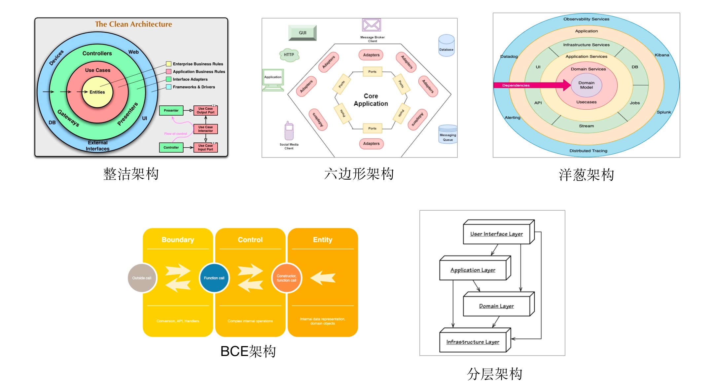
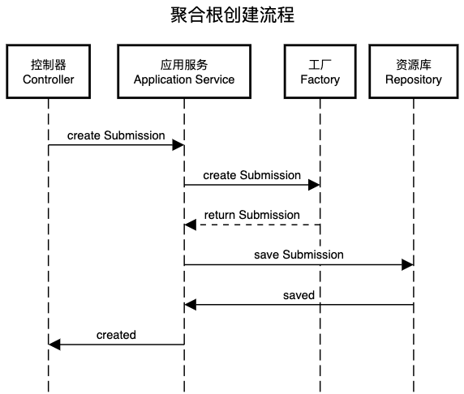
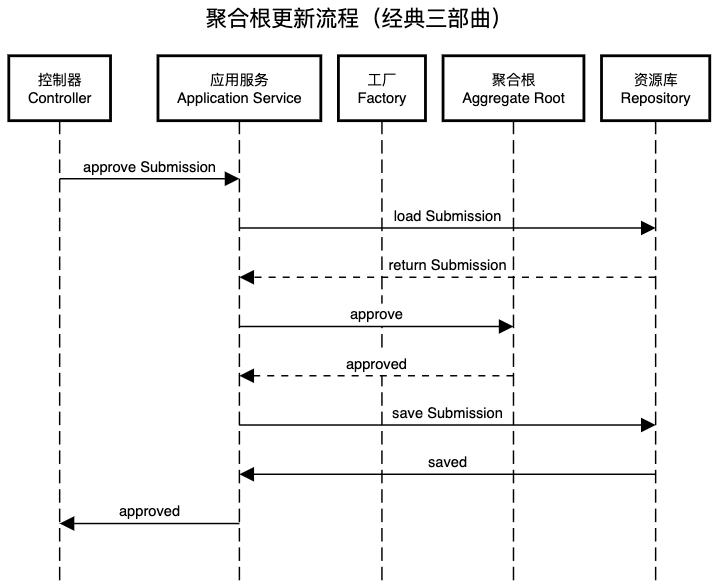
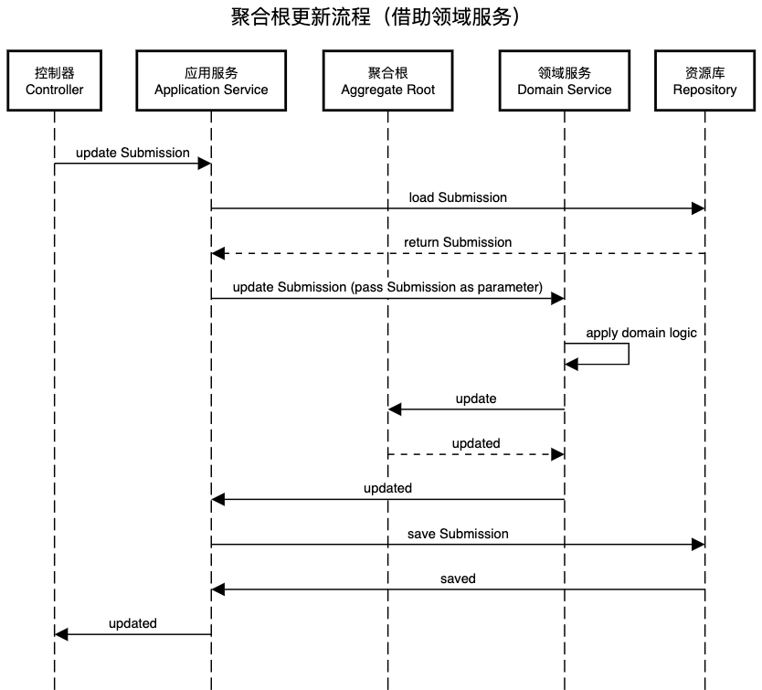
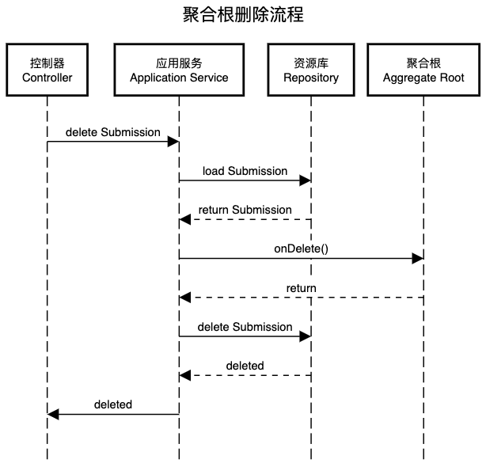

# 请求处理流程

在上一篇 [代码工程结构](https://docs.mryqr.com/ddd-project-structure) 中，我们从宏观层面讲到了 DDD 项目的目录结构，但并未触及到实际的代码。在本文中，我们将深入到代码中，逐一讲解 DDD 中对各种请求类型的典型处理流程。

在本系列的 [DDD 概念大白话](https://docs.mryqr.com/ddd-in-plain-words) 我们提到，DDD 中的所有组件都是围绕着 [聚合根](https://docs.mryqr.com/ddd-aggregate-root-and-repository) 展开的，其中有些本身即是聚合根的一部分，比如实体和值对象；有些是聚合根的客户，比如应用服务；有些则是对聚合根的辅助或补充，比如领域服务和工厂。反观当下流行的各种软件架构，无论是分层架构、六边形架构还是整洁架构，它们都有一个共同点，即在架构中心都有一个核心存在，这个核心正是领域模型，而 DDD 的聚合根则存在于领域模型之中。



不难看出，既然每种架构中都有为领域模型预留的位置，这也意味着 DDD 可采用任何一种软件架构。事实也的确如此，DDD 并不要求采用哪种特定架构，如果你真要说 DDD 项目应该采用某种架构的话，那么应该 “以领域模型为中心的软件架构”。

如果我们把软件系统当做一个黑盒的话，其外界是各种形态的客户端，比如浏览器，手机 APP 或者第三方调用方等，盒子内部则是我们精心构建的领域模型。不过，领域模型是不能直接被外界访问的，主要原因有以下两点：

- 客户端的演进和领域模型的演进是不同步的，比如网页端所需要展示的信息量比手机端更多，但是他们所使用的领域模型却是相同的，因此在建模时我们通常会将领域模型和客户端解耦开来，以利于各自的建模和演进
- 软件除了处理领域模型这种业务复杂度之外，还需要处理技术复杂度，以及业务和技术的衔接复杂度，比如有些请求通过 HTTP 协议完成，而有些则通过 RPC 完成，因此除了领域模型，我们还需要适配各种形式的外部客户端

接下来，让我们来看看 DDD 项目是如何衔接外部请求和内部领域模型的。既然聚合根是领域模型中的一等公民，那么按照对聚合根的操作类型不同，DDD 项目中主要存在以下 4 种类型的请求：

- 聚合根创建流程
- 聚合根更新流程
- 聚合根删除流程
- 查询流程

咋一看，你可能会说这不就是 CRUD 么？本质上这的确是 CRUD，但是这里的 CRUD 可不是仅仅操作数据库那么简单，你如果阅览过本系列的上一篇 [代码工程结构](https://docs.mryqr.com/ddd-project-structure) 的话，便知道在 [码如云](https://www.mryqr.com/) 中领域模型的代码量占比远远高出数据库访问相关的代码量。

本文主要讲解 DDD 对请求的处理流程，并不讲解聚合根本身的设计和实现，而是假设聚合根（以及领域模型中的工厂和领域服务等）已经实现就位了，关于聚合根本身的讲解请参考本系列的 [聚合根与资源库](https://docs.mryqr.com/ddd-aggregate-root-and-repository) 一文。此外，为了突出重点，本文只着重讲解请求处理流程的主干，而忽略与之关系不大的其他细节，比如我们将忽略应用服务中的事务处理和权限管理等功能，为此读者可参考 [应用服务与领域服务](https://docs.mryqr.com/ddd-application-service-and-domain-service)。

## 聚合根创建流程

聚合根的创建通常通过**工厂**类完成，请求流经路线为：控制器 (Controller) -> 应用服务 (Application Service) -> 工厂 (Factory) -> 资源库 (Repository)。



在码如云中，当用户提交表单后，系统后台将创建一份提交 (Submission)，这里的 `Submission` 便是一个聚合根对象。在整个 “创建 Submission” 的处理流程中，请求先通过 HTTP 协议到达 Spring MVC 中的 Controller：

```java
//SubmissionController

@PostMapping
@ResponseStatus(CREATED)
public ReturnId newSubmission(@RequestBody @Valid NewSubmissionCommand command,
                              @AuthenticationPrincipal User user) {
    String submissionId = submissionCommandService.newSubmission(command, user);
    return returnId(submissionId);
}
```

> 源码出处：[com/mryqr/core/submission/SubmissionController.java](https://github.com/mryqr-com/mry-backend/blob/main/src/main/java/com/mryqr/core/submission/SubmissionController.java)

Controller 的作用只是为了衔接技术和业务，因此其逻辑应该相对简单，在本例中，`SubmissionController` 的 `newSubmission()` 方法仅仅将请求代理给应用服务 `SubmissionCommandService` 即完成了其自身的使命。这里的 `NewSubmissionCommand` 表示命令对象，用于携带请求数据，比如对于 “创建 Submission” 来说，`NewSubmissionCommand` 对象中至少应该包含表单的提交内容等数据。命令对象是外部客户端传入的数据，因此需要将其与领域模型解耦，也即命令对象不能进入到领域模型的内部，其所能到达的最后一站是应用服务。

**处理流程的下一站是应用服务**，应用服务是整个领域模型的门面，无论什么类型的客户端，只要业务用例相同，那么所调用的应用服务的方法也应相同，也即应用服务和技术设施也是解耦的。

```java
//SubmissionCommandService

@Transactional
public String newSubmission(NewSubmissionCommand command, User user) {
    AppedQr appedQr = qrRepository.appedQrById(command.getQrId());
    App app = appedQr.getApp();
    QR qr = appedQr.getQr();

    Page page = app.pageById(command.getPageId());
    SubmissionPermissions permissions = permissionChecker.permissionsFor(user, appedQr);
    permissions.checkPermissions(app.requiredPermission(), page.requiredPermission());

    Set<Answer> answers = command.getAnswers();
    Submission submission = submissionFactory.createNewSubmission(
            answers,
            qr,
            page,
            app,
            permissions.getPermissions(),
            command.getReferenceData(),
            user
    );

    submissionRepository.houseKeepSave(submission, app);
    log.info("Created submission[{}].", submission.getId());

    return submission.getId();
}
```

> 源码出处：[com/mryqr/core/submission/command/SubmissionCommandService.java](https://github.com/mryqr-com/mry-backend/blob/main/src/main/java/com/mryqr/core/submission/command/SubmissionCommandService.java)

在以上的 `SubmissionCommandService` 应用服务中，首先做权限检查，然后调用工厂 `SubmissionFactory.createNewSubmission()` 完成 `Submission` 的创建，最后调用资源库 `SubmissionRepository.houseKeepSave()` 将新建的 `Submission` 持久化到数据库中。从中可见，应用服务主要用于协调各方以完成一个业务用例，**其本身并不包含业务逻辑**，业务逻辑在工厂中完成。

```java
//SubmissionFactory

public Submission createNewSubmission(Set<Answer> answers,
                                      QR qr,
                                      Page page,
                                      App app,
                                      Set<Permission> permissions,
                                      String referenceData,
                                      User user) {
    if (page.isOncePerInstanceSubmitType()) {
        submissionRepository.lastInstanceSubmission(qr.getId(), page.getId())
                .ifPresent(submission -> {
                    throw new MryException(SUBMISSION_ALREADY_EXISTS_FOR_INSTANCE,
                            "当前页面不支持重复提交，请尝试更新已有表单。",
                            mapOf("qrId", qr.getId(),
                                    "pageId", page.getId()));
                });
    }

    //...此处忽略更多业务逻辑

    //只有需要登录的页面才记录user
    User finalUser = page.requireLogin() ? user : ANONYMOUS_USER;
    Map<String, Answer> checkedAnswers = submissionDomainService.checkAnswers(answers,
            qr,
            page,
            app,
            permissions);

    return new Submission(checkedAnswers,
            page.getId(),
            qr, app,
            referenceData,
            finalUser);
}
```

> 源码出处：[com/mryqr/core/submission/domain/SubmissionFactory.java](https://github.com/mryqr-com/mry-backend/blob/main/src/main/java/com/mryqr/core/submission/domain/SubmissionFactory.java)

虽然工厂用于创建聚合根，但并不是直接调用聚合根的构造函数那么简单，从 `SubmissionFactory.createNewSubmission()` 可以看出，在创建 `Submission` 之前，需要根据表单类型检查是否可以创建新的 `Submission`，而这正是业务逻辑的一部分。因此，工厂也属于领域模型的一部分，本质上工厂可以认为是一种特殊形式的领域服务。

请求流程的最后，应用服务调用资源库 `submissionRepository.houseKeepSave()` 完成对新建 `Submission` 的持久化。更多关于资源库的内容，请参考 [聚合根与资源库](https://docs.mryqr.com/ddd-aggregate-root-and-repository) 一文。

## 聚合根更新流程

对聚合根的更新流程通常可以通过 “经典三部曲” 完成：

1. 调用资源库获得聚合根
2. 调用聚合根上的业务方法，完成对聚合根的更新
3. 再次调用资源库保存聚合根

此时的请求流经路线为：控制器 (Controller) -> 应用服务 (Application Service) -> 资源库 (Repository) -> 聚合根 (Aggregate Root)。



在 [码如云](https://www.mryqr.com/) 中，当表单开启了审批功能过后，管理员可对 `Submission` 进行审批操作，本质上则是在更新 `Submission`。在 “审批 Submission” 的过程中，请求依然是首先到达 Controller：

```java
//SubmissionController

@ResponseStatus(CREATED)
@PostMapping(value = "/{submissionId}/approval")
public ReturnId approveSubmission(@PathVariable("submissionId") @SubmissionId @NotBlank String submissionId,
                                  @RequestBody @Valid ApproveSubmissionCommand command,
                                  @AuthenticationPrincipal User user) {
    submissionCommandService.approveSubmission(submissionId, command, user);
    return returnId(submissionId);
}
```

> 源码出处：[com/mryqr/core/submission/SubmissionController.java](https://github.com/mryqr-com/mry-backend/blob/main/src/main/java/com/mryqr/core/submission/SubmissionController.java)

与 “创建聚合根” 相似，`SubmissionController` 直接将请求代理给应用服务 `SubmissionCommandService.approveSubmission()`：

```java
//SubmissionCommandService

@Transactional
public void approveSubmission(String submissionId,
                              ApproveSubmissionCommand command,
                              User user) {
    Submission submission = submissionRepository.byIdAndCheckTenantShip(submissionId, user);

    App app = appRepository.cachedById(submission.getAppId());
    Page page = app.pageById(submission.getPageId());
    SubmissionPermissions permissions = permissionChecker.permissionsFor(user,
            app,
            submission.getGroupId());
    permissions.checkCanApproveSubmission(submission, page, app);

    submission.approve(command.isPassed(),
            command.getNote(),
            page,
            user);

    submissionRepository.houseKeepSave(submission, app);

    log.info("Approved submission[{}].", submissionId);
}
```

> 源码出处：[com/mryqr/core/submission/command/SubmissionCommandService.java](https://github.com/mryqr-com/mry-backend/blob/main/src/main/java/com/mryqr/core/submission/command/SubmissionCommandService.java)

应用服务 `SubmissionCommandService` 先通过资源库 `SubmissionRepository` 的 `byIdAndCheckTenantShip()` 方法获取到需要操作的 `Submission`，然后进行权限检查，再调用 `Submission.approve()` 方法完成对 `Submission` 的更新，最后调用资源库 `SubmissionRepository` 的 `houseKeepSave()` 方法将更新后的 `Submission` 保存到数据库。这里的重点在于：需要保证所有的业务逻辑均放在 `Submission.approve()` 中：

```java
//Submission

public void approve(boolean passed,
                    String note,
                    Page page,
                    User user) {

    if (isApproved()) {
        throw new MryException(SUBMISSION_ALREADY_APPROVED,
                "无法完成审批，先前已经完成审批。",
                "submissionId", this.getId());
    }

    this.approval = SubmissionApproval.builder()
            .passed(passed)
            .note(note)
            .approvedAt(now())
            .approvedBy(user.getMemberId())
            .build();

    raiseEvent(new SubmissionApprovedEvent(this.getId(),
            this.getQrId(),
            this.getAppId(),
            this.getPageId(),
            this.approval,
            user));

    addOpsLog(passed ?
            "审批" + page.approvalPassText() :
            "审批" + page.approvalNotPassText(), user);
}
```

> 源码出处：[com/mryqr/core/submission/domain/Submission.java](https://github.com/mryqr-com/mry-backend/blob/main/src/main/java/com/mryqr/core/submission/domain/Submission.java)

可以看到，`Submission.approve()` 先检查 `Submission` 是否已经被审批过了，如果尚未审批才继续审批操作，审批过程还会发出 “提交已审批”(`SubmissionApprovedEvent`) 领域事件（更多关于领域事件的内容，请参考本系列的 [领域事件](https://docs.mryqr.com/ddd-domain-events) 一文）。`Submission.approve()` 中的代码量虽然不多，但是却体现了核心的业务逻辑：“已经完成审批的提交不能再次审批”。

当然，并不是所有的业务用例都适合 “经典三部曲”，有时聚合根自身无法完成所有的业务逻辑，此时我们则需要借助领域服务 (Domain Service) 来完成请求的处理。比如，常见的使用领域服务的场景是需要进行跨聚合查询的时候。此时的请求流经路线则为：控制器 (Controller) -> 应用服务 (Application Service) -> 资源库 (Repository) -> 聚合根 (Aggregate Root) -> 领域服务 (Domain Service)。



在码如云中，管理员可以对既有的 `Submission` 进行编辑更新，但是由于更新时可能涉及到检查手机号或者邮箱等控件填值的唯一性，因此在更新时需要跨 `Submission` 进行查询，此时光靠 `Submission` 自身便无法完成了，为此我们可以创建领域服务 `SubmissionDomainService` 用于跨 `Submission` 操作：

```java
//SubmissionCommandService

@Transactional
public void updateSubmission(String submissionId,
                             UpdateSubmissionCommand command,
                             User user) {

    Submission submission = submissionRepository.byIdAndCheckTenantShip(submissionId, user);
    AppedQr appedQr = qrRepository.appedQrById(submission.getQrId());
    App app = appedQr.getApp();
    QR qr = appedQr.getQr();

    Page page = app.pageById(submission.getPageId());
    SubmissionPermissions permissions = submissionPermissionChecker.permissionsFor(user,
            app,
            submission.getGroupId());
    permissions.checkCanUpdateSubmission(submission, page, app);

    submissionDomainService.updateSubmission(submission,
            app,
            page,
            qr,
            command.getAnswers(),
            permissions.getPermissions(),
            user
    );

    submissionRepository.houseKeepSave(submission, app);
    log.info("Updated submission[{}].", submissionId);
}
```

> 源码出处：[com/mryqr/core/submission/command/SubmissionCommandService.java](https://github.com/mryqr-com/mry-backend/blob/main/src/main/java/com/mryqr/core/submission/command/SubmissionCommandService.java)

在本例中，应用服务 `SubmissionCommandService` 并未直接调用聚合根 `Submission` 中的方法，而是将 `Submission` 作为参数传入了领域服务 `SubmissionDomainService` 的 `updateSubmission()` 方法中，在 `SubmissionDomainService` 完成了对 `Submission` 的更新后，`SubmissionCommandService` 再调用 `SubmissionRepository.houseKeepSave()` 方法将 `Submission` 保存到数据库中。`SubmissionDomainService.updateSubmission()` 实现如下：

```java
//SubmissionDomainService
    
public void updateSubmission(Submission submission,
                             App app,
                             Page page,
                             QR qr,
                             Set<Answer> answers,
                             Set<Permission> permissions,
                             User user) {

    Map<String, Answer> checkedAnswers = checkAnswers(answers,
            qr,
            page,
            app,
            submission.getId(),
            permissions);

    Set<String> submittedControlIds = answers.stream()
            .map(Answer::getControlId)
            .collect(toImmutableSet());

    submission.update(submittedControlIds, checkedAnswers, user);
}
```

> 源码出处：[com/mryqr/core/submission/domain/answer/SubmissionDomainService.java](https://github.com/mryqr-com/mry-backend/blob/main/src/main/java/com/mryqr/core/submission/domain/answer/SubmissionDomainService.java)

可以看到，`SubmissionDomainService.updateSubmission()` 首先调用业务方法 `checkAnswers()` 对表单内容进行检查（其中便包含上文提到的对手机号或邮箱的重复性检查），再调用 `Submission.update()` 以完成对 `Submission` 的更新，相当于 `SubmissionDomainService` 对 `Submission` 做了业务上的加工。

这里，领域服务 `SubmissionDomainService` 的职责范围仅包含对聚合根 `Submission` 的更新，并不负责持久化 `Submission`，持久化的职责依然在应用服务 `SubmissionCommandService` 上。这种方式的好处在于：（1）与 “经典三部曲” 保持一致，将所有持久化操作均集中到应用服务中，不至于过于分散；（2）使领域服务的职责尽量单一。

## 聚合根删除流程

聚合根删除流程相对简单，此时的请求流经路线为：控制器 (Controller) -> 应用服务 (Application Service) -> 资源库 (Application Service) -> 聚合根 (Aggregate Root) 。



删除请求首先到达 Controller：

```java
//SubmissionController

@DeleteMapping(value = "/{submissionId}")
public ReturnId deleteSubmission(@PathVariable("submissionId") @SubmissionId @NotBlank String submissionId,
                                 @AuthenticationPrincipal User user) {
    submissionCommandService.deleteSubmission(submissionId, user);
    return returnId(submissionId);
}
```

> 源码出处：[com/mryqr/core/submission/SubmissionController.java](https://github.com/mryqr-com/mry-backend/blob/main/src/main/java/com/mryqr/core/submission/SubmissionController.java)

Controller 将请求进一步代理给应用服务 `SubmissionCommandService`：

```java
//SubmissionCommandService

@Transactional
public void deleteSubmission(String submissionId, User user) {
    Submission submission = submissionRepository.byIdAndCheckTenantShip(submissionId, user);
    Group group = groupRepository.cachedById(submission.getGroupId());
    managePermissionChecker.checkCanManageGroup(user, group);

    submission.onDelete(user);
    submissionRepository.delete(submission);
    log.info("Deleted submission[{}].", submissionId);
}
```

> 源码出处：[com/mryqr/core/submission/command/SubmissionCommandService.java](https://github.com/mryqr-com/mry-backend/blob/main/src/main/java/com/mryqr/core/submission/command/SubmissionCommandService.java)

应用服务 `SubmissionCommandService` 通过 `SubmissionRepository` 加载出需要删除的 `Submission` 后，再调用 `Submission.onDelete()` 以完成删除前的一些操作，在本例中 `onDelete()` 将发出 “提交已删除”(`SubmissionDeletedEvent`) 领域事件：

```java
//Submission
    
public void onDelete(User user) {
    raiseEvent(new SubmissionDeletedEvent(this.getId(),
            this.getQrId(),
            this.getAppId(),
            this.getPageId(),
            user));
}
```

> 源码出处：[com/mryqr/core/submission/domain/Submission.java](https://github.com/mryqr-com/mry-backend/blob/main/src/main/java/com/mryqr/core/submission/domain/Submission.java)

最后，应用服务 `SubmissionCommandService` 调用 `SubmissionRepository.delete()` 完成对聚合根的删除操作。

## 查询流程

在本系列的 [CQRS](https://docs.mryqr.com/ddd-cqrs) 一文中，我们将专门讲到在 DDD 中如何做查询操作。

## 典型例子

抽开上面详细的代码，站在顶层设计的角度来说，让我用一个“用户注册”的例子描述一个走通 DDD 链路的请求。

**场景**：用户想要注册一个新账号。

**1. 客户端发起请求 (Controller 层)**

- 用户在网页或 APP 上填写注册信息（用户名、密码、邮箱等）。
- 点击“注册”按钮，客户端将这些信息打包成一个 HTTP 请求，发送到服务器的 Controller 层。
- Controller 的职责是接收请求、验证基本参数（比如邮箱格式是否正确），然后将请求转发给下一层。
- **例子：** `UserController` 接收到 `/users/register` 的 POST 请求，包含 `RegisterRequest` 对象 (包含用户名、密码、邮箱)。

**2. 应用服务 (Application Service)**

- 应用服务是连接 Controller 和领域模型的桥梁。它负责协调领域模型中的各个对象，完成具体的业务逻辑。
- 应用服务不包含任何业务规则，只是简单地调用领域对象的方法。
- **例子：** `UserService` 接收到 `RegisterRequest`，它会：
    - 调用 `UserRepository` 检查用户名或邮箱是否已被注册。
    - 如果未被注册，调用 `UserFactory` 创建一个新的 `User` 领域对象。
    - 调用 `UserRepository` 保存新创建的 `User` 对象。
    - 发送欢迎邮件（如果需要）。

**3. 领域模型 (Domain Model)**

- 领域模型是 DDD 的核心，它包含了业务实体、值对象、领域服务和领域事件，以及它们之间的交互关系。
- **实体 (Entity):** 具有唯一标识的对象，代表业务概念。
    - **例子：** `User` 实体，包含用户名、密码（加密存储）、邮箱、注册时间等属性。
- **值对象 (Value Object):** 没有唯一标识，通过属性值来识别的对象，代表业务概念的属性。
    - **例子：** `Email` 值对象，封装了邮箱地址，并提供邮箱格式验证等方法。
- **工厂 (Factory):** 负责创建复杂的领域对象，隐藏创建逻辑。
    - **例子：** `UserFactory` 负责创建 `User` 对象，并进行密码加密等操作。
- **资源库 (Repository):** 提供访问数据存储的接口，隐藏数据访问细节。
    - **例子：** `UserRepository` 提供保存、查询 `User` 对象的方法，底层可以使用数据库、缓存等存储介质。
- **领域服务 (Domain Service):** 包含跨多个实体或值对象的业务逻辑。
    - **例子：** 如果注册时需要调用第三方服务验证邮箱，可以使用 `EmailVerificationService` 领域服务。
- **领域事件 (Domain Event):** 代表领域中发生的事件，用于解耦不同的领域模块。
    - **例子：** `UserRegisteredEvent`，当用户注册成功后触发，可以用于发送欢迎邮件、记录用户行为等。

**4. 数据持久化 (Repository)**

- Repository 将领域对象保存到数据库或其他存储介质中。
- Repository 负责处理数据访问的细节，例如 ORM 映射、事务管理等。
- **例子：** `UserRepository` 将 `User` 对象保存到数据库中。

**DDD 的优势在这个例子中体现为**：

- **清晰的职责划分:** 每一层都有明确的职责，易于维护和扩展。
- **领域模型的独立性:** 领域模型不依赖于任何技术框架，可以专注于业务逻辑的实现。
- **可测试性:** 每一层都可以独立进行单元测试。

# 总结

在本文中，我们分别对聚合根的新建、更新和删除的典型请求处理流程做了详细介绍。在这些流程中，我们以聚合根为中心，围绕之形成了恰如其分的软件架构。在下一篇 [聚合根与资源库](https://docs.mryqr.com/ddd-aggregate-root-and-repository) 中，我们将对聚合根本身的设计与实现做详细讲解。
