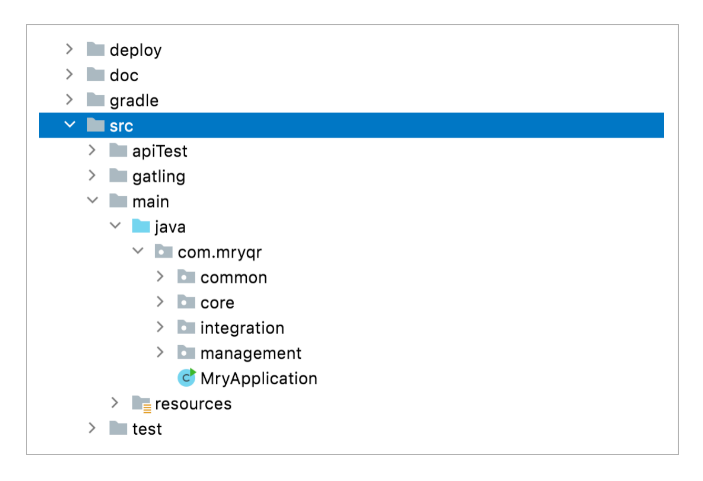
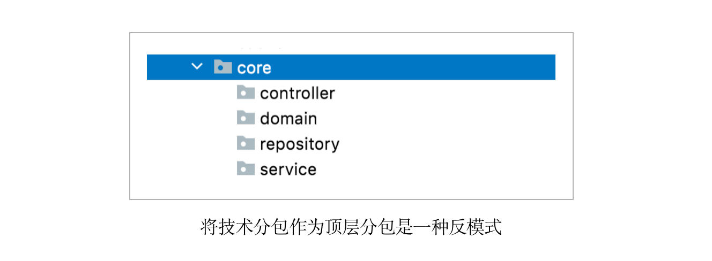
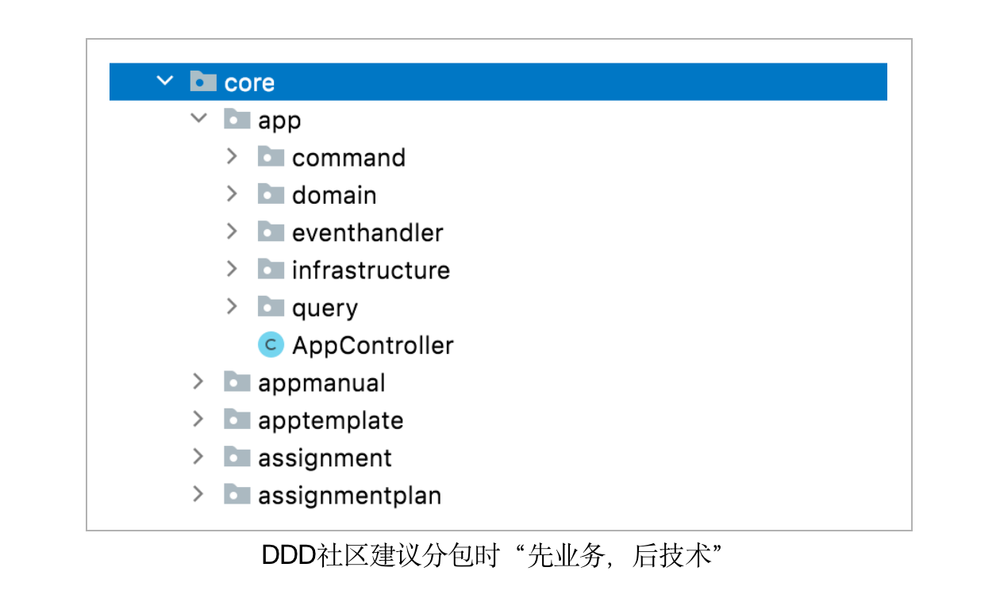
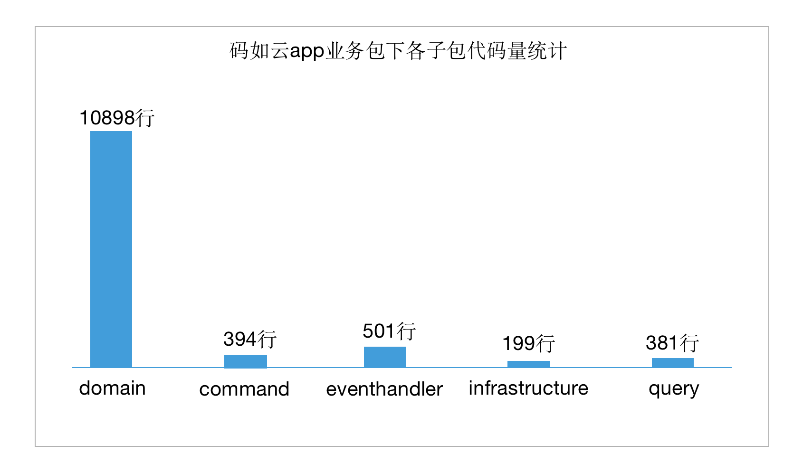
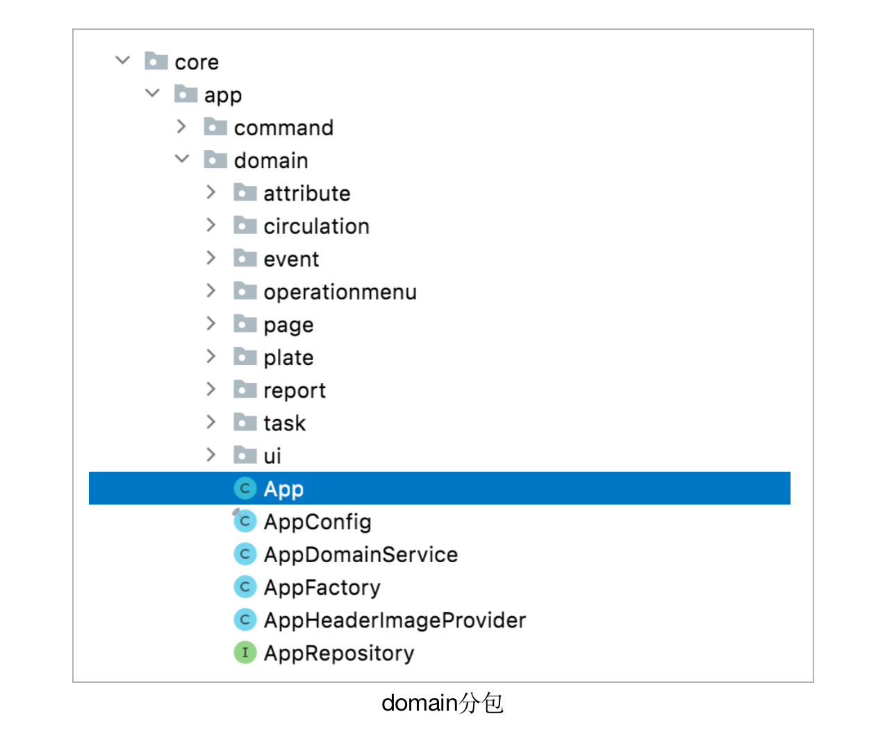
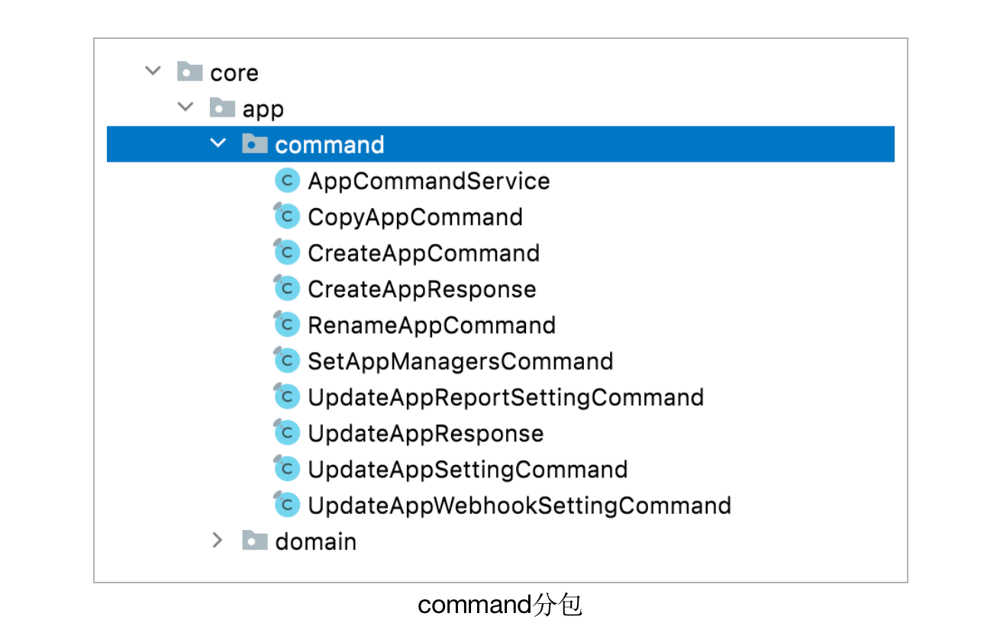
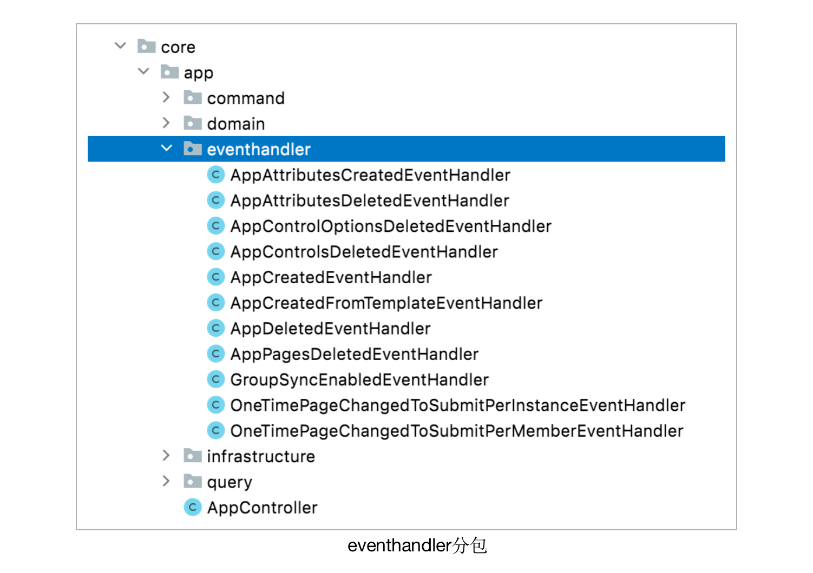
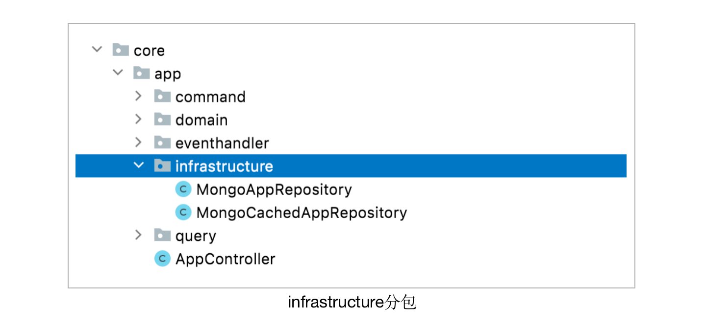
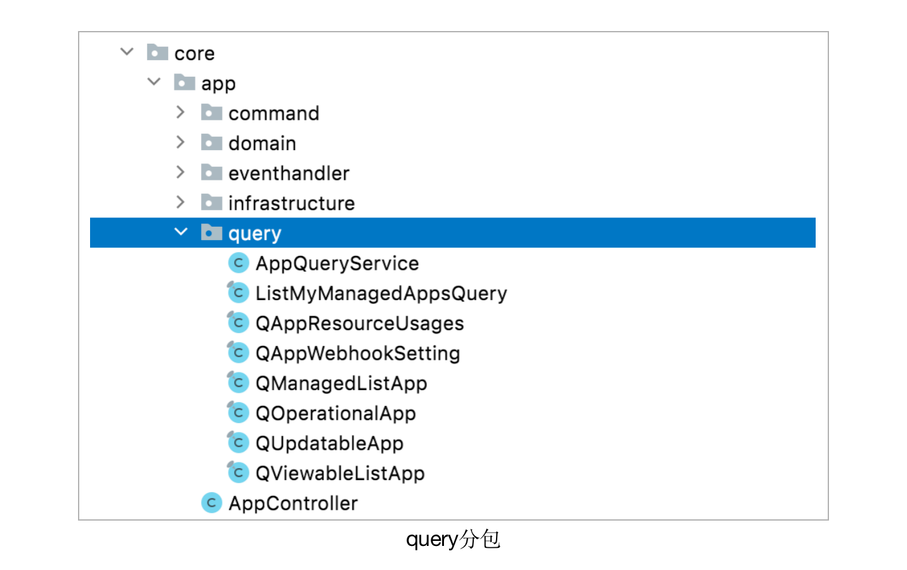

# 代码工程结构

在 [码如云](https://www.mryqr.com/)，我们经常会受邀去给其他公司或组织分享 DDD 的落地实践经验，分享期间听众一般会问很多问题，被问得最多的反倒不是限界上下文如何划分，聚合如何设计等 DDD 重点议题，而是 DDD 工程结构该怎么搭，包该怎么分这些实实在在的问题。

事实上，DDD 并未对工程结构做出要求，在码如云，我们结合行业通用实践以及自身对 DDD 的认识搭建出了一套适合于自身的工程结构，我们认为对于多数项目也是适用的，在本文中，我们将对此做详细讲解。

在上一篇 [战略设计](https://docs.mryqr.com/ddd-strategic-design) 中我们提到，码如云是一个单体项目，其通过 Java 分包的方式划分出了 3 个限界上下文，即 3 个模块。对于正在搞微服务的读者来说，可不要被 “单体” 二字吓跑了，本文所讲解的绝大多数内容既适合于单体，也适合于微服务。

以上是码如云工程的目录结构，在根分包 `src/main/java/com/mryqr` 下，分出了 `core`、`integration` 和 `management`3 个模块包，分别对应 “核心上下文”、“集成上下文” 和 “后台管理上下文”，对于微服务系统来说，这 3 个分包则不存在，因为每个分包都有自己单独的微服务项目，也即 DDD 的限界上下文和微服务存在一一对应的关系。与这 3 个模块包同级的还有一个 `common` 包，该包并不是一个业务模块，而是所有模块所共享的一些基础设施，比如 Spring 的配置、邮件发送机制等。在 `src` 目录下，还包含 `test`、`apiTest` 和 `gatling` 三个目录，分别对应单元测试，API 测试和性能测试代码。此外，`deploy` 目录用于存放与部署相关的文件，`doc` 目录用于存放项目文档，`gradle` 目录则用于存放各种 Gradle 配置文件。

## 分包原则：先业务，后技术

在以上提及的各种模块包中，程序员们最为关注的估计是 `core` 包之下应该如何进一步分包了，因为 `core` 是整个项目的核心业务模块。

在做分包时，一个最常见的反模式是将技术分包作为上层分包，然后在各技术分包下再划分业务包。DDD 社区更加推崇的分包方式是 “先业务，后技术”，即上层包先按照业务进行划分，然后在各个业务包内部可以再按照技术分包。

在码如云的 `core` 模块包中，首先是基于业务的分包，包含 `app`、 `assignment` 等几十个包，其中的 `app` 对应于**应用**聚合根，而 `assignment` 对应于**任务**聚合根，也即每一个业务分包对应一个聚合根。在每个业务分包下再做技术分包，其中包含以下子分包：

- `command`：用于存放应用服务以及命令对象等，更多相关内容请参考 [应用服务与领域服务](https://docs.mryqr.com/ddd-application-service-and-domain-service)；
- `domain`：用于存放所有领域模型，更多相关内容请参考 [聚合根与资源库](https://docs.mryqr.com/ddd-aggregate-root-and-repository)；
- `eventhandler`：用于存放领域事件处理器，更多相关内容请参考 [领域事件](https://docs.mryqr.com/ddd-domain-events) ;
- `infrastructure`：用于存放技术基础设施，比如对数据库的访问实现等；
- `query`：用于存放查询逻辑，更多相关内容请参考 [CQRS](https://docs.mryqr.com/ddd-cqrs)。

在这些分包下，可以根据实际情况进一步分包。

这种 “先业务，后技术” 的分包方式有以下好处：

- 业务直观：所有的业务模块被放在一起，并且处于一个分包级别中，让人一眼即可全景式地了解一个软件项目中的所有业务。事实上，Robert C. Martin（Bob 大叔）提出了一个概念叫 [尖叫架构](https://blog.cleancoder.com/uncle-bob/2011/09/30/Screaming-Architecture.html)（Screaming Architecture）讲的就是这个意思。尖叫即 “哇的一声” 的意思，比如当你看到一栋房子时，你会说 “哇，好一栋漂亮的房子！”，也即你一眼就能识别出这是一套房子。
- 便于导航：当你要查找一个功能时，你首先想到的一定是该功能属于哪个业务板块，而不是属于哪个 Controller，因此你可以先找到业务分包，然后顺藤摸瓜找到相应的功能代码。
- 便于迁移：每一个业务包都包含了从业务到技术的所有代码，因此在迁移时只需整体挪动业务包即可，比如，如果码如云以后要迁移到微服务架构，那么只需将需要迁出的业务包整体拷贝到新的工程中即可。

在以上子分包中，`domain` 分包应是最大的一个分包，因为其中包含了所有的领域模型以及业务逻辑。在码如云项目的 `app` 业务包下，各个子分包所包含的代码量统计如下：

可以看到，`domain` 包中所包含的代码量远远超过其他所有分包的总和。当然，我们并不是说所有 DDD 项目都需要满足这一点，而是强调在 DDD 中领域模型应该是代码的主体。

接下来，让我们来看看各个子分包中都包含哪些内容，首先来看 `domain` 分包：

在 `domain` 分包中，最重要的当属 `App` 聚合根了，除此之外还包含领域服务 `AppDomainService`，工厂 `AppFactory` 和资源库 `AppRepository`。这里的 `AppRepository` 是一个接口，其实现在 `infrastructure` 分包中。基于内聚原则，有些密切联系的类被放置在了下一级子分包中，比如 `attribute` 和 `page` 分包等。值得一提的是，用于存放领域事件的 `event` 包也被放置在了 `domain` 下，因为领域事件也是领域模型的一部分，不过领域事件的处理器类则放在了与 `domain` 同级的 `eventhandler` 包中，我们将在 [领域事件](https://docs.mryqr.com/ddd-domain-events) 中对此做详细讲解。

`command` 包用于放置 [应用服务](https://docs.mryqr.com/ddd-application-service-and-domain-service) 以及请求数据类，这里的 “command” 即 [CQRS](https://docs.mryqr.com/ddd-cqrs) 中的 “C”，表示外界向软件系统所发起的一次命令。

在 `command` 包中，应用服务 `AppCommandService` 用于接收外界的业务请求（命令）。`AppCommandService` 接收的输入参数为 Command 对象（以 “Command” 为后缀），Command 对象通过其名称表达业务意图，比如 `CopyAppCommand` 用于拷贝**应用**（这里的 “应用” 表示业务上的应用聚合根），`CreateAppCommand` 用于新建**应用**。

`eventhandler` 用于存放领域事件的处理器类，这些类的地位相当于应用服务，它们并不是领域模型的一部分，只是与应用服务相似起编排协调作用。

`infrastructure` 用于存放基础设施类，主要包含资源库的实现类：

`query` 用于存放与数据查询相关的类，这里的 "query" 也即 CQRS 中的 “Q”，我们将在本系列的 [CQRS](https://docs.mryqr.com/ddd-cqrs) 中对此做详细讲解。

## 自动化测试

自动化测试包含单元测试、API 测试和性能测试。在 API 测试中，数据库和消息队列等基础设施均通过本地 Docker 完成搭建，测试时先启动整个 Spring 进程，然后模拟前端向各个 API 发送真实业务请求，最后验证返回结果，如果遇到有需访问第三方系统的情况，则通过 [Stub 类](https://en.wikipedia.org/wiki/Test_stub) 进行代替。码如云采用的是 “API 测试为主，单元测试为辅” 的测试策略，其 API 测试覆盖率达到了 90%，所有的业务用例和重要分支都有 API 测试覆盖，单元测试主要用于测试领域模型，对于诸如应用服务、Controller 以及事件处理器等结构性设施则不作单元测试要求，因为这些类并不包含太多逻辑，对这些类的测试可以消化在 API 测试中。

> 所谓的 Stub 类，就是一个写死的 Mock，比如说有 API 要请求用户名，就写死返回 John Doe，以避免再走持久化层，给测试添麻烦。

# 总结

本文主要讲解了 DDD 代码工程的典型目录结构，我们推荐通过 “先业务，后技术” 的方式进行分包，这样使得项目所体现的业务更加的直观。此外，在 DDD 项目中，领域模型应该是整个项目的主体，所有的领域对象和业务逻辑均应该包含在 `domain` 包下。在下文 [请求处理流程](https://docs.mryqr.com/ddd-request-process-flow) 中，我们将对 DDD 项目中请求处理的全流程进行详细讲解。
