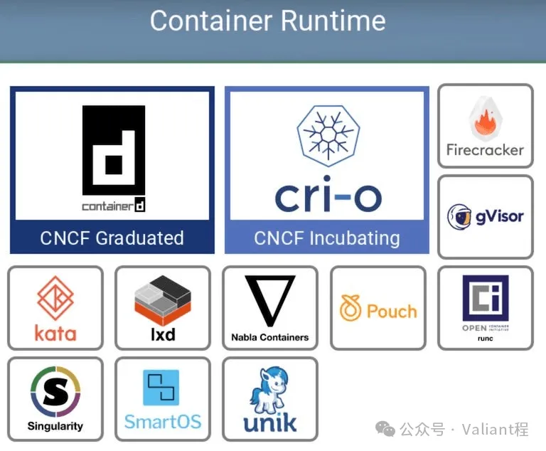
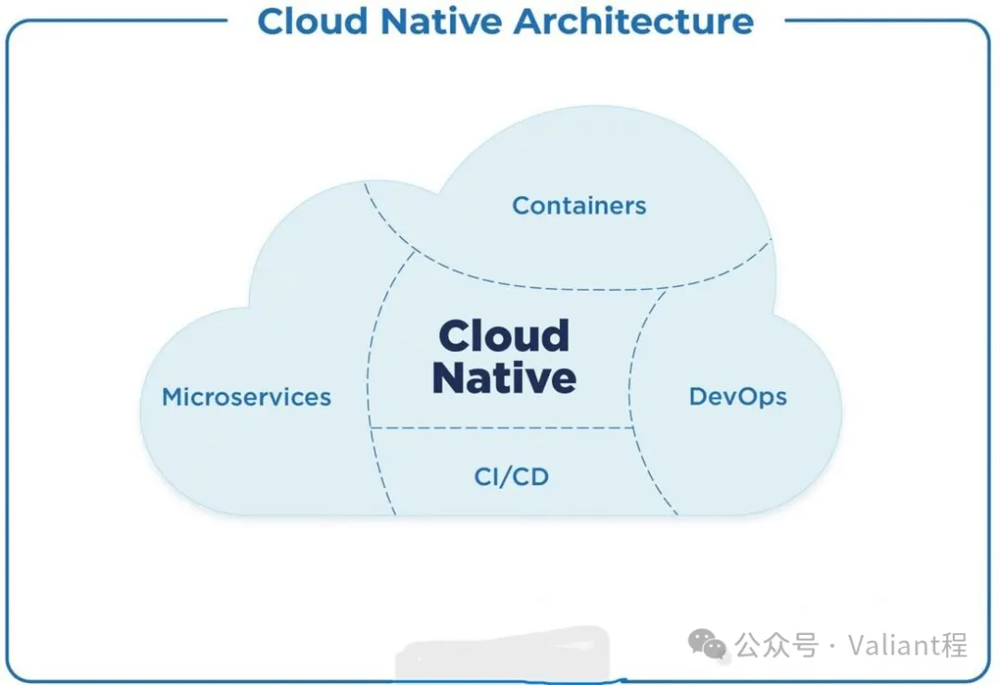

上期我们说完了提及的前三个问题是如何被面向终态的思想所解决的，下面我们来看第四和第五个问题：资源管理、使用和分配问题和服务管理治理问题，K8S 的出现，使得进行这类事情变得更加高效。

### 调度

#### 调度面对的核心问题

调度是计算机科学里面对的一类非常具备普遍性的问题，我们在很多地方都能看到调度问题：

- 操作系统的进程、线程调度
- CDN 的网络流量调度
- 物流中的多地多仓库货物调度
- 编程语言的垃圾回收本质上也是调度问题

调度本质上是一个决定资源如何分配才能达成某些条件下的最优效果的过程，这个某些条件下的最优效果往往是人为定义的：可能是最直接的全局综合最优，也有可能是特定范围内的局部最优，这个最优效果往往会随实际需求的变化而进行适应性的定义调整。

在 K8S 的所面对的调度场景中，就是探究如何将多个具备不同特点和规格的应用程序安置到一个由多个相同或不相同的机器组成的集群内，才能达成最大程度的资源利用率（这是最常见的最优效果要求，随着场景的变化往往会不同）。

一般来说，资源利用率往往和服务质量（如响应实时性）是不可兼得的，在操作系统上就会遇到这样的问题，所以便有实时操作系统和普通操作系统之分，前者更加在乎响应实时性，所以整体资源的利用率就变成了次要关注目标。同样的，在集群调度中也会遇到类似的场景，如果大部分调度对象对执行完成时间有较为严格的要求，调度的侧重点就会变成调度对象任务执行的平均时间开销而非是资源利用率。

#### K8S 的调度

由于调度本身是一个非常复杂和多样化的事情，在不同场景和需求下所要求的目标并不相同，所以 K8S 提供了一个调度框架，来辅助使用者实现不同的调度需求目标，我们这里以最常见的、也是默认的调度策略为例来介绍下 K8S 调度框架的整体思想。

对刚刚了解 K8S 的人来说，只需要关注理解调度框架中过滤（Filter）和打分（Score）两个过程就够了，这两个步骤也是 K8S 调度中最重要的两个，这里可以直接引用 K8S 官方文档的解释：

> kube-scheduler（调度器）给一个 Pod 做调度选择时包含两个步骤：
>
> 1. 过滤
> 2. 打分
>
> 过滤阶段会将所有满足 Pod 调度需求的节点选出来。例如，PodFitsResources 过滤函数会检查候选节点的可用资源能否满足 Pod 的资源请求。在过滤之后，得出一个节点列表，里面包含了所有可调度节点；通常情况下，这个节点列表包含不止一个节点。如果这个列表是空的，代表这个 Pod 不可调度。
>
> 在打分阶段，调度器会为 Pod 从所有可调度节点中选取一个最合适的节点。根据当前启用的打分规则，调度器会给每一个可调度节点进行打分。
>
> 最后，调度器会将 Pod 调度到得分最高的节点上。如果存在多个得分最高的节点，调度器会从中随机选取一个。

进一步简单地考虑，其实过滤和打分做的是同一件事情，过滤可以理解为把过滤掉的候选项放到打分结果最后一位之后，所以我们着重看看 K8S 调度默认是如何打分的，默认的打分结果是由以下几种策略加权求和计算出来的（根据 K8S v1.30 代码整理）：

- TaintToleration（3）：污点容忍情况
- NodeAffinity（2）：节点亲和性情况
- NodeResourcesFit（1）：可用资源情况
- PodTopologySpread（2）：pod 拓扑分布情况
- InterPodAffinity（2）：pod 间亲和性情况
- NodeResourcesBalancedAllocation（1）：节点资源分配均衡情况
- ImageLocality（1）：节点存在镜像情况

污点容忍、节点亲和性、pod 拓扑分布、pod 间亲和性这三类都是用户主动指定的位置偏好（即：我想让这些应用运行在哪些地方），所以相对来说赋予了较高权重，这里可以看出默认策略是更照顾用户的主观性要求的。

可用资源、节点资源分配、节点存在镜像情况则是客观资源条件（即：把应用放在哪里可以起到最好的资源利用率），这里的权重是比主观性要求要低的。

上述是 K8S 默认使用的调度策略，如果有需要，K8S 所选用的调度策略、权重甚至是策略执行和计算的过程都是可以完全自定义实现的，并且所谓的 “资源” 的概念也可以自行定义和实现针对其的调度模式。譬如上述涉及到的仅为最常见的以 CPU 和内存为基本计算资源的调度场景，除此之外，磁盘、网卡、GPU 芯片、IO 设备各类硬件乃至虚拟的软件资源都能成为可能的调度资源对象。

理论上讲，K8S 的调度机制和框架，最终赋予了用户达成任意调度策略和目标的可行性。

也因此，通过这样的调度机制和思想，K8S 实现了各类资源的利用在各类定义衡量标准下的尽可能高的优化效果，提升了企业和个人对资源的使用率和取得的特定质量效果，同时灵活地满足了各类可能的调度诉求，顺带解决了人工部署时存在的 “选择困难症” 现象，这样提升的效果无疑是非常显著的。

### 中立的服务管理和治理模式

接下来我们来谈谈 K8S 如何解决第五个问题：应用服务的管理和治理

#### 微服务和容器化

这也是一个非常大的话题，我们可以知道，在容器和 K8S 出现的前后，微服务也在那段时间开始变成了一个非常流行的技术术语，这两者几乎在同一时间段受到追捧，从某种程度上来看，是一种必然。因为从两者的理念和模式上来看，存在非常多的交集和共通点，所以这两个技术的流行普及实际上是一个相辅相成的过程。

微服务的核心理念是什么呢，是把旁大的单体式应用服务根据功能或领域拆分成若干个独立的灵活小巧的微型服务，所以称为微服务。而单体服务往往切分完遇到的第一个问题就是切分后的服务数量上涨，多个微服务的部署、管理、治理都变得复杂和棘手，而容器和 K8S 技术恰恰能够较好地帮助解决这些问题，因此两者的使用相得益彰。

相信做业务开发的同学对微服务的理念非常熟悉，而这一领域比较经典的就是 Java Spring Cloud 那一套东西，它给出了微服务架构中的关键功能范式组成：

- **配置中心**：对各个服务的多个实例所使用的配置进行统一化管理
- **注册中心 / 服务发现**：注册中心对所有服务进行统一登记管理，进而帮助多个服务间进行互相发现和访问
- **负载均衡**：用于访问服务时在单个服务的多个实例间均衡流量
- **网关**：作为服务访问的统一入口使用，集成了和服务具体逻辑无关的通用性功能：如路由、过滤、鉴权等
- **远程调用**：用于服务间互相调用对方提供的接口和方法
- **限流熔断**：用于限制访问服务量过大时进而对服务稳定产生威胁

Spring Cloud 的这样的设计，是一个针对微服务架构很好的范式，不过很遗憾的是 Spring Cloud 仅限于 Java 系的语言中，在非 Java、多语言混合技术栈中，就很难适用了。

不过，这些典型功能是从微服务架构中抽象出的不可或缺的基本需求，也对后续我们理解 K8S 为何对微服务架构非常友好有所帮助，实际上 K8S 就是达成了多语言混合、或者说语言中立技术栈微服务架构所需的要求。

#### K8S 中的微服务

我们可以从上一部分抽象出的微服务架构的关键功能范式的基础上，来一一对应地说明，K8S 是如何达成同样的效果的：

- **配置中心**：K8S 提供了两类存在于集群中的抽象资源 Configmap、Secret 来实现配置的管理，前者用于保存非敏感数据、后者用于保存敏感数据，所有需要使用配置的应用都可以通过 “挂载” 一个或若干个 Configmap 或 Secret 来实现配置的附加，同时多个应用可以挂载同一个 Config 或 Secret，其修改和变化也会同步同步到所有挂载这些对象的应用服务实例上，实现配置的统一管理和变更
- **注册中心 / 服务发现**：在 K8S 集群中，一组应用服务程序（微服务）的实例可以被直接抽象成一个 K8S 集群中的资源 —— 服务（Service）而对待，这个名字非常直观，不同应用服务间通过 Service 这个集群资源即可实现互访，无需感知究竟要访问哪一个实际的服务地址。并且服务作为集群资源，会被 K8S 所保存到其全局记录中，也可以通过 K8S API 轻易地获知集群中存在哪些对外暴露可访问的 Service 进行服务发现
- **负载均衡**：K8S 使用一个叫做 Kube-proxy 的组件，借用 Linux 内核提供的灵活的网络转发机制（iptables/ipvs），同样实现了应用程序在客户端的负载均衡，保证了应用程序在访问抽象的 Service 资源所对应的实际端点时，能够按照特定的负载均衡策略在多个端点间进行合理的请求分布，简化了对一个应用程序实体、多个实例的访问方式
- **网关**：K8S 通过抽象资源 Ingress、Gateway 来声明式地提供网关实例，在 K8S 中，没有强制地绑定了一个网关的具体实现，而是定义了一个网关组件需要支持的基本语义规范（也可以理解为协议、接口）来提供给用户使用，这里给予了用户灵活选择的空间，用户可以选择更加适合自己场景的网关进行使用，并通过 K8S 提供的统一的声明式抽象语义规范来使用；除了在网关上我们能看到这种定义语义规范 / 协议 / 接口，而不是定义具体实现的模式，我们还能在 K8S 的很多地方看到这样的模式，譬如 CNI、CSI、CCM 等等，这也是 K8S 本身的一大特点
- **远程调用**：由于远程调用是一个和语言密切相关的操作，K8S 出于本身的语言中立性，不提供一个具体的远程调用方法框架，因为诸如像 gRPC、Thrift、GraphQL 等项目已经提供了成熟的语言中立的远程调用能力，所以这里 K8S 同样不强制性地绑定实现，而是把选择权交由用户
- **限流熔断**：这类功能可以看作是网关层和远程调用范畴内的功能，一般往往也是在这两个层面内进行实现，因此 K8S 并不考虑这部分内容

总体上，对应 Spring Cloud 提供的微服务架构基本能力来看，其中基于语言无关立场能够实现的，K8S 均提供了定义和实现，而不能实现的，K8S 也能很好地进行嵌入和适配。而 K8S 面向支持微服务架构，提供的最关键的优势，就是其语言中立性立场带来的普适性、面向接口和协议而非实现的高度兼容和扩展性。

不过相比于 Spring Cloud 这样的方案，K8S 这样的模式也造成了很多时候不能够开箱即用、方便快速地使用，不过从其本身的定位来说，这样的代价也是可以接受的。因此，最终通过这样的模式，K8S 解决了第五个多个服务难以管理和治理的问题。

## 为什么是 K8S

我们在前面的部分也提及到了，K8S 并不是解决大规模容器化应用和机器集群管理问题的唯一的项目，但它确实是解决地最好的一个，也因此成了现在容器编排管理领域事实上的标准。那么，为什么是 K8S 呢，与他同期同类的项目为什么没能竞争过它呢？

### 开放性

我们上一篇文章讲了 Docker，事实上对 Docker 比较熟悉的人应该知道，Docker 除了管理单机上容器的成名项目 Docker，还有自己的容器编排项目：Dokcer Swarm。

并且，在容器生态刚刚兴起繁荣的当时，Docker 可谓是如日中天，与它无缝集成的 Swarm 自然也有非常巨大的优势去抢占容器编排领域的主位，但它还是被 K8S 击败了，并且输得很厉害，乃至于 K8S 最终把 Docker 也抛弃并划清界限了，造成这种结果的核心原因，就是开放性。

Docker Swarm 从诞生时，就成为了 Docker 雄心勃勃、想进一步垄断容器生态市场的一个有力工具，因此当时参与该领域竞争的其他公司自然会对 Docker Swarm 抱有较大的竞争意识。

由于 Docker Swarm 本身的非中立性（绑定了 Docker 公司），因此推出 K8S 的 Google 在之后的竞争中选择了成立一个中立的开源组织 CNCF，把 K8S 完全捐赠了出去，撇清了 K8S 和 Google 之间的管理（也就是告诉大家：不用担心，这个项目不是我的，我不会通过控制项目的发展来牟利）。

也因此，彻底中立开放的 K8S 项目成了广大开发者和企业所青睐的对象，因为中立的立场意味着 K8S 的使用永远不会需要授权、付费，并且其发展永远不会被一家公司所把持。另外，开源、开放的运作模式，意味着任何个人、公司、团体，都有参与发展 K8S 项目的权利，都有无偿享受项目的权利。

除此之外，K8S 的开放性还体现在对各个具备同类功能项目的包容和中立性，由于是通用的容器编排系统，因此会集成很多能力，包括存储、网络、计算的各个方面。在这个时候，K8S 选择制定开放的协议和接口标准，而不是强制绑定和规定一个实现，比如：

- CRI 抽象了所有底层容器运行时（如 Docker）的功能标准接口，满足了该接口标准的任何项目，都能被集成到 K8S 中使用
- CSI 抽象了所有 K8S 容器使用存储能力的统一功能标准接口
- CNI 抽象了所有 K8S 容器使用网络能力的统一功能标准接口
- CloudControllerManager 抽象了所有 K8S 集群使用云平台相关能力的统一标准接口
- DevicePlugin 抽象了所有 K8S 集群使用异构设备的统一功能标准接口

上述这种规定接口协议标准，而不是绑定实现的模式，除了进一步加深 K8S 的开放性，本身也为 K8S 提供了多样化且富有差异化的底层功能支撑，在开源的大背景下，满足了不同用户在各类场景下的不同需求，进一步丰富了社区生态。

### 正确的专精技术方向选择

在同期比较知名的容器编排系统还有另一个叫做 Mesos 的项目，在当时也有较为广泛的使用，但为什么 Mesos 没能在和 K8S 的竞争中胜出呢，重点还是在专精技术方向的选择上。

事实上，Mesos 出现的比 K8S 早得多，其建立的最初目的是服务 Hadoop、Spark 这类大数据计算机器集群的管理，在这时以 Docker 为代表的容器技术还没有成熟和流行。因此，Mesos 项目的能力重点早期都侧重到了传统机器集群的管理上，以致于后续没能很好地拥抱上容器化技术。

虽然后来 Mesos 也在项目中积极支持容器相关能力，但由于其历史包袱过重，无法在容器领域内竞争过专精容器集群管理的 K8S，因此逐渐在和 K8S 的竞争中被淘汰，这又是一个生不逢时、错失机遇的故事。原先很多 Mesos 专精服务的大数据计算项目社区，后来也反过来主动涌现了很多结合 K8S 范式的项目来完成这些大数据计算服务在 K8S 上的适配，这让 Mesos 一开始想做主动完成的事情，对 K8S 变成了一个被动、自然的事。

只有容器化集群在当前才能最好地解决应用服务在 IT 基础设施一直以来的运维问题和痛点，也只有它，才能带来当下应用服务在 IT 基础设施上最高效的管理能力。一个技术项目，对于核心关键问题到的正确把握，在恰当的时间和历史背景下，带来正确的专精技术方向的选择，带来最终更广泛意义上的成功。

### 云计算厂商的推波助澜

另一个不可忽视的事实是，在容器相关生态技术迅猛发展的这段时间，云计算这个产业也处于高速增长、发展革新的阶段。AWS、Azure、Google 等公司，承包了越来越多的 IDC 机房，托管了越来越多企业和个人的应用服务，自身对于 IT 基础设施的管理效率以及利用率的要求也在不断增长。

在这样的大背景下，容器生态技术无疑很好地解决了这些云厂商的痛点，从传统的售卖虚拟机到售卖托管容器集群，容器技术的使用使得管理效率和资源利用率都得到了提高，让厂商和客户都享受到了技术所带来的红利。

同时，K8S 作为首个开放中立的开源容器编排项目，自然得到了几乎所有主流云厂商的青睐，这样的现象也让诸多云厂商自身投入了很多高质量的研发人员到了 K8S 项目之中进行开源共享，反过来促进了了 K8S 本身的发展。

除此之外，由于 K8S 本身的开放性，其本身可以通过开放的协议标准来和云厂商提供的很多其他云产品产生集成效应，对于促进云厂商本身的营收增长也有非常明显的推动作用。也因此，后来有了 “云原生” 这个概念，潜在含义就是 K8S 牢牢将应用服务和云计算牢牢绑定，K8S 提供的能力和云产品本身的价值紧密结合，产生 1+1>2 的效应来提供价值。

因此，随着云厂商的推波助澜，K8S 变得越来越为人所知，也成为了当时那段时间中最为新潮的技术项目和方向，“云原生” 作为从容器和 K8S 生态中衍生出的概念，也变得如日中天，并演化除了后续的云原生生态。

## 总结

从整个 K8S 的诞生、发展到现在的成熟，我们可以看出一个很明显的本质，那就是：**应用程序应当且仅需关注自身**。

不论是容器还是 K8S、抑或是云平台提供的各类云产品、基础平台提供的各类能力，其核心做的事情都是将和应用程序本身无关的问题进行解耦，进而得到更为专业化的解决，让应用程序的开发者和拥有者专注于应用程序本身和其所带来的价值上。所谓的云原生、平台工程，其实都是在做这样的事情，这也符合了生产力发展、社会整体效率不断提高的大趋势。
