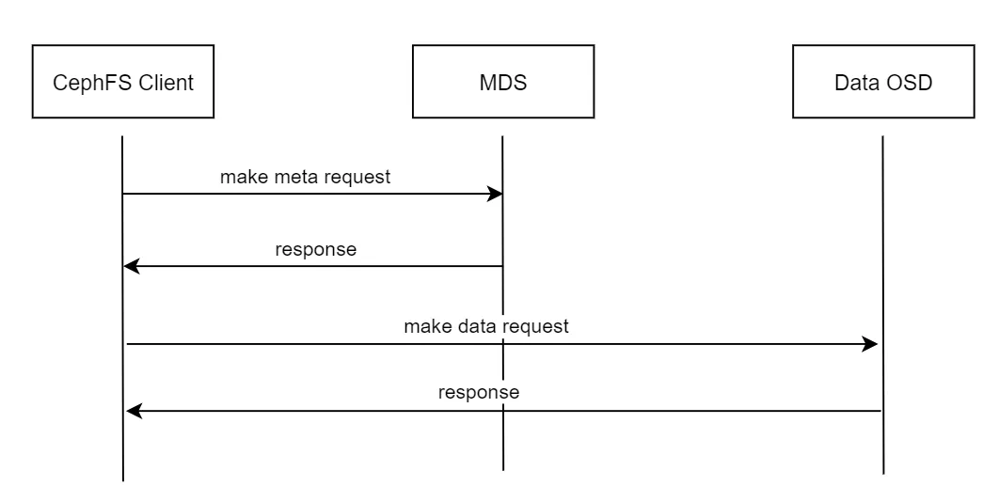
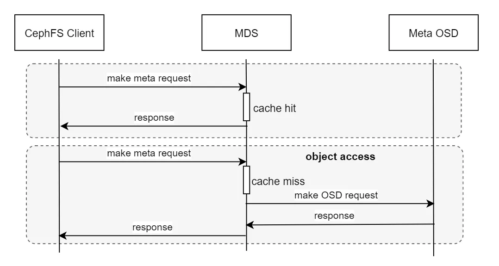

在高性能存储设备越来越普及的今天，如何发挥高性能存储设备的性能，已经成为一个大数据企业绕不开的话题。传统的面向 HDD 或 SATA SSD 设计的分布式存储系统在高性能硬件上，甚至很难将硬件的性能发挥到其 1/10。同时，伴随着 AIGC、数据库系统的发展，越来越多的业务对高性能分布式存储产生了需求，同时也有更高要求。随着数据规模的增长，堆砌硬件的方式已经不能满足企业的正常发展。通过设计基于全闪硬件的高性能存储产品，充分释放高性能硬件能力，才是解决问题的关键。本文旨在分析 Ceph、阿里盘古 2.0 和 XSKY 星飞全闪分布式存储系统的实现与设计，总结最新的高性能分布式存储系统依赖的核心关键技术，对比开源产品 Ceph 的发展与企业级产品在高性能核心技术方面的差距，看看 Ceph 是否依然具备在高性能存储介质上的技术先进性，是否值得大家继续投入和研究。限于笔者水平，如有错误，欢迎联系指正。

# 高性能分布式存储系统调研

## 1. Ceph

Ceph 以 RADOS 为存储底座，对外提供了包括文件、块和对象存储的服务，RADOS 是一个高性能的对象存储系统。Ceph 的三大存储系统构建在 RADOS 存储底座之上。总体结构如下图所示。

> RADOS（**Reliable Autonomic Distributed Object Store**）是 **Ceph** 分布式存储系统的核心组件和基础层。它是一个高度可靠、可扩展、自管理的分布式对象存储系统，负责管理数据存储、复制、分发和一致性等功能。RADOS 提供了一个抽象层，使上层应用程序无需关心底层存储的复杂性。
>
> RADOS 的主要特点：
>
> 1. **分布式架构**：
>     - 数据被分布在多个存储节点上，消除了单点故障，同时提高了性能和可扩展性。
> 2. **高可靠性**：
>     - 通过数据复制或纠删码技术，RADOS 确保数据在硬件故障（如磁盘或节点故障）时依然可用。
> 3. **自管理（Autonomic）**：
>     - RADOS 能够自动处理存储节点的加入、移除或故障，无需人工干预。
>     - 自动均衡数据分布，优化存储效率和性能。
> 4. **强一致性**：
>     - RADOS 提供强一致性模型，确保数据读写的准确性和完整性。
> 5. **可扩展性**：
>     - RADOS 支持从小规模部署扩展到数百甚至上千个存储节点，且性能随节点增加而线性扩展。
> 6. **对象存储**：
>     - 数据以对象的形式存储，每个对象都有唯一的 ID 和元数据，支持灵活的存储和检索。
>
> RADOS 的关键功能：
>
> - **数据分布和映射**：
>     - 使用 CRUSH（Controlled Replication Under Scalable Hashing）算法将数据分布到存储集群中的不同节点，避免了传统中心化元数据管理的瓶颈。
> - **数据复制**：
>     - 默认情况下，RADOS 通过多副本机制实现数据冗余，确保高可用性。
> - **容错和恢复**：
>     - 当节点或磁盘发生故障时，RADOS 会自动检测并重新复制数据到健康节点。
> - **多种接口支持**：
>     - RADOS 提供多种接口，包括：
>         - **Librados**：程序化访问。
>         - **RADOS Gateway（RGW）**：RESTful 接口，兼容 S3 和 Swift 协议。
>         - **RBD（RADOS Block Device）**：块存储接口。
>         - **CephFS**：文件系统接口。
>
> RADOS 在 Ceph 中的作用：
>
> RADOS 是 Ceph 的核心，所有 Ceph 的高层功能（如 CephFS、RBD 和 RGW）都建立在 RADOS 之上。它负责底层的数据管理和分布，而上层模块通过不同的接口与 RADOS 交互，从而实现对象存储、块存储和文件存储的功能。
>
> 简单来说，RADOS 是 Ceph 的“引擎”，提供了分布式存储系统所需的核心功能和可靠性保障。

### （1）块存储服务

由于块存储服务非常简单，因此其不需要一个中心化的服务进行数据处理，用户使用 librbd 或者 内核的 rbd 客户端（krbd）来直接使用块存储服务。客户端负责将块数据转为 RADOS 系统对象数据进行访问，RBD 服务性能的关键在于底层 RADOS 的性能，可以参考 RADOS 一节分析介绍，这里不作赘述。

### （2）文件系统服务

Ceph 提供的分布式文件系统兼容 POSIX 接口，具备强一致性，允许多客户端同时读写相同文件。Ceph 通过中心化的 MDS 服务来管理文件系统的元数据。用户通过内核 cephfs 客户端或者 cephfs fuse 客户端通过 mount 方式来使用 cephfs 文件系统。一次典型的文件系统访问请求如下图所示，客户端首先向 mds 发起元数据请求服务，从 mds 读取到元数据后，客户端向数据 rados pool 发生请求，读写数据。

> 在 Ceph 中，OSD 指的是对象存储守护进程（Object Storage Daemon）。Data OSD 负责存储实际的数据对象，并处理数据的复制、恢复、回收等操作。每个 OSD 通常对应一个存储设备（如硬盘或 SSD），并直接管理该设备上的数据存储。OSD 在 Ceph 集群中是数据存储的基本单元，负责确保数据的高可用性和可靠性。

Cephfs MDS 的数据持久化在 RADOS 中，因此，RADOS 性能成为 MDS 服务的性能关键。RADOS 本身是一个对象存储，如果所有数据都直接从 RADOS 层获取，MDS 会成为文件服务的瓶颈。MDS 采用将需要的元数据全部缓存入内存的方式，来解决这个问题。由于 Cephfs 提供强一致的文件读写，因此每个文件的元数据设计异常复杂，同时占用大量内存（测试中，cephfs 的一个 inode 大致需要占用 2.5KB 的内存）。Cephfs 的元数据请求处理链路如下图所示。

Cephfs MDS 采用主备的方式提供高可用，主备切换期间服务不可用。MDS 进程启动的速度与挂载的客户端和打开的文件数量有关。在千万文件规模的集群上，MDS 重启可能需要花费数分钟到数十分钟。这里主要的原因是为了保证服务重启过程中的强一致性，重启过程中需要等待客户端锁相关数据全部加载完成，同时，为了保证服务重启后的性能，MDS 还要花费一部分时间来装载客户端打开的文件 inode。

### （3） 对象存储服务

由于 RADOS 本身就是一个广义的对象存储，因此使用 RADOS 为底座的 S3 对象存储服务设计相对简单，仅需要对 S3 对象进行切片，管理相关元数据即可，并兼容 S3 相关 REST API 即可。这里，我们不对 RADOS gateway 服务进行分析，从架构层面，这部分不会系统性能的瓶颈点。

### （4）存储底座 - RADOS

RADOS 全称为 Reliable Autonomic Distributed Object Store，是一个广义的分布式对象存储系统，其分布式基于 CRUSH（Controlled Replication Under Scalable Hashing，即可扩展哈希的受控副本分布） 算法构造，彻底抛弃了传统架构中的中心化元数据管理、网关等服务。RADOS 中对象的存储位置，可以直接通过 CRUSH 算法计算得出，进而客户端可以直接向存储单元发起请求，读写数据，而不需要访问中心控制逻辑。

> 在 Ceph 中，**PG** 是指 **Placement Group**（放置组）。它是 Ceph 中用于管理和组织数据存储的核心概念之一，主要用于将数据划分为更小的逻辑单元，以便在集群中高效分布、复制和恢复。
>
> PG 的作用
>
> 1. **逻辑分组：** PG 是一种逻辑分组，用于将数据从客户端到存储节点（OSD）之间的映射简化。数据首先被分配到某个 PG，然后 PG 再映射到具体的 OSD。
> 2. **分布式存储：** PG 帮助 Ceph 将数据均匀分布在整个集群中，避免热点问题。
> 3. **复制和恢复：** PG 负责管理其包含的数据对象的复制和一致性。当某个 OSD 失效时，PG 会确保数据在其他 OSD 上重新恢复。
>
> PG 的工作原理
>
> 1. **数据映射**：
>   - 当客户端存储一个对象时，Ceph 会使用哈希函数（通常基于对象名称）将数据映射到某个 PG。
>   - 然后，通过 **CRUSH 算法**，PG 会进一步映射到一个或多个具体的 OSD（根据副本或纠删码配置）。
>
> 2. **分布和负载均衡**：
>   - 集群中的 PG 数量通常比 OSD 数量多得多（例如，数百到数千个 PG），这样可以在 OSD 间实现更细粒度的负载均衡。
>   - 如果 OSD 数量变化（如增加或移除节点），PG 会通过 CRUSH 重新映射到新的 OSD 集合，确保数据的自动重平衡。
>
> PG 数量配置非常重要： PG 数量过少会导致数据分布不均，PG 数量过多会增加 OSD 的管理开销。
>
> 总结
>
> PG 是 Ceph 中用于将数据映射到 OSD 的中间层逻辑单元。它的引入使得数据分布、复制和恢复变得高效且灵活。在实际部署中，合理配置 PG 数量对于集群性能和稳定性至关重要。

对于业务逻辑来说（块、文件、对象）等，只要按照自定义固定规则生成一致的对象 id，就可以使用该对象 id 直接向存储对象的 OSD（磁盘设备管理进程）发起数据读写请求。CRUSH 算法的计算过程仅仅依赖少量的集群元数据，而这部分数据完全可以缓存在客户端，当集群发生变化时，客户端监听并更新相应数据即可（相关逻辑在 librados 中实现）。相比其它对象存储系统，CRUSH 算法少了中心控制逻辑访问的逻辑，总体请求链路更短。RADOS 数据访问流程如下图所示。

#### 数据持久层 - ObjectStore

RADOS 通过本地对象存储引擎（ObjectStore），将对象数据持久化至磁盘上。ObjectStore 对外提供无差异、符合事务语义的本地对象存储服务。目前，ObjectStore 主要有 FileStore 和 BlueStore 两种实现方式，同时社区正在积极推进 SeaStore 的开发工作。

- FileStore 将数据保存到本地文件系统，为了提升写入性能，数据可以写入由高速设备（SSD）管理的 journal 文件，然后再异步下刷到慢速磁盘设备（HDD）。
- 与 FileStore 不同，BlueStore 绕过本地文件系统，直接管理裸设备。BlueStore 中实现了一个极简的 BlueFs 文件系统，用来支持 RocksDB（存储对象 omap 数据、磁盘元数据等）的运行，同时可以用来读写 wal 日志。直接管理裸磁盘设备主要有以下好处：
  - 不需要执行对象与文件之间的转换，而是直接操作对象，这使得 BlueStore 的 I/O 路径大大缩短， I/O 时延也随之得到改善
  - BlueStore 支持将元数据和用户数据严格隔离，并支持分别存储到不同设备，（例如用户数据使用 HDD 存储，元数据使用 NVMe SSD 设备存储）以获得更好性能
  - 直接管理裸设备让 BlueStore 可以非常容易支持用户空间相关技术栈（SPDK、DPDK）的应用，从而更进一步发挥高速设备性能
- 经过测试，BlueStore 已经不能完全发挥现代高性能设备的全部性能，性能瓶颈从磁盘设备转移到了 CPU（特别是随机 IOPS 读写）。为了降低数据请求过程中对 CPU 的消耗，SeaStore 引入 SeaStar 框架的 RUN-TO-COMPLETE 模型，以避免由于数据同步、锁而产的线程频繁切换造成的 CPU 消耗，同时，SeaStore 中放弃使用 RocksDB 管理元数据，进一步降低元数据管理对于 CPU 的消耗。

## 2. Pangu

Pangu 是阿里巴巴的存储底座，经历了 1.0 到 2.0 的发展历程。由于系统本身不开源，我们仅能从发表的论文中学习相关存储技术的使用与迭代发展。论文中介绍的 Pangu 系统非常复杂，有很多组件和专门的优化（例如针对数据压缩的硬件 offload），大部分的设计仅仅具备学习价值，对于很多中小企业不具备参考指导意义。这里我们重点介绍数据持久层的设计思路，看看大型企业最底层的数据存储技术是如何发展演化的。

### （1）整体设计

盘古 2.0 系统核心组件主要包括：客户端、Master、ChunkServer。整体架构如下图所示。

- 客户端向使用盘古系统的 OSS、EBS 等服务提供了系统使用 SDK
- Master 采用 raft 协议来管理集群的所有元数据
- ChunkServer 负责管理和存储一组 chunk（chunk 是数据存储单元）

盘古 2.0 对外提供 append-only 的 FlatLogFile 接口，以 directory/file 方式读写数据（RADOS 和 OZone 是对象存储），FlatLogFile 以 Chunk 形式保存在 Chunk Server 中，Chunk 元数据由中心化的元数据服务进行管理。

### （2）高性能技术应用与发展

在数据持久层，盘古 2.0 主要应用了以下技术方案，来充分发挥底层高性能硬件的性能：

- 盘古 1.0 采用内核文件系统的方式管理磁盘设备，这个阶段的文件系统基于 Linux Ex4 和 Kernel TCP 开发，支持 TempFile, LogFile 和 random access file；
- 盘古 2.0 为了释放高性能设备的性，采用用户空间文件系统 USSFS （user space storage file system）来管理底层高性能磁盘设备。绕过文件系统可以更好的配合用户空间技术的使用，减少内核 - 用户空间互相切换的开销
- 对外仅提供 append-only 数据写入，以便获得极致的写入延迟，同时更好的利用 SSD 的高性能顺序写性能

为了更好发挥 CPU 性能，盘古 2.0 做了以下努力：

- ChunkServer 运行在用户空间系统之上（USSOS），采用 RUN-TO-COMPLETION 线程模型，以减少线程上下文切换带来的 CPU 损耗
- USSOS 构建在 SPDK、DPDK 等用户空间技术栈之上，同时将讲个技术栈融合，使其更好配合，正在做到内存零拷贝（例如：RDMA 收到数据放入内存后，这部分数据占用的内存空间不再变化，直到下刷到磁盘后释放），以缓解内存带宽瓶颈问题
- 从客户端开始，就使用 EC 和数据压缩，以减少网络带宽和存储的数据量
- 胖客户端设计，大部分操作都在客户端完成，客户端感知底层所有核心组件
- 硬件 offload：将数据压缩放到专门的 FPGA 硬件进行，以减少其对 CPU 的巨大损耗

### （3）使用方式

论文 《More Than Capacity: Performance-oriented Evolution of Pangu in Alibaba》这篇论文中并未提及上层类似 EBS、OSS 服务层的系统设计。但是从底层提供的 append-only 语义，我们可以猜测其可能设计思路可能和 LSM tree 的思路相似，上层数据将以 log-structured 的方式组织，业务自行负责垃圾回收的实现。xsky 的 BlockServer 实现就是其中一种可行的方案。

## 3. XSKY INFINI

XSKY 星飞全闪产品是 XSKY 旗下的高性能存储产品，从《XSKY 星飞全闪技术白皮书》中，我们可以对其应用的和兴高性能技术窥探一二。XSKY 全闪 INFINI 的总体技术架构与阿里云盘古系统类似，数据都是通过 ChunkServer 以 chunk 形式进行管理，chunk 元数据管理在中心化的元数据管理服务中，对外也仅提供 append-only 语义的写入，以获取极致的 SSD 写入性能。

### 高性能设计

XSKY 在技术架构上做了如下突破，从而达到了业界超高性能的水准。

- 以 NVME-oF 为核心的 shared-everything 存储架构。
通常 shared-everything 概念是在计算领域被提及，即存算分离时，所有计算资源共享使用统一的存储资源。这里 XSKY 的 shared-everything 特指的是基于 NVME-oF 网络的底层磁盘资源的共享，即从存储系统内部的计算或者无状态服务（ChunkServer）可以访问到底层全部存储磁盘（无需了解底层具体的存储节点信息），从而访问到全部数据。所以系统可以高效的解决数据和缓存一致性问题，无需多个 ChunkServer 进行紧密协作，极大降低了系统复杂度。同时更好的支持大比例 EC 和数据压缩。

- 充分利用 NVMe-oF 技术，实现端到端的 NVMe
在端到端 IO 路径上，XSKY 采用了标准 NVMe over Fabrics 协议进行构建。除了客户端访问存储采用 NVMe over Fabrics 标 准协议外，在存储内部互联网络也采用 NVMe over Fabrics 标准 协议，是完全的端到端 NVMe 设计，意味着所有存储节点都可以 通过 NVMe over Fabrics 高效地访问每一个 NVMe SSD，从而 避免了存储协议转换所带来的额外开销。在端到端的 NVMe I/O 路径上，星海架构也采用了高效的 Polling 模式处理每个 I/O 请求，并通过 NUMA 绑定优化了不同服务的内存访问效率，最后实 现低至 100 微秒的端到端延迟。这可以让数据中心的任何位置 访问星飞全闪存储都只需要微秒级时延。

- 磁盘 append-only 写入
  与 盘古 2.0 类似，XSKY 也采用了 append-only 的数据写入语义（参考了盘古的论文？），以最大化 SSD 磁盘性能。
  - 提高客户端随机写性能，且消除原地读改写的开销，降低写时延和 CPU 消耗
  - Append-Only Write IO 大小可以与 SSD 内部 Page Size 对齐，减少 SSD 内部写放大，降低 SSD 磨损
- Applend-Only 简化了分布式事务开销，保证数据和元数据一致性
- 将数据压缩计算交给 intel QAT
  XSKY 利用第四代英特尔至强可扩展处理器内置的 QAT 硬件加速器提高压缩和解压缩性能且降低 CPU 消耗。压缩操作在数据下刷到 ChunkServer 时进行，因此不影响 Client Write 操作的时延。解压缩操作在数据读取到客户端时执行。可以看到，数据压缩发生的时间非常早，压缩后的数据在系统内部流动，大大的降低了系统内部带宽、存储等资源的消耗。

## 4. 高性能分布式存储的关键技术

从以上产品的研究与分析，我们可以看到，当前主流的高性能分布式存储系统中在被广泛使用的技术总结起来有以下几点。

### （1）RTC 线程模型

在高性能存储设备逐步普及的情况下，各个产品意识到，分布式存储系统的性能瓶颈已经从之前的低速存储设备转移到了 CPU、内存带宽以及网络带宽。线程上下文切换在随机读写的场景下占用了大量的 CPU 时间，为解决这个问题，RTC（run-to-completion）线程模型被系统设计者采用，以解决线程频繁切换引起的资源消耗。

- Ceph: SeaStore 采用了 Seastar 架构来实现的 RTC
- 盘古 2.0 的 USSOS 实现了 RTC 线程模型
- XSKY 自己并未提及相关 RTC 的设计，但是其通过 NUMA 将不同服务绑定到不同 CPU 也是在解决类似问题

### （2）Append-Only 语义的数据写入

技术是相通的，append-only 写入最早在 LSM Tree 的方案中被广泛使用，以解决 HDD 设备随机写入过慢的问题。数十年后，这项技术又被应用到了 SSD 设备之上，以提供更好的性能。盘古 2.0 的论文和 xsky 星飞全闪技术白皮书中，都重点解释了 append-only 数据写入的优势，这里不再赘述。我们要补充的一点是，append-only 技术在新的架构下的使用，对于老的基于文件系统接口的数据读写将是一个全方位的打击。基于 HDD 的文件系统持久化数据的分布式存储方案，在 append-only 被新技术架构采用后，已经失去最后的一点优势。

- Ceph：SeaStore 支持 append-only 写入
- 盘古 2.0：支持
- XSKY 星飞全闪：支持

### （3）Kernel-bypass 方案的深入

在高负载高性能场景下，内核的部分机制如中断等，逐步成为制约应用性能的瓶颈。为了进一步释放高性能设备的能力，系统的开发和设计者在逐步的减少代码中内核参与的比重，将越来越多的业务和数据处理放在用户空间进行，尽量避免或者减少因为与内核的交互而引起额外的 CPU 消耗，从而极大地提升了应用性能。RDMA、SPDK、DPDK 等用户空间技术栈就是在这样的背景下出现的。相比传统的 TCP 网络，使用 RDMA 可以做到真正的内存零拷贝。因为 RDMA 将接收的数据存在用户空间内存中，配置用户空间 SPDK、DPDK 等方案，完全可以做在 0 次数据拷贝情况下，将数据下刷到磁盘设备中（数据读过程类似）。

- Ceph: Seastore 支持 RMDA、DPDK，目前不支持 SPDK
- 盘古 2.0：支持 RDMA、SPDK、DPDK
- XSKY 星飞全闪：支持 RDMA，SPDK（NVMe-oF 依赖 SPDK），DPDK 不确定

### （4）RDMA 网络成为标配

网络是分布式应用的高速公路，RDMA/IB 技术为高吞吐高带宽需求的应用提供了有力支持。

- Ceph: 支持
- 盘古 2.0：支持
- XSKY 星飞全闪：支持

### （5）数据压缩与 EC 方案

由于高性能存储设备价格较高，数据压缩与 EC 是降本增效的利器。通过数据压缩与 EC 之后，业务用户的得盘率可以超过 100%。由于数据压缩和 EC 带来的额外计算对系统性能，通常对比多副本存储会产生显著的性能损失。但是，在新的存储架构下，通过基于以下的特点与解决方案，采用数据压缩与 EC 后，存储系统在关键的读写性能上可以和多副本达到持平的水平。

1. 客户端测试的压缩与 EC，可以显著降低分布式存储系统内部的数据和带宽放大
2. 数据压缩被 offload 至特定硬件执行，消除了数据压缩对系统 CPU 产生的巨大消耗
3. append-only 写入模型可以将耗时的数据压缩推迟到异步的数据下刷阶段，从而不影响业务写入时延

数据压缩与 EC 支持状态：

- Ceph: 支持 EC 与压缩，但不支持将压缩 offload 至特定硬件
- 盘古 2.0：支持 EC，数据压缩 offload 至特定 FPGA 进行计算
- XSKY 星飞全闪：支持 EC，支持压缩 offload 至 intel QAT 进行计算

## 5. 元数据管理方案

元数据是一个系统数据的索引，高效的元数据管理是高性能存储系统的必备条件。即使是传统的面向 HDD 设计的存储系统，少量的元数据也通常被存储在性能更高的 SSD 设备上。在以上三个分布式存储系统的分析中我们看到，Ceph 使用 CRUSH 算法，无需元数据进行数据索引。盘古与 XSKY 则使用中心化元数据管理的方案。两种方案各有自己的优缺点。

### （1）CRUSH 算法

CRUSH 算法介绍过程可以参考 Ceph 一节的介绍。CRUSH 算法属于哈希算法的变种，因此继承了基于 hash 算法的全部特点。

CRUSH 算法优点：

1. 通过算法查找数据块信息，不需要访问数据服务，可以节省一次服务请求 RTT，因此在数据读写方面具有优势
2. 无需元数据管理服务，简化系统实现

CRUSH 算法缺点：

1. 基于 CRUSH 算法的系统，扩缩容过程中会出现短暂的服务不可用。为了解决这个问题，Ceph 引入 PG 的资源组概念，将不可用的资源粒度特定的 PG，属于 PG 的资源在 peering 过程中不可用。这种优化几乎使用用户感受扩缩容带来的影响。
2. 基于 CRUSH 算法的系统，缺少中心调度系统，对于 hash 算法出现的负载不均衡，难以应对（Ceph 在系统中不断完善各种补救的机制来解决这个问题）。
3. CRUSH 算法本身相对复杂，实现更是比较复杂，目前未遇到除了 Ceph 之外的系统在使用 CRUSH 算法

### （2）中心化元数据管理

中心化元数据管理算法是最直接的思考，有元数据，那就封装为一个服务，对外提供相关能力，元数据通常需要负责创建和查找元数据。中心化元数据方案有如下优点：

1. 集中元数据可以使用少量高性能设备对外提供服务
2. 集中元数据管理使得系统扩缩容的实现更加简单，大部分 multi-raft 数据管理的模块，通过中心元数据服务，可以更好的进行 raft 组的分裂与合并
3. 中心化元数据管理，可以更好感知集群负载状态，对于热点资源进行分散，负载均衡更容易控制
4. 实现简单、直观，更易于理解

中心化元数据管理的缺点也很明显：

1. 所有的数据操作都需要先访问一次元数据服务后才能进行，增加了一次数据请求的 RTT 时延
2. 大量请求同时访问元数据，元数据服务很容易成为集群负载热点和瓶颈

## 6. 写在最后

本文对 Ceph、Pangu2.0 和 XSKY 三款高性能分布式存储系统做了分析、对比，总结了当前高性能分布式存储系统依赖的核心关键技术，并对相关技术特点做了解析，由于用户空间技术并未形成非常完善的统一基座，这里涉及的每种新技术都极具挑战性。本文中涉及的三个系统，盘古作为大厂的核心系统，其核心研发实力与投入远非中小企业可以比拟；XSKY 作为初创的新型存储企业，能够在短时间内沉淀出自己的高性能产品，其研发能力也不可小觑。这两个企业的发展道路，对于非存储厂商中小企业，参考意义不大。而 Ceph 作为开源产品，在高性能核心技术方面，对比前面两个企业级的存储系统，并无明显的短板。因此，对于投入较小、人员较少同时又想发展自己的高性能存储产品的中小企业，Ceph 可能是唯一的选择。
