# IO Multiplexing From 0 to 1

## 1. 引言

在现代网络编程中，构建高性能、高并发的服务器是至关重要的。传统的阻塞 IO 模型在处理大量并发连接时效率低下，因为每个连接都需要一个独立的线程或进程来处理。这种方式不仅资源消耗巨大，而且线程/进程切换的开销也会严重影响性能。

IO 多路复用技术应运而生，它允许单个线程或进程同时监听多个文件描述符。当其中一个或多个文件描述符可读、可写或发生错误时，操作系统会通知应用程序，然后应用程序再对这些文件描述符进行相应的 IO 操作。

这种机制极大地提高了服务器的并发处理能力，降低了资源消耗，使得服务器能够轻松应对大量的并发连接。因此，IO 多路复用是构建高性能网络服务器的关键技术之一。

## 2. IO 基础概念

### 2.1 什么是 IO 操作

IO 操作，即输入/输出操作，是计算机系统中数据在不同组件之间传输的过程。这些组件可以是内存、磁盘、网络接口等。理解 IO 操作的本质是理解 IO 多路复用的基础。

#### 2.1.1 输入与输出的本质

- **输入**：数据从外部设备（如键盘、磁盘、网络）流向内存的过程。
- **输出**：数据从内存流向外部设备（如显示器、磁盘、网络）的过程。

从本质上讲，IO 操作就是数据的流动。这种流动需要经过操作系统内核的管理和控制。

#### 2.1.2 系统调用与内核交互

用户程序不能直接访问硬件设备，必须通过操作系统提供的**系统调用**来请求 IO 操作。系统调用是用户空间程序与内核空间进行交互的唯一接口。

例如，当用户程序需要从文件中读取数据时，它会调用 `read()` 系统调用，将请求传递给内核。内核负责执行实际的 IO 操作，并将数据返回给用户程序。

#### 2.1.3 文件描述符概念

**文件描述符（File Descriptor，FD）** 是一个非负整数，它是操作系统内核用来标识一个打开的文件或 socket 的索引。每个进程在打开一个文件或 socket 时，内核都会分配一个唯一的文件描述符。

用户程序通过文件描述符来访问和操作文件或 socket。例如，`read(fd, buffer, size)` 函数中的 `fd` 就是一个文件描述符，表示要读取的文件或 socket。

### 2.2 用户空间与内核空间

为了保护系统的稳定性和安全性，操作系统将内存划分为**用户空间（User Space）** 和 **内核空间（Kernel Space）**。

- **用户空间**：用户程序运行的空间，权限受限，不能直接访问硬件资源。
- **内核空间**：操作系统内核运行的空间，拥有最高的权限，可以访问所有硬件资源。

#### 2.2.1 内存分隔的必要性

内存分隔的主要目的是**隔离用户程序和操作系统内核**，防止用户程序因错误或恶意行为破坏系统。如果用户程序可以直接访问硬件资源，那么任何一个程序的崩溃都可能导致整个系统崩溃。

#### 2.2.2 上下文切换成本

当用户程序发起系统调用时，会发生**上下文切换（Context Switch）**，即从用户空间切换到内核空间。上下文切换是一个开销较大的操作，因为它涉及到保存用户程序的上下文（如寄存器、堆栈指针等），然后加载内核的上下文。

#### 2.2.3 数据拷贝过程

在 IO 操作中，数据需要在用户空间和内核空间之间进行拷贝。例如，当用户程序从文件中读取数据时，数据首先从磁盘读取到内核空间的缓冲区，然后从内核空间拷贝到用户空间的缓冲区。

这种数据拷贝也是 IO 操作延迟的重要来源之一。

### 2.3 IO 操作的延迟来源

IO 操作的延迟主要来自以下几个方面：

#### 2.3.1 设备访问延迟

设备访问延迟是指访问硬件设备（如磁盘、网络）所需的时间。不同类型的设备访问延迟差异很大，例如，SSD 的访问延迟远低于 HDD。

#### 2.3.2 数据准备时间

数据准备时间是指设备准备好数据所需的时间。例如，当从网络接收数据时，需要等待数据包到达；当从磁盘读取数据时，需要等待磁盘寻道和旋转。

#### 2.3.3 数据拷贝时间

数据拷贝时间是指将数据从内核空间拷贝到用户空间所需的时间。这涉及到内存拷贝操作，其延迟与数据量的大小和内存带宽有关。

## 3. IO 模型概述

### 3.1 阻塞式 IO

阻塞式 IO（Blocking IO）是最简单、最常见的 IO 模型。在阻塞式 IO 中，当应用程序发起一个 IO 操作（例如，读取数据）时，如果数据尚未准备好，应用程序会一直阻塞，直到数据准备就绪并被复制到应用程序的缓冲区中。

#### 3.1.1 工作原理

1. **发起 IO 请求**：应用程序调用 `read()` 或 `recv()` 等系统调用，向操作系统发起 IO 请求。
2. **等待数据**：如果内核缓冲区中没有数据，或者数据不完整，内核会将该进程/线程挂起（阻塞）。
3. **数据准备**：内核等待数据从外部设备（例如，网卡、磁盘）到达，并将数据复制到内核缓冲区。
4. **数据拷贝**：当数据准备好后，内核将数据从内核缓冲区复制到应用程序的缓冲区。
5. **解除阻塞**：内核解除进程/线程的阻塞状态，`read()` 或 `recv()` 等系统调用返回。

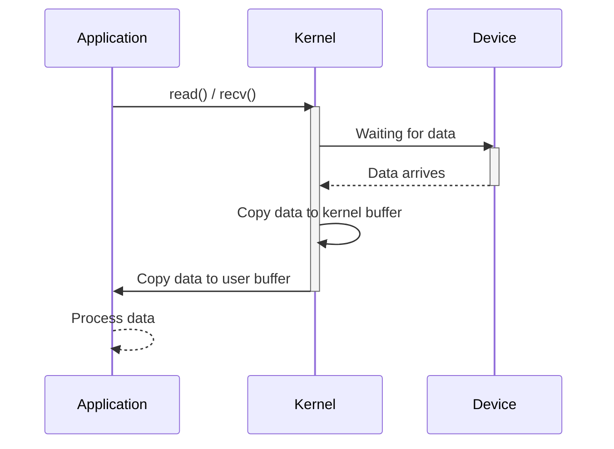
```mermaid
sequenceDiagram
    participant Application
    participant Kernel
    participant Device

    Application->>Kernel: read() / recv()
    activate Kernel
    Kernel->>Device: Waiting for data
    activate Device
    Device-->>Kernel: Data arrives
    deactivate Device
    Kernel->>Kernel: Copy data to kernel buffer
    Kernel->>Application: Copy data to user buffer
    deactivate Kernel
    Application-->>Application: Process data
```

#### 3.1.2 优缺点分析

**优点**：

- **简单直观**：编程模型简单，易于理解和实现。
- **同步处理**：代码执行顺序与 IO 操作顺序一致，方便调试和维护。

**缺点**：

- **资源浪费**：在等待 IO 完成期间，进程/线程会被阻塞，无法执行其他任务，导致 CPU 资源浪费。
- **并发能力差**：难以处理高并发场景，因为每个连接都需要一个独立的线程/进程来处理，而线程/进程的创建和切换开销较大。

#### 3.1.3 适用场景

阻塞式 IO 适用于以下场景：

- **低并发**：并发连接数较少，每个连接的处理时间较短。
- **简单应用**：对性能要求不高，开发效率优先。
- **资源充足**：服务器资源充足，可以为每个连接分配独立的线程/进程。

伪代码：

```python
def handle_connection(socket):
    """
    处理单个连接的请求 (阻塞式IO)
    """
    while True:
        data = socket.recv(1024) # 阻塞，直到接收到数据
        if not data:
            break # 连接关闭
        process_data(data) # 处理接收到的数据
    socket.close()

def main():
    server_socket = create_server_socket()
    while True:
        client_socket, address = server_socket.accept() # 阻塞，直到有新的连接
        # 为每个连接创建一个新的线程/进程
        create_thread(handle_connection, client_socket)
```

### 3.2 非阻塞式 IO

非阻塞式 IO（Non-blocking IO，NIO）允许应用程序在 IO 操作未完成时继续执行其他任务，而不会被阻塞。应用程序可以多次尝试执行 IO 操作，直到数据准备好或者发生错误。

#### 3.2.1 工作原理

1. **发起 IO 请求**：应用程序调用 `read()` 或 `recv()` 等系统调用，向操作系统发起 IO 请求。
2. **立即返回**：如果内核缓冲区中没有数据，或者数据不完整，内核**不会**阻塞进程/线程，而是立即返回一个错误码（例如 `EAGAIN` 或 `EWOULDBLOCK`）。
3. **轮询**：应用程序需要不断地轮询（polling）内核，检查 IO 操作是否已经完成。
4. **数据准备与拷贝**：当数据准备好后，内核将数据从内核缓冲区复制到应用程序的缓冲区。
5. **完成 IO**：应用程序再次调用 `read()` 或 `recv()` 等系统调用，成功读取数据。

可以用下面的时序图来描述这个过程：

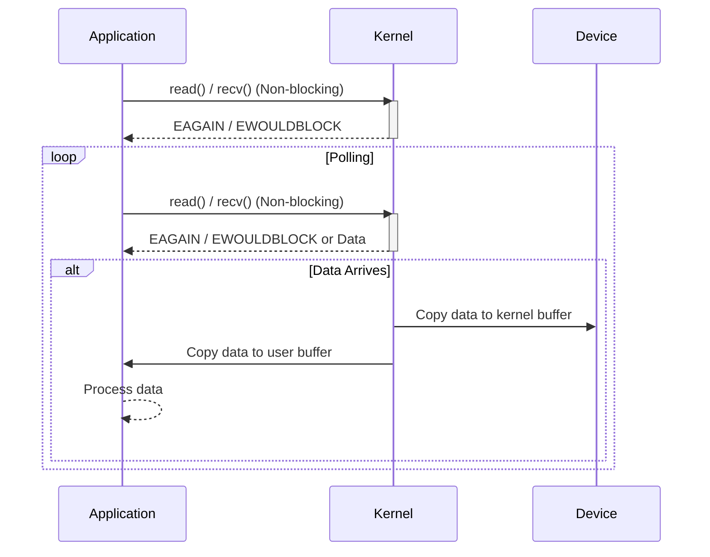
```mermaid
sequenceDiagram
    participant Application
    participant Kernel
    participant Device

    Application->>Kernel: read() / recv() (Non-blocking)
    activate Kernel
    Kernel-->>Application: EAGAIN / EWOULDBLOCK
    deactivate Kernel
    loop Polling
        Application->>Kernel: read() / recv() (Non-blocking)
        activate Kernel
        Kernel-->>Application: EAGAIN / EWOULDBLOCK or Data
        deactivate Kernel
        alt Data Arrives
            Kernel->>Device: Copy data to kernel buffer
            Kernel->>Application: Copy data to user buffer
            Application-->>Application: Process data
        end
    end
```

#### 3.2.2 轮询机制

轮询是实现非阻塞式 IO 的关键。应用程序需要在一个循环中不断地调用 IO 操作，检查是否有数据可读或者可写。常见的轮询方式有：

- **忙轮询（Busy-waiting，忙等）**：应用程序在一个循环中不断地调用 `read()` 或 `recv()`，直到返回有效数据。这种方式会消耗大量的 CPU 资源，因为应用程序会不停地向内核发起请求。
- **带有延迟的轮询**：应用程序在每次轮询之间增加一个短暂的延迟（例如，使用 `sleep()` 函数），以减少 CPU 占用。但这会增加 IO 操作的延迟。

伪代码如下：

```python
import time

def non_blocking_read(socket):
    """
    非阻塞读取数据
    """
    while True:
        try:
            data = socket.recv(1024) # 非阻塞
            if data:
                return data # 成功读取数据
            else:
                # 连接关闭
                return None
        except BlockingIOError:
            # 没有数据可读，稍后重试
            time.sleep(0.01) # 延迟 10ms
        except Exception as e:
            # 其他错误
            print(f"Error: {e}")
            return None

def handle_connection(socket):
    """
    处理单个连接的请求 (非阻塞式IO)
    """
    socket.setblocking(False) # 设置为非阻塞模式
    while True:
        data = non_blocking_read(socket)
        if data:
            process_data(data)
        elif data is None:
            break # 连接关闭或发生错误
    socket.close()

def main():
    server_socket = create_server_socket()
    server_socket.setblocking(False) # 设置为非阻塞模式
    while True:
        try:
            client_socket, address = server_socket.accept() # 非阻塞
            client_socket.setblocking(False) # 设置为非阻塞模式
            create_thread(handle_connection, client_socket)
        except BlockingIOError:
            # 没有新的连接，稍后重试
            time.sleep(0.01)
```

#### 3.2.3 优缺点分析

**优点**：

- **非阻塞**：应用程序可以在等待 IO 完成期间执行其他任务，提高了 CPU 利用率。
- **并发性**：可以同时处理多个连接，而无需为每个连接创建独立的线程/进程。

**缺点**：

- **复杂性**：编程模型复杂，需要处理 `EAGAIN` 等错误码，并实现轮询机制。
- **CPU 占用**：忙轮询会消耗大量的 CPU 资源。即使使用带有延迟的轮询，仍然会占用一定的 CPU 资源。
- **延迟**：轮询机制会引入一定的延迟，因为应用程序需要等待一段时间才能检测到数据已经准备好。

**总结**：

非阻塞式 IO 允许应用程序在等待 IO 完成期间执行其他任务，提高了 CPU 利用率和并发性。但是，它也增加了编程的复杂性，并可能导致 CPU 占用过高。在选择 IO 模型时，需要根据具体的应用场景和性能需求进行权衡。

### 3.3 同步 IO 与异步 IO

同步 IO 和异步 IO 是描述 IO 操作方式的两种重要模型。它们的区别在于：谁负责数据在内核缓冲区和用户缓冲区之间的拷贝。

#### 3.3.1 概念区分

- **同步 IO**：应用程序发起 IO 请求后，必须等待 IO 操作**实际完成**（数据从内核缓冲区复制到用户缓冲区）后才能继续执行。 也就是说，在数据拷贝期间，应用程序会被阻塞。 **阻塞式 IO 和 非阻塞式 IO 都是同步 IO**。
- **异步 IO**（AIO）：应用程序发起 IO 请求后，可以立即返回并继续执行其他任务。内核在后台完成 IO 操作（包括数据从外部设备到内核缓冲区，以及从内核缓冲区到用户缓冲区的**所有**数据拷贝），完成后会通知应用程序。也就是说，数据拷贝期间，应用程序不会被阻塞。

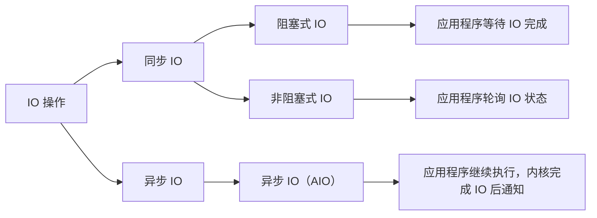
```mermaid
graph LR
    A[IO 操作] --> B[同步 IO]
    A --> C[异步 IO]
    
    B --> D[阻塞式 IO]
    B --> E[非阻塞式 IO]
    
    C --> F[异步 IO（AIO）]
    
    D --> G[应用程序等待 IO 完成]
    E --> H[应用程序轮询 IO 状态]
    F --> I[应用程序继续执行，内核完成 IO 后通知]
```

IO 多路复用（如 select、poll、epoll）经常被误认为是异步 IO，但它们实际上是同步 IO 模型。

非阻塞 IO 和异步 IO 最为显著的区别，就是 NIO 依赖轮询得到结果，而异步 IO 通过回调机制通知；此外，NIO 仅在数据没准备好时立刻返回，显然，当数据准备好时，NIO 仍然会同步地进行，而 AIO 总是立刻返回，IO 本身是异步的。

```c
// 使用epoll的示例
int epfd = epoll_create1(0);
struct epoll_event event, events[MAX_EVENTS];
int fd = socket(...);

// 设置为非阻塞
fcntl(fd, F_SETFL, fcntl(fd, F_GETFL, 0) | O_NONBLOCK);

// 注册fd到epoll
event.events = EPOLLIN;
event.data.fd = fd;
epoll_ctl(epfd, EPOLL_CTL_ADD, fd, &event);

while (1) {
    // 等待事件发生
    int nfds = epoll_wait(epfd, events, MAX_EVENTS, -1);
    
    for (int i = 0; i < nfds; i++) {
        if (events[i].data.fd == fd) {
            char buffer[1024];
            // 虽然知道fd已就绪，但read操作仍是同步的
            // 数据拷贝阶段仍会阻塞线程
            ssize_t n = read(fd, buffer, sizeof(buffer));
            process_data(buffer, n);
        }
    }
}
```

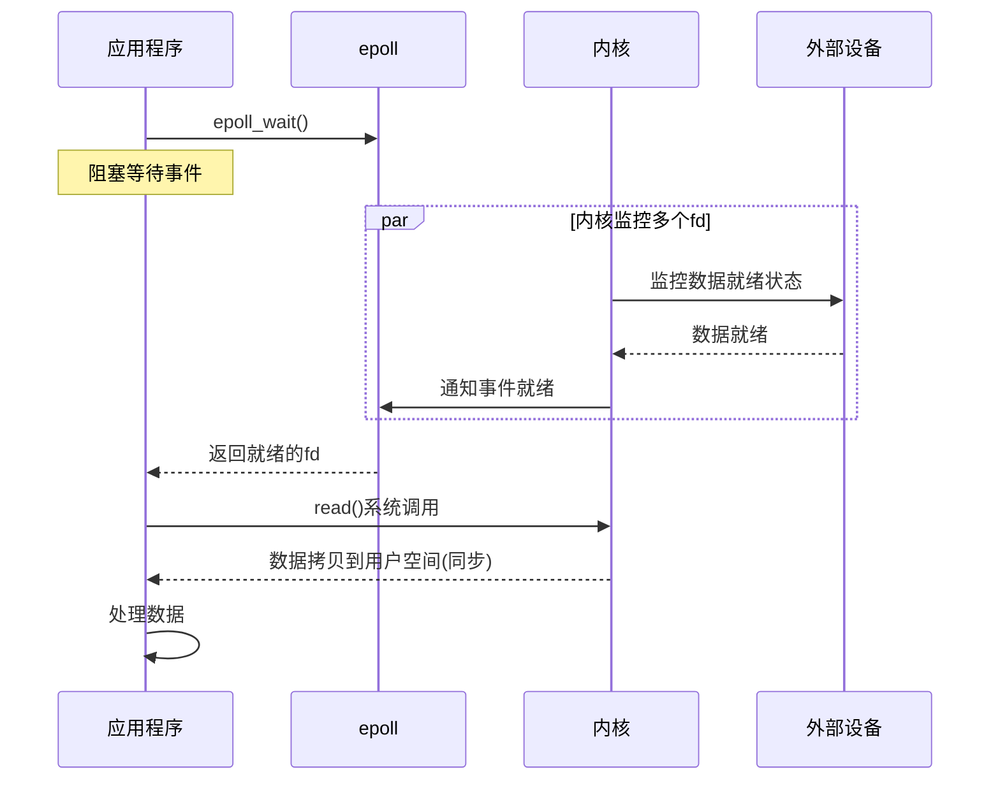
```mermaid
sequenceDiagram
    participant App as 应用程序
    participant Epoll as epoll
    participant Kernel as 内核
    participant Device as 外部设备
    
    App->>Epoll: epoll_wait()
    Note over App: 阻塞等待事件
    
    par 内核监控多个fd
        Kernel->>Device: 监控数据就绪状态
        Device-->>Kernel: 数据就绪
        Kernel->>Epoll: 通知事件就绪
    end
    
    Epoll-->>App: 返回就绪的fd
    App->>Kernel: read()系统调用
    Kernel-->>App: 数据拷贝到用户空间(同步)
    App->>App: 处理数据
```

关键区别：

- **IO 多路复用**：允许单线程监控多个文件描述符，但在数据拷贝阶段仍然是同步的（应用程序负责数据拷贝）
- **异步 IO**：内核负责完成所有 IO 操作（包括数据拷贝），然后通知应用程序

#### 3.3.2 POSIX 定义

POSIX（Portable Operating System Interface）标准对同步 IO 和异步 IO 进行了定义。

- **同步 IO**：导致请求线程阻塞的 IO 操作。
- **异步 IO**：不导致请求线程阻塞的 IO 操作。

POSIX 定义的关键在于：线程是否会被阻塞。如果线程在等待 IO 操作完成期间被阻塞，那么就是同步 IO。如果线程可以立即返回并继续执行其他任务，那么就是异步 IO。

#### 3.3.3 实现差异

同步 IO 和异步 IO 在实现上有很大的差异。

- **同步 IO**：通常使用 `read()`、`recv()`、`write()`、`send()` 等系统调用。应用程序需要自己处理数据的读取和写入，以及错误处理。
- **异步 IO**：通常使用 `aio_read()`、`aio_write()` 等系统调用（在 Linux 上）。应用程序需要注册一个回调函数，当 IO 操作完成后，内核会调用该回调函数通知应用程序。

| IO 模型     | CPU 使用 | 响应延迟 | 编程复杂度 | 适用场景       |
| --------- | ------ | ---- | ----- | ---------- |
| 阻塞式同步 IO  | 低      | 高    | 低     | 简单应用，连接数少  |
| 非阻塞式同步 IO | 高（轮询）  | 中    | 中     | 需要立即响应的场景  |
| IO 多路复用   | 中      | 中    | 高     | 高并发服务器     |
| 异步 IO     | 低      | 低    | 高     | 高吞吐量、低延迟系统 |

### 3.4 IO 模型比较

#### 3.4.1 五种 IO 模型对比

在 UNIX/Linux 系统中，常见的五种 IO 模型包括：阻塞式 IO、非阻塞式 IO、IO 多路复用、信号驱动 IO 和异步 IO。让我们深入比较这五种模型的工作原理和特点。

##### 阻塞式 IO (Blocking IO)

阻塞式 IO 是最传统的 IO 模型，应用程序发起系统调用后会被阻塞，直到操作完成。

伪代码：

```c
// 阻塞式IO示例
int fd = open("file.txt", O_RDONLY);
char buffer[1024];
ssize_t n = read(fd, buffer, sizeof(buffer)); // 线程在此阻塞直到读取完成
process_data(buffer, n);
```

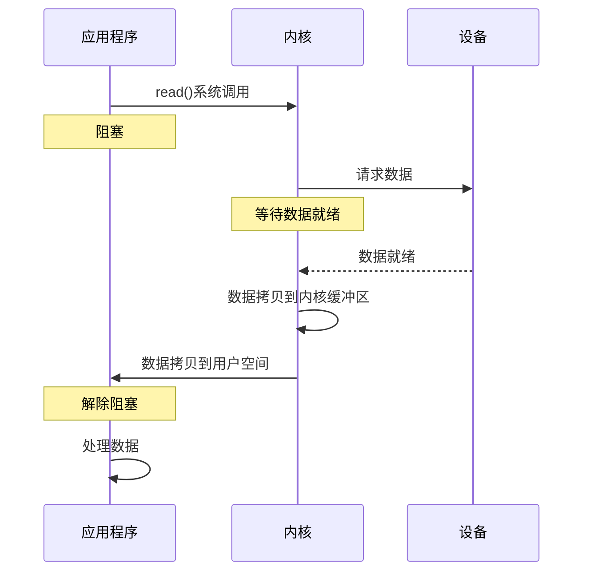
```mermaid
sequenceDiagram
    participant App as 应用程序
    participant Kernel as 内核
    participant Device as 设备
    
    App->>Kernel: read()系统调用
    Note over App: 阻塞
    Kernel->>Device: 请求数据
    Note over Kernel: 等待数据就绪
    Device-->>Kernel: 数据就绪
    Kernel->>Kernel: 数据拷贝到内核缓冲区
    Kernel->>App: 数据拷贝到用户空间
    Note over App: 解除阻塞
    App->>App: 处理数据
```

##### 非阻塞式 IO (Non-blocking IO)

非阻塞式 IO 允许应用程序发起系统调用后立即返回，通常需要应用程序轮询检查操作是否完成。

伪代码：

```c
// 非阻塞式IO示例
int fd = open("file.txt", O_RDONLY | O_NONBLOCK);
char buffer[1024];
ssize_t n;

do {
    n = read(fd, buffer, sizeof(buffer));
    if (n == -1 && (errno == EAGAIN || errno == EWOULDBLOCK)) {
        // 数据未就绪，可以执行其他任务
        do_something_else();
    }
} while (n == -1 && (errno == EAGAIN || errno == EWOULDBLOCK));

if (n > 0) {
    process_data(buffer, n);
}
```

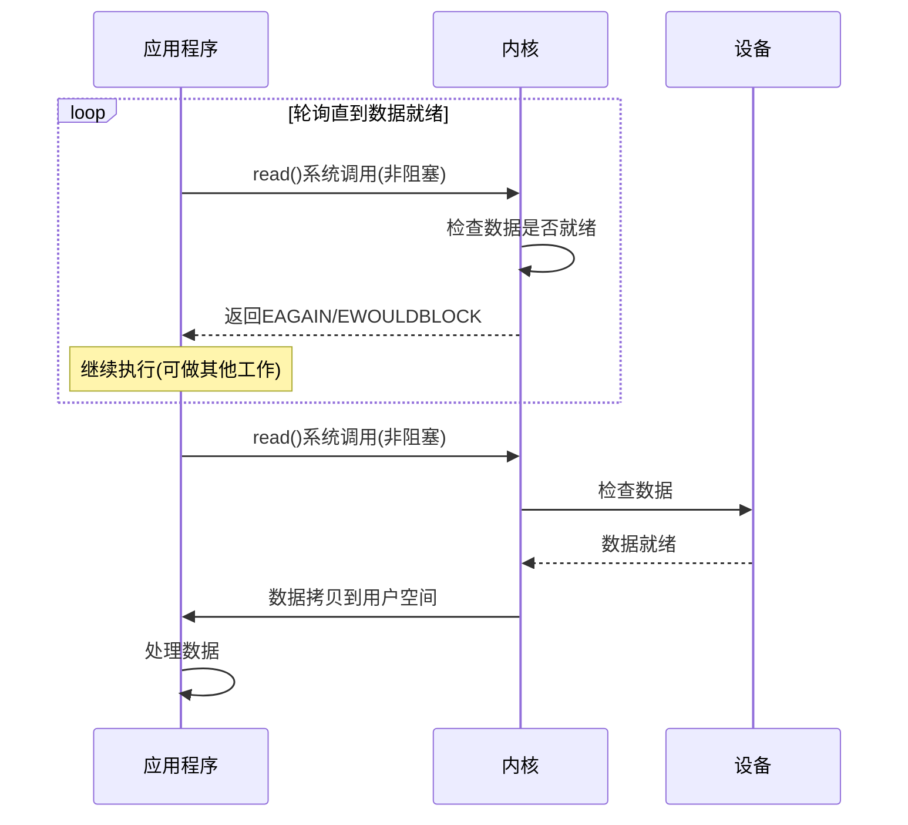
```mermaid
sequenceDiagram
    participant App as 应用程序
    participant Kernel as 内核
    participant Device as 设备
    
    loop 轮询直到数据就绪
        App->>Kernel: read()系统调用(非阻塞)
        Kernel->>Kernel: 检查数据是否就绪
        Kernel-->>App: 返回EAGAIN/EWOULDBLOCK
        Note over App: 继续执行(可做其他工作)
    end
    
    App->>Kernel: read()系统调用(非阻塞)
    Kernel->>Device: 检查数据
    Device-->>Kernel: 数据就绪
    Kernel->>App: 数据拷贝到用户空间
    App->>App: 处理数据
```

##### IO 多路复用 (IO Multiplexing)

IO 多路复用允许单个线程监控多个文件描述符，等待它们中的任何一个变为就绪状态。

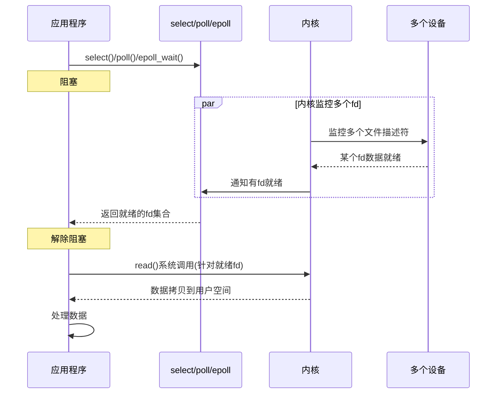
```mermaid
sequenceDiagram
    participant App as 应用程序
    participant Select as select/poll/epoll
    participant Kernel as 内核
    participant Devices as 多个设备
    
    App->>Select: select()/poll()/epoll_wait()
    Note over App: 阻塞
    
    par 内核监控多个fd
        Kernel->>Devices: 监控多个文件描述符
        Devices-->>Kernel: 某个fd数据就绪
        Kernel->>Select: 通知有fd就绪
    end
    
    Select-->>App: 返回就绪的fd集合
    Note over App: 解除阻塞
    
    App->>Kernel: read()系统调用(针对就绪fd)
    Kernel-->>App: 数据拷贝到用户空间
    App->>App: 处理数据
```

伪代码：

```c
// IO多路复用示例(使用select)
int fd1 = socket(...);
int fd2 = open("file.txt", O_RDONLY);
fd_set readfds;
char buffer[1024];

while (1) {
    FD_ZERO(&readfds);  // 清空 fd 集合
    FD_SET(fd1, &readfds);
    FD_SET(fd2, &readfds);
    
    // 阻塞等待任一fd就绪
    select(max(fd1, fd2) + 1, &readfds, NULL, NULL, NULL);
    
    if (FD_ISSET(fd1, &readfds)) {
        read(fd1, buffer, sizeof(buffer));
        process_network_data(buffer);
    }
    
    if (FD_ISSET(fd2, &readfds)) {
        read(fd2, buffer, sizeof(buffer));
        process_file_data(buffer);
    }
}
```

`select` 是一个 I/O 多路复用函数，用于监控多个文件描述符的状态。

- 参数说明：
    - `max(fd1, fd2) + 1`：`select` 需要监控的文件描述符的最大值加 1。
    - `&readfds`：监控读事件的文件描述符集合。
    - `NULL`：表示不监控写事件和异常事件。
    - `NULL`：表示不设置超时时间，`select` 会一直阻塞，直到至少有一个文件描述符就绪。

`select` 会阻塞，直到 `fd1` 或 `fd2` 中有数据可读。

- `FD_ISSET` 用于检查某个文件描述符是否在 `fd_set` 中处于就绪状态。
    - 如果 `fd1` 就绪，表示网络套接字有数据可读，调用 `read` 读取数据，并处理网络数据。
    - 如果 `fd2` 就绪，表示文件有数据可读，调用 `read` 读取数据，并处理文件数据。

##### 信号驱动 IO (Signal-Driven IO)

信号驱动 IO 使用信号通知应用程序 IO 事件的发生，应用程序可以在信号处理函数中处理 IO 操作。

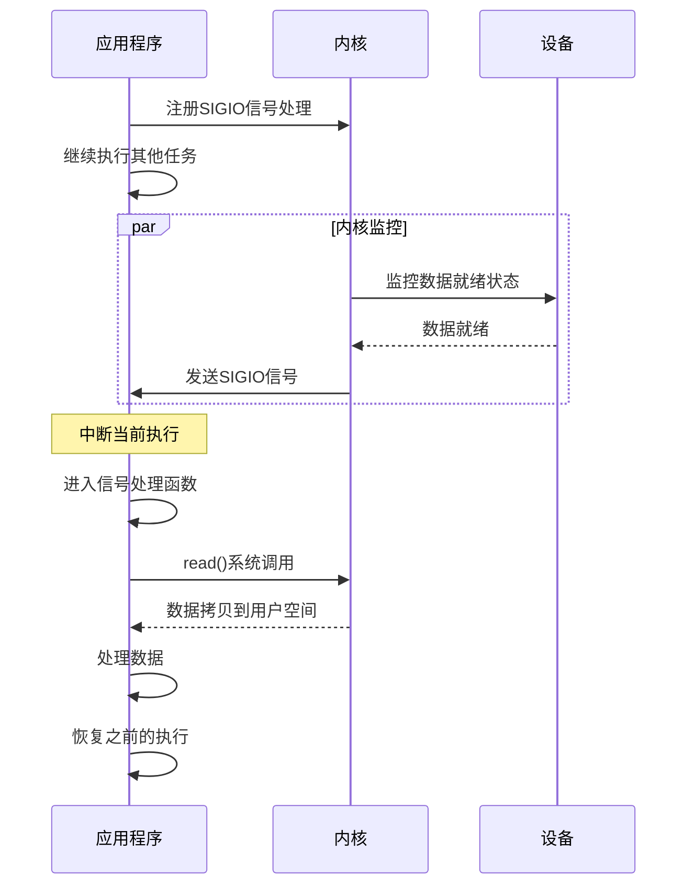
```mermaid
sequenceDiagram
    participant App as 应用程序
    participant Kernel as 内核
    participant Device as 设备
    
    App->>Kernel: 注册SIGIO信号处理
    App->>App: 继续执行其他任务
    
    par 内核监控
        Kernel->>Device: 监控数据就绪状态
        Device-->>Kernel: 数据就绪
        Kernel->>App: 发送SIGIO信号
    end
    
    Note over App: 中断当前执行
    App->>App: 进入信号处理函数
    App->>Kernel: read()系统调用
    Kernel-->>App: 数据拷贝到用户空间
    App->>App: 处理数据
    App->>App: 恢复之前的执行
```

伪代码：

```c
// 信号驱动IO示例
int fd;
void signal_handler(int signo) {
    char buffer[1024];
    read(fd, buffer, sizeof(buffer));
    process_data(buffer);
}

void setup_io() {
    fd = open("file.txt", O_RDONLY | O_NONBLOCK);

    // 设置信号处理函数
    signal(SIGIO, signal_handler);

    // 设置进程接收fd的信号
    fcntl(fd, F_SETOWN, getpid());

    // 设置fd为信号驱动IO
    int flags = fcntl(fd, F_GETFL);
    fcntl(fd, F_SETFL, flags | O_ASYNC);

    // 继续执行其他任务
    do_other_work();
}
```

- **机制**：
    - `SIGIO` 是基于信号的异步 I/O 机制。当文件描述符（fd）上有 I/O 事件（如数据可读或可写）时，内核会向进程发送 `SIGIO` 信号。
    - 进程需要注册一个信号处理函数来处理 `SIGIO` 信号，并在信号处理函数中执行 I/O 操作。
- **特点**：
    - 依赖于信号机制，信号处理函数的执行上下文是异步的，可能会打断主程序的执行。（相比之下，AIO 并不会）
    - 适用于文件描述符较少、I/O 事件不频繁的场景。
    - 只能监控文件描述符的读写事件，无法处理更复杂的 I/O 操作（如文件偏移量设置等）。
- **优点**：
    - 实现简单，适合轻量级的异步 I/O 需求。
- **缺点**：
    - 信号处理函数的执行上下文受限，不能调用某些不可重入的函数。
    - 信号可能会丢失或合并，导致事件处理不准确。
    - 不适合高并发或高性能的场景。

SIGIO 和 AIO 是很像的，但 SIGIO 更像是简化机制的一种 AIO。

对于 AIO 而言：

- **机制**：
    - `AIO` 是真正的异步 I/O 机制，允许进程发起 I/O 操作后立即返回，内核在 I/O 操作完成后通知进程。
    - 在 Linux 中，`AIO` 通过 `libaio` 库或系统调用（如 `io_submit`、`io_getevents`）实现。
- **特点**：
    - 不依赖于信号机制，而是通过回调函数或事件通知机制（如 `io_getevents`）来通知 I/O 完成。
    - 支持更复杂的 I/O 操作，如文件偏移量设置、分散/聚集 I/O（scatter/gather I/O）等。
    - 适用于高并发、高性能的场景，如数据库、文件服务器等。
- **优点**：
    - 真正的异步 I/O，不会打断主程序的执行。
    - 支持高并发，适合处理大量 I/O 操作。
- **缺点**：
    - 实现复杂，需要额外的库或系统调用支持。
    - 在某些系统上（如 Linux），`AIO` 的实现可能不够完善，存在性能或兼容性问题。

| 特性        | SIGIO             | AIO                |
| --------- | ----------------- | ------------------ |
| **机制**    | 基于信号              | 基于回调或事件通知          |
| **执行上下文** | 信号处理函数（异步）        | 主程序或回调函数（异步）       |
| **适用场景**  | 文件描述符较少、I/O 事件不频繁 | 高并发、高性能场景          |
| **复杂性**   | 简单                | 复杂                 |
| **支持的操作** | 读写事件              | 读写、偏移量设置、分散/聚集 I/O |
| **性能**    | 较低                | 较高                 |
| **可移植性**  | 较好                | 较差（依赖系统实现）         |

##### 异步 IO (Asynchronous IO)

异步 IO 是最完整的非阻塞模型，应用程序发起 IO 请求后立即返回，内核负责完成所有 IO 操作（包括数据拷贝），然后通知应用程序。

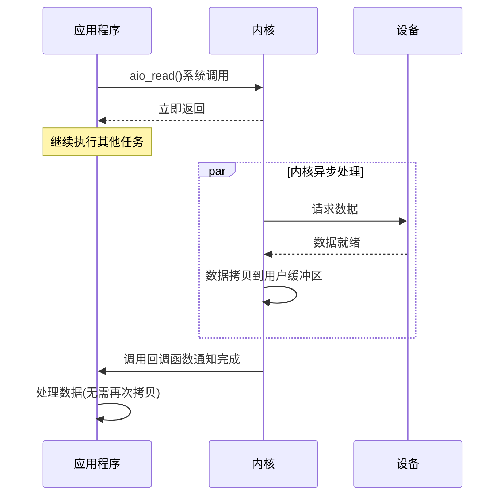
```mermaid
sequenceDiagram
    participant App as 应用程序
    participant Kernel as 内核
    participant Device as 设备
    
    App->>Kernel: aio_read()系统调用
    Kernel-->>App: 立即返回
    Note over App: 继续执行其他任务
    
    par 内核异步处理
        Kernel->>Device: 请求数据
        Device-->>Kernel: 数据就绪
        Kernel->>Kernel: 数据拷贝到用户缓冲区
    end
    
    Kernel->>App: 调用回调函数通知完成
    App->>App: 处理数据(无需再次拷贝)
```

伪代码：

```c
// 异步IO示例(使用POSIX AIO)
#include <aio.h>

void aio_completion_handler(sigval_t sigval) {
    struct aiocb *req = (struct aiocb *)sigval.sival_ptr;
    // 数据已在用户缓冲区中
    process_data((char*)req->aio_buf, req->aio_nbytes);
}

void start_async_io() {
    struct aiocb cb;
    char *buffer = malloc(1024);
    
    memset(&cb, 0, sizeof(struct aiocb));
    cb.aio_fildes = open("file.txt", O_RDONLY);
    cb.aio_buf = buffer;
    cb.aio_nbytes = 1024;
    cb.aio_sigevent.sigev_notify = SIGEV_THREAD;
    cb.aio_sigevent.sigev_notify_function = aio_completion_handler;
    cb.aio_sigevent.sigev_value.sival_ptr = &cb;
    
    // 发起异步读取请求
    aio_read(&cb);
    
    // 继续执行其他任务
    do_other_work();
}
```

- `sigev_notify`：设置通知方式为 `SIGEV_THREAD`，表示异步 I/O 完成后会创建一个新线程来执行回调函数。
- `sigev_notify_function`：指定回调函数为 `aio_completion_handler`。
- `sigev_value.sival_ptr`：将 `struct aiocb` 的指针传递给回调函数。

#### 3.4.2 性能特性

各种 IO 模型在不同场景下表现出不同的性能特性：

| IO 模型   | CPU 使用率 | 响应延迟 | 吞吐量 | 可扩展性 | 资源消耗 |
| ------- | ------- | ---- | --- | ---- | ---- |
| 阻塞式 IO  | 低       | 高    | 低   | 差    | 低    |
| 非阻塞式 IO | 高 (轮询)   | 中    | 中   | 中    | 中    |
| IO 多路复用 | 中       | 中    | 高   | 好    | 中    |
| 信号驱动 IO | 低       | 中    | 中   | 中    | 中    |
| 异步 IO   | 低       | 低    | 高   | 极好   | 高    |

适用场景分析：

- **阻塞式 IO**：适用于连接数少、逻辑简单的应用，如简单的命令行工具
- **非阻塞式 IO**：适用于需要立即响应但连接数不多的场景
- **IO 多路复用**：适用于高并发服务器，如 Web 服务器、代理服务器
- **信号驱动 IO**：适用于对实时性要求较高的应用，如实时数据处理系统
- **异步 IO**：适用于高吞吐量、低延迟要求的系统，如数据库服务器、高性能网络库

#### 3.4.4 现代高性能系统的选择

现代高性能系统通常采用混合 IO 模型，结合各种模型的优点：

1. **主事件循环 + IO 多路复用**：使用 epoll/kqueue 等高效多路复用机制处理大量连接
2. **线程池 + 阻塞式 IO**：对于耗时操作，分发到工作线程池中使用阻塞式 IO 处理
3. **有限使用异步 IO**：在特定场景（如磁盘 IO）使用异步 IO 提高性能
4. **框架抽象**：使用高级框架（如 Netty、libuv、Boost.Asio）隐藏底层 IO 模型复杂性

## 4. IO 多路复用基本原理

### 4.1 核心思想：单线程管理多连接

传统的 IO 模型中，每个连接都需要一个独立的线程来处理。当连接数量非常大时，会创建大量的线程，导致系统资源消耗巨大，线程切换开销高昂。IO 多路复用技术通过**单个线程**来同时**监听多个连接**的 IO 事件，从而避免了大量线程的创建和切换，极大地提高了系统的并发处理能力。

可以将其理解为：一个餐厅服务员（线程）同时负责多张餐桌（连接）的顾客需求。服务员不需要一直等待某个顾客点餐，而是轮流查看每张桌子，一旦有顾客需要服务（IO 事件就绪），就立刻处理。

#### 4.1.1 事件驱动模型

IO 多路复用基于**事件驱动模型**。当一个连接上有数据可读、可写或者发生错误等事件时，操作系统会通知应用程序。应用程序根据事件类型，执行相应的处理逻辑。

事件驱动模型的核心在于：

1. **事件注册**：应用程序将需要监听的连接（文件描述符）注册到 IO 多路复用器（如 select、poll、epoll）中。
2. **事件监听**：IO 多路复用器会一直监听所有注册的连接上的 IO 事件。
3. **事件通知**：当某个连接上发生 IO 事件时，IO 多路复用器会通知应用程序。
4. **事件处理**：应用程序根据事件类型，执行相应的读写操作。

#### 4.1.2 就绪通知机制

IO 多路复用的关键在于**就绪通知机制**。当一个连接上的 IO 事件就绪时，IO 多路复用器会返回一个**就绪文件描述符集合**，应用程序只需要遍历这个集合，就可以找到所有可以进行 IO 操作的连接。

常见的 IO 多路复用器包括：

- **select**：最早的 IO 多路复用器，支持监听的文件描述符数量有限（通常为 1024），且每次调用都需要遍历所有文件描述符。
- **poll**：改进了 select，取消了文件描述符数量的限制，但仍然需要遍历所有文件描述符。
- **epoll**：Linux 特有的 IO 多路复用器，基于事件通知机制，只有就绪的文件描述符才会通知应用程序，避免了遍历操作，效率最高。

### 4.2 事件类型

在 IO 多路复用中，应用程序需要关注不同类型的 IO 事件，以便及时响应并处理。常见的事件类型包括：

- **可读事件（Read Event）**：表示文件描述符（socket）上有数据可以读取，或者连接已经关闭（EOF）。
- **可写事件（Write Event）**：表示文件描述符（socket）可以写入数据，或者连接已经建立成功。
- **异常事件（Exception Event）**：表示文件描述符（socket）上发生了错误，例如连接中断、接收到带外数据等。

接下来，我们分别详细介绍这三种事件类型。

#### 4.2.1 可读事件（Read Event）

当一个文件描述符上发生可读事件时，意味着以下几种情况：

1. **有新的数据到达**：socket 的接收缓冲区中有新的数据可以读取。应用程序可以调用 `read()` 或 `recv()` 等函数来读取数据。
2. **连接被对方关闭（EOF）**：如果 socket 连接的对方关闭了连接，`read()` 或 `recv()` 函数会返回 0，表示读取到文件结束符（EOF）。
3. **连接被对方重置（RST）**：如果 socket 连接被对方重置，`read()` 或 `recv()` 函数会返回错误，例如 `ECONNRESET`。

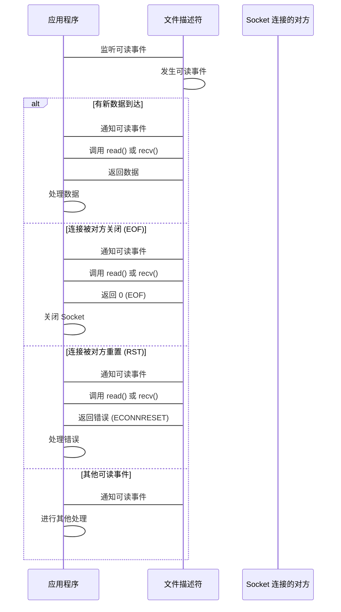
```mermaid
sequenceDiagram
    participant 应用程序
    participant 文件描述符
    participant Socket 连接的对方

    应用程序->文件描述符: 监听可读事件
    文件描述符->文件描述符: 发生可读事件
    alt 有新数据到达
        文件描述符->应用程序: 通知可读事件
        应用程序->文件描述符: 调用 read() 或 recv()
        文件描述符->应用程序: 返回数据
        应用程序->应用程序: 处理数据
    else 连接被对方关闭 (EOF)
        文件描述符->应用程序: 通知可读事件
        应用程序->文件描述符: 调用 read() 或 recv()
        文件描述符->应用程序: 返回 0 (EOF)
        应用程序->应用程序: 关闭 Socket
    else 连接被对方重置 (RST)
        文件描述符->应用程序: 通知可读事件
        应用程序->文件描述符: 调用 read() 或 recv()
        文件描述符->应用程序: 返回错误 (ECONNRESET)
        应用程序->应用程序: 处理错误
    else 其他可读事件
        文件描述符->应用程序: 通知可读事件
        应用程序->应用程序: 进行其他处理
    end
```

所谓 socket 连接被对方重置（RST），意味着连接突然中断，并且对方明确地发送了一个重置（RST）包来终止连接。这通常表示出现了错误或异常情况，导致连接无法继续维持。比如，应用程序接收到无法处理的意外数据，可能会发送 RST 包来终止连接。或者，如果连接的另一端的应用程序崩溃或意外退出，操作系统可能会发送 RST 包来通知对方连接已中断。

**处理可读事件的常见步骤：**

1. 调用 `read()` 或 `recv()` 函数读取数据。
2. 检查返回值：
    - 如果返回值大于 0，表示成功读取到数据，处理数据。
    - 如果返回值等于 0，表示连接被对方关闭，关闭 socket。
    - 如果返回值小于 0，表示发生错误，处理错误。

#### 4.2.2 可写事件（Write Event）

当一个文件描述符上发生可写事件时，意味着以下几种情况：

1. **socket 的发送缓冲区有空闲空间**：应用程序可以向 socket 写入数据。
2. **连接已经建立成功**：对于非阻塞 socket，当调用 `connect()` 函数建立连接时，如果连接建立成功，socket 会变为可写。

**需要注意的是：**

- socket 变为可写并不意味着一定可以写入任意数量的数据。如果发送缓冲区仍然很小，写入大量数据仍然可能导致阻塞。
- 通常情况下，我们不需要一直监听 socket 的可写事件。只有当 socket 的发送缓冲区已满，无法写入数据时，才需要监听可写事件，等待缓冲区有空闲空间后再写入数据。

**处理可写事件的常见步骤：**

1. 调用 `write()` 或 `send()` 函数写入数据。
2. 检查返回值：
    - 如果返回值大于 0，表示成功写入了部分或全部数据，更新已发送数据的偏移量。
    - 如果返回值小于 0，表示发生错误，处理错误（例如 `EAGAIN` 或 `EWOULDBLOCK`，表示缓冲区已满，稍后重试）。

#### 4.2.3 异常事件（Exception Event）

当一个文件描述符上发生异常事件时，表示发生了错误，例如：

1. **连接中断**：连接意外中断，例如网络故障、对方主机崩溃等。
2. **接收到带外数据（OOB Data）**：接收到紧急数据，需要优先处理。
3. **其他错误**：例如协议错误、校验错误等。

**处理异常事件的常见步骤：**

1. 调用 `getsockopt()` 函数获取错误信息。
2. 根据错误信息，采取相应的处理措施，例如关闭 socket、重新连接等。

- 多路复用器的基本组件
  - 事件收集
  - 事件分发
  - 回调处理

### 4.3 多路复用器的基本组件

多路复用（Multiplexing）是一种允许单个线程或进程同时监视多个文件描述符（File Descriptor，FD）的技术。它通过等待多个 FD 中的任何一个变为就绪状态（可读、可写或出错）来实现高效的 I/O 操作。多路复用器的核心组件包括事件收集、事件分发和回调处理。

#### 4.3.1 事件收集（Event Gathering）

事件收集是多路复用器的首要任务，它负责监视所有注册的文件描述符，并等待其中任何一个 FD 上的事件发生。这个过程通常由操作系统内核提供支持，例如 `select`、`poll` 和 `epoll` 等系统调用。

**原理**：

事件收集器维护一个文件描述符集合，并定期检查这些 FD 的状态。当一个或多个 FD 变为就绪状态时，事件收集器会将这些就绪事件报告给多路复用器。

**代码示例（伪代码）**：

```c
function 事件收集器(FD集合):
  while true:
    就绪FD集合 = 监听(FD集合)  // 阻塞等待，直到有FD就绪
    if 就绪FD集合不为空:
      返回 就绪FD集合
```

> IO 多路复用是阻塞 IO 这一点，也可以从 Event Gathering 的过程中看到，因为监听就绪 fd 的过程是阻塞的。

#### 4.3.2 事件分发（Event Dispatching）

事件分发器接收来自事件收集器的就绪事件，并根据事件类型（可读、可写或出错）将事件分发到相应的处理程序。

**原理**：

事件分发器维护一个事件类型与处理程序之间的映射关系。当收到一个就绪事件时，它会查找与该事件类型关联的处理程序，并将事件传递给该处理程序进行处理。

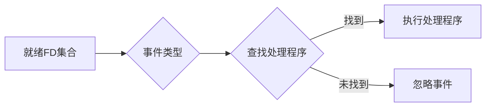
```mermaid
graph LR
    A[就绪FD集合] --> B{事件类型}
    B --> C{查找处理程序}
    C -- 找到 --> D[执行处理程序]
    C -- 未找到 --> E[忽略事件]
```

**代码示例**：

```python
class EventDispatcher:
    def __init__(self):
        self.handlers = {}  # 事件类型 -> 处理函数

    def register(self, event_type, handler):
        self.handlers[event_type] = handler

    def dispatch(self, fd, event_type):
        handler = self.handlers.get(event_type)
        if handler:
            handler(fd)
        else:
            print(f"No handler for event type: {event_type}")

# 示例用法
def read_handler(fd):
    print(f"处理可读事件，文件描述符: {fd}")

dispatcher = EventDispatcher()
dispatcher.register("read", read_handler)

# 假设 fd1 发生了可读事件
dispatcher.dispatch(fd1, "read")
```

#### 4.3.3 回调处理（Callback Handling）

回调处理是事件处理的最终阶段。当事件分发器将事件传递给相应的处理程序时，处理程序会执行与该事件相关的操作。这些操作通常包括读取数据、写入数据或处理错误。

**原理**：

回调处理程序是预先注册的函数或方法，用于处理特定类型的事件。当事件发生时，多路复用器会调用相应的回调处理程序，并将事件数据传递给它。

代码示例：

```c
// 回调函数
void read_callback(int fd) {
    char buffer[1024];
    ssize_t bytes_read = read(fd, buffer, sizeof(buffer));
    if (bytes_read > 0) {
        printf("读取到数据: %.*s\n", (int)bytes_read, buffer);
    } else {
        printf("读取错误或连接关闭\n");
    }
}

// 假设有一个事件循环，当文件描述符可读时调用 read_callback
void event_loop(int fd) {
    // 简化示例：实际中需要使用 select, poll 或 epoll
    if (/* fd is readable */ 1) {
        read_callback(fd);
    }
}

int main() {
    int fd = 0; // 假设 fd 是一个有效的文件描述符
    event_loop(fd);
    return 0;
}
```

### 4.4 内核实现机制

IO 多路复用允许一个进程同时监听多个文件描述符（File Descriptor，FD），并在其中任何一个 FD 就绪时得到通知。这样，单个线程就可以处理多个 IO 事件，避免了为每个 IO 事件创建一个线程的开销。

#### 4.4.1 等待队列

**定义**：等待队列（Wait Queue）是内核中用于实现进程/线程同步的一种机制。当一个进程需要等待某个事件发生时，它会被放入一个等待队列中，并进入睡眠状态。

**结构**：等待队列通常由一个双向链表组成，每个节点代表一个等待中的进程/线程。节点中包含进程/线程的 task_struct 指针、等待条件等信息。

代码示例：

```c
struct wait_queue_node {
    struct task_struct *task;   // 等待的进程/线程
    int event;                  // 等待的事件
    struct wait_queue_node *next;
    struct wait_queue_node *prev;
};

struct wait_queue_head {
    spinlock_t lock;            // 自旋锁，用于保护队列
    struct wait_queue_node *head; // 队列头
};
```

**工作原理**：

1. 进程调用 `select/poll/epoll_wait` 等函数，注册需要监听的 FD。
2. 内核为每个 FD 创建一个等待队列，并将当前进程加入到这些队列中。
3. 进程进入睡眠状态，等待 IO 事件发生。

#### 4.4.2 唤醒机制

**定义**：当某个 FD 上的 IO 事件就绪时（例如，有数据可读、可写或发生错误），内核会唤醒等待在该 FD 对应的等待队列上的进程。

**实现方式**：

1. 当网卡收到数据或磁盘完成读写操作时，会触发一个硬件中断。
2. 中断处理程序会调用相应的驱动程序，驱动程序会找到与该 FD 关联的等待队列。
3. 驱动程序会遍历等待队列，唤醒等待在该队列上的进程。
4. 被唤醒的进程会从 `select/poll/epoll_wait` 等函数返回，并处理就绪的 IO 事件。

代码示例：

```c
// 唤醒等待队列上的所有进程
void wake_up_wait_queue(struct wait_queue_head *queue) {
    struct wait_queue_node *node;

    // 遍历等待队列
    for (node = queue->head; node != NULL; node = node->next) {
        // 唤醒进程
        wake_up_process(node->task);
    }
}

// 唤醒单个进程
void wake_up_process(struct task_struct *task) {
    // 设置进程状态为可运行
    task->state = TASK_RUNNING;

    // 将进程加入到运行队列
    add_to_runqueue(task);
}
```

#### 4.4.3 事件通知

**定义**：事件通知是指内核如何将 IO 事件就绪的信息通知给用户进程。不同的 IO 多路复用机制采用不同的事件通知方式。

**select/poll**：

- 内核会遍历所有被监听的 FD，检查是否有事件就绪。
- 如果某个 FD 就绪，内核会将该 FD 的信息写入用户空间，并返回就绪 FD 的数量。
- 用户进程需要遍历返回的 FD 集合，才能找到真正就绪的 FD。

**epoll**：

- 内核维护一个红黑树（Red-Black Tree）来管理被监听的 FD。
- 当某个 FD 就绪时，内核会将该 FD 对应的事件信息放入一个就绪队列（Ready List）中。
- `epoll_wait` 函数直接从就绪队列中返回事件信息，无需遍历所有 FD。

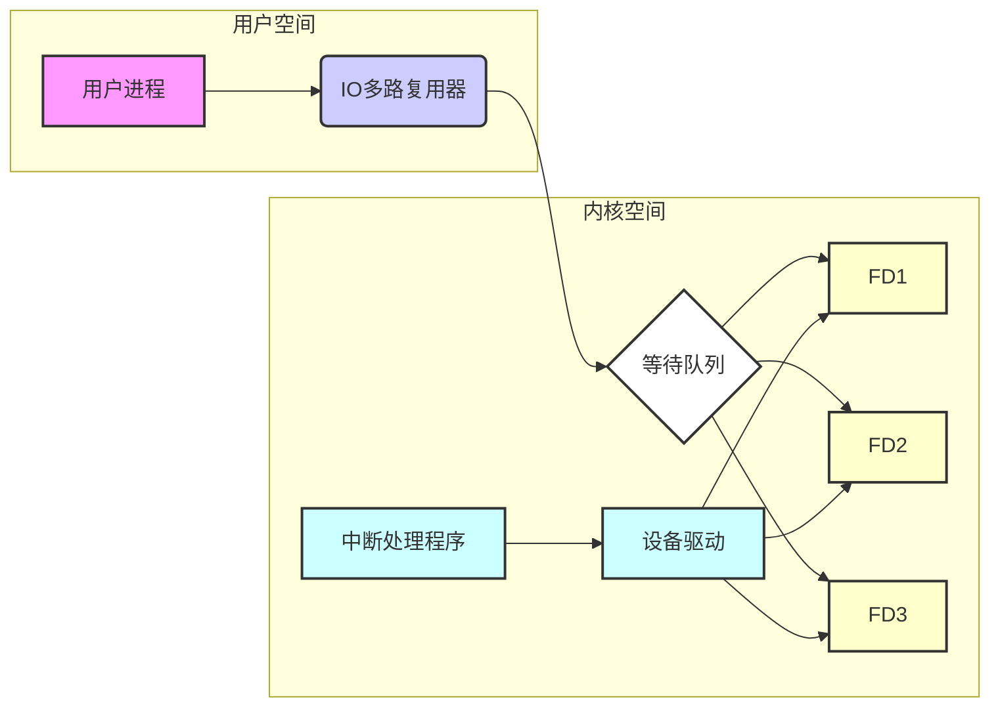
```mermaid
graph LR
subgraph 用户空间
    A[用户进程] --> B(IO多路复用器);
end

subgraph 内核空间
    B --> C{等待队列};
    C --> D[FD1];
    C --> E[FD2];
    C --> F[FD3];
    G[设备驱动] --> D;
    G --> E;
    G --> F;
    H[中断处理程序] --> G;
end

style A fill:#f9f,stroke:#333,stroke-width:2px
style B fill:#ccf,stroke:#333,stroke-width:2px
style D fill:#ffc,stroke:#333,stroke-width:2px
style E fill:#ffc,stroke:#333,stroke-width:2px
style F fill:#ffc,stroke:#333,stroke-width:2px
style G fill:#cff,stroke:#333,stroke-width:2px
style H fill:#cff,stroke:#333,stroke-width:2px

classDef box fill:#fff,stroke:#333,stroke-width:2px;
class C box;
```

**图示说明**：

- **用户空间**：用户进程通过 IO 多路复用器（如 `select`、`poll`、`epoll`）来监听多个文件描述符（FD）。
- **内核空间**：
    - IO 多路复用器内部维护一个等待队列，用于管理等待 IO 事件的 FD。
    - 每个 FD 关联一个设备驱动，负责处理实际的 IO 操作。
    - 当设备完成 IO 操作时，会触发中断，中断处理程序会通知设备驱动。
    - 设备驱动会唤醒等待队列中对应的进程。

**结构解释**：

1. **用户进程**：发起 IO 请求，并调用 IO 多路复用器进行监听。
2. **IO 多路复用器**：在内核中实现，负责管理等待队列和事件通知。
3. **等待队列**：存储等待 IO 事件的 FD，每个 FD 对应一个等待节点。
4. **文件描述符（FD）**：代表一个打开的文件、socket 或其他 IO 资源。
5. **设备驱动**：负责与硬件设备进行交互，处理实际的 IO 操作。
6. **中断处理程序**：响应硬件中断，通知设备驱动 IO 事件就绪。

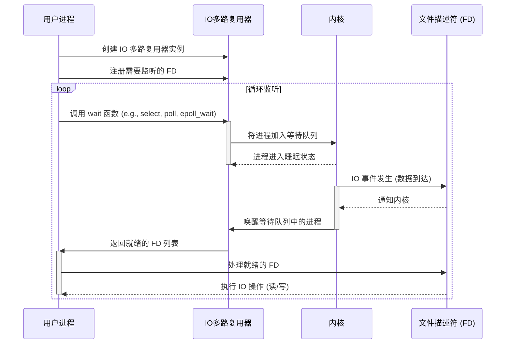
```mermaid
sequenceDiagram
    participant UserProcess as 用户进程
    participant Multiplexer as IO多路复用器
    participant Kernel as 内核
    participant FileDescriptor as 文件描述符 (FD)

    UserProcess->>Multiplexer: 创建 IO 多路复用器实例
    UserProcess->>Multiplexer: 注册需要监听的 FD
    loop 循环监听
        UserProcess->>Multiplexer: 调用 wait 函数 (e.g., select, poll, epoll_wait)
        activate Multiplexer
        Multiplexer->>Kernel: 将进程加入等待队列
        Kernel-->>Multiplexer: 进程进入睡眠状态
        deactivate Multiplexer

        Kernel->>FileDescriptor: IO 事件发生 (数据到达)
        activate Kernel
        FileDescriptor-->>Kernel: 通知内核
        Kernel->>Multiplexer: 唤醒等待队列中的进程
        deactivate Kernel

        Multiplexer->>UserProcess: 返回就绪的 FD 列表
        activate UserProcess
        UserProcess->>FileDescriptor: 处理就绪的 FD
        FileDescriptor-->>UserProcess: 执行 IO 操作 (读/写)
        deactivate UserProcess
    end
```

所谓「多路复用」的本质内含，可以从以下几个方面来理解：

1. **时间上的复用**：
    - **核心思想**：在单个线程或进程中，通过时间片轮转的方式，交替处理多个 IO 事件。
    - **具体表现**：一个线程/进程不是一直阻塞在一个 IO 操作上，而是可以先处理一部分 IO 事件，然后切换到其他 IO 事件，从而提高 CPU 的利用率。
    - **类比**：就像一个服务员同时服务多张桌子，他不会一直等待一张桌子的客人点完菜、吃完饭，而是会轮流询问每张桌子的客人，从而提高服务效率。
2. **IO 资源的复用**：
    - **核心思想**：通过一个或少量的线程/进程，管理多个 IO 连接（文件描述符）。
    - **具体表现**：不再为每个 IO 连接创建一个线程/进程，而是使用一个线程/进程同时监听多个 IO 连接的状态，并在有 IO 事件就绪时进行处理。
    - **类比**：就像一个交通枢纽，通过统一的管理和调度，使得多条道路可以共享同一个枢纽，从而提高交通效率。
3. **事件驱动**：
    - **核心思想**：程序不是主动轮询 IO 状态，而是等待 IO 事件的发生，然后根据事件类型进行处理。
    - **具体表现**：程序注册需要监听的 IO 事件，然后进入睡眠状态，当有 IO 事件就绪时，内核会唤醒程序，程序再根据事件类型进行相应的处理。
    - **类比**：就像一个消防系统，平时处于待命状态，只有当火灾发生时，才会触发警报并采取行动。

## 5. select 机制详解

### 5.1 历史背景与设计初衷

在早期的 Unix 系统中，每个进程处理一个连接是一种常见的做法。然而，这种方式在面对大量并发连接时效率低下，因为创建和管理大量进程会消耗大量的系统资源。为了解决这个问题，人们开始探索一种机制，允许一个进程同时监听多个文件描述符（sockets, files, pipes 等），并在其中任何一个文件描述符就绪时得到通知。这就是 I/O 多路复用技术的由来，而 `select` 就是其中一种早期的实现。

`select` 的设计初衷是提供一种简单、通用的方式，让一个进程能够监视多个文件描述符，而无需为每个连接创建一个独立的进程或线程。它允许程序在多个 I/O 操作之间进行复用，从而提高系统的并发处理能力。

### 5.2 API 详解

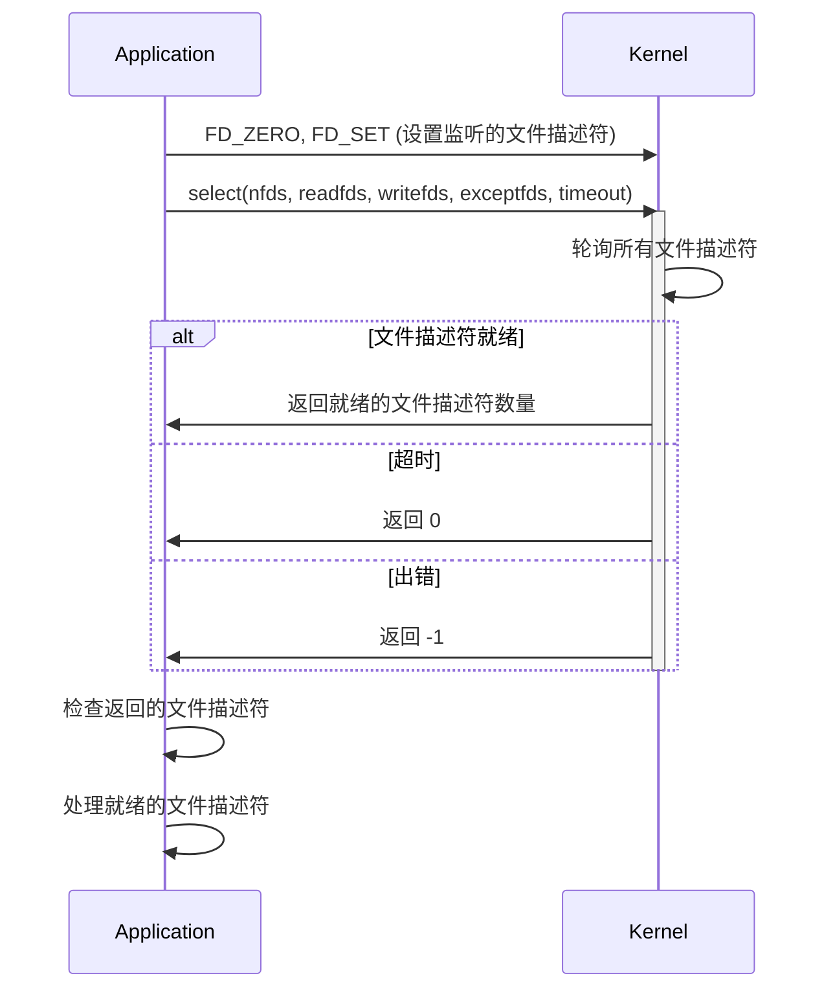
```mermaid
sequenceDiagram
    participant Application
    participant Kernel
    Application->>Kernel: FD_ZERO, FD_SET (设置监听的文件描述符)
    Application->>Kernel: select(nfds, readfds, writefds, exceptfds, timeout)
    activate Kernel
    Kernel->>Kernel: 轮询所有文件描述符
    alt 文件描述符就绪
        Kernel->>Application: 返回就绪的文件描述符数量
    else 超时
        Kernel->>Application: 返回 0
    else 出错
        Kernel->>Application: 返回 -1
    end
    deactivate Kernel
    Application->>Application: 检查返回的文件描述符
    Application->>Application: 处理就绪的文件描述符
```

#### 5.2.1 函数签名与参数

`select` 函数的签名如下：

```c
#include <sys/select.h>
#include <sys/time.h>

int select(int nfds, fd_set *readfds, fd_set *writefds,
           fd_set *exceptfds, struct timeval *timeout);
```

其中：

- **`nfds`**: 需要监视的文件描述符的最大值加 1。 `select` 会检查从 0 到 `nfds-1` 的所有文件描述符。
- **`readfds`**: 指向一个 `fd_set` 结构体的指针，该结构体包含了需要监视**可读性**的文件描述符集合。如果某个文件描述符在 `select` 返回时仍然存在于该集合中，则表示该文件描述符可以进行读取操作。
- **`writefds`**: 指向一个 `fd_set` 结构体的指针，该结构体包含了需要监视**可写性**的文件描述符集合。如果某个文件描述符在 `select` 返回时仍然存在于该集合中，则表示该文件描述符可以进行写入操作。
- **`exceptfds`**: 指向一个 `fd_set` 结构体的指针，该结构体包含了需要监视**异常条件**的文件描述符集合。通常用于监视带外数据（out-of-band data）等异常情况。
- **`timeout`**: 指向一个 `timeval` 结构体的指针，用于指定 `select` 函数的超时时间。如果 `timeout` 为 `NULL`，则 `select` 会一直阻塞，直到有文件描述符就绪。如果 `timeout` 的 `tv_sec` 和 `tv_usec` 都为 0，则 `select` 会立即返回，成为一个非阻塞的调用。

返回值：

- 成功：返回就绪的文件描述符的总数。
- 超时：返回 0。
- 出错：返回 -1，并设置 `errno` 变量。

#### 5.2.2 `fd_set` 数据结构

`fd_set` 是一个位掩码（bitmask），用于表示一组文件描述符的集合。它通常被实现为一个固定大小的数组，其中每个位代表一个文件描述符。

```c
typedef struct {
    /*
     * The following are opaque types.  XPG4.2 requires that
     * they be arrays of longs.  As such, we make them arrays of
     * `long' so that we don't have to worry about the size of
     * `fd_mask' changing between kernel and userland.
     */
    long fds_bits[__FD_SETSIZE / __NFDBITS];
} fd_set;
```

为了操作 `fd_set`，我们需要使用以下宏：

- **`FD_ZERO(fd_set *fdset)`**: 用于清空 `fdset` 中的所有位，将其初始化为一个空集合。
- **`FD_SET(int fd, fd_set *fdset)`**: 用于将文件描述符 `fd` 添加到 `fdset` 中。
- **`FD_CLR(int fd, fd_set *fdset)`**: 用于从 `fdset` 中移除文件描述符 `fd`。
- **`FD_ISSET(int fd, fd_set *fdset)`**: 用于检查文件描述符 `fd` 是否在 `fdset` 中。

#### 5.2.3 超时处理

`select` 函数的超时处理通过 `timeval` 结构体来实现。

```c
struct timeval {
    long tv_sec;   /* seconds */
    long tv_usec;  /* microseconds */
};
```

- **阻塞模式**: 如果 `timeout` 为 `NULL`，`select` 将一直阻塞，直到有文件描述符就绪或发生错误。
- **非阻塞模式**: 如果 `timeout` 的 `tv_sec` 和 `tv_usec` 都为 0，`select` 将立即返回，不会阻塞。
- **超时模式**: 如果 `timeout` 的 `tv_sec` 和 `tv_usec` 大于 0，`select` 将在指定的时间内阻塞，如果在超时时间内没有文件描述符就绪，`select` 将返回 0。

### 5.3 内核实现原理

`select` 系统调用的核心在于内核如何检查和管理文件描述符的状态，并最终将就绪的文件描述符返回给用户空间。

#### 5.3.1 遍历检查机制

当用户进程调用 `select` 时，内核会执行以下步骤：

1. **复制 `fd_set`**: 内核首先将用户空间传递进来的 `readfds`、`writefds` 和 `exceptfds` 复制到内核空间。这是因为内核不能直接访问用户空间的内存。
2. **遍历文件描述符**: 内核会遍历从 0 到 `nfds - 1` 的所有文件描述符，并检查它们的状态。对于每个文件描述符，内核会执行以下操作：
    - **检查是否在 `fd_set` 中**: 如果文件描述符不在相应的 `fd_set` 中（例如，不在 `readfds` 中），则跳过该文件描述符。
    - **检查是否就绪**: 如果文件描述符在 `fd_set` 中，内核会调用相应的文件系统或设备驱动程序提供的函数，以检查该文件描述符是否可读、可写或有异常情况发生。这个检查通常涉及到检查内核中的相关数据结构，例如 socket 的接收缓冲区是否为空或已满。
3. **阻塞或返回**:
    - **如果设置了超时时间**: 内核会设置一个定时器。如果在超时时间内，没有任何文件描述符就绪，`select` 将返回 0。
    - **如果没有设置超时时间**: `select` 将一直阻塞，直到有文件描述符就绪或发生错误。
4. **修改 `fd_set`**: 当一个或多个文件描述符就绪时，内核会修改内核空间中的 `fd_set`，只保留就绪的文件描述符。未就绪的文件描述符对应的位会被清除。
5. **复制回用户空间**: 内核将修改后的 `fd_set` 复制回用户空间。
6. **返回**: `select` 返回就绪的文件描述符的数量。

#### 5.3.2 数据结构限制

`select` 的内核实现受到以下数据结构的限制：

- **`fd_set` 的大小固定**: `fd_set` 通常是一个固定大小的位图，例如 1024 位。这意味着 `select` 最多只能监视 1024 个文件描述符。这个限制是由 `FD_SETSIZE` 宏定义的。
- **线性遍历**: 内核需要线性遍历所有文件描述符，以检查它们的状态。这意味着 `select` 的时间复杂度是 O(N)，其中 N 是文件描述符的数量。当 N 很大时，`select` 的性能会下降。
- **用户空间和内核空间之间的数据复制**: 每次调用 `select` 时，都需要将 `fd_set` 从用户空间复制到内核空间，并在 `select` 返回时将结果复制回用户空间。这种复制操作会带来额外的开销。

### 5.4 性能瓶颈分析

`select` 机制虽然简单易用，但在高并发、大规模 I/O 场景下，其性能瓶颈会变得非常明显。主要的问题包括时间复杂度、文件描述符上限以及重复初始化开销。

#### 5.4.1 O(n) 复杂度问题

`select` 的核心性能瓶颈在于其 O(n) 的时间复杂度。每次调用 `select` 时，内核都需要遍历所有被监视的文件描述符，以检查它们是否就绪。这意味着，随着监视的文件描述符数量的增加，`select` 的性能会线性下降。

- **遍历开销**: 即使只有少数几个文件描述符是活跃的，`select` 仍然需要遍历所有 `nfds` 个文件描述符。在高并发服务器中，这会导致大量的 CPU 时间浪费在无用的遍历上。
- **就绪事件比例**: 在实际应用中，通常只有一小部分连接是活跃的。这意味着 `select` 需要检查大量不活跃的连接，从而降低了整体效率。

**示例说明**

假设一个服务器需要同时处理 10000 个连接，但平均只有 100 个连接是活跃的。使用 `select` 时，每次调用都需要遍历 10000 个文件描述符，即使只有 100 个连接有数据可读或可写。这导致了大量的 CPU 时间浪费在检查不活跃的连接上。

#### 5.4.2 文件描述符上限

`select` 使用 `fd_set` 数据结构来表示文件描述符集合。`fd_set` 通常是一个固定大小的位图，其大小由 `FD_SETSIZE` 宏定义。在大多数 Unix 系统中，`FD_SETSIZE` 的默认值为 1024。这意味着 `select` 最多只能监视 1024 个文件描述符。

- **连接数量限制**: `select` 的文件描述符上限限制了服务器能够同时处理的连接数量。在高并发服务器中，1024 个连接的限制可能远远不够。
- **扩展性问题**: 即使系统资源充足，`select` 也无法利用更多的文件描述符来提高并发处理能力。这限制了服务器的扩展性。

**解决方法**

虽然可以通过重新编译内核或修改系统配置来增加 `FD_SETSIZE` 的值，但这并不是一个理想的解决方案。因为增加 `FD_SETSIZE` 会增加 `fd_set` 的大小，从而增加内存消耗和遍历开销。更合理的解决方案是使用更高级的 I/O 多路复用机制，例如 `poll` 和 `epoll`，它们没有文件描述符数量的限制。

#### 5.4.3 重复初始化开销

每次调用 `select` 时，都需要执行以下操作：

1. **清空 `fd_set`**: 使用 `FD_ZERO` 宏清空 `fd_set`。
2. **添加文件描述符**: 使用 `FD_SET` 宏将需要监视的文件描述符添加到 `fd_set` 中。
3. **复制 `fd_set`**: 将 `fd_set` 从用户空间复制到内核空间。
4. **复制 `fd_set`**: 将修改后的 `fd_set` 从内核空间复制回用户空间。

这些操作都需要消耗 CPU 时间和内存带宽。在高并发服务器中，频繁地调用 `select` 会导致大量的重复初始化开销。

- **CPU 消耗**: 频繁的 `FD_ZERO` 和 `FD_SET` 操作会消耗大量的 CPU 时间。
- **内存带宽消耗**: 用户空间和内核空间之间的数据复制会消耗大量的内存带宽。

**优化策略**

虽然无法完全避免重复初始化开销，但可以通过一些策略来减少其影响：

- **减少 `select` 调用频率**: 可以通过合理设置超时时间来减少 `select` 的调用频率。
- **使用更高效的 I/O 多路复用机制**: `poll` 和 `epoll` 等机制可以避免重复初始化开销。

## 6. poll 机制详解

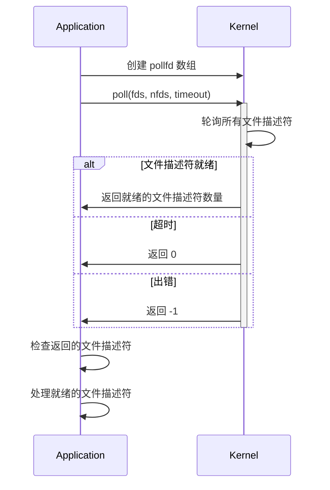
```mermaid
sequenceDiagram
    participant Application
    participant Kernel
    Application->>Kernel: 创建 pollfd 数组
    Application->>Kernel: poll(fds, nfds, timeout)
    activate Kernel
    Kernel->>Kernel: 轮询所有文件描述符
    alt 文件描述符就绪
        Kernel->>Application: 返回就绪的文件描述符数量
    else 超时
        Kernel->>Application: 返回 0
    else 出错
        Kernel->>Application: 返回 -1
    end
    deactivate Kernel
    Application->>Application: 检查返回的文件描述符
    Application->>Application: 处理就绪的文件描述符
```

### 6.1 设计改进点

`poll` 机制是对 `select` 机制的一种改进，它主要解决了 `select` 的以下几个问题：

1. **取消了文件描述符数量的限制**：`poll` 使用 `pollfd` 结构体数组来管理文件描述符，而不是像 `select` 那样使用固定大小的 `fd_set`。这意味着 `poll` 可以监视的文件描述符数量只受系统内存的限制，而不再受 `FD_SETSIZE` 的限制。
2. **避免了线性遍历的开销**：虽然 `poll` 在实现上仍然需要遍历文件描述符，但它将文件描述符和事件标志分离开来，使得内核可以更高效地管理和检查文件描述符的状态。
3. **简化了 API**：`poll` 的 API 更加简洁，只需要一个 `pollfd` 数组作为输入，而不需要像 `select` 那样需要三个 `fd_set` 结构体。

总的来说，`poll` 的设计目标是提供一种更灵活、更高效的 I/O 多路复用机制，以克服 `select` 的缺点。

### 6.2 API 详解

`poll` 函数的签名如下：

```c
#include <poll.h>

int poll(struct pollfd *fds, nfds_t nfds, int timeout);
```

- **`fds`**: 指向一个 `pollfd` 结构体数组的指针，该数组包含了需要监视的文件描述符和事件。
- **`nfds`**: `fds` 数组中元素的数量。
- **`timeout`**: 指定 `poll` 函数的超时时间，单位是毫秒。如果 `timeout` 为 -1，则 `poll` 会一直阻塞，直到有文件描述符就绪。如果 `timeout` 为 0，则 `poll` 会立即返回，成为一个非阻塞的调用。

返回值：

- 成功：返回就绪的文件描述符的总数。
- 超时：返回 0。
- 出错：返回 -1，并设置 `errno` 变量。

#### 6.2.1 pollfd 结构体

`pollfd` 结构体用于描述一个需要监视的文件描述符和事件。其定义如下：

```c
struct pollfd {
    int   fd;         /* 文件描述符 */
    short events;     /* 注册的事件 */
    short revents;    /* 实际发生的事件 */
};
```

- **`fd`**: 需要监视的文件描述符。如果 `fd` 的值为负数，则 `poll` 会忽略该 `pollfd` 结构体。
- **`events`**: 一个位掩码，用于指定需要监视的事件。
- **`revents`**: 一个位掩码，由内核设置，用于指示实际发生的事件。

#### 6.2.2 事件标志

`events` 和 `revents` 字段使用以下事件标志：

- **`POLLIN`**: 有数据可读。
- **`POLLPRI`**: 有紧急数据可读（例如，带外数据）。
- **`POLLOUT`**: 可以写入数据。
- **`POLLERR`**: 发生错误。
- **`POLLHUP`**: 连接断开。
- **`POLLNVAL`**: 文件描述符无效。

### 6.3 内核实现原理

`poll` 系统调用的内核实现与 `select` 有一些关键的区别，主要体现在数据结构和文件描述符管理上。

#### 6.3.1 链表结构

在内核中，`poll` 通常使用链表或其他动态数据结构来管理需要监视的文件描述符。每个 `pollfd` 结构体都包含文件描述符和事件标志，内核会将这些结构体组织成一个链表。

- **动态管理**: 使用链表可以动态地添加和删除文件描述符，而不需要像 `select` 那样预先分配固定大小的 `fd_set`。
- **灵活扩展**: 链表的长度可以根据需要动态调整，从而支持监视大量的文件描述符。

#### 6.3.2 无描述符上限

由于 `poll` 使用链表来管理文件描述符，因此它没有像 `select` 那样受到 `FD_SETSIZE` 的限制。`poll` 可以监视的文件描述符数量只受系统内存的限制。

- **突破限制**: `poll` 突破了 `select` 的文件描述符数量上限，使得服务器可以同时处理更多的连接。
- **资源消耗**: 虽然 `poll` 没有文件描述符数量的硬性限制，但监视大量的文件描述符仍然会消耗大量的系统资源，包括内存和 CPU 时间。

**内核实现流程**

1. **复制 `pollfd` 数组**: 内核首先将用户空间传递进来的 `pollfd` 数组复制到内核空间。
2. **创建链表**: 内核根据 `pollfd` 数组创建一个链表，每个节点包含一个文件描述符和事件标志。
3. **注册事件**: 内核将链表中的每个文件描述符注册到相应的设备驱动程序或文件系统中，以便在文件描述符就绪时得到通知。
4. **阻塞或返回**:
    - **如果设置了超时时间**: 内核会设置一个定时器。如果在超时时间内，没有任何文件描述符就绪，`poll` 将返回 0。
    - **如果没有设置超时时间**: `poll` 将一直阻塞，直到有文件描述符就绪或发生错误。
5. **更新 `revents`**: 当一个或多个文件描述符就绪时，内核会更新内核空间中的 `pollfd` 结构体的 `revents` 字段，以指示实际发生的事件。
6. **复制回用户空间**: 内核将修改后的 `pollfd` 数组复制回用户空间。
7. **返回**: `poll` 返回就绪的文件描述符的数量。

### 6.4 与 select 的对比

#### 6.4.1 数据结构差异

`select` 和 `poll` 在数据结构上的主要差异在于文件描述符的管理方式：

- **`select`**: 使用固定大小的 `fd_set` 位图来管理文件描述符。
- **`poll`**: 使用动态链表或数组来管理 `pollfd` 结构体，每个 `pollfd` 结构体包含文件描述符和事件标志。

这种差异导致了 `select` 和 `poll` 在文件描述符数量限制、内存消耗和遍历效率上的不同。

#### 6.4.2 性能特性对比

|特性|`select`|`poll`|
|---|---|---|
|文件描述符数量限制|受 `FD_SETSIZE` 限制|无限制（受系统内存限制）|
|数据结构|`fd_set` 位图|`pollfd` 结构体数组或链表|
|遍历效率|O(n)，需要遍历所有文件描述符|O(n)，但可以更高效地管理事件标志|
|API 复杂度|复杂，需要三个 `fd_set` 结构体|简单，只需要一个 `pollfd` 数组|
|内存消耗|固定大小的 `fd_set`，可能浪费内存|动态分配内存，更节省内存|
|适用场景|文件描述符数量较少，且变化不频繁的场景|文件描述符数量较多，或变化频繁的场景|

总的来说，`poll` 在文件描述符数量、API 简洁性和内存消耗方面优于 `select`，但在遍历效率方面并没有本质的改进。

## 7. epoll 机制详解

`epoll` 是 Linux 系统特有的一种 I/O 多路复用机制，是 Linux 下效率最高的 I/O 通知机制。它通过在内核中维护一个事件表，避免了像 `select` 和 `poll` 那样每次调用都需要遍历所有文件描述符的开销。`epoll` 只会将就绪的文件描述符通知给用户空间，从而大大提高了 I/O 处理的效率。

### 7.1 Linux 特有的高性能方案

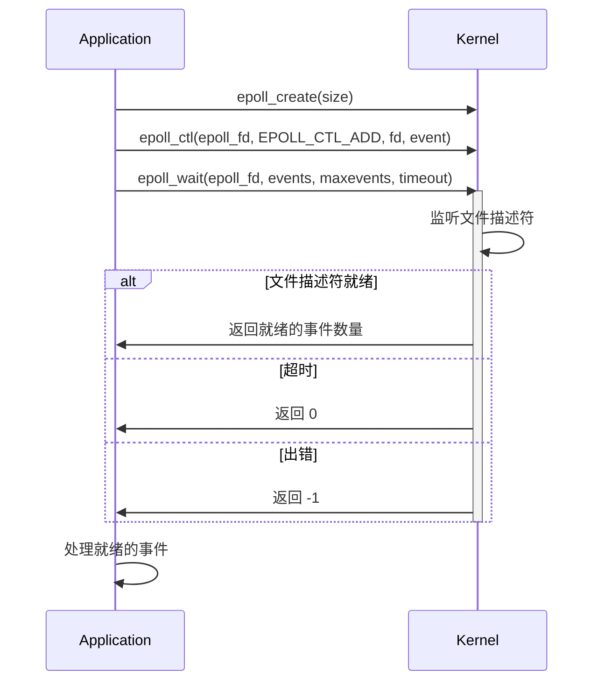
```mermaid
sequenceDiagram
    participant Application
    participant Kernel
    Application->>Kernel: epoll_create(size)
    Application->>Kernel: epoll_ctl(epoll_fd, EPOLL_CTL_ADD, fd, event)
    Application->>Kernel: epoll_wait(epoll_fd, events, maxevents, timeout)
    activate Kernel
    Kernel->>Kernel: 监听文件描述符
    alt 文件描述符就绪
        Kernel->>Application: 返回就绪的事件数量
    else 超时
        Kernel->>Application: 返回 0
    else 出错
        Kernel->>Application: 返回 -1
    end
    deactivate Kernel
    Application->>Application: 处理就绪的事件
```

`epoll` 的主要特点包括：

- **基于事件驱动**: `epoll` 采用事件驱动的方式，只有当文件描述符就绪时，才会将事件通知给用户空间。
- **内核事件表**: `epoll` 在内核中维护一个事件表，用于管理需要监视的文件描述符。
- **高效的查找**: `epoll` 使用红黑树等高效的数据结构来管理事件表，从而实现快速的查找和插入操作。
- **支持两种触发模式**: `epoll` 支持边缘触发（Edge Triggered，ET）和水平触发（Level Triggered，LT）两种触发模式。

`epoll` 的设计目标是提供一种高性能、可扩展的 I/O 多路复用机制，以满足高并发服务器的需求。

### 7.2 API 三部曲

`epoll` 的使用主要涉及三个 API 函数：`epoll_create`、`epoll_ctl` 和 `epoll_wait`。

#### 7.2.1 `epoll_create`

`epoll_create` 函数用于创建一个 epoll 实例，返回一个 epoll 文件描述符。

```c
#include <sys/epoll.h>

int epoll_create(int size);
```

- **`size`**: 指定 epoll 实例的大小。在 Linux 2.6.8 之前，`size` 参数用于指定 epoll 实例可以管理的最大的文件描述符数量。但从 Linux 2.6.8 开始，`size` 参数被忽略，只是作为给内核的一个建议值。
- **返回值**:
    - 成功：返回一个非负的 epoll 文件描述符。
    - 出错：返回 -1，并设置 `errno` 变量。

#### 7.2.2 `epoll_ctl`

`epoll_ctl` 函数用于控制 epoll 实例，可以添加、修改或删除需要监视的文件描述符。

```c
#include <sys/epoll.h>

int epoll_ctl(int epoll_fd, int op, int fd, struct epoll_event *event);
```

- **`epoll_fd`**: `epoll_create` 返回的 epoll 文件描述符。
- **`op`**: 指定要执行的操作，可以是以下值之一：
    - `EPOLL_CTL_ADD`: 将文件描述符 `fd` 添加到 epoll 实例中。
    - `EPOLL_CTL_MOD`: 修改文件描述符 `fd` 在 epoll 实例中的事件。
    - `EPOLL_CTL_DEL`: 从 epoll 实例中删除文件描述符 `fd`。
- **`fd`**: 需要操作的文件描述符。
- **`event`**: 指向一个 `epoll_event` 结构体的指针，用于指定需要监视的事件。

**`epoll_event` 结构体**

```c
struct epoll_event {
    uint32_t     events;    /* Epoll events */
    epoll_data_t data;      /* User data variable */
};
```

- **`events`**: 一个位掩码，用于指定需要监视的事件，可以是以下值之一或多个的组合：
    - `EPOLLIN`: 有数据可读。
    - `EPOLLOUT`: 可以写入数据。
    - `EPOLLRDHUP`: 连接断开，或者对端关闭了写操作。
    - `EPOLLPRI`: 有紧急数据可读。
    - `EPOLLERR`: 发生错误。
    - `EPOLLHUP`: 连接断开。
    - `EPOLLET`: 边缘触发模式。
    - `EPOLLONESHOT`: 只触发一次事件。
- **`data`**: 一个联合体，用于存储用户数据，可以是以下类型之一：

```c
typedef union epoll_data {
    void    *ptr;
    int      fd;
    uint32_t u32;
    uint64_t u64;
} epoll_data_t;
```

通常，我们会将文件描述符 `fd` 存储在 `data.fd` 中，以便在事件发生时快速找到对应的文件描述符。

#### 7.2.3 `epoll_wait`

`epoll_wait` 函数用于等待 epoll 实例上的事件发生。

```c
#include <sys/epoll.h>

int epoll_wait(int epoll_fd, struct epoll_event *events,
               int maxevents, int timeout);
```

- **`epoll_fd`**: `epoll_create` 返回的 epoll 文件描述符。
- **`events`**: 指向一个 `epoll_event` 结构体数组的指针，用于存储就绪的事件。
- **`maxevents`**: 指定 `events` 数组的最大长度。
- **`timeout`**: 指定 `epoll_wait` 函数的超时时间，单位是毫秒。如果 `timeout` 为 -1，则 `epoll_wait` 会一直阻塞，直到有事件发生。如果 `timeout` 为 0，则 `epoll_wait` 会立即返回，成为一个非阻塞的调用。
- **返回值**:
    - 成功：返回就绪的事件的数量。
    - 超时：返回 0。
    - 出错：返回 -1，并设置 `errno` 变量。

**伪代码描述**

```python
// 创建 epoll 实例
epoll_fd = epoll_create(1024)

// 添加需要监视的文件描述符
for each fd in file_descriptors:
    event.events = EPOLLIN // 例如，监听可读事件
    event.data.fd = fd
    epoll_ctl(epoll_fd, EPOLL_CTL_ADD, fd, &event)

while (true):
    // 等待事件发生
    num_events = epoll_wait(epoll_fd, events, MAX_EVENTS, -1)

    // 处理事件
    for i from 0 to num_events - 1:
        fd = events[i].data.fd
        if (events[i].events & EPOLLIN):
            // 读取数据
            read(fd, buffer)
            // 处理数据
```

### 7.3 内核数据结构

`epoll` 的高性能很大程度上归功于其高效的内核数据结构。`epoll` 在内核中主要使用两种数据结构来管理文件描述符和事件：红黑树和就绪链表。

#### 7.3.1 红黑树与就绪链表

- **红黑树 (Red-Black Tree)**：用于存储所有需要监视的文件描述符。红黑树是一种自平衡的二叉搜索树，可以保证在最坏情况下，查找、插入和删除操作的时间复杂度为 O(log n)，其中 n 是文件描述符的数量。
    - **高效查找**: 红黑树可以快速地查找指定的文件描述符，以便进行添加、修改或删除操作。
    - **有序存储**: 红黑树可以按照文件描述符的大小顺序存储节点，方便内核进行管理。
- **就绪链表 (Ready List)**：用于存储已经就绪的文件描述符。当文件描述符上的事件发生时，内核会将该文件描述符添加到就绪链表中。
    - **快速通知**: `epoll_wait` 函数只需要检查就绪链表，就可以快速地获取就绪的文件描述符，而不需要遍历所有文件描述符。
    - **避免重复通知**: 就绪链表可以避免重复通知同一个文件描述符，只有当文件描述符上的事件发生变化时，才会将其添加到就绪链表中。

#### 7.3.2 事件结构体

在内核中，每个文件描述符都关联一个事件结构体，用于存储该文件描述符上的事件信息。事件结构体通常包含以下字段：

- **文件描述符 (File Descriptor)**：需要监视的文件描述符。
- **事件类型 (Event Type)**：需要监视的事件类型，例如 `EPOLLIN`、`EPOLLOUT` 等。
- **回调函数 (Callback Function)**：当事件发生时，内核需要调用的回调函数。
- **用户数据 (User Data)**：用户自定义的数据，可以在回调函数中使用。

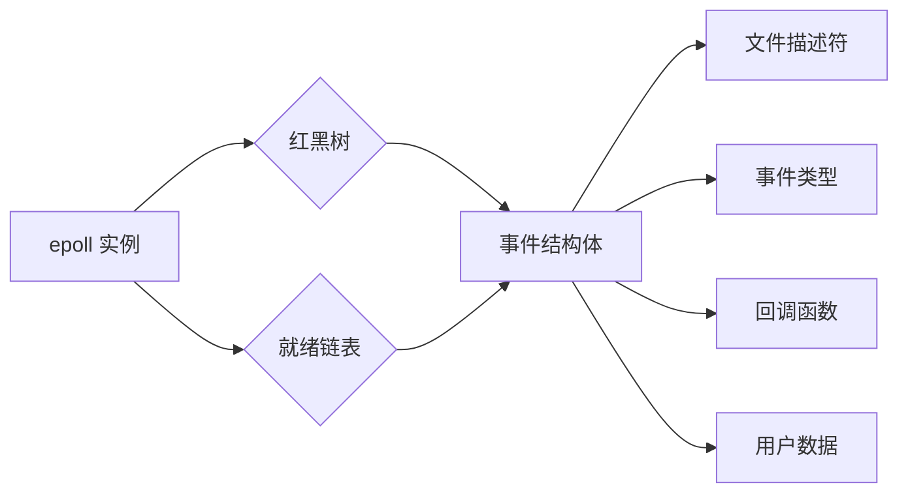
```mermaid
graph LR
    A[epoll 实例] --> B{红黑树};
    A --> C{就绪链表};
    B --> D[事件结构体];
    C --> D;
    D --> E[文件描述符];
    D --> F[事件类型];
    D --> G[回调函数];
    D --> H[用户数据];
```

### 7.4 两种工作模式

`epoll` 支持两种工作模式：水平触发（Level Triggered，LT）和边缘触发（Edge Triggered，ET）。

#### 7.4.1 水平触发 (LT)

- **定义**: 只要文件描述符上的事件满足条件，就一直触发通知。也就是说，只要文件描述符可读或可写，`epoll_wait` 就会一直返回该文件描述符。
- **特点**:
    - **简单易用**: LT 模式是默认模式，使用起来比较简单，不容易出错。
    - **可靠性高**: LT 模式可以保证所有事件都被处理，即使应用程序没有及时处理事件，也不会丢失事件。
    - **效率较低**: LT 模式可能会导致重复通知，降低 I/O 处理的效率。

#### 7.4.2 边缘触发 (ET)

- **定义**: 只有当文件描述符上的事件状态发生改变时，才会触发通知。也就是说，只有当文件描述符从不可读变为可读，或者从不可写变为可写时，`epoll_wait` 才会返回该文件描述符。
- **特点**:
    - **效率高**: ET 模式可以避免重复通知，提高 I/O 处理的效率。
    - **复杂性高**: ET 模式使用起来比较复杂，容易出错。
    - **需要非阻塞 I/O**: 在使用 ET 模式时，必须将文件描述符设置为非阻塞模式，以避免阻塞在 I/O 操作上。
    - **需要一次性读取所有数据**: 在使用 ET 模式时，必须一次性读取所有可读的数据，或者一次性写入所有可写的数据，否则可能会丢失事件。

#### 7.4.3 使用场景对比

|特性|水平触发 (LT)|边缘触发 (ET)|
|---|---|---|
|复杂性|简单易用|复杂，容易出错|
|效率|较低，可能重复通知|较高，避免重复通知|
|可靠性|高，保证所有事件都被处理|较低，需要保证一次性读取所有数据或写入所有数据|
|适用场景|对效率要求不高，但对可靠性要求较高的场景|对效率要求高，且能保证正确处理所有事件的场景|
|I/O 模式|可以使用阻塞 I/O 或非阻塞 I/O|必须使用非阻塞 I/O|

**示例说明**

假设一个文件描述符上有 100 字节的数据可读。

- **LT 模式**: `epoll_wait` 会一直返回该文件描述符，直到所有 100 字节的数据都被读取。
- **ET 模式**: `epoll_wait` 只会返回一次该文件描述符，即使只读取了 50 字节的数据，也不会再次返回，直到有新的数据到达。

### 7.5 性能优势

`epoll` 的性能优势主要体现在以下几个方面：

#### 7.5.1 O(1) 复杂度

`epoll` 的核心优势在于其 O(1) 的时间复杂度。`epoll_wait` 函数只需要检查就绪链表，就可以快速地获取就绪的文件描述符，而不需要遍历所有文件描述符。这意味着，`epoll` 的性能不会随着文件描述符数量的增加而线性下降。

#### 7.5.2 避免重复拷贝

`epoll` 只需要在添加或修改文件描述符时，将文件描述符和事件信息从用户空间拷贝到内核空间。在 `epoll_wait` 函数中，只需要将就绪的文件描述符信息从内核空间拷贝到用户空间，而不需要像 `select` 和 `poll` 那样每次调用都需要拷贝所有文件描述符信息。

#### 7.5.3 精确通知

`epoll` 采用事件驱动的方式，只有当文件描述符上的事件发生时，才会将事件通知给用户空间。这意味着，`epoll` 可以避免不必要的通知，提高 I/O 处理的效率。

## 8. kqueue 机制详解

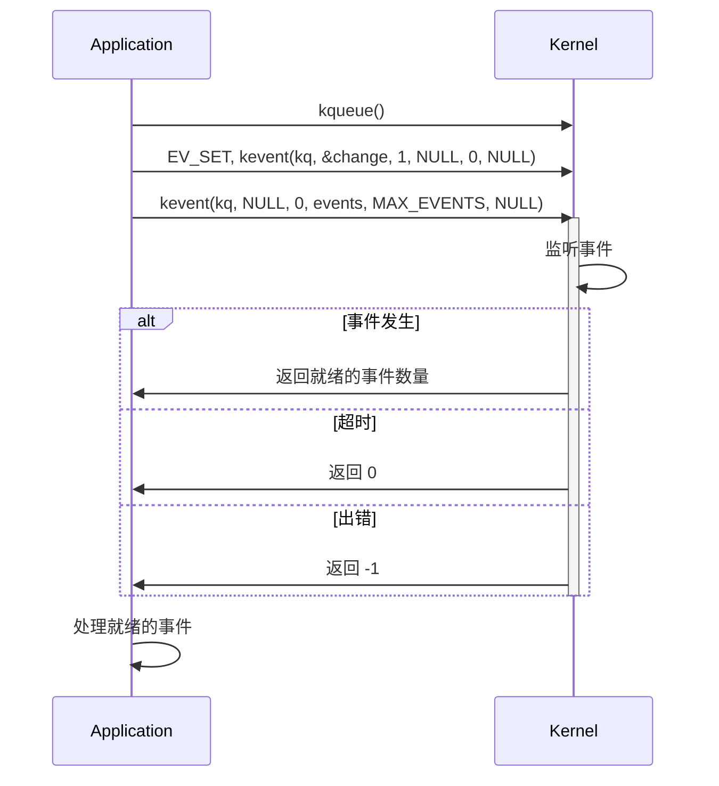
```mermaid
sequenceDiagram
    participant Application
    participant Kernel
    Application->>Kernel: kqueue()
    Application->>Kernel: EV_SET, kevent(kq, &change, 1, NULL, 0, NULL)
    Application->>Kernel: kevent(kq, NULL, 0, events, MAX_EVENTS, NULL)
    activate Kernel
    Kernel->>Kernel: 监听事件
    alt 事件发生
        Kernel->>Application: 返回就绪的事件数量
    else 超时
        Kernel->>Application: 返回 0
    else 出错
        Kernel->>Application: 返回 -1
    end
    deactivate Kernel
    Application->>Application: 处理就绪的事件
```

### 8.1 BSD/macOS 的多路复用方案

`kqueue` 是 FreeBSD 和 macOS 系统提供的一种事件通知接口，用于监控文件描述符、信号、用户定义的事件以及异步 I/O 操作等。它类似于 Linux 的 `epoll`，但设计上更加通用和灵活。`kqueue` 允许应用程序注册对各种内核事件的关注，并在这些事件发生时得到通知，从而实现高效的 I/O 多路复用。

`kqueue` 的主要特点包括：

- **通用事件通知**: `kqueue` 不仅可以监控文件描述符的 I/O 事件，还可以监控信号、定时器、文件系统事件、进程状态变化等。
- **事件过滤器**: `kqueue` 使用事件过滤器来定义需要监控的具体事件类型，例如文件可读、可写、连接断开等。
- **高效的内核实现**: `kqueue` 在内核中维护一个事件队列，只有当事件发生时，才会将事件通知给用户空间。
- **用户定义的事件**: `kqueue` 允许应用程序创建和触发用户定义的事件，从而实现更灵活的事件通知机制。

`kqueue` 的设计目标是提供一种通用、高效、灵活的事件通知接口，以满足各种应用程序的需求。

### 8.2 API 详解

`kqueue` 的使用主要涉及三个 API 函数：`kqueue`、`kevent` 和相关的事件过滤器。

#### 8.2.1 `kqueue` 创建

`kqueue` 函数用于创建一个 kqueue 实例，返回一个 kqueue 文件描述符。

```c
#include <sys/event.h>
#include <sys/types.h>
#include <unistd.h>

int kqueue(void);
```

- **参数**: 无参数。
- **返回值**:
    - 成功：返回一个非负的 kqueue 文件描述符。
    - 出错：返回 -1，并设置 `errno` 变量。

#### 8.2.2 `kevent` 操作

`kevent` 函数用于控制 kqueue 实例，可以添加、修改或删除需要监视的事件。

```c
#include <sys/event.h>
#include <sys/time.h>

int kevent(int kq, const struct kevent *changelist, int nchanges,
           struct kevent *eventlist, int nevents, const struct timespec *timeout);
```

- **`kq`**: `kqueue` 返回的 kqueue 文件描述符。
- **`changelist`**: 指向一个 `kevent` 结构体数组的指针，用于指定需要添加、修改或删除的事件。
- **`nchanges`**: `changelist` 数组中元素的数量。
- **`eventlist`**: 指向一个 `kevent` 结构体数组的指针，用于存储就绪的事件。
- **`nevents`**: `eventlist` 数组的最大长度。
- **`timeout`**: 指向一个 `timespec` 结构体的指针，用于指定 `kevent` 函数的超时时间。如果 `timeout` 为 `NULL`，则 `kevent` 会一直阻塞，直到有事件发生。

**`kevent` 结构体**

```c
struct kevent {
    uintptr_t       ident;          /* identifier for this event */
    short           filter;         /* filter type */
    u_short         flags;          /* general flags */
    u_int           fflags;         /* filter-specific flags */
    intptr_t        data;           /* filter-specific data */
    void            *udata;         /* user data passed to event */
};
```

- **`ident`**: 用于标识事件的标识符，通常是文件描述符、信号或其他内核对象的 ID。
- **`filter`**: 指定事件过滤器，用于定义需要监控的具体事件类型。
- **`flags`**: 用于指定事件的控制标志，例如添加、删除、启用、禁用等。
- **`fflags`**: 过滤器特定的标志，用于进一步定义事件的细节。
- **`data`**: 过滤器特定的数据，用于传递额外的信息。
- **`udata`**: 用户自定义的数据，可以在事件处理中使用。

#### 8.2.3 事件过滤器

`kqueue` 使用事件过滤器来定义需要监控的具体事件类型。常见的事件过滤器包括：

- `EVFILT_READ`: 文件可读事件。
- `EVFILT_WRITE`: 文件可写事件。
- `EVFILT_AIO`: 异步 I/O 事件。
- `EVFILT_VNODE`: 文件系统事件，例如文件创建、删除、修改等。
- `EVFILT_PROC`: 进程状态变化事件，例如进程创建、退出等。
- `EVFILT_SIGNAL`: 信号事件。
- `EVFILT_TIMER`: 定时器事件。

**伪代码描述**

```python
// 创建 kqueue 实例
kq = kqueue()

// 添加需要监视的事件
for each fd in file_descriptors:
    EV_SET(&change, fd, EVFILT_READ, EV_ADD, 0, 0, NULL)
    kevent(kq, &change, 1, NULL, 0, NULL)

while (true):
    // 等待事件发生
    nevents = kevent(kq, NULL, 0, events, MAX_EVENTS, NULL)

    // 处理事件
    for i from 0 to nevents - 1:
        if (events[i].filter == EVFILT_READ):
            // 读取数据
            read(events[i].ident, buffer)
            // 处理数据
```

### 8.3 强大的事件处理能力

`kqueue` 相比于 `select` 和 `poll`，以及 Linux 的 `epoll`，提供了更为强大的事件处理能力，不仅仅局限于 I/O 事件，还可以处理文件系统事件、进程事件和定时器事件等。

#### 8.3.1 文件系统事件

`kqueue` 允许应用程序监控文件或目录的各种变化，例如：

- **文件创建 (NOTE_WRITE)**：当文件内容被修改时触发。
- **文件删除 (NOTE_DELETE)**：当文件被删除时触发。
- **文件属性修改 (NOTE_ATTRIB)**：当文件属性（例如权限、所有者等）被修改时触发。
- **文件重命名 (NOTE_RENAME)**：当文件被重命名时触发。
- **文件大小改变 (NOTE_EXTEND)**：当文件大小发生改变时触发。

通过 `EVFILT_VNODE` 过滤器和相应的 `NOTE_*` 标志，应用程序可以精确地监控文件系统的变化，并及时做出响应。

#### 8.3.2 进程事件

`kqueue` 允许应用程序监控进程的状态变化，例如：

- **进程退出 (NOTE_EXIT)**：当进程退出时触发。
- **进程创建 (NOTE_FORK)**：当进程创建子进程时触发。
- **进程执行新程序 (NOTE_EXEC)**：当进程执行新的程序时触发。
- **进程信号 (NOTE_SIGNAL)**：当进程接收到信号时触发。

通过 `EVFILT_PROC` 过滤器和相应的 `NOTE_*` 标志，应用程序可以监控进程的生命周期，并及时做出响应。

#### 8.3.3 定时器事件

`kqueue` 允许应用程序创建定时器，并在指定的时间间隔后触发事件。

通过 `EVFILT_TIMER` 过滤器，应用程序可以实现精确的定时器功能，而无需使用 `select` 或 `poll` 等传统的定时器机制。

### 8.4 内核实现特点

`kqueue` 的高性能和强大功能得益于其高效的内核实现。

#### 8.4.1 高效的事件管理

`kqueue` 在内核中维护一个事件队列，用于存储所有需要监视的事件。当事件发生时，内核会将事件添加到事件队列中，并通知等待该事件的应用程序。

- **事件过滤**: `kqueue` 使用事件过滤器来定义需要监控的具体事件类型，从而避免不必要的事件通知。
- **事件合并**: `kqueue` 可以将多个相同类型的事件合并成一个事件，从而减少事件通知的数量。
- **事件优先级**: `kqueue` 可以为事件设置优先级，从而保证重要的事件能够及时处理。

#### 8.4.2 细粒度控制

`kqueue` 提供了细粒度的事件控制能力，允许应用程序精确地定义需要监控的事件类型和事件行为。

- **事件标志**: `kqueue` 使用事件标志来控制事件的行为，例如启用、禁用、删除等。
- **过滤器特定标志**: `kqueue` 使用过滤器特定标志来进一步定义事件的细节，例如文件系统事件的 `NOTE_*` 标志。
- **用户数据**: `kqueue` 允许应用程序将用户自定义的数据与事件关联起来，从而方便事件处理。

## 9. IOCP 机制详解

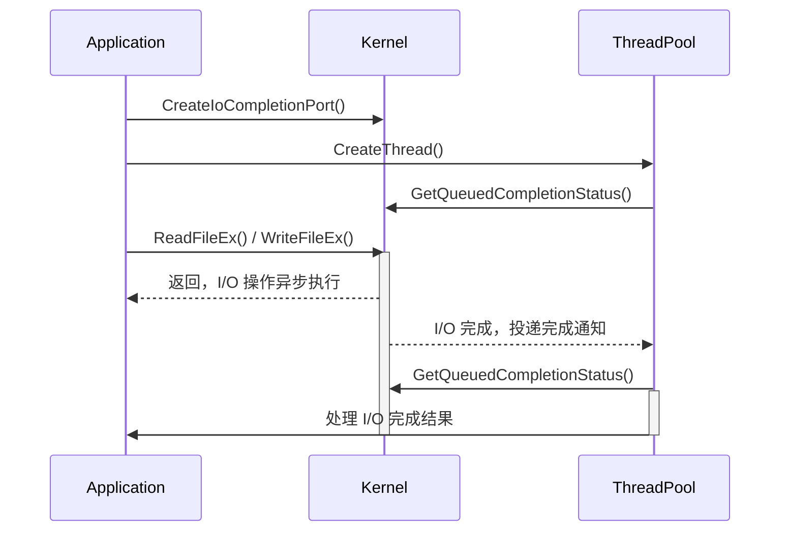
```mermaid
sequenceDiagram
    participant Application
    participant Kernel
    participant ThreadPool
    Application->>Kernel: CreateIoCompletionPort()
    Application->>ThreadPool: CreateThread()
    ThreadPool->>Kernel: GetQueuedCompletionStatus()
    Application->>Kernel: ReadFileEx() / WriteFileEx()
    activate Kernel
    Kernel-->>Application: 返回，I/O 操作异步执行
    Kernel-->>ThreadPool: I/O 完成，投递完成通知
    ThreadPool->>Kernel: GetQueuedCompletionStatus()
    activate ThreadPool
    ThreadPool->>Application: 处理 I/O 完成结果
    deactivate ThreadPool
    deactivate Kernel
```

### 9.1 Windows 平台的异步 IO 方案

IOCP（I/O Completion Port，I/O 完成端口）是 Windows 操作系统提供的一种高效的异步 I/O 机制。它允许应用程序发起 I/O 操作后立即返回，而无需等待 I/O 操作完成。当 I/O 操作完成时，操作系统会将一个完成通知投递到完成端口，应用程序可以通过监听完成端口来获取 I/O 操作的结果。

IOCP 的主要特点包括：

- **真正的异步 I/O**: IOCP 是真正的异步 I/O 机制，I/O 操作在内核中异步执行，不会阻塞应用程序的线程。
- **完成端口**: IOCP 使用完成端口来管理 I/O 操作的完成通知。
- **线程池**: IOCP 通常与线程池关联，用于处理完成端口上的完成通知。
- **高效的并发处理**: IOCP 可以高效地处理大量的并发 I/O 操作，适用于高并发服务器。

IOCP 的设计目标是提供一种高性能、可扩展的异步 I/O 机制，以满足高并发服务器的需求。

### 9.2 完成端口概念

完成端口是 IOCP 的核心概念，它是一个内核对象，用于管理 I/O 操作的完成通知。

#### 9.2.1 工作队列模型

完成端口使用工作队列模型来管理 I/O 操作的完成通知。当应用程序发起一个异步 I/O 操作时，操作系统会将一个表示该 I/O 操作的结构体（通常称为 Overlapped 结构体）添加到完成端口的工作队列中。当 I/O 操作完成时，操作系统会将一个完成通知添加到完成端口的完成队列中。

应用程序可以通过调用 `GetQueuedCompletionStatus` 函数来从完成端口的完成队列中获取完成通知。`GetQueuedCompletionStatus` 函数会阻塞当前线程，直到有完成通知到达，或者超时。

#### 9.2.2 线程池关联

完成端口通常与线程池关联，用于处理完成端口上的完成通知。线程池是一组预先创建的线程，可以高效地处理并发任务。

当有完成通知到达完成端口时，操作系统会从线程池中选择一个线程来处理该完成通知。处理完成通知的线程会调用 `GetQueuedCompletionStatus` 函数来获取完成通知，并执行相应的 I/O 操作处理逻辑。

**工作流程**

1. 应用程序创建一个完成端口。
2. 应用程序创建一个线程池。
3. 应用程序将完成端口与线程池关联起来。
4. 应用程序发起一个异步 I/O 操作，并将 Overlapped 结构体添加到完成端口的工作队列中。
5. I/O 操作在内核中异步执行。
6. 当 I/O 操作完成时，操作系统将一个完成通知添加到完成端口的完成队列中。
7. 线程池中的一个线程调用 `GetQueuedCompletionStatus` 函数来获取完成通知。
8. 线程执行相应的 I/O 操作处理逻辑。

### 9.3 异步操作模型

IOCP 的异步操作模型主要包括请求投递和完成通知两个阶段。

#### 9.3.1 请求投递

应用程序通过调用 Windows API 函数（例如 `ReadFileEx`、`WriteFileEx` 等）来发起异步 I/O 操作。在调用这些函数时，应用程序需要提供一个 Overlapped 结构体，用于存储 I/O 操作的相关信息。

Overlapped 结构体包含以下字段：

- **`Internal`**: 保留字段，由系统使用。
- **`InternalHigh`**: 保留字段，由系统使用。
- **`Offset`**: 指定文件偏移量。
- **`OffsetHigh`**: 指定文件偏移量的高 32 位。
- **`hEvent`**: 一个事件句柄，用于在 I/O 操作完成时通知应用程序。

在调用 I/O 函数后，函数会立即返回，而 I/O 操作会在内核中异步执行。

#### 9.3.2 完成通知

当 I/O 操作完成时，操作系统会将一个完成通知添加到完成端口的完成队列中。完成通知包含以下信息：

- **完成键 (Completion Key)**：一个用户自定义的值，用于标识 I/O 操作。
- **传输字节数 (Number of Bytes Transferred)**：实际传输的字节数。
- **Overlapped 结构体指针 (Overlapped Pointer)**：指向 Overlapped 结构体的指针。

线程池中的一个线程会调用 `GetQueuedCompletionStatus` 函数来获取完成通知。`GetQueuedCompletionStatus` 函数会返回完成键、传输字节数和 Overlapped 结构体指针。

应用程序可以根据这些信息来判断 I/O 操作是否成功，并执行相应的处理逻辑。

### 9.4 与其他多路复用技术的区别

IOCP 与其他多路复用技术（例如 `select`、`poll`、`epoll`、`kqueue`）的主要区别在于：

#### 9.4.1 真正的异步 I/O

`select`、`poll`、`epoll` 和 `kqueue` 都是 I/O 多路复用技术，它们允许应用程序同时监听多个文件描述符，并在其中任何一个就绪时得到通知。但是，这些技术仍然需要在应用程序的线程中执行实际的 I/O 操作。这意味着，如果 I/O 操作被阻塞，应用程序的线程也会被阻塞。

IOCP 是一种真正的异步 I/O 机制，I/O 操作在内核中异步执行，不会阻塞应用程序的线程。应用程序可以通过监听完成端口来获取 I/O 操作的结果，而无需等待 I/O 操作完成。

#### 9.4.2 线程池集成

IOCP 通常与线程池集成，用于处理完成端口上的完成通知。线程池可以高效地处理并发任务，从而提高 I/O 处理的效率。

`select`、`poll`、`epoll` 和 `kqueue` 通常需要应用程序自己管理线程池，以处理就绪的文件描述符。这意味着，应用程序需要自己编写线程池的代码，并负责线程的创建、销毁和调度。

## 10. io_uring 新一代 IO 框架

### 10.1 Linux 内核 5.1+ 的革命性 IO 框架

`io_uring` 是 Linux 内核 5.1 引入的一种新的异步 I/O 框架，它旨在解决传统 I/O 机制在高并发、低延迟场景下的性能瓶颈。`io_uring` 通过共享内存、零拷贝和无系统调用提交等技术，实现了高效的异步 I/O 操作，被誉为 Linux I/O 领域的革命性创新。

`io_uring` 的主要特点包括：

- **高性能**: `io_uring` 通过共享内存和零拷贝技术，减少了数据在用户空间和内核空间之间的拷贝次数，从而提高了 I/O 性能。
- **低延迟**: `io_uring` 通过无系统调用提交技术，减少了系统调用的开销，从而降低了 I/O 延迟。
- **异步操作**: `io_uring` 支持真正的异步 I/O 操作，应用程序可以发起 I/O 请求后立即返回，而无需等待 I/O 操作完成。
- **灵活的 API**: `io_uring` 提供了灵活的 API，可以支持各种 I/O 操作，包括文件 I/O、网络 I/O 和设备 I/O。

`io_uring` 的设计目标是提供一种高性能、低延迟、灵活的异步 I/O 框架，以满足现代应用程序的需求。

### 10.2 设计理念

`io_uring` 的设计理念主要包括共享内存环形缓冲区、无系统调用提交和真正的异步操作。

#### 10.2.1 共享内存环形缓冲区

`io_uring` 使用共享内存环形缓冲区来管理 I/O 请求和完成事件。应用程序和内核共享两个环形缓冲区：提交队列 (Submission Queue, SQ) 和完成队列 (Completion Queue, CQ)。

- **提交队列 (SQ)**：应用程序将 I/O 请求提交到 SQ 中，内核从 SQ 中获取 I/O 请求并执行。
- **完成队列 (CQ)**：内核将 I/O 完成事件添加到 CQ 中，应用程序从 CQ 中获取 I/O 完成事件并处理。

`io_uring` 还通过共享内存环形缓冲区，避免了每次 I/O 操作都需要进行系统调用的开销，从而提高了 I/O 性能。

**1. 共享内存映射（Memory Mapping）：**

- `io_uring` 的核心是两个环形缓冲区：
    - **提交队列（Submission Queue, SQ）：** 用户空间程序将 I/O 请求放入 SQ 中。
    - **完成队列（Completion Queue, CQ）：** 内核将 I/O 操作的完成状态放入 CQ 中。
- 这两个环形缓冲区不是简单的用户空间数据结构，而是通过 `mmap()` 系统调用将内核空间的一块内存映射到用户空间。 这意味着用户空间程序可以直接访问和修改内核空间的内存，反之亦然。
- 这种共享内存映射避免了用户空间和内核空间之间的数据拷贝，因为双方都直接操作同一块内存区域。

**2. 无锁并发控制（Lockless Concurrency）：**

- 由于用户空间程序和内核同时访问共享的环形缓冲区，因此需要一种机制来保证并发访问的安全性。 `io_uring` 使用了无锁（lockless）并发控制技术来实现这一点。
- 具体来说，`io_uring` 依赖于原子操作（atomic operations），例如 `atomic_load` 和 `atomic_store`，来更新环形缓冲区的索引和状态。 原子操作可以保证在多线程或多进程环境下，对共享变量的修改是原子性的，不会出现数据竞争。
- 通过巧妙地设计环形缓冲区的布局和使用原子操作，`io_uring` 避免了使用传统的锁机制，从而提高了并发性能。

**3. 事件通知（Event Notification）：**

- 用户空间程序需要一种方式来知道内核已经处理了 SQ 中的 I/O 请求，并将完成状态放入了 CQ 中。 `io_uring` 使用了事件通知机制来实现这一点。
- 用户空间程序可以通过 `io_uring_enter()` 系统调用来提交 SQ 中的 I/O 请求，并等待 CQ 中的完成事件。
- 内核在完成 I/O 操作后，会将完成事件放入 CQ 中，并唤醒等待的 `io_uring_enter()` 调用。
- 通过事件通知机制，用户空间程序可以及时地获取 I/O 操作的完成状态，并进行后续处理。

**4. 批量提交和完成（Batching）：**

- `io_uring` 支持批量提交和完成 I/O 请求。 用户空间程序可以将多个 I/O 请求放入 SQ 中，然后一次性提交给内核。 类似地，内核可以将多个 I/O 操作的完成状态放入 CQ 中，然后一次性通知用户空间程序。
- 批量提交和完成可以减少系统调用的次数，从而提高 I/O 性能。

#### 10.2.2 无系统调用提交

`io_uring` 支持无系统调用提交 I/O 请求。在传统的 I/O 机制中，应用程序需要通过系统调用（例如 `read`、`write`）来提交 I/O 请求。每次系统调用都需要进行用户空间和内核空间之间的切换，这会带来额外的开销。

`io_uring` 允许应用程序将 I/O 请求直接写入到共享内存环形缓冲区中，而无需进行系统调用。内核会自动从环形缓冲区中获取 I/O 请求并执行。

通过无系统调用提交技术，`io_uring` 减少了系统调用的开销，从而降低了 I/O 延迟。

#### 10.2.3 真正的异步操作

`io_uring` 支持真正的异步 I/O 操作。应用程序可以发起 I/O 请求后立即返回，而无需等待 I/O 操作完成。当 I/O 操作完成时，内核会将完成事件添加到共享内存环形缓冲区中，应用程序可以从环形缓冲区中获取完成事件并处理。

通过真正的异步操作，`io_uring` 避免了 I/O 操作阻塞应用程序的线程，从而提高了应用程序的并发处理能力。

### 10.3 核心组件

`io_uring` 的核心组件包括提交队列 (SQ)、完成队列 (CQ) 和内存屏障优化。

#### 10.3.1 提交队列 (SQ)

提交队列 (Submission Queue, SQ) 是一个共享内存环形缓冲区，用于存储应用程序提交的 I/O 请求。

- **`struct io_uring_sq`**: 表示提交队列的结构体。
- **`struct io_uring_sqe`**: 表示提交队列条目的结构体，用于描述一个 I/O 请求。

应用程序通过以下步骤将 I/O 请求提交到 SQ 中：

1. 调用 `io_uring_get_sqe` 函数获取一个空闲的 SQE (Submission Queue Entry)。
2. 设置 SQE 的各个字段，例如文件描述符、操作类型、缓冲区地址、缓冲区大小等。
3. 调用 `io_uring_submit` 函数将 SQE 提交到 SQ 中。

#### 10.3.2 完成队列 (CQ)

完成队列 (Completion Queue, CQ) 是一个共享内存环形缓冲区，用于存储内核完成的 I/O 事件。

- **`struct io_uring_cq`**: 表示完成队列的结构体。
- **`struct io_uring_cqe`**: 表示完成队列条目的结构体，用于描述一个 I/O 完成事件。

应用程序通过以下步骤从 CQ 中获取 I/O 完成事件：

1. 调用 `io_uring_wait_cqe` 函数等待 CQE (Completion Queue Entry) 到达。
2. 从 CQ 中获取 CQE。
3. 处理 CQE，例如检查 I/O 操作是否成功，获取传输的字节数等。
4. 调用 `io_uring_cqe_seen` 函数通知内核 CQE 已经被处理。

#### 10.3.3 内存屏障优化

由于提交队列和完成队列是共享内存环形缓冲区，应用程序和内核需要通过内存屏障来保证数据的一致性。

- **内存屏障 (Memory Barrier)**：用于强制 CPU 按照指定的顺序执行内存操作，以避免数据竞争和缓存一致性问题。

`io_uring` 使用了多种内存屏障优化技术，以减少内存屏障的开销，从而提高 I/O 性能。

### 10.4 API 详解

`io_uring` 的 API 主要包括 `io_uring_setup`、`io_uring_enter` 和 `io_uring_register`。

#### 10.4.1 `io_uring_setup`

`io_uring_setup` 函数用于创建一个 `io_uring` 实例，并设置共享内存区域。

```c
#include <linux/io_uring.h>

int io_uring_setup(unsigned entries, struct io_uring_params *p);
```

- **`entries`**: 指定 `io_uring` 实例可以处理的最大 I/O 请求数量。
- **`p`**: 指向一个 `io_uring_params` 结构体的指针，用于设置 `io_uring` 实例的参数。

**`io_uring_params` 结构体**

```c
struct io_uring_params {
    __u32 sq_entries;
    __u32 cq_entries;
    __u32 flags;
    __u32 sq_thread_cpu;
    __u32 sq_thread_idle;
    __u32 resv[5];
    struct io_uring_sqring_offsets sq_off;
    struct io_uring_cqring_offsets cq_off;
};
```

- **`sq_entries`**: 提交队列的条目数。
- **`cq_entries`**: 完成队列的条目数。
- **`flags`**: 指定 `io_uring` 实例的标志，例如 `IORING_SETUP_IOPOLL`、`IORING_SETUP_SQPOLL` 等。
- **`sq_thread_cpu`**: 指定用于轮询提交队列的内核线程的 CPU 核心。
- **`sq_thread_idle`**: 指定用于轮询提交队列的内核线程的空闲时间。
- **`sq_off`**: `io_uring_sqring_offsets` 结构体，描述了提交队列的内存布局。
- **`cq_off`**: `io_uring_cqring_offsets` 结构体，描述了完成队列的内存布局。

#### 10.4.2 `io_uring_enter`

`io_uring_enter` 函数用于提交 I/O 请求到提交队列，并等待完成事件。

```c
#include <linux/io_uring.h>

int io_uring_enter(int fd, unsigned to_submit, unsigned min_complete,
                    unsigned flags, sigset_t *sig);
```

- **`fd`**: `io_uring_setup` 返回的 `io_uring` 文件描述符。
- **`to_submit`**: 指定需要提交的 I/O 请求数量。
- **`min_complete`**: 指定需要等待的最小完成事件数量。
- **`flags`**: 指定 `io_uring_enter` 函数的标志，例如 `IORING_ENTER_GETEVENTS`、`IORING_ENTER_SQ_WAKEUP` 等。
- **`sig`**: 指向一个信号掩码的指针，用于阻塞指定的信号。

#### 10.4.3 `io_uring_register`

`io_uring_register` 函数用于注册文件、缓冲区或事件到 `io_uring` 实例中，以便在后续的 I/O 操作中使用。

```c
#include <linux/io_uring.h>

int io_uring_register(int fd, unsigned opcode, void *arg,
                       unsigned nr_args);
```

**`opcode`**: 指定注册操作的类型；**`arg`**: 指向一个数据结构的指针，该数据结构包含了注册操作所需的参数；**`nr_args`**: 指定 `arg` 指向的数据结构中元素的数量。

### 10.5 与传统多路复用的区别

`io_uring` 与传统多路复用技术（例如 `select`、`poll`、`epoll`、`kqueue`、`IOCP`）的主要区别在于：

#### 10.5.1 批量提交

`io_uring` 支持批量提交 I/O 请求，可以将多个 I/O 请求一次性提交到提交队列中，从而减少系统调用的开销。

#### 10.5.2 零拷贝设计

`io_uring` 采用了零拷贝设计，可以减少数据在用户空间和内核空间之间的拷贝次数，从而提高 I/O 性能。

#### 10.5.3 可扩展性

`io_uring` 具有良好的可扩展性，可以支持各种 I/O 操作，包括文件 I/O、网络 I/O 和设备 I/O。

## 11. 实际应用案例

### 11.1 Web 服务器设计

Web 服务器是高并发 I/O 的典型应用场景。不同的 Web 服务器采用了不同的 I/O 模型来处理并发请求。

#### 11.1.1 Nginx 的 IO 模型

Nginx 是一个高性能的 Web 服务器，它采用了基于事件驱动的异步非阻塞 I/O 模型。

- **事件驱动**: Nginx 使用事件驱动的方式来处理并发请求，当有事件发生时，才会调用相应的处理函数。
- **异步非阻塞**: Nginx 使用异步非阻塞 I/O 操作，可以发起 I/O 请求后立即返回，而无需等待 I/O 操作完成。
- **多进程/多线程**: Nginx 使用多进程或多线程来处理并发请求，每个进程或线程负责处理一部分请求。

Nginx 的 I/O 模型主要包括以下几个组件：

- **Master 进程**: 负责管理 Worker 进程，例如启动、停止和重启 Worker 进程。
- **Worker 进程**: 负责处理客户端请求，每个 Worker 进程都包含一个事件循环。
- **事件循环**: 负责监听文件描述符上的事件，例如可读、可写等。
- **事件处理函数**: 负责处理发生的事件，例如读取客户端请求、发送响应等。

Nginx 使用 `epoll` (Linux)、`kqueue` (FreeBSD/macOS) 或 `select` (其他系统) 等 I/O 多路复用技术来监听文件描述符上的事件。

**Nginx 事件处理流程**

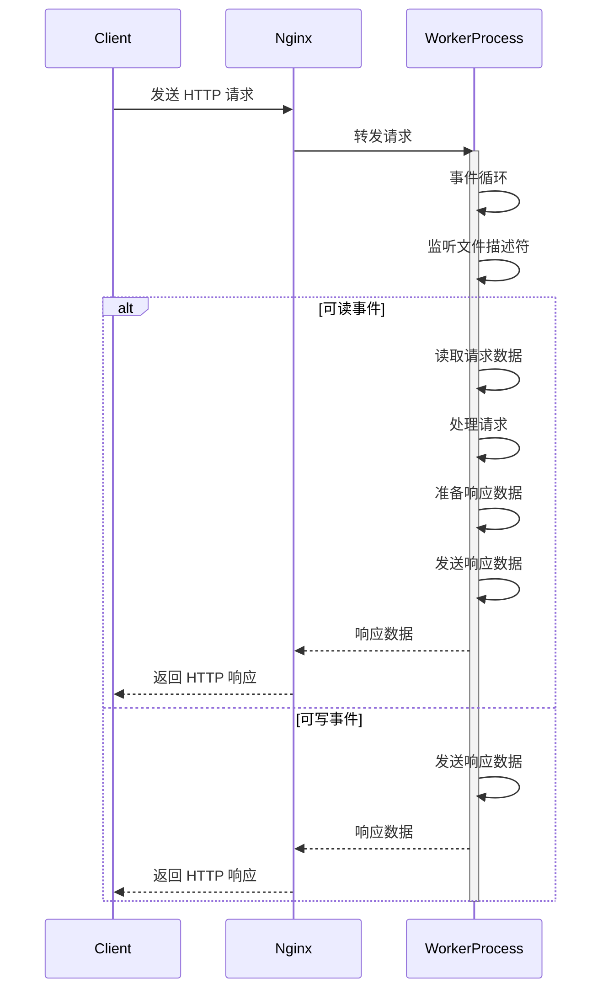
```mermaid
sequenceDiagram
    participant Client
    participant Nginx
    participant WorkerProcess
    Client->>Nginx: 发送 HTTP 请求
    Nginx->>WorkerProcess: 转发请求
    activate WorkerProcess
    WorkerProcess->>WorkerProcess: 事件循环
    WorkerProcess->>WorkerProcess: 监听文件描述符
    alt 可读事件
        WorkerProcess->>WorkerProcess: 读取请求数据
        WorkerProcess->>WorkerProcess: 处理请求
        WorkerProcess->>WorkerProcess: 准备响应数据
        WorkerProcess->>WorkerProcess: 发送响应数据
        WorkerProcess-->>Nginx: 响应数据
        Nginx-->>Client: 返回 HTTP 响应
    else 可写事件
        WorkerProcess->>WorkerProcess: 发送响应数据
        WorkerProcess-->>Nginx: 响应数据
        Nginx-->>Client: 返回 HTTP 响应
    end
    deactivate WorkerProcess
```

#### 11.1.2 事件处理框架

Nginx 使用了一个自定义的事件处理框架，该框架基于 Reactor 模式。

- **Reactor 模式**: Reactor 模式是一种事件驱动的设计模式，它将事件的监听和处理分离，从而提高系统的并发处理能力。

Nginx 的事件处理框架主要包括以下几个组件：

- **事件管理器**: 负责管理事件的注册、注销和分发。
- **事件处理器**: 负责处理发生的事件。
- **事件循环**: 负责监听文件描述符上的事件，并将事件分发给相应的事件处理器。

### 11.2 数据库系统

数据库系统是另一个高并发 I/O 的典型应用场景。不同的数据库系统采用了不同的 I/O 模型来处理并发请求。

#### 11.2.1 Redis 的事件循环

Redis 是一个高性能的键值存储数据库，它采用了基于事件驱动的单线程 I/O 模型。

- **单线程**: Redis 使用单线程来处理所有客户端请求，避免了多线程之间的锁竞争和上下文切换开销。
- **事件驱动**: Redis 使用事件驱动的方式来处理并发请求，当有事件发生时，才会调用相应的处理函数。
- **异步非阻塞**: Redis 使用异步非阻塞 I/O 操作，可以发起 I/O 请求后立即返回，而无需等待 I/O 操作完成。

Redis 使用 `epoll` (Linux)、`kqueue` (FreeBSD/macOS) 或 `select` (其他系统) 等 I/O 多路复用技术来监听文件描述符上的事件。

**Redis 事件处理流程**

```mermaid
sequenceDiagram
    participant Client
    participant Redis
    Client->>Redis: 发送命令请求
    Redis->>Redis: 事件循环
    Redis->>Redis: 监听文件描述符
    alt 可读事件
        Redis->>Redis: 读取命令请求
        Redis->>Redis: 解析命令
        Redis->>Redis: 执行命令
        Redis->>Redis: 准备响应数据
        Redis->>Redis: 发送响应数据
        Redis-->>Client: 返回响应
    else 可写事件
        Redis->>Redis: 发送响应数据
        Redis-->>Client: 返回响应
    end
```

#### 11.2.2 PostgreSQL 的多进程模型

PostgreSQL 是一个强大的关系型数据库，它采用了基于多进程的 I/O 模型。

- **多进程**: PostgreSQL 使用多进程来处理并发请求，每个进程负责处理一部分请求。
- **共享内存**: PostgreSQL 使用共享内存来实现进程间通信。
- **同步阻塞**: PostgreSQL 使用同步阻塞 I/O 操作，当发起 I/O 请求时，会阻塞当前进程，直到 I/O 操作完成。

PostgreSQL 使用 `select` 或 `poll` 等 I/O 多路复用技术来监听文件描述符上的事件。

### 11.3 网络库实现

网络库是构建网络应用程序的基础组件，不同的网络库采用了不同的 I/O 模型来处理并发连接。

#### 11.3.1 libevent

libevent 是一个事件通知库，它提供了一种通用的事件循环机制，可以用于构建各种网络应用程序。

- **事件循环**: libevent 提供了一个事件循环，可以监听文件描述符上的事件，并将事件分发给相应的事件处理器。
- **I/O 多路复用**: libevent 支持多种 I/O 多路复用技术，例如 `select`、`poll`、`epoll`、`kqueue` 等。
- **跨平台**: libevent 可以在多种操作系统上运行，包括 Linux、FreeBSD、macOS 和 Windows。

#### 11.3.2 libuv

libuv 是一个跨平台的异步 I/O 库，它是 Node.js 的底层依赖库。

- **事件循环**: libuv 提供了一个事件循环，可以监听文件描述符上的事件，并将事件分发给相应的事件处理器。
- **异步 I/O**: libuv 支持异步 I/O 操作，可以发起 I/O 请求后立即返回，而无需等待 I/O 操作完成。
- **线程池**: libuv 使用线程池来处理异步 I/O 操作，从而避免阻塞事件循环。
- **跨平台**: libuv 可以在多种操作系统上运行，包括 Linux、FreeBSD、macOS 和 Windows。

#### 11.3.3 Netty

Netty 是一个高性能的异步事件驱动的网络应用程序框架，它是 Java 平台上最流行的网络库之一。

- **异步事件驱动**: Netty 采用了异步事件驱动的设计模式，可以高效地处理并发连接。
- **NIO**: Netty 基于 Java NIO (New I/O) 构建，可以利用操作系统的 I/O 多路复用技术。
- **Channel**: Netty 使用 Channel 来表示一个网络连接，可以对 Channel 进行各种操作，例如读取数据、写入数据、关闭连接等。
- **Pipeline**: Netty 使用 Pipeline 来处理 Channel 上的事件，Pipeline 包含多个 ChannelHandler，每个 ChannelHandler 负责处理一种类型的事件。

### 11.4 瓶颈分析

不同的 I/O 多路复用技术有不同的瓶颈：

- **select**: 文件描述符数量限制、O(n) 复杂度。
- **poll**: O(n) 复杂度。
- **epoll**: 需要手动管理事件，边缘触发模式容易出错。
- **kqueue**: BSD/macOS 平台特有。
- **IOCP**: Windows 平台特有，需要使用线程池。
- **io_uring**: Linux 内核版本要求较高，API 复杂。

## 12. 性能优化与最佳实践

### 12.1 编程模式

#### 12.1.1 Reactor 模式

Reactor 模式是一种事件驱动的设计模式，它将事件的监听和处理分离，从而提高系统的并发处理能力。

- **组件**:
    - **Reactor**: 负责监听事件，并将事件分发给相应的事件处理器。
    - **事件处理器 (Handler)**：负责处理发生的事件。
    - **事件源 (Event Source)**：产生事件的对象，例如文件描述符、定时器等。
- **优点**:
    - 简单易用。
    - 适用于单线程或多线程环境。
- **缺点**:
    - 所有事件处理都在 Reactor 线程中执行，可能会导致 Reactor 线程阻塞。

#### 12.1.2 Proactor 模式

Proactor 模式也是一种事件驱动的设计模式，它与 Reactor 模式的区别在于，Proactor 模式将 I/O 操作的执行也委托给事件处理器。

- **组件**:
    - **Proactor**: 负责发起异步 I/O 操作，并将 I/O 操作的结果通知给相应的事件处理器。
    - **事件处理器 (Handler)**：负责处理 I/O 操作的结果。
    - **异步 I/O 操作 (Asynchronous Operation)**：执行 I/O 操作的对象，例如 `ReadFileEx`、`WriteFileEx` (Windows IOCP) 或 `io_uring` (Linux)。
- **优点**:
    - 异步 I/O 操作不会阻塞 Reactor 线程。
    - 适用于高并发、低延迟场景。
- **缺点**:
    - 实现复杂。
    - 需要操作系统的支持。

#### 12.1.3 协程集成

协程（Coroutine）是一种轻量级的线程，可以在单线程中实现并发执行。将协程与 I/O 多路复用技术集成，可以提高系统的并发处理能力。

- **优点**:
    - 避免了多线程之间的锁竞争和上下文切换开销。
    - 提高了代码的可读性和可维护性。
- **缺点**:
    - 需要协程库的支持。
    - 调试困难。

### 12.2 常见陷阱与解决方案

#### 12.2.1 惊群效应

惊群效应（Thundering Herd）是指多个进程或线程同时等待同一个事件，当事件发生时，所有进程或线程都被唤醒，但只有一个进程或线程能够处理该事件，其他进程或线程则被白白唤醒。

- **解决方案**:
    - 使用 `accept4` 系统调用（Linux 2.6.28+）可以避免惊群效应。
    - 在多进程模型中，可以使用文件锁或信号量来限制只有一个进程能够监听套接字。

`accept4` 系统调用可以通过原子性地接受连接并设置套接字上的 `flags`，从而帮助避免惊群效应。

`accept4` 系统调用通过以下方式减少或避免惊群效应：

1. **原子性操作:** `accept4` 允许在接受连接的同时，原子性地设置新套接字的标志（通过 `flags` 参数）。 这意味着接受连接和设置标志这两个操作，对于其他进程/线程来说是不可分割的。
2. **减少竞争条件:** 虽然 `accept4` 本身并不能完全消除惊群效应，但它减少了竞争条件。 通过原子性地设置标志，可以避免一些在传统 `accept` 中可能发生的竞争情况，尤其是在多线程环境中。

**为什么原子性操作很重要？**

在多线程或多进程环境中，如果没有原子性操作，可能会出现以下情况：

1. 多个线程/进程同时调用 `accept`。
2. 内核唤醒所有等待的线程/进程。
3. 多个线程/进程几乎同时成功 `accept` 连接。
4. 只有一个线程/进程能够真正获得这个连接。
5. 其他线程/进程需要处理错误并返回，造成不必要的开销。

`accept4` 的原子性操作可以减少这种竞争，因为它保证了接受连接和设置标志这两个步骤是不可分割的，从而降低了多个线程/进程同时成功 `accept` 同一个连接的可能性。

#### 12.2.2 边缘触发注意事项

在使用边缘触发（Edge Triggered，ET）模式时，需要注意以下几点：

- **非阻塞 I/O**: 必须将文件描述符设置为非阻塞模式，以避免阻塞在 I/O 操作上。
- **一次性读取所有数据**: 必须一次性读取所有可读的数据，或者一次性写入所有可写的数据，否则可能会丢失事件。
- **处理 `EAGAIN` 错误**: 当没有数据可读或没有空间可写时，`read` 或 `write` 系统调用会返回 `EAGAIN` 错误，需要处理该错误。

#### 12.2.3 缓冲区管理

缓冲区管理是 I/O 性能优化的关键。以下是一些缓冲区管理技巧：

- **使用直接 I/O (Direct I/O)**：Direct I/O 可以绕过操作系统的缓冲区缓存，直接将数据从磁盘读取到应用程序的缓冲区中，从而提高 I/O 性能。
- **使用内存池 (Memory Pool)**：内存池可以预先分配一组缓冲区，从而避免频繁的内存分配和释放操作，提高内存管理效率。
- **使用零拷贝 (Zero-Copy)**：零拷贝技术可以减少数据在用户空间和内核空间之间的拷贝次数，从而提高 I/O 性能。
