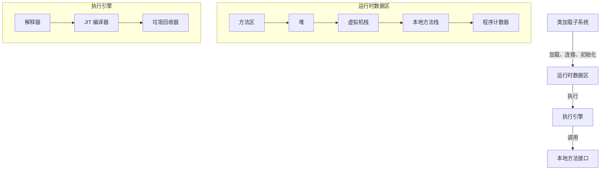
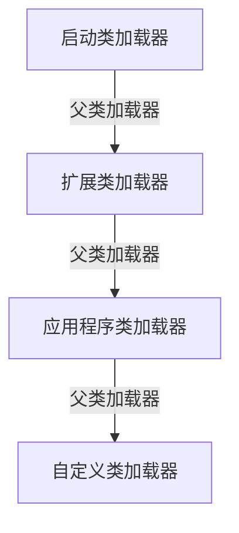
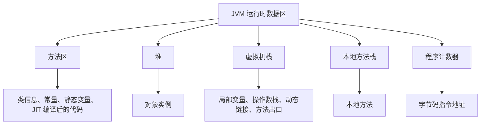
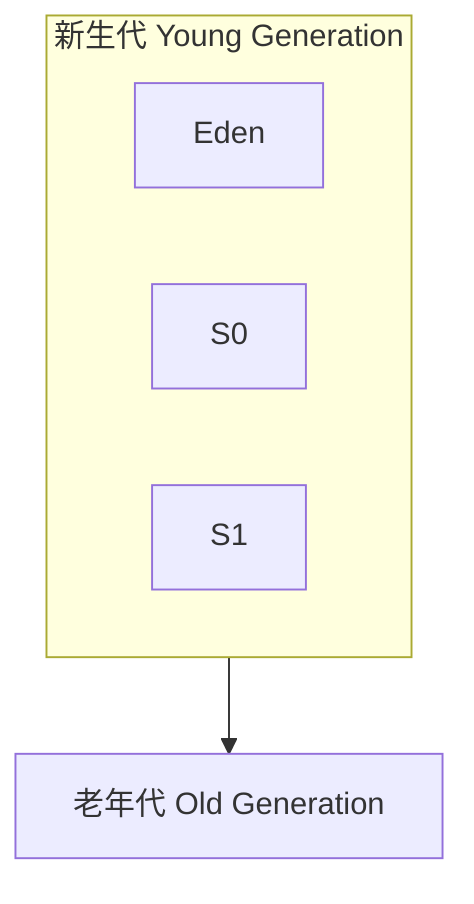
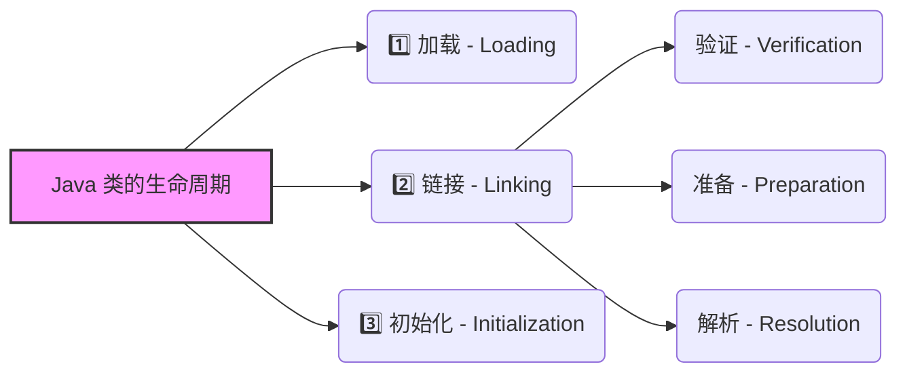
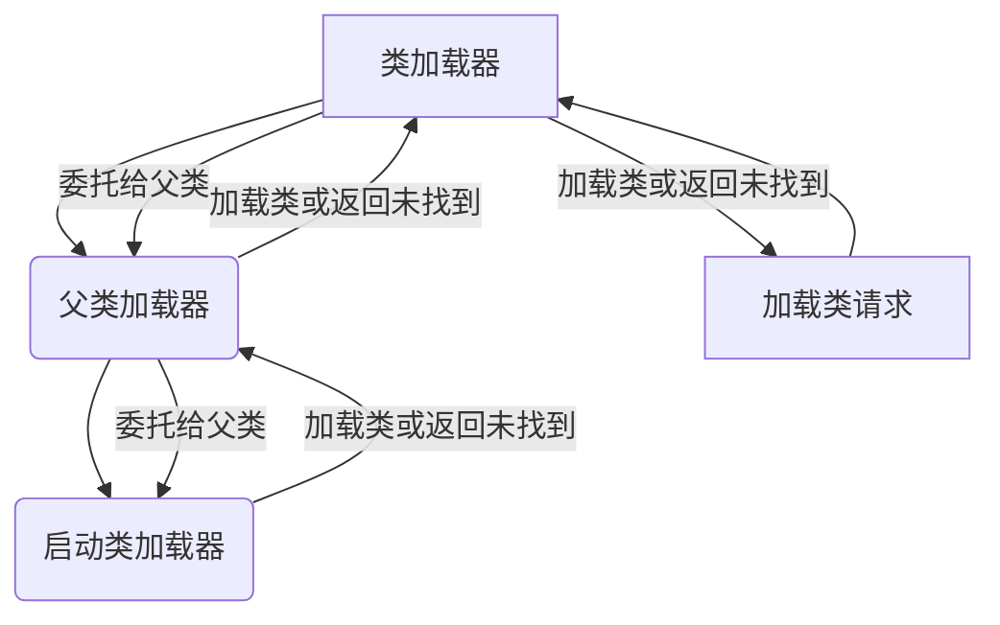
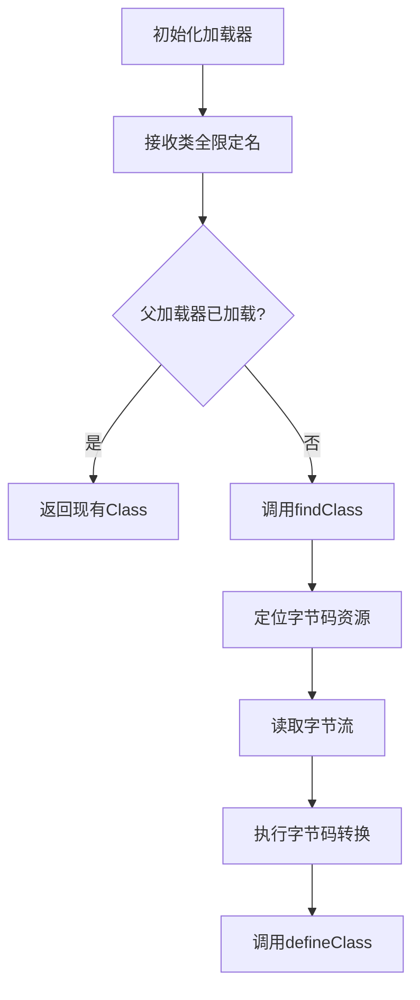
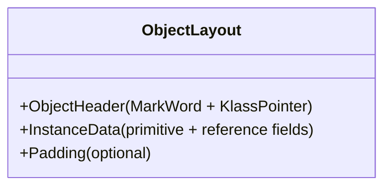

# Java From 0 to 1

## 1. Java 底层原理

### 1.1 JVM 架构与工作原理

#### 1.1.1 JVM 整体架构

JVM（Java Virtual Machine）是 Java 平台的核心，它负责执行 Java 字节码。可以将 JVM 视为一个抽象的计算机，它有自己的指令集、内存管理系统和执行引擎。



<div align="center"><i>JVM 架构图</i></div>

**各个组件的作用**：

- **类加载子系统**：负责加载、连接和初始化类文件。
- **运行时数据区**：JVM 内存空间，用于存储程序在运行过程中产生的数据。
- **执行引擎**：负责执行字节码指令。
- **本地方法接口**：允许 Java 程序调用本地（通常是 C 或 C++）代码。

#### 1.1.2 类加载子系统

类加载子系统负责将 `.class` 文件加载到 JVM 中。它包括三个主要阶段：

1. **加载（Loading）**：查找并加载类的二进制数据。
2. **连接（Linking）**：
    - **验证（Verification）**：确保 `.class` 文件的结构正确，符合 JVM 规范。
    - **准备（Preparation）**：为类的静态变量分配内存，并设置默认初始值。
    - **解析（Resolution）**：将符号引用替换为直接引用。
3. **初始化（Initialization）**：执行类构造器 `<clinit>()` 方法，为静态变量赋予正确的初始值。

```java
public class MyClass {
    private static int count = 0; // 准备阶段：count = 0; 初始化阶段：count = 1

    static {
        count = 1;
    }

    public static void main(String[] args) {
        System.out.println(MyClass.count);
    }
}
```

对于上述代码而言，`MyClass` 定义了一个静态变量 `count`，并赋予初始值 `0`。静态变量属于类，而不是类的实例。它在类加载时被初始化，并且在类的所有实例之间共享。

`static { count = 1; }` 是一个静态代码块。静态代码块在类加载的**初始化阶段**执行，用于对静态变量进行额外的初始化操作。静态代码块的执行顺序与其在类中定义的顺序一致。

我们假定 JVM 已经完成了加载过程，也完成了连接中的验证过程。在准备阶段，JVM 为静态变量分配内存并设置默认值。对于 `int` 类型的静态变量 `count`，默认值是 `0`。此时，`count` 的值为 `0`。进入初始化阶段，JVM 执行静态变量的显式初始化和静态代码块。首先，执行 `private static int count = 0;`，将 `count` 的值设置为 `0`。然后，执行静态代码块 `static { count = 1; }`，将 `count` 的值修改为 `1`。

**类加载器**：

JVM 使用类加载器来加载类。常见的类加载器有：

- **启动类加载器（Bootstrap ClassLoader）**：加载 JVM 核心类库，如 `java.lang.*`。
- **扩展类加载器（Extension ClassLoader）**：加载 `jre/lib/ext` 目录下的类库，如 JDK 扩展库（如 `javax.*` 包中的部分类）和第三方扩展库（如果放置在 `ext` 目录下）。
- **应用程序类加载器（Application ClassLoader）**：加载应用程序的类路径（CLASSPATH）下的类，例如用户自定义的类（如 `com.example.MyClass`）和第三方库（如 `org.apache.commons.*`）。
- **自定义类加载器（User-Defined ClassLoader）**：用户可以自定义类加载器，实现特定的加载需求，例如动态生成的类（如通过字节码生成工具生成的类）。



启动类加载器（Bootstrap ClassLoader）是最顶层的类加载器，由 JVM 实现，通常用本地代码编写，负责加载 JVM 核心类库（如 `java.lang.*`）。它不是 Java 类，因此没有父类加载器。

**双亲委派机制**：

JVM 使用双亲委派机制来加载类。当一个类加载器收到类加载请求时，它首先会委派给父类加载器去加载，只有当父类加载器无法加载时，才会尝试自己加载。

**双亲委派机制的优点**：

- **安全性**：避免核心类库被篡改。
- **唯一性**：确保同一个类只被加载一次。

#### 1.1.3 运行时数据区

运行时数据区是 JVM 内存空间，用于存储程序在运行过程中产生的数据。它包括以下几个部分：

1. **方法区（Method Area）**：存储已加载的类信息、常量、静态变量、JIT 编译后的代码等数据。方法区是所有线程共享的。
2. **堆（Heap）**：存储对象实例。堆是所有线程共享的，也是垃圾回收的主要区域。
3. **虚拟机栈（VM Stack）**：每个线程都有一个虚拟机栈，用于存储局部变量、操作数栈、动态链接、方法出口等信息。
4. **本地方法栈（Native Method Stack）**：与虚拟机栈类似，但用于执行本地方法。
5. **程序计数器（Program Counter Register）**：记录当前线程正在执行的字节码指令的地址。

存储信息示意：

**方法区（Method Area）**

- **类信息**：`com.example.MyClass` 的类定义（字段、方法、构造器等）。
- **常量**：字符串常量 `"Hello, World!"` 或常量池中的 `final int MAX_VALUE = 100`。
- **静态变量**：`static int count = 0;`。
- **JIT 编译后的代码**：热点方法 `public void calculate() { … }` 编译后的本地机器代码。

**堆（Heap）**

- **对象实例**：
    - `new MyClass()` 创建的实例。
    - `new int[]{1, 2, 3}` 创建的数组对象。
    - `new String("Example")` 创建的字符串对象。

**虚拟机栈（VM Stack）**

- **局部变量**：方法中的局部变量，如 `int x = 10;` 或 `String name = "Alice";`。
- **操作数栈**：用于计算表达式的临时数据，如 `x + y` 的计算过程。
- **动态链接**：指向方法区中方法符号引用的指针。
- **方法出口**：记录方法返回的地址，例如 `return x;` 后返回到调用者的位置。

**本地方法栈（Native Method Stack）**

- **本地方法**：调用 JNI（Java Native Interface）方法，如 `native void doSomething();` 的执行上下文。

**程序计数器（Program Counter Register）**

- **字节码指令地址**：当前线程执行的字节码指令地址，例如 `0x1000`（表示正在执行某方法的第 16 条指令）。



**内存分配示例（伪代码）**：

```
// 创建一个对象
Object obj = new Object();

// 1. 在堆中分配内存空间
memory = allocateMemory(heap, sizeof(Object));

// 2. 初始化对象头（Mark Word, Class Pointer）
initializeObjectHeader(memory, Object.class);

// 3. 将对象引用赋值给 obj 变量
obj = memory;
```

#### 1.1.4 执行引擎

执行引擎负责执行字节码指令。它包括以下几个组件：

1. **解释器（Interpreter）**：逐条解释执行字节码指令。
2. **JIT 编译器（Just-In-Time Compiler）**：将热点代码（经常执行的代码）编译成本地机器码，以提高执行效率。
3. **垃圾回收器（Garbage Collector）**：自动回收不再使用的对象，释放内存空间。

**JIT 编译器**：

JIT 编译器是 JVM 的重要组成部分，它可以将热点代码编译成本地机器码，从而提高程序的执行效率。

**JIT 编译器的编译过程**：

1. **识别热点代码**：JVM 通过计数器来识别热点代码。
2. **编译**：将热点代码编译成本地机器码。
3. **优化**：对编译后的代码进行优化，以提高执行效率。
4. **缓存**：将编译后的代码缓存起来，下次可以直接使用。

**垃圾回收器**：

垃圾回收器是 JVM 的重要组成部分，它可以自动回收不再使用的对象，释放内存空间。

**常见的垃圾回收算法**：

- **标记 - 清除（Mark-Sweep）**：标记所有可达对象，然后清除未标记的对象。
- **复制（Copying）**：将堆分成两个区域，每次只使用一个区域，当一个区域满了之后，将所有可达对象复制到另一个区域，然后清除原来的区域。
- **标记 - 整理（Mark-Compact）**：标记所有可达对象，然后将所有可达对象移动到堆的一端，然后清除另一端的空间。
- **分代收集（Generational Collection）**：将堆分成新生代和老年代，根据对象的生命周期选择不同的垃圾回收算法。

所谓的 Minor GC、Major GC / Full GC，含义如下：

1. **Minor GC**:
    - 回收新生代（Eden + Survivor 区）。
    - 存活对象从 Eden 区复制到 Survivor 区，或从 Survivor 区复制到另一个 Survivor 区。
    - 达到年龄阈值的对象晋升到老年代。
2. **Major GC / Full GC**:
    - 回收老年代，通常伴随新生代的回收。
    - 停顿时间较长，影响应用性能。

一般地，新生代存放新创建的对象，特点是大多数对象的生命周期很短。新生代是垃圾回收（Minor GC）的主要区域，垃圾回收频率高，但每次回收时间较短。新生代划分如下：

- **Eden 区**:
    - 新创建的对象首先分配在 Eden 区。
    - 当 Eden 区满时，触发 Minor GC，存活的对象被移动到 Survivor 区。
- **Survivor 区**:
    - 分为 **Survivor 0（S0）** 和 **Survivor 1（S1）**，用于存放从 Eden 区或另一个 Survivor 区中存活的对象。
    - 对象在 Survivor 区之间复制，每经历一次 Minor GC，对象的年龄（Age）加 1。
    - 当对象的年龄达到一定阈值（默认 15），会被晋升到老年代。



老年代存放长期存活的对象，特点是对象生命周期较长，垃圾回收频率较低，但每次回收时间较长（Major GC 或 Full GC）。垃圾回收算法通常更复杂，如标记 - 清除（Mark-Sweep）或标记 - 整理（Mark-Compact）。

从新生代晋升到老年代的条件：

1. 对象的年龄达到阈值（默认 15）。
2. Survivor 区空间不足，无法存放存活对象。
3. 大对象（如大数组）直接分配到老年代（取决于 JVM 实现）。

在 Java 8 之前，存在永久代（PermGen），用于存放类元数据、常量池等。由于永久代大小固定，容易导致 `OutOfMemoryError`。Java 8 以后，永久代被移除，改为 **元空间（Metaspace）**，使用本地内存（Native Memory），默认不限制大小，但可以通过参数（如 `-XX:MaxMetaspaceSize`）设置上限。

Java 8 中，默认 GC 为 Parallel GC（并行垃圾收集器）。

- **Parallel GC** 使用多线程进行垃圾回收，主要针对年轻代和老年代。
- 在年轻代使用 **Parallel Scavenge** 算法，通过多线程并行复制存活对象到 Survivor 区或老年代。
- 在老年代使用 **Parallel Old** 算法，通过多线程并行标记 - 整理（Mark-Compact）来回收内存。
- 目标是最大化吞吐量，适合多核处理器和大内存应用。

Java 11 及 Java 17 中，默认 GC 为 G1 GC（Garbage-First 垃圾收集器）。

- **G1 GC** 是一种面向低延迟的收集器，将堆划分为多个区域（Region），优先回收垃圾最多的区域。
- 使用 **Young Generation Collection** 和 **Mixed Collection** 进行回收。
- 通过并发标记和并行回收减少停顿时间，适合需要低延迟的应用。

Q：G1 GC 为什么能取代 Parallel GC？

A：G1 GC 比 Parallel GC 性能更好的核心原因在于其**分区回收**和**增量并发**的设计。Parallel GC 采用传统的分代模型，每次回收必须处理整个年轻代或老年代，导致较长的 STW（Stop-The-World）停顿；而 G1 将堆划分为多个 Region，优先回收垃圾最多的区域，并通过并发标记和混合回收（Mixed GC）减少单次停顿时间。此外，G1 支持**预测性停顿控制**（如 `MaxGCPauseMillis`），能动态调整回收策略以适应低延迟需求，尤其在大堆内存（如几十 GB）场景下表现更稳定。简单来说，G1 通过**更细粒度的内存管理**和**部分并发操作**，在吞吐量损失不大的情况下大幅降低停顿时间，更适合现代响应式应用；而 Parallel GC 更适合对吞吐量极度敏感但能容忍长停顿的离线计算任务。

**ZGC（Z Garbage Collector）** 是 Java 引入的一种低延迟垃圾收集器，旨在实现 **亚毫秒级** 的停顿时间，适用于大内存和低延迟要求的应用。在 Java 11 中，ZGC 作为实验性功能引入，在 15 以后得到正式支持。

1. **并发处理**：ZGC 的核心特点是 **完全并发**，几乎所有工作（标记、压缩、引用处理等）都在应用程序线程运行时进行，极大减少了停顿时间。
2. **区域划分**：ZGC 将堆划分为多个 **区域（Region）**，动态调整区域大小以适应不同对象。
3. **指针着色（Colored Pointers）**：ZGC 使用指针着色技术，在指针中嵌入元数据（如标记位、重定位信息），避免额外的内存开销，同时支持并发压缩。
4. **负载屏障（Load Barrier）**：ZGC 使用负载屏障技术，在应用程序访问对象时检查指针是否需要更新或重定位，确保并发压缩的正确性。
5. **压缩（Compaction）**：ZGC 在并发过程中压缩堆，减少内存碎片，提升内存利用率。

Q：ZGC 那么好，为什么后续版本默认的 GC 仍然是 G1 GC？

A：**G1 GC** 是一种 **通用型垃圾收集器**，适用于大多数应用场景，在吞吐量和延迟之间提供了较好的平衡，而 ZGC 主要针对 低延迟 和 大堆内存 场景，虽然在这些场景中表现优异，但对于普通应用（如中小型应用或对延迟不敏感的应用），G1 GC 已经足够满足需求；**ZGC** 为了实现低延迟，使用了更复杂的技术（如指针着色、负载屏障等），这可能会带来额外的 **CPU 和内存开销**，而 **G1 GC** 的资源开销相对较低，更适合资源有限的环境或对性能要求不那么极端的应用。另外，也有平滑过渡，增加补充选项的考虑。

#### 1.1.5 本地方法接口

本地方法接口（JNI）允许 Java 程序调用本地（通常是 C 或 C++）代码。

**JNI 的作用**：

- **访问操作系统底层资源**：Java 程序可以通过 JNI 访问操作系统底层资源，如文件系统、网络等。
- **提高性能**：对于一些性能敏感的代码，可以使用 C 或 C++ 来实现，然后通过 JNI 调用。
- **与现有系统集成**：可以将 Java 程序与现有的 C 或 C++ 系统集成。

**JNI 的使用步骤**：

1. **编写 Java 代码**：在 Java 代码中声明本地方法。
2. **生成 C/C++ 头文件**：使用 `javah` 命令生成 C/C++ 头文件。
3. **编写 C/C++ 代码**：实现本地方法。
4. **编译 C/C++ 代码**：将 C/C++ 代码编译成动态链接库。
5. **加载动态链接库**：在 Java 代码中使用 `System.loadLibrary()` 方法加载动态链接库。
6. **调用本地方法**：在 Java 代码中调用本地方法。

**代码示例**：

**Java 代码**：

```java
public class NativeExample {
    public native int add(int a, int b);

    static {
        System.loadLibrary("native"); // 加载动态链接库
    }

    public static void main(String[] args) {
        NativeExample example = new NativeExample();
        int result = example.add(1, 2);
        System.out.println("Result: " + result);
    }
}
```

**C/C++ 代码**：

```cpp
#include "NativeExample.h"

JNIEXPORT jint JNICALL Java_NativeExample_add(JNIEnv *env, jobject obj, jint a, jint b) {
    return a + b;
}
```

### 1.2 字节码与类加载机制

#### 1.2.1 Java 字节码格式详解

Java 字节码是 Java 源代码经过编译器编译后生成的中间代码，它是一种平台无关的二进制格式，可以在任何支持 JVM 的平台上运行。

##### 1.2.1.1 字节码文件的结构

Java 字节码文件（.class 文件）并非简单的二进制数据，而是按照严格的格式组织起来的。其主要结构如下：

```
ClassFile {
    u4             magic;          // 魔数，用于标识文件类型
    u2             minor_version;  // 副版本号
    u2             major_version;  // 主版本号
    u2             constant_pool_count; // 常量池计数器
    cp_info        constant_pool[constant_pool_count-1]; // 常量池
    u2             access_flags;   // 访问标志，如public、final等
    u2             this_class;     // 类索引，指向常量池中的类名
    u2             super_class;    // 父类索引，指向常量池中的父类名
    u2             interfaces_count; // 接口计数器
    u2             interfaces[interfaces_count]; // 接口表
    u2             fields_count;   // 字段计数器
    field_info     fields[fields_count]; // 字段表
    u2             methods_count;  // 方法计数器
    method_info    methods[methods_count]; // 方法表
    u2             attributes_count; // 属性计数器
    attribute_info attributes[attributes_count]; // 属性表
}
```

其中：

- **magic**: 固定值为 `0xCAFEBABE`，用于 JVM 识别 Class 文件。
- **minor_version** 和 **major_version**: JDK 版本号。
- **constant_pool**: 常量池，存储了类名、方法名、字符串字面量等常量信息。常量池是 Class 文件中最重要的部分之一。
- **access_flags**: 访问标志，用于表示类或接口的访问权限和属性，例如 `ACC_PUBLIC`、`ACC_FINAL`、`ACC_INTERFACE` 等。
- **this_class**: 指向常量池中类名的索引。
- **super_class**: 指向常量池中父类名的索引。
- **interfaces**: 接口表，存储了类实现的所有接口。
- **fields**: 字段表，存储了类中声明的所有字段的信息，包括字段名、类型、访问标志等。
- **methods**: 方法表，存储了类中声明的所有方法的信息，包括方法名、参数、返回值、访问标志、字节码指令等。
- **attributes**: 属性表，存储了类、字段、方法等相关的属性信息，例如 SourceFile、LineNumberTable 等。

#### 1.2.2 类加载过程

Java 类的生命周期包括加载（Loading）、链接（Linking）和初始化（Initialization）三个主要阶段。链接阶段又可以细分为验证（Verification）、准备（Preparation）和解析（Resolution）三个子阶段。



1. **加载（Loading）**

    加载阶段是类加载过程的第一个阶段，主要完成以下三件事：

    - 通过类的全限定名获取定义此类的二进制字节流。
    - 将这个字节流所代表的静态存储结构转化为方法区的运行时数据结构。
    - 在内存中生成一个代表这个类的 `java.lang.Class` 对象，作为方法区这个类的各种数据的访问入口。

    加载阶段可以使用系统提供的类加载器完成，也可以由用户自定义的类加载器完成。加载器并不需要等到某个类被“首次主动使用”时再加载它。JVM 规范允许类加载器在预料某个类将要被使用时就预先加载它。

> [!tip] 全限定名
> 全限定名（Fully Qualified Name）是指包含完整包名和类名的字符串，用于唯一标识一个类。例如，如果一个类名为 `MyClass`，位于包 `com.example` 中，那么它的全限定名就是 `com.example.MyClass`。使用全限定名可以避免类名冲突，确保 JVM 能够准确地找到并加载所需的类。

2. **链接（Linking）**

    链接阶段是类加载过程的核心，主要目的是将加载到 JVM 中的二进制字节码进行校验、准备和解析，最终形成可以被 JVM 直接使用的类型。

    - **验证（Verification）**

        验证阶段的目的是确保 Class 文件的字节流中包含的信息符合当前虚拟机的要求，并且不会危害虚拟机自身的安全。验证阶段大致会完成以下四个阶段的检验动作：

        - 文件格式验证：验证字节流是否符合 Class 文件格式的规范，例如是否以魔数开头等。
        - 元数据验证：对字节码描述的信息进行语义分析，例如是否有父类，父类是否是 final 等。
        - 字节码验证：通过数据流和控制流分析，确定程序语义是合法的、符合逻辑的。
        - 符号引用验证：确保解析动作能够正确执行。

    - **准备（Preparation）**

        准备阶段是正式为类变量（static 变量）分配内存并设置类变量初始值的阶段，这些变量所使用的内存都将在方法区中进行分配。注意这里所说的初始值“通常情况”下是数据类型的零值，而不是代码中被显式赋予的值。

        例如：

        ```java
        public static int value = 123;
        ```

        那么变量 value 在准备阶段过后的初始值为 0，而不是 123，将 value 赋值为 123 的动作将在初始化阶段才会执行。特殊情况：如果类字段的字段属性表中存在 ConstantValue 属性，那么在准备阶段变量 value 就会被初始化为 ConstantValue 属性所指定的值。

        例如：

        ```java
        public static final int value = 123;
        ```

        编译时 Javac 将会为 value 生成 ConstantValue 属性，在准备阶段虚拟机就会根据 ConstantValue 的设置将 value 赋值为 123。

    - **解析（Resolution）**

        解析阶段是虚拟机将常量池内的符号引用替换为直接引用的过程。符号引用就是一组符号来描述所引用的目标，而直接引用就是直接指向目标的指针、相对偏移量或者是一个能间接定位到目标的句柄。

        解析动作主要针对类或接口、字段、类方法、接口方法、方法类型、方法句柄和调用点限定符 7 类符号引用进行。

3. **初始化（Initialization）**

    类初始化阶段是类加载过程的最后一步，也是真正开始执行类中定义的 Java 程序代码（字节码）的阶段。在准备阶段，类变量已经被赋过一次系统要求的初始值，而在初始化阶段，则会根据程序员通过程序制定的主观计划去初始化类变量和其他资源。

    初始化阶段就是执行类构造器 `<clinit>()` 方法的过程。此方法不需要定义，是 javac 编译器自动收集类中的所有类变量的赋值动作和静态语句块中的语句合并产生的。

    - `<clinit>()` 方法与类的构造函数不同，它不需要显式调用父类构造器，虚拟机会保证在子类的 `<clinit>()` 方法执行之前，父类的 `<clinit>()` 方法已经执行完毕。因此，虚拟机中第一个被执行的 `<clinit>()` 方法的类肯定是 `java.lang.Object`。
    - 由于父类的 `<clinit>()` 方法先执行，也就意味着父类中定义的静态语句块要优先于子类的变量赋值操作。
    - `<clinit>()` 方法对于类或接口来说并不是必需的，如果一个类中没有静态语句块，也没有对变量的赋值操作，那么编译器可以不为这个类生成 `<clinit>()` 方法。
    - 接口中不能使用静态语句块，但仍然有变量初始化的赋值操作，因此接口也会生成 `<clinit>()` 方法。但接口与类不同的是，执行接口的 `<clinit>()` 方法不需要先执行父接口的 `<clinit>()` 方法。只有当父接口中定义的变量被使用时，父接口才会被初始化。
    - 虚拟机会保证一个类的 `<clinit>()` 方法在多线程环境中被正确的加锁、同步，如果多个线程同时去初始化一个类，那么只会有一个线程去执行这个类的 `<clinit>()` 方法，其他线程都需要阻塞等待，直到活动线程执行 `<clinit>()` 方法完毕。

#### 1.2.3 类加载器层次结构与双亲委派模型

Java 类加载器是 Java 运行时环境的一部分，负责动态加载类到 JVM 中。Java 类加载器采用了**双亲委派模型**，这种模型保证了 Java 核心类库的安全性和一致性。

**1. 类加载器层次结构**

从 Java 虚拟机的角度来讲，只存在两种不同的类加载器：一种是启动类加载器（Bootstrap ClassLoader），这个类加载器使用 C++ 语言实现，是虚拟机自身的一部分；另一种就是所有其他的类加载器，这些类加载器都由 Java 语言实现，独立于虚拟机外部，并且全部继承自抽象类 `java.lang.ClassLoader`。

一般来说，Java 类加载器可以分为以下几种：

- **启动类加载器（Bootstrap ClassLoader）**：负责加载 `<JAVA_HOME>/lib` 目录中的，或者被 `-Xbootclasspath` 参数指定的路径中的，并且是被虚拟机识别的类库加载到虚拟机内存中。启动类加载器无法被 Java 程序直接引用。
- **扩展类加载器（Extension ClassLoader）**：由 `sun.misc.Launcher$ExtClassLoader` 实现，负责加载 `<JAVA_HOME>/lib/ext` 目录中的，或者被 `java.ext.dirs` 系统变量指定的路径中的所有类库。开发者可以直接使用扩展类加载器。
- **应用程序类加载器（Application ClassLoader）：** 由 `sun.misc.Launcher$AppClassLoader` 实现，由于这个类加载器是 `ClassLoader` 中的 `getSystemClassLoader()` 方法的返回值，所以一般也称它为系统类加载器。它负责加载用户类路径（ClassPath）上所指定的类库，开发者可以直接使用这个类加载器，如果应用程序中没有自定义过自己的类加载器，一般情况下这个就是程序中默认的类加载器。
- **自定义类加载器（User-Defined ClassLoader）：** 由用户自定义实现，可以加载特定路径下的类库，或者从网络中加载类库。

**2. 双亲委派模型**

双亲委派模型要求除了顶层的启动类加载器外，其余的类加载器都应当有自己的父类加载器。这里类加载器之间的父子关系一般不会以继承的关系来实现，而是使用组合关系来复用父加载器的代码。

> [!info] 为什么不是继承而是组合？
> Java 使用组合关系来复用父加载器的代码，子类加载器会包含一个父类加载器的实例，通过调用父类加载器的 `loadClass()` 方法来实现委托加载。使用组合而非继承，可以更灵活地控制类加载器的层次结构。如果使用继承关系，那么子类加载器会继承父类加载器的所有属性和方法；通过组合，子类加载器可以选择性地使用父类加载器的功能，而不需要继承所有的实现细节。这降低了类加载器之间的耦合度，通过组合，子类加载器只需要依赖于父类加载器的接口，而不需要关心其具体的实现。

双亲委派模型的工作过程是：如果一个类加载器收到了类加载的请求，它首先不会自己去尝试加载这个类，而是把这个请求委派给父类加载器去完成，每一个层次的类加载器都是如此，因此所有的加载请求最终都应该传送到顶层的启动类加载器中，只有当父加载器反馈自己无法完成这个加载请求时，子加载器才会尝试自己去加载。



双亲委派模型对于保证 Java 程序的稳定性和安全性非常重要。它避免了类的重复加载，也防止了核心 API 被篡改。

**双亲委派模型的优点**：

- **避免重复加载**：当父 ClassLoader 已经加载了该类时，子 ClassLoader 无需再次加载，保证被加载类的唯一性。
- **安全性**：防止核心 API 被篡改。通过委派给父 ClassLoader 加载，即使有恶意代码试图替换系统类，也会因为双亲委派模型而无法成功。

**双亲委派模型的缺点**：

- **灵活性较差：** 虽然双亲委派机制能够很好地解决各种类加载器的基础问题，但是当上层 ClassLoader 无法加载下层 ClassLoader 所需的类时，就无法很好地解决。

#### 1.2.4 自定义类加载器实现

在某些情况下，我们需要自定义类加载器来满足特定的需求，比如：

- 从特定的来源加载类，例如网络、数据库等。
- 对加载的类进行加密或解密。
- 实现类的隔离，防止不同应用之间的类冲突。

##### 核心设计原则

1. **职责分离原则**
    - 继承体系：必须继承 `ClassLoader` 基类
    - 方法重写：通常只需重写 `findClass()` 而非 `loadClass()`，保持双亲委派机制
    - 资源管理：独立维护类字节码的获取逻辑

2. **安全边界控制**
    - 字节码验证：在 `defineClass()` 前完成格式校验
    - 加载隔离：不同加载器实例维护独立的类命名空间
    - 异常处理：明确区分 " 未找到 " 和 " 加载失败 " 场景



##### 打破双亲委派机制

在 Java 类加载机制中，打破双亲委派模型的设计通常是为了解决特定场景下的类加载需求。典型场景如：

一、热部署/热加载场景

**设计方式**：

1. 直接重写 `loadClass()` 方法，跳过父加载器的委派逻辑
2. 每个模块/应用使用独立的类加载器实例

**典型案例**：

- OSGi 框架的 `BundleClassLoader`
- Tomcat 的 `WebappClassLoader`

**为什么打破**：

- 需要实现运行时动态更新类（不同版本类共存）
- 避免父加载器缓存已加载的旧版本类
- 隔离不同模块的类空间（如 Web 应用隔离）

二、SPI 服务加载场景

**设计方式**：

1. 使用线程上下文类加载器（Thread Context ClassLoader）
2. 父类加载器“反向”委托子类加载器加载

**典型案例**：

- JDBC 驱动加载（`DriverManager` 使用 `ServiceLoader`）
- JNDI 服务实现加载

**为什么打破**：

- 基础库（如 `java.sql` 包）需要加载第三方实现（如 MySQL 驱动）
- 避免核心库被实现类污染（Bootstrap 加载器不应加载外部 jar）
- 解决“父加载器无法访问子加载器资源”的问题

三、类隔离需求

**设计方式**：

1. 平级类加载器互相隔离
2. 显式建立类加载器拓扑关系

**典型案例**：

- Android 的 `DexClassLoader`
- 大数据框架（如 Hadoop 的 `IsolatedClassLoader`）

**为什么打破**：

- 避免依赖冲突（如不同组件需要不同版本的库）
- 实现插件化架构（插件间类不可见）
- 安全沙箱需求（限制某些类的访问权限）

四、动态代码生成场景

**设计方式**：

1. 完全自主控制类加载过程
2. 混合使用字节码增强技术

**典型案例**：

- Spring AOP 的 `CGLIB` 动态代理
- JRebel 热部署工具

**为什么打破**：

- 需要直接操作字节码（如 ASM 框架）
- 父加载器无法理解动态生成的类结构
- 避免 JVM 的类验证机制限制

---

根本上来说，打破双亲委派机制基本上主要是因为：

1. 父加载器缓存已加载的类，无法重新加载新版本，无法满足热加载。
2. 父加载器（如 Bootstrap）无法加载子加载器路径的实现类。
3. 避免不同组件加载冲突的类（如 Log4j 1.x vs 2.x）。
4. JVM 标准加载流程无法处理运行时生成的字节码。

此外，对于热加载而言，JVM 会在 GC 时回收旧 ClassLoader，并卸载其加载的类。

### 1.3 Java 内存模型

Java 内存模型（Java Memory Model，JMM）定义了 Java 程序中的变量、线程如何和主存以及工作内存进行交互的规则。它主要涉及到多线程环境下的共享变量可见性、指令重排等问题，是理解并发编程中的关键概念。

并发编程的线程之间存在两个问题：

- 线程间如何通信？即：线程之间以何种机制来交换信息
- 线程间如何同步？即：线程以何种机制来控制不同线程间发生的相对顺序

由于对于每一个线程来说，栈都是私有的，而堆是共有的。也就是说，在栈中的变量（局部变量、方法定义的参数、异常处理的参数）不会在线程之间共享，也就不会有内存可见性的问题，也不受内存模型的影响。而在堆中的变量是共享的，一般称之为共享变量。

因此，内存可见性显然是针对堆中的共享变量的。

> 以上引自：https://javabetter.cn/thread/jmm.html#%E4%BB%80%E4%B9%88%E6%98%AF%E5%85%B1%E4%BA%AB%E5%8F%98%E9%87%8F

#### 1.3.1 JMM 规范与实现

Java 内存模型（JMM）定义了多线程环境下变量的访问规则，确保线程安全。核心原则：

1. **Happens-Before**：若操作 A happens-before 操作 B，则 A 的结果对 B 可见。
2. **原子性**：基本类型（除 `long/double`）的读写是原子的。
3. **可见性**：`volatile` 变量修改后立即对其他线程可见。
4. **有序性**：禁止指令重排序（通过内存屏障实现）。

```java
// 示例：volatile 的可见性
class SharedResource {
    volatile boolean flag = false; // 保证多线程可见性
}
```

#### 1.3.2 对象在内存中的布局

对象在堆中的结构分为三部分：

1. **对象头**：Mark Word（哈希码、锁状态等） + 类元数据指针。
2. **实例数据**：字段值（包括父类继承的字段）。
3. **对齐填充**：保证对象大小为 8 字节的倍数。



- 垃圾回收算法与垃圾收集器
- 内存泄漏分析与优化

## 2. Java 核心机制深度解析

### 2.1 面向对象编程的底层实现

- 类与对象的内存表示
- 继承与多态的实现机制
- 方法调用的底层实现
- 反射机制的工作原理

### 2.2 并发模型与线程

- 线程的实现与生命周期
- 锁机制的底层实现
- 线程池工作原理
- 并发工具类源码分析

### 2.3 异常处理机制

- 异常处理的底层实现
- 异常表与栈轨迹
- 性能影响与最佳实践

## 3. Java 8 特性详解

### 3.1 Lambda 表达式与函数式接口

- Lambda 表达式的底层实现
- 函数式接口设计
- 方法引用机制
- 闭包与变量捕获

### 3.2 Stream API

- Stream 实现原理
- 中间操作与终端操作
- 并行流实现机制
- 性能考量与最佳实践

### 3.3 Java 8 其他重要特性

- 新的日期时间 API
- Optional 类
- 默认方法与静态接口方法
- CompletableFuture 异步编程

## 4. Java 11 特性详解

### 4.1 HTTP Client API

- 新 HTTP Client 架构
- 同步与异步请求
- WebSocket 支持
- 与旧版 HttpURLConnection 对比

### 4.2 Java 11 语言与库增强

- 字符串增强（strip、lines、isBlank 等）
- 集合增强
- Files 类新方法
- Epsilon GC

### 4.3 Java 11 模块系统

- 模块系统成熟度
- 模块化应用开发
- 迁移传统应用到模块系统
- 模块化带来的性能优势

## 5. Java 17 特性详解

### 5.1 Java 17 语言特性

- 密封类（Sealed Classes）
- 模式匹配（Pattern Matching）
- 记录类（Records）
- Switch 表达式增强

### 5.2 Java 17 平台增强

- 增强的伪随机数生成器
- 外部内存访问 API
- 向量 API（孵化）
- 新的垃圾收集器

### 5.3 Java 17 安全与性能

- 安全增强
- 性能优化
- 弃用与移除的功能

## 6. 版本演进与最佳实践

### 6.1 版本对比与迁移

- Java 8 到 Java 11 迁移指南
- Java 11 到 Java 17 迁移指南
- 性能对比与基准测试
- 兼容性问题与解决方案

### 6.2 企业实践案例

- 大型企业 Java 版本升级案例
- 微服务架构中的 Java 版本策略
- 容器化环境中的 Java 应用优化

## 7. Spring Framework

### 7.1 核心概念

- IoC (控制反转) 与 DI (依赖注入)
- AOP (面向切面编程)
- Bean 的生命周期
- Spring 容器的启动过程

### 7.2 常用模块

- Spring Core
- Spring Context
- Spring Beans
- Spring AOP
- Spring JDBC
- Spring ORM
- Spring MVC
- Spring Test

### 7.3 Spring 的设计模式

- 单例模式
- 工厂模式
- 代理模式
- 模板方法模式
- 观察者模式

### 7.4 Spring 源码分析

- Bean 的创建过程
- AOP 的实现原理
- 事务管理的实现原理

### 7.5 Spring Boot

- 自动配置 (Auto-Configuration)
- 起步依赖 (Starter Dependencies)
- 嵌入式 Web 容器
- Actuator

### 7.6 Spring Cloud

#### 7.6.1 核心组件

- 服务注册与发现 (Eureka, Nacos, Consul)
- 配置中心 (Spring Cloud Config, Nacos Config)
- API 网关 (Spring Cloud Gateway, Zuul)
- 负载均衡 (Ribbon, LoadBalancer)
- 断路器 (Hystrix, Resilience4j)
- 消息队列 (Spring Cloud Stream, RabbitMQ, Kafka)
- 链路追踪 (Spring Cloud Sleuth, Zipkin, SkyWalking)

#### 7.6.2 微服务架构设计

- 服务拆分原则
- CAP 理论
- 分布式事务
- 服务治理
