# 缓存一致性：内存缓存与持久化存储的数据同步

## 摘要

**缓存一致性**是指在计算机系统中，确保内存缓存（如应用程序缓存、CPU 缓存）中的数据与持久化存储（如磁盘、数据库）中的数据保持一致的机制和策略。随着多层次存储架构的普及，缓存一致性问题已成为现代软件系统设计中的核心挑战。缓存虽然能显著提升系统性能，但当多个组件同时访问和修改数据时，不同存储层之间的数据不一致可能导致数据损坏、业务逻辑错误或系统行为异常。本文详细介绍缓存一致性的基本概念、常见问题、解决方案以及在实际系统中的应用。

## 信息框：缓存一致性概览

| 属性   | 描述                      |
| ---- | ----------------------- |
| 定义   | 确保内存缓存与持久化存储中数据同步的机制    |
| 主要挑战 | 并发访问、系统故障、网络延迟、分布式环境    |
| 常见策略 | 写直达、写回、缓存失效、CQRS 模式     |
| 应用领域 | 数据库系统、Web 应用、分布式系统、操作系统 |
| 相关理论 | CAP 定理、最终一致性、强一致性       |
| 评估指标 | 一致性级别、性能开销、实现复杂度        |

## 1. 基本概念

### 1.1 缓存与持久化存储

缓存是一种临时存储机制，用于存储频繁访问的数据，以减少对较慢的主存储系统的访问。在计算机系统中，缓存通常位于内存中，而持久化存储则位于磁盘或其他非易失性存储介质上。

**内存缓存的特点**：
- 访问速度快（纳秒级）
- 容量相对有限
- 易失性（断电后数据丢失）
- 成本较高

**持久化存储的特点**：
- 访问速度相对较慢（毫秒级）
- 容量大
- 非易失性（断电后数据保留）
- 成本较低

### 1.2 缓存一致性问题的本质

缓存一致性问题源于数据在不同存储层之间的复制和同步挑战。当数据被修改时，这些修改需要在各个存储层之间传播，以确保所有访问点看到的是相同的、最新的数据状态。

**产生不一致的典型场景**：
1. 并发更新：多个进程/线程同时修改同一数据
2. 系统故障：在数据同步过程中发生崩溃
3. 网络分区：在分布式系统中，网络故障导致数据同步失败
4. 延迟传播：更新操作的效果未能及时反映到所有存储层

## 2. 缓存一致性模型

### 2.1 强一致性

强一致性保证所有读操作都能看到最近一次写操作的结果，无论读操作发生在系统的哪个部分。

**特点**：
- 所有访问点看到相同的数据状态
- 写操作完成后，所有后续读操作都能看到更新后的值
- 通常需要同步机制，可能影响性能

**实现方式**：
- 锁机制
- 两阶段提交协议
- 同步复制

### 2.2 弱一致性

弱一致性（或者说最终一致性）模型放宽了对数据一致性的严格要求，允许在一定时间窗口内存在不一致状态。

**特点**：
- 更新后的数据可能不会立即对所有读操作可见
- 系统最终会达到一致状态
- 性能通常优于强一致性模型

**常见类型**：
- 最终一致性：保证在没有新更新的情况下，最终所有访问点都会返回最新值
- 因果一致性：保证因果相关的操作按正确顺序被观察到
- 会话一致性：在同一会话内保证读取到自己写入的最新数据

### 2.3 一致性与性能权衡

根据 CAP 定理（一致性、可用性、分区容忍性），在分布式系统中不可能同时满足这三个特性。系统设计者需要根据业务需求在一致性和性能之间做出权衡。

**权衡考量**：
- 业务对数据一致性的要求（如金融交易 vs 社交媒体点赞）
- 系统性能目标
- 用户体验要求
- 故障恢复能力

## 3. 内存缓存与数据库一致性策略

### 3.1 缓存更新策略

> [!info] Info
> 可以认为缓存更新策略属于所谓的「先写缓存后写库」的方案

#### 3.1.1 写直达（Write-Through）

在写直达策略中，数据同时写入缓存和数据库。

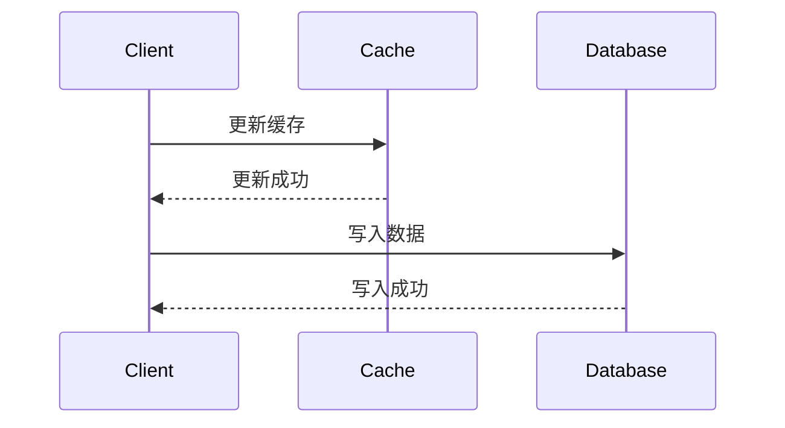

**优点**：
- 缓存与数据库始终保持一致
- 系统崩溃时数据丢失风险低

**缺点**：
- 写操作延迟增加
- 每次写操作都会产生数据库负载

**适用场景**：
- 对数据一致性要求高的系统
- 写操作相对较少的应用

```
function writeData(key, value):
    cache.put(key, value)  // 更新缓存
    db.put(key, value)     // 同时更新数据库
    return success
```

#### 3.1.2 写回（Write-Back）

写回策略先将数据写入缓存，然后异步写入数据库。

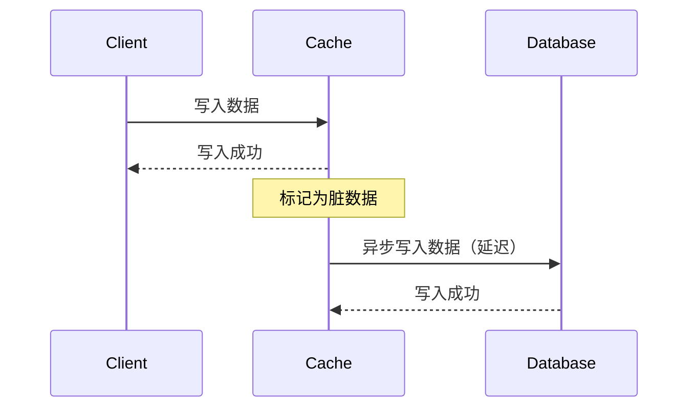

**优点**：
- 写操作响应速度快
- 可以批量处理写操作，减少数据库负载

**缺点**：
- 系统崩溃可能导致数据丢失
- 实现复杂度较高

**适用场景**：
- 高频写操作的系统
- 可以容忍短暂数据不一致的应用

```
function writeData(key, value):
    cache.put(key, value)           // 更新缓存
    dirtyKeys.add(key)              // 标记为脏数据
    return success

// 后台线程定期执行
function flushDirtyData():
    for key in dirtyKeys:
        db.put(key, cache.get(key)) // 异步写入数据库
        dirtyKeys.remove(key)
```

#### 3.1.3 写直达与写回结合

一些系统采用混合策略，根据数据重要性选择不同的写入策略。

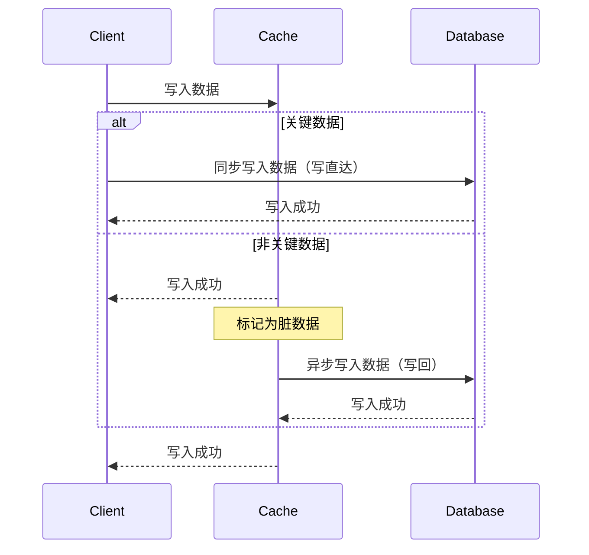

**实现方式**：
- 关键数据使用写直达
- 非关键数据使用写回
- 设置写回的最大延迟时间

### 3.2 缓存失效策略

> [!info] Info
> 可以认为缓存失效策略属于所谓的「先写库后写缓存」的方案

#### 3.2.1 基于时间的失效（TTL）

为缓存项设置生存时间（Time-To-Live），超时后自动失效。

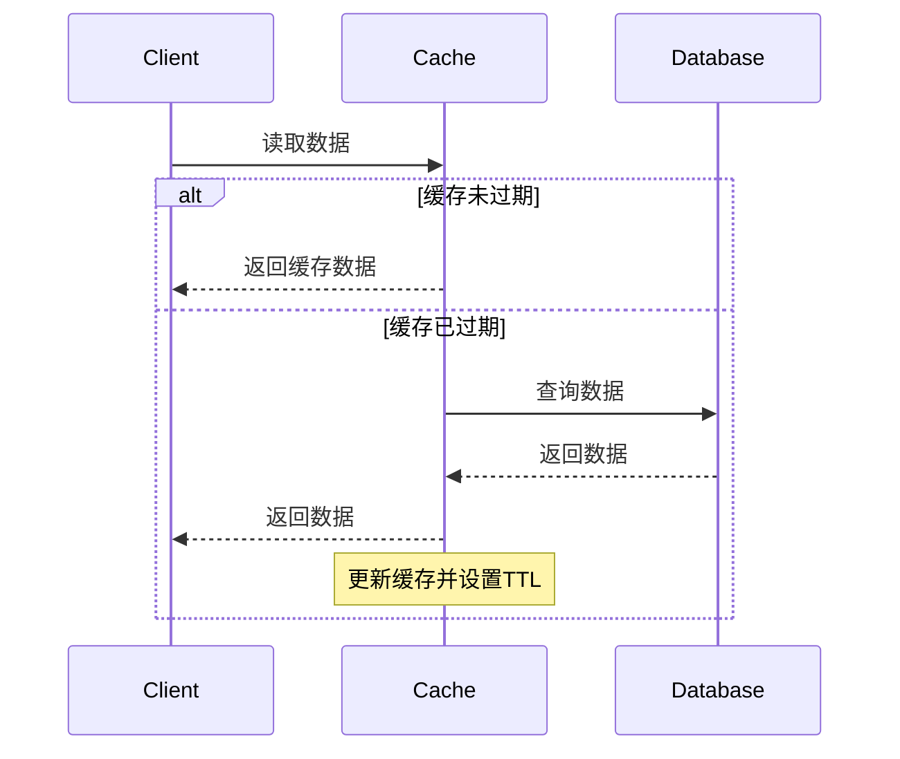

**优点**：
- 实现简单
- 自动处理缓存过期
- 不需要额外的失效机制

**缺点**：
- 可能返回过期数据
- 难以为不同数据设置合适的 TTL 值

**示例**：

```
// 设置缓存，10分钟后过期
cache.put(key, value, ttl=600)
```

#### 3.2.2 主动失效

当数据在数据库中更新时，主动使相关缓存失效。

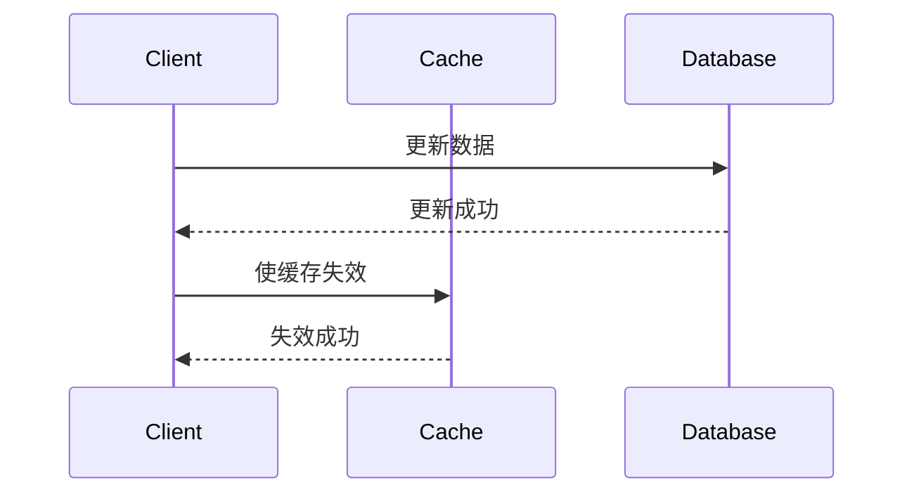

**优点**：
- 确保不会读取到过期数据
- 适用于数据更新频率不高的场景

**缺点**：
- 需要额外的失效机制
- 可能导致缓存频繁重建（缓存风暴）

**示例**：

```
function updateData(key, value):
    db.put(key, value)     // 更新数据库
    cache.invalidate(key)  // 使缓存失效
    return success
```

#### 3.2.3 更新模式

直接更新缓存中的数据，而不是使其失效。

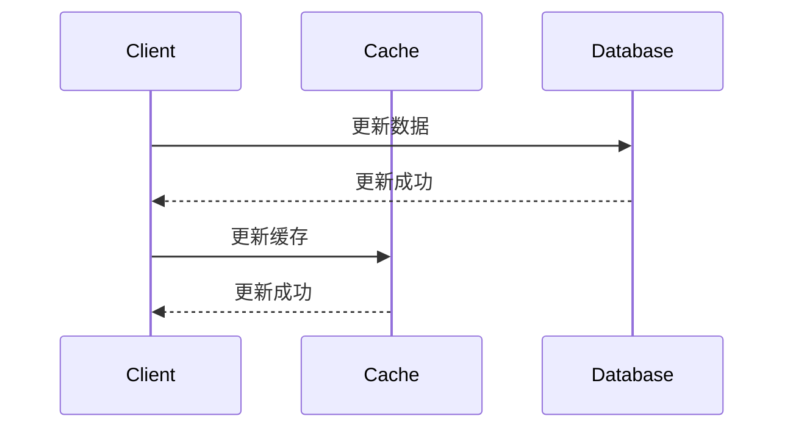

**优点**：
- 避免缓存未命中导致的性能下降
- 用户始终能获取到最新数据

**缺点**：
- 增加了写操作的复杂性
- 在分布式环境中实现困难

**示例**：

```
function updateData(key, value):
    db.put(key, value)     // 更新数据库
    cache.put(key, value)  // 更新缓存
    return success
```

#### 3.2.4 延迟双删策略

延迟双删（Delayed Double Delete）是一种用于解决缓存与数据库一致性问题的策略，特别是在高并发场景下。该策略的核心思想是在更新数据库后，先删除缓存，等待一段时间后再删除一次缓存，以确保缓存中的数据与数据库保持一致。

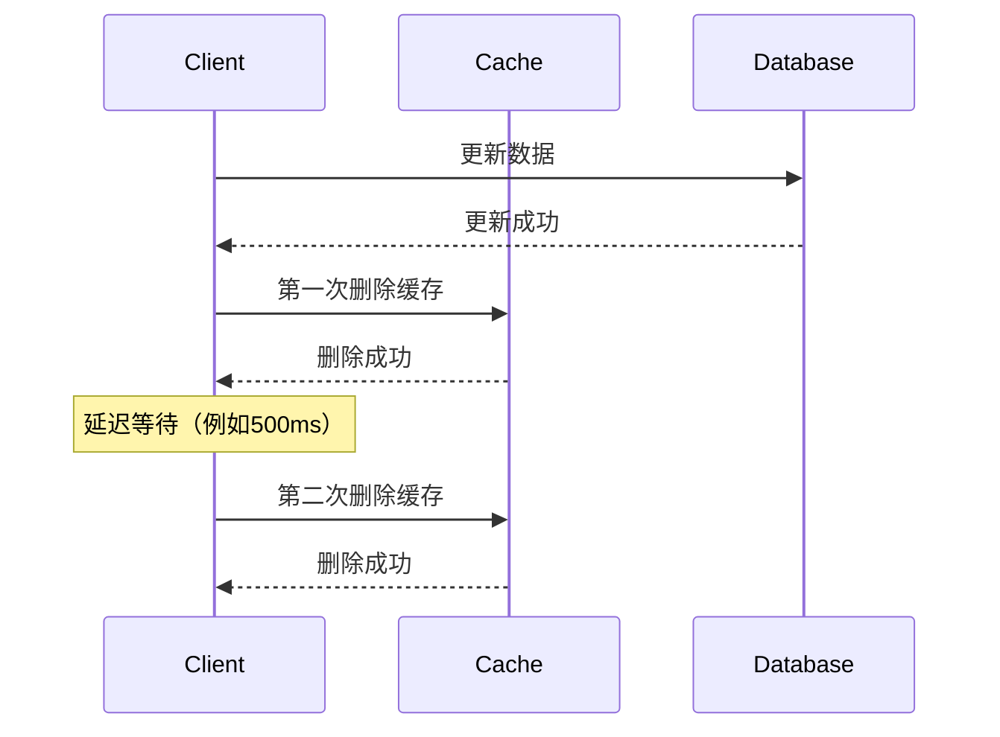

> [!faq] 为什么要延迟双删？
> 延迟双删（Delayed Double Delete）是一种在分布式系统中用于确保数据一致性的策略。它主要用于解决缓存与数据库之间的数据不一致问题。具体来说，当数据库中的数据被更新或删除时，缓存中的数据可能仍然存在，导致读取到过期的数据。延迟双删通过在删除缓存后，延迟一段时间再次删除缓存，以确保在此期间任何可能的脏数据都被清除。

说白了就是，「更新数据库 - 删缓存」的同时，「读到数据库旧数据 - 写缓存」也发生了。更新数据库是比较重量级的，因此并发线程读到旧数据的可能性比较大；对缓存的操作是比较快的，因此可能出现删除完缓存后，被写入旧数据的缓存，从而导致缓存不一致。

```mermaid
gantt
    title 并发线程 P1 和 P2 的操作时序（无延迟双删）
    dateFormat  HH:mm:ss
    axisFormat  %H:%M:%S

    section P1
    更新数据库           :a1, 00:00:01, 00:00:03
    删除缓存             :a2, 00:00:03, 00:00:04

    section P2
    读取缓存（未命中）   :b1, 00:00:02, 00:00:03
    从数据库读取旧数据   :b2, 00:00:03, 00:00:04
    将旧数据写入缓存     :b3, 00:00:04, 00:00:05

    section 时间线
    时间轴               : 00:00:00, 00:00:06
```

工作原理：

1. **第一次删除**：在更新数据库后，立即删除缓存。这一步的目的是确保在更新数据库后，缓存中的数据被清除，避免读取到旧数据。
2. **延迟等待**：在第一次删除后，等待一段时间（通常为几百毫秒到几秒），以确保所有可能的并发读操作已经完成。
3. **第二次删除**：在延迟等待后，再次删除缓存。这一步的目的是处理在第一次删除后，可能由于并发读操作导致的缓存重建问题。

延迟双删虽然也不能完全保证一致性，但是可以很大程度避免不一致。

优点：

- **减少缓存不一致**：通过两次删除操作，可以显著减少缓存与数据库不一致的概率。
- **适应高并发场景**：在高并发场景下，延迟双删策略可以有效处理并发读操作导致的缓存重建问题。

缺点：

- **增加延迟**：由于需要等待一段时间，可能会增加系统的整体延迟。
- **实现复杂度**：需要精确控制延迟时间，并确保第二次删除操作能够正确执行。

```
func updateData(key, value):
    // 更新数据库
    db.update(key, value)

    cache.delete(key)
    // 延迟等待（譬如说，500ms）
    time.sleep(500)
    cache.delete(key)

    return success
```

应用场景：

- **高并发更新**：在数据频繁更新的场景下，延迟双删可以有效减少缓存不一致的问题。
- **缓存重建频繁**：在缓存重建频繁的场景下，延迟双删可以确保缓存中的数据与数据库保持一致。
- **对一致性要求高**：在对数据一致性要求较高的系统中，延迟双删可以提供更高的数据一致性保障。

注意事项：

- **延迟时间选择**：延迟时间的选择需要根据具体的业务场景和系统负载进行调整，过短可能无法有效处理并发读操作，过长则可能增加系统延迟。
- **异常处理**：在实现延迟双删策略时，需要考虑异常情况，如第二次删除操作失败时的处理机制。
- **性能影响**：延迟双删策略可能会对系统性能产生一定影响，特别是在高并发场景下，需要权衡一致性和性能之间的关系。

## 4. 高级缓存一致性技术

### 4.1 CQRS 模式

命令查询责任分离（Command Query Responsibility Segregation）模式将系统操作分为命令（写）和查询（读）两部分，分别优化。

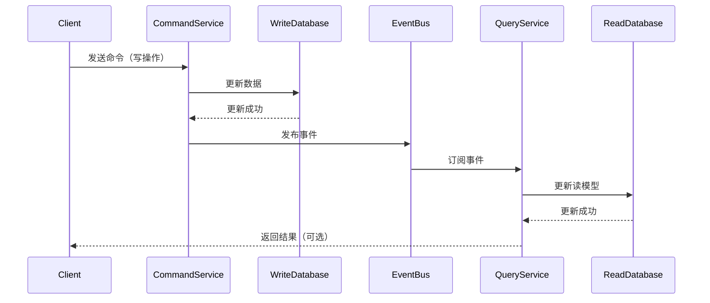

**工作原理**：
- 写操作直接作用于主数据库
- 读操作从专用的、可能有延迟的读模型中获取数据
- 通过事件机制将写操作的结果异步传播到读模型

**优点**：
- 读写操作可以独立扩展
- 可以针对不同查询优化不同的读模型
- 降低系统复杂度

**缺点**：
- 引入最终一致性
- 增加系统复杂度
- 需要处理事件传播失败的情况

### 4.2 事件溯源

事件溯源（Event Sourcing）将所有对数据的更改存储为事件序列，而不是仅存储当前状态。

**工作原理**：
- 所有更改都作为事件记录
- 当前状态通过重放事件得到
- 缓存可以存储计算得到的当前状态

**优点**：
- 提供完整的审计跟踪
- 可以重建任意时间点的系统状态
- 简化了并发冲突处理

**缺点**：
- 查询复杂度增加
- 事件日志可能变得非常大
- 需要处理事件模式演化

### 4.3 分布式缓存协议

在分布式系统中，需要特殊的协议来维护缓存一致性。

**常见协议**：
- MESI（Modified, Exclusive, Shared, Invalid）协议
- MOESI（Modified, Owned, Exclusive, Shared, Invalid）协议
- 目录基缓存协议

**实现挑战**：
- 减少协议消息开销
- 处理网络分区
- 扩展性问题

### 4.4 版本控制与冲突解决

使用版本号或向量时钟跟踪数据变更，检测并解决冲突。

**常见技术**：
- 乐观并发控制
- 向量时钟
- 冲突自动合并策略
- 最后写入胜出策略

**示例**：

```
function updateWithVersion(key, value, expectedVersion):
    currentVersion = db.getVersion(key)
    if currentVersion != expectedVersion:
        return conflict
    
    db.put(key, value, currentVersion + 1)
    cache.invalidate(key)
    return success
```

## 5. 实际应用场景

### 5.1 Web 应用缓存

Web 应用通常使用多级缓存来提高性能，包括浏览器缓存、CDN 缓存、应用缓存和数据库缓存。

**常见挑战**：
- HTTP 缓存控制
- 缓存失效传播
- 用户特定数据缓存

**解决方案**：
- 使用 ETag 和条件请求
- 缓存键包含版本信息
- 实施缓存分层策略

### 5.2 数据库系统

数据库系统内部实现了复杂的缓存一致性机制，如缓冲池管理、日志先行写入（WAL）等。

**关键技术**：
- ACID 事务保证
- 多版本并发控制（MVCC）
- 两阶段锁定
- 快照隔离

### 5.3 分布式缓存系统

如 Redis、Memcached 等分布式缓存系统需要处理节点间的数据一致性问题。

**常见策略**：
- 一致性哈希
- 主从复制
- 分区容忍性设计
- 故障检测与恢复

### 5.4 微服务架构

微服务架构中，不同服务可能拥有自己的缓存和数据存储，增加了一致性维护的复杂性。

**解决方案**：
- 事件驱动架构
- API 网关缓存策略
- 服务间契约测试
- 断路器模式

## 6. 缓存一致性问题的常见挑战

### 6.1 缓存穿透

缓存穿透指查询一个不存在的数据，导致请求直接落到数据库上。

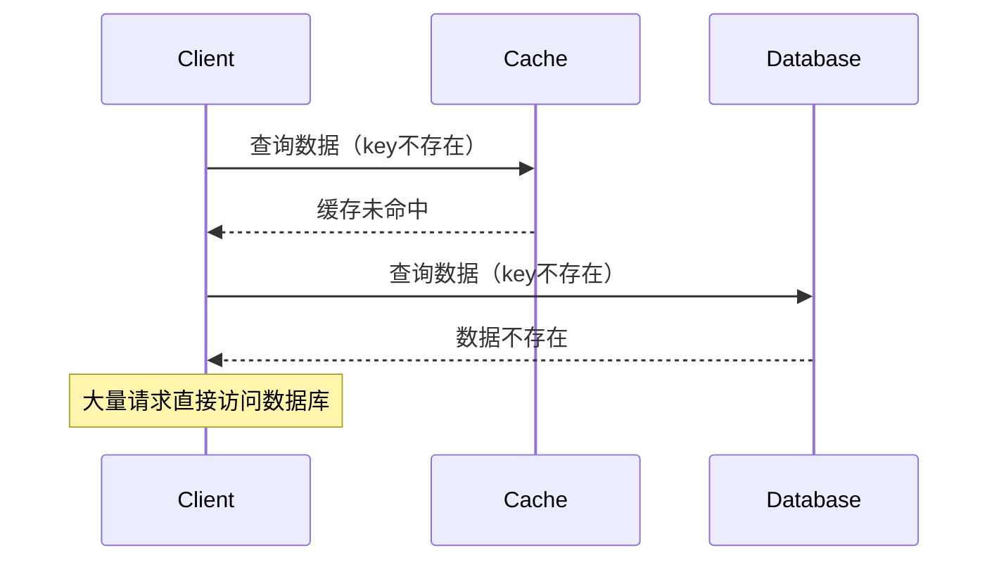

**解决方案**：
- 布隆过滤器
- 缓存空结果（设置较短的 TTL）
- 请求合并

### 6.2 缓存雪崩

缓存雪崩指大量缓存同时失效，导致请求突然涌向数据库。

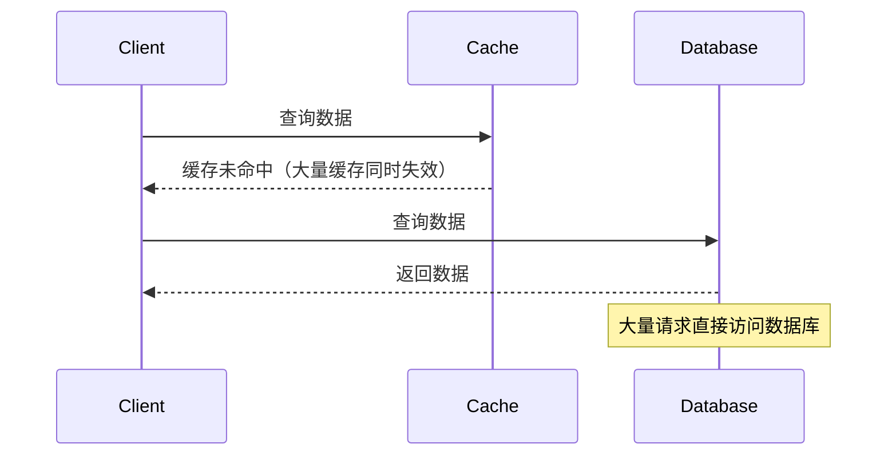

**解决方案**：
- 缓存失效时间随机化
- 热点数据永不过期
- 多级缓存架构
- 限流和熔断机制

### 6.3 缓存击穿

缓存击穿指热点数据过期时，大量并发请求直接访问数据库。

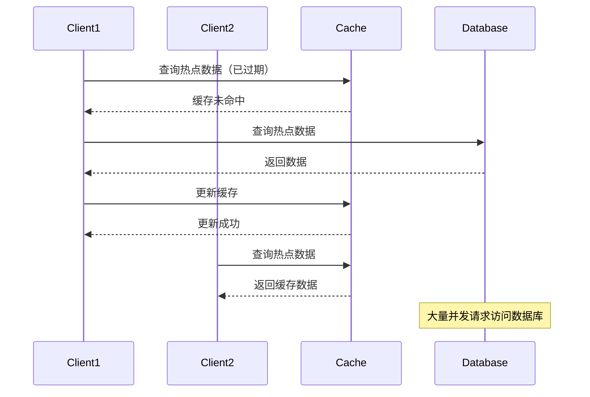

**解决方案**：
- 互斥锁（只允许一个请求重建缓存）
- 后台异步更新
- 提前预热

### 6.4 对缓存常见问题的解决方案

#### 6.4.1 缓存穿透的解决方案

缓存穿透是指查询不存在的数据，导致请求直接落到数据库上。以下是解决方案：

布隆过滤器（Bloom Filter）

- **原理**：布隆过滤器是一种概率型数据结构，用于快速判断一个元素是否存在于集合中。
- **实现方式**：
  - 在缓存层之前增加布隆过滤器。
  - 查询时，先通过布隆过滤器判断数据是否存在。如果不存在，直接返回空结果。
- **优点**：内存占用小，查询效率高。
- **缺点**：存在一定的误判率（假阳性）。

缓存空结果

- **原理**：对于查询不存在的数据，缓存一个空结果（如 `null` 或特殊标记），并设置较短的 TTL。
- **实现方式**：
  - 当查询数据库发现数据不存在时，将空结果写入缓存。
  - 后续查询直接返回缓存中的空结果。
- **优点**：简单易实现，有效减少数据库压力。
- **缺点**：可能缓存大量无效数据，占用缓存空间。

请求合并

- **原理**：将多个相同的查询请求合并为一个，减少对数据库的重复查询。
- **实现方式**：
  - 使用分布式锁或队列机制，将相同查询请求合并。
  - 只允许一个请求访问数据库，其他请求等待结果。
- **优点**：减少数据库查询次数。
- **缺点**：增加系统复杂度。

#### **6.4.2 缓存雪崩的解决方案**

缓存雪崩是指大量缓存同时失效，导致请求直接落到数据库上。以下是解决方案：

缓存失效时间随机化

- **原理**：为缓存设置随机的失效时间，避免大量缓存同时失效。
- **实现方式**：
  - 在基础 TTL 上增加一个随机值（如 `TTL + random(0, 600)`）。
- **优点**：简单有效，分散缓存失效时间。
- **缺点**：无法完全避免缓存失效。

热点数据永不过期

- **原理**：对热点数据设置永不过期，避免因缓存失效导致数据库压力。
- **实现方式**：
  - 使用后台线程定期更新热点数据。
  - 在数据更新时，直接覆盖缓存中的旧数据。
- **优点**：确保热点数据始终可用。
- **缺点**：需要额外的后台更新机制。

多级缓存架构

- **原理**：使用多级缓存（如本地缓存 + 分布式缓存），分散缓存失效的影响。
- **实现方式**：
  - 第一级缓存（本地缓存）失效后，请求第二级缓存（分布式缓存）。
  - 只有多级缓存都失效时，才会访问数据库。
- **优点**：减少数据库压力，提高系统容错能力。
- **缺点**：增加系统复杂度。

限流和熔断机制

- **原理**：在缓存失效时，通过限流和熔断机制保护数据库。
- **实现方式**：
  - 使用限流工具（如 Sentinel、Hystrix）限制对数据库的访问。
  - 当请求量超过阈值时，直接返回降级结果。
- **优点**：有效保护数据库，避免系统崩溃。
- **缺点**：可能影响用户体验。

#### 6.4.3 缓存击穿的解决方案

缓存击穿是指热点数据过期后，大量并发请求直接访问数据库。以下是解决方案：

互斥锁（Mutex Lock）

- **原理**：只允许一个请求重建缓存，其他请求等待结果。
- **实现方式**：
  - 使用分布式锁（如 Redis 的 `SETNX`）控制缓存重建。
  - 第一个请求获取锁并重建缓存，其他请求等待锁释放后直接读取缓存。
- **优点**：有效减少数据库压力。
- **缺点**：增加系统复杂度，可能引入锁竞争。

后台异步更新

- **原理**：在缓存过期前，通过后台线程异步更新缓存。
- **实现方式**：
  - 设置缓存的 TTL 较长。
  - 在 TTL 到期前，后台线程主动更新缓存。
- **优点**：避免缓存过期导致的击穿问题。
- **缺点**：需要额外的后台更新机制。

热点数据永不过期

- **原理**：对热点数据设置永不过期，避免因缓存失效导致数据库压力。
- **实现方式**：
  - 使用后台线程定期更新热点数据。
  - 在数据更新时，直接覆盖缓存中的旧数据。
- **优点**：确保热点数据始终可用。
- **缺点**：需要额外的后台更新机制。
